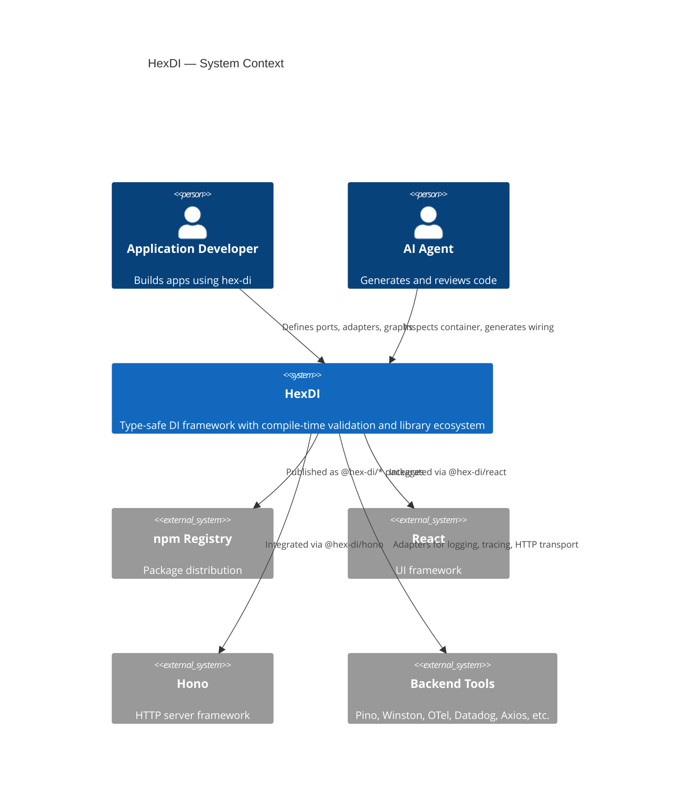
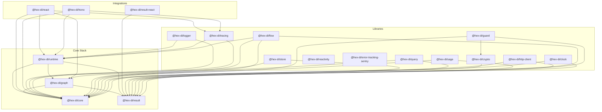

# Architecture

HexDI follows **hexagonal architecture** (ports & adapters). The dependency direction flows strictly inward — outer layers depend on inner layers, never the reverse.

## Architecture at a Glance

Key architectural decisions that shape the codebase — start here before diving into package-level details.

| #   | Decision                                                             | Package | Path                                                                                                                                                                                         |
| --- | -------------------------------------------------------------------- | ------- | -------------------------------------------------------------------------------------------------------------------------------------------------------------------------------------------- |
| 1   | Frozen port references — immutable port objects as DI keys           | Core    | [`spec/packages/core/decisions/001-frozen-port-references.md`](https://github.com/leaderiop/hex-di/blob/main/spec/packages/core/decisions/001-frozen-port-references.md)                     |
| 2   | Blame context model — error attribution across resolution chains     | Core    | [`spec/packages/core/decisions/002-blame-context-model.md`](https://github.com/leaderiop/hex-di/blob/main/spec/packages/core/decisions/002-blame-context-model.md)                           |
| 3   | Effect capability unification — merging effect and capability models | Core    | [`spec/packages/core/decisions/007-effect-capability-unification.md`](https://github.com/leaderiop/hex-di/blob/main/spec/packages/core/decisions/007-effect-capability-unification.md)       |
| 4   | Operation completeness strategy — graph validation at build time     | Graph   | [`spec/packages/graph/decisions/001-operation-completeness-strategy.md`](https://github.com/leaderiop/hex-di/blob/main/spec/packages/graph/decisions/001-operation-completeness-strategy.md) |
| 5   | Full type-level topology — compile-time dependency graph checking    | Graph   | [`spec/packages/graph/decisions/003-full-type-level-topology.md`](https://github.com/leaderiop/hex-di/blob/main/spec/packages/graph/decisions/003-full-type-level-topology.md)               |
| 6   | Memo-map resolution model — deterministic singleton resolution       | Runtime | [`spec/packages/runtime/decisions/001-memo-map-resolution-model.md`](https://github.com/leaderiop/hex-di/blob/main/spec/packages/runtime/decisions/001-memo-map-resolution-model.md)         |
| 7   | Phased container lifecycle — construction, resolution, disposal      | Runtime | [`spec/packages/runtime/decisions/002-phased-container-lifecycle.md`](https://github.com/leaderiop/hex-di/blob/main/spec/packages/runtime/decisions/002-phased-container-lifecycle.md)       |
| 8   | Closures over classes — functional Result implementation             | Result  | [`spec/packages/result/decisions/001-closures-over-classes.md`](https://github.com/leaderiop/hex-di/blob/main/spec/packages/result/decisions/001-closures-over-classes.md)                   |
| 9   | Object.freeze immutability — frozen error and result objects         | Result  | [`spec/packages/result/decisions/004-object-freeze-immutability.md`](https://github.com/leaderiop/hex-di/blob/main/spec/packages/result/decisions/004-object-freeze-immutability.md)         |
| 10  | Do-notation — monadic composition for Result chains                  | Result  | [`spec/packages/result/decisions/012-do-notation.md`](https://github.com/leaderiop/hex-di/blob/main/spec/packages/result/decisions/012-do-notation.md)                                       |

> Full ADR index: [docs/decisions/README.md](./decisions/README.md) — 161 ADRs across 12 scopes.

## Layer Diagram

```
┌──────────────────────────────────────────────────────────────────┐
│                        Applications                              │
│   React apps, Hono servers, CLI tools, presentations             │
├──────────────────────────────────────────────────────────────────┤
│                        Integrations                              │
│   @hex-di/react, @hex-di/hono, @hex-di/result-react             │
├──────────────────────────────────────────────────────────────────┤
│                         Libraries                                │
│   logger, tracing, store, query, flow, saga, http-client, guard, │
│   reactivity, error-tracking, clock, crypto                      │
├──────────────────────────────────────────────────────────────────┤
│                          Tooling                                 │
│   testing, visualization, devtools-ui, playground                │
├──────────────────────────────────────────────────────────────────┤
│                       Core Stack                                 │
│  ┌──────────────────────────────────────────────────────────┐    │
│  │  @hex-di/runtime    Container, scopes, resolution hooks  │    │
│  │        ↓ depends on                                      │    │
│  │  @hex-di/graph      GraphBuilder, compile-time validation│    │
│  │        ↓ depends on                                      │    │
│  │  @hex-di/core       Ports, adapters, error types         │    │
│  └──────────────────────────────────────────────────────────┘    │
│                                                                  │
│  @hex-di/result        Standalone Result<T, E> monad             │
└──────────────────────────────────────────────────────────────────┘
```

## Core Stack

The core stack has three layers with strict dependency direction:

### `@hex-di/core` (innermost)

Zero external dependencies. Defines the fundamental primitives:

- **Ports** — typed service tokens (`port<T>()`)
- **Adapters** — implementations bound to ports (`createAdapter()`)
- **Error types** — typed error classes for dependency issues
- **Lifetimes** — `singleton`, `scoped`, `transient`

### `@hex-di/graph`

Depends only on `@hex-di/core`. Provides compile-time dependency validation:

- **GraphBuilder** — type-safe builder that catches missing/duplicate dependencies as TypeScript errors
- **Type-state pattern** — the builder tracks provided ports at the type level
- **Circular dependency detection** — via topological sort at build time

### `@hex-di/runtime`

Depends on `@hex-di/core` and `@hex-di/graph`. Provides the runtime container:

- **Container** — immutable, resolves adapters from a validated graph
- **Scopes** — child containers with scoped lifetime management
- **Disposal** — deterministic cleanup via `scope.dispose()`

### `@hex-di/result` (standalone)

Independent of the DI stack. A Rust-inspired `Result<T, E>` monad:

- **Errors as values** — no thrown exceptions in business logic
- **Effect-style error handling** — `catchTag`, `catchTags` for discriminated error unions
- **Async support** — `ResultAsync<T, E>` with full method chaining
- **Zero `any`** — fully type-safe with zero casts or eslint-disable

## Libraries

Each library follows the same pattern:

```
libs/<name>/
  core/       — Framework-agnostic ports and logic
  react/      — React hooks and providers (depends on core)
  testing/    — Test utilities and mocks (depends on core)
```

Libraries define their own **ports** and register as adapters in the DI graph. This means any library can be swapped without touching consuming code.

### Library Index

| Family         | Purpose                                             | Packages                                                      | Core Layer Dependencies      |
| -------------- | --------------------------------------------------- | ------------------------------------------------------------- | ---------------------------- |
| clock          | Injectable clock, timers, sequence generation (GxP) | core                                                          | core, result (peer)          |
| crypto         | Hash digests and constant-time comparison           | core, browser, node                                           | core                         |
| flow           | Typed state machine runtime with effects-as-data    | core, react, testing                                          | core, graph, result, runtime |
| guard          | Authorization — permissions, roles, policies        | core, features, react, testing, validation                    | core, **crypto**, result     |
| http-client    | Transport-agnostic HTTP with composable combinators | core, axios, bun, fetch, got, ky, node, ofetch, react, undici | core, result (peer)          |
| logger         | Structured logging with multiple backends           | core, bunyan, pino, react, winston                            | core, runtime (peer)         |
| query          | Data fetching, caching, structural sharing          | core, react, testing                                          | core, result                 |
| saga           | Multi-step transactions with compensation           | core, react, testing                                          | core, result                 |
| store          | Reactive state management with signal reactivity    | core, react, testing                                          | core, result                 |
| tracing        | Distributed tracing (W3C Trace Context, OTel)       | core, datadog, jaeger, otel, zipkin                           | core, runtime (peer)         |
| reactivity     | Signal-based reactive primitives                    | core                                                          | core, result                 |
| error-tracking | Vendor-neutral error tracking                       | sentry                                                        | core                         |

> **Cross-library dependency:** `guard/core` depends on `crypto/core` for signature verification — this is the only cross-library dependency and is allowed by the layer rules.

### Integration Index

| Package                | Connects             | Role                                              |
| ---------------------- | -------------------- | ------------------------------------------------- |
| `@hex-di/react`        | React ↔ DI runtime   | Container provider, typed `usePort()` hooks       |
| `@hex-di/hono`         | Hono ↔ DI runtime    | Per-request scoped container middleware           |
| `@hex-di/result-react` | Result monad ↔ React | `useResult`, `<Match>`, suspense/transition hooks |

### Integration-to-Package Dependency Matrix

Which core packages each integration may import:

| Integration            | core | graph | runtime | result | Notes                                        |
| ---------------------- | :--: | :---: | :-----: | :----: | -------------------------------------------- |
| `@hex-di/react`        | yes  |  yes  |   yes   |  yes   | Provider needs runtime; hooks use core ports |
| `@hex-di/hono`         | yes  |  --   |   yes   |  yes   | Middleware creates per-request scopes        |
| `@hex-di/result-react` |  --  |  --   |   --    |  yes   | Pure React bindings for the Result monad     |

Integrations may **not** depend on any `libs/` package. Library React variants (e.g. `libs/logger/react`) depend on `@hex-di/react`, never the reverse.

### Package Variant Convention

| Variant | Location              | Depends on             | Contents                                       |
| ------- | --------------------- | ---------------------- | ---------------------------------------------- |
| core    | `libs/<name>/core`    | core stack             | Framework-agnostic ports, logic, adapters      |
| react   | `libs/<name>/react`   | core + `@hex-di/react` | React hooks and providers                      |
| testing | `libs/<name>/testing` | core                   | Test utilities, mocks, assertion helpers       |
| backend | `libs/<name>/<impl>`  | core                   | Platform-specific adapters (e.g., pino, axios) |

## Package Boundaries

| Rule                      | Enforced by                                 |
| ------------------------- | ------------------------------------------- |
| No circular dependencies  | `madge` check in CI (`pnpm madge:circular`) |
| Layer dependency rules    | `dependency-cruiser` in CI (`pnpm cruise`)  |
| Core has zero deps        | Package-level `package.json`                |
| Build order respects deps | Turborepo `dependsOn: ["^build"]`           |
| Strict TypeScript         | Root `tsconfig.json` with `strict: true`    |
| No `any` in production    | ESLint `no-explicit-any: error` for `src/`  |

## Schema-First HTTP Convention

HTTP-facing services use **Zod** with [`@hono/zod-openapi`](https://github.com/honojs/middleware/tree/main/packages/zod-openapi) for schema-first API development. Zod schemas serve as both runtime validators and OpenAPI documentation sources — no hand-written OpenAPI YAML.

**Reference implementations:**

- [`examples/hono-todo/src/adapters/inbound/hono/schemas.ts`](../examples/hono-todo/src/adapters/inbound/hono/schemas.ts) — Zod schemas with `.openapi()` metadata for request/response shapes
- [`examples/pokenerve/api/src/schemas/pokemon.ts`](../examples/pokenerve/api/src/schemas/pokemon.ts) — External API payload models as OpenAPI components
- [`examples/pokenerve/api/src/env.ts`](../examples/pokenerve/api/src/env.ts) — Environment variable parsing via `Result` with tagged error types

New HTTP entrypoints should follow this pattern: define Zod schemas co-located with route definitions, use `createRoute()` from `@hono/zod-openapi`, and validate all external input at the boundary.

### Validation Surface Map

Not all surfaces use runtime schema validation. The distinction matters for AI agents generating code — library packages rely on TypeScript's type system alone, while application boundaries add Zod for runtime safety.

**Rule of thumb:** if data crosses a trust boundary (HTTP request, environment variable, user input, external API response), validate at runtime with Zod. If the data stays within TypeScript compilation units, rely on the type system.

| Surface                                                               | Validation                 | Mechanism                                                                        |
| --------------------------------------------------------------------- | -------------------------- | -------------------------------------------------------------------------------- |
| Published library packages (`@hex-di/core`, `graph`, `runtime`, etc.) | **Compile-time only**      | TypeScript strict mode, generic constraints, branded types                       |
| HTTP route handlers (Hono examples)                                   | **Runtime + compile-time** | Zod schemas via `@hono/zod-openapi` with OpenAPI generation                      |
| Environment variable loading                                          | **Runtime + compile-time** | `Result`-returning parsers with `zipOrAccumulate` error accumulation             |
| Port/adapter factory inputs                                           | **Compile-time only**      | Generic type parameters enforce contract shape at build time                     |
| Test fixtures and mocks                                               | **None**                   | Test files have relaxed ESLint rules; `any` is permitted for mocking flexibility |

See also: [Runtime Validation guide](./guides/runtime-validation.md), [JSON Validation guide](./guides/json-validation.md).

## Tooling and References

The following tools enforce the boundaries described above:

| Tool                                                                 | Config                                                                                             | Command               | Purpose                                                         |
| -------------------------------------------------------------------- | -------------------------------------------------------------------------------------------------- | --------------------- | --------------------------------------------------------------- |
| [dependency-cruiser](https://github.com/sverweij/dependency-cruiser) | [`.dependency-cruiser.cjs`](https://github.com/leaderiop/hex-di/blob/main/.dependency-cruiser.cjs) | `pnpm cruise`         | Enforces layer dependency direction and cross-library isolation |
| [madge](https://github.com/pahen/madge)                              | [`scripts/check-circular.sh`](../scripts/check-circular.sh)                                        | `pnpm madge:circular` | Detects circular imports across all workspace `src/` trees      |
| [Knip](https://knip.dev)                                             | [`knip.json`](../knip.json)                                                                        | `pnpm knip`           | Finds unused exports, dependencies, and files                   |
| [jscpd](https://github.com/kucherenko/jscpd)                         | [`.jscpd.json`](../.jscpd.json) / [`.jscpd-baseline.json`](../.jscpd-baseline.json)                | `pnpm jscpd:check`    | Detects copy-paste duplication against a tracked baseline       |
| [Turborepo](https://turbo.build)                                     | [`turbo.json`](../turbo.json)                                                                      | `pnpm build`          | Orchestrates builds respecting `^build` dependency order        |

### dependency-cruiser Rule Catalog

The forbidden-dependency rules in [`.dependency-cruiser.cjs`](https://github.com/leaderiop/hex-di/blob/main/.dependency-cruiser.cjs) enforce the layer boundaries documented above. Each rule maps to a specific architectural constraint:

| Rule Name                       | Layer           | Enforces                                                                                |
| ------------------------------- | --------------- | --------------------------------------------------------------------------------------- |
| `core-no-outward-deps`          | Core            | `@hex-di/core` has zero outward dependencies — no graph, runtime, libs, or integrations |
| `result-standalone`             | Result          | `@hex-di/result` depends on nothing — fully standalone monad                            |
| `graph-no-upper-layers`         | Graph           | `@hex-di/graph` depends only on core — no runtime, libs, or integrations                |
| `runtime-no-upper-layers`       | Runtime         | `@hex-di/runtime` depends on core + graph only — no libs or integrations                |
| `libs-<family>-isolation`       | Libraries       | Each lib family is isolated from other families (exception: `guard → crypto`)           |
| `integrations-<name>-isolation` | Integrations    | Each integration is isolated from other integrations                                    |
| `no-testing-in-production`      | Testing/Tooling | Production code must not import from testing or tooling packages                        |
| `no-example-deps`               | Examples        | Packages, libs, integrations, and tooling must not depend on examples or websites       |

Rules for library families and integrations are generated dynamically from arrays (e.g., `["clock", "crypto", "flow", ...]`) to avoid repetition.

### Adding dependency-cruiser Rules

When introducing a new `libs/` family or integration package, add corresponding forbidden-dependency rules to [`.dependency-cruiser.cjs`](https://github.com/leaderiop/hex-di/blob/main/.dependency-cruiser.cjs). Key scenarios:

- **New lib family** (e.g., `libs/cache/*`) — add the family name to the libs isolation array. This auto-generates cross-family isolation rules (unless explicitly allowed like the documented `guard→crypto` exception).
- **New integration** — add the integration name to the integrations isolation array. This enforces that it only depends on the documented stack (core, graph, runtime, result) and not on other integrations or libs.
- **New example** — covered by the `no-example-deps` rule (production code must not import from examples).

Run `pnpm cruise` locally to verify new rules before pushing.

## Architecture Navigation

Architecture knowledge lives in three tiers: `docs/` for cross-cutting documentation, `spec/` for formal per-package specifications and ADRs, and inline `ARCHITECTURE.md` files for package-level notes. Use this table to find the right starting point.

| Resource           | Path                                                                | Purpose                                              |
| ------------------ | ------------------------------------------------------------------- | ---------------------------------------------------- |
| ADR Index          | [docs/decisions/README.md](./decisions/README.md)                   | Cross-package Architecture Decision Records          |
| Per-package ADRs   | `spec/<package>/decisions/`                                         | Formal ADRs scoped to a single package               |
| Package Notes      | `packages/*/ARCHITECTURE.md`                                        | Per-package architecture notes (where present)       |
| How-to Guides      | [docs/guides/](./guides/README.md)                                  | Integration, testing, error handling, observability  |
| API Reference      | [docs/api/](./api/README.md)                                        | Generated API docs for published packages            |
| Glossary           | [docs/glossary.md](./glossary.md)                                   | Domain terminology and definitions                   |
| Runbook            | [docs/runbook.md](./runbook.md)                                     | Local setup, release process, CI pipeline            |
| Debug Playbook     | [docs/debug-playbook.md](./debug-playbook.md)                       | Incident response, CI flake triage, debugging        |
| Onboarding Map     | [docs/onboarding-map.md](./onboarding-map.md)                       | Reading paths by persona                             |
| Observability      | [docs/observability.md](./observability.md)                         | Logging, tracing, error tracking package map         |
| Spec Directory     | `spec/`                                                             | Behavioral specs, capabilities, and per-package ADRs |
| Runtime Validation | [docs/guides/runtime-validation.md](./guides/runtime-validation.md) | Where and how to validate data at untyped boundaries |

## Monorepo Structure

```
hex-di/
├── packages/         Core DI stack (core, graph, runtime, result, hex-di)
├── integrations/     Framework bindings (react, hono, result-react)
├── libs/             Domain libraries (logger, tracing, store, query, flow, saga, ...)
├── tooling/          Developer tools (testing, visualization, devtools-ui, ...)
├── examples/         Example apps (hono-todo, react, ...)
├── docs/             Documentation (getting-started, guides, patterns, API)
├── spec/             Specifications and ADRs per package
├── scripts/          Build and CI helper scripts
└── websites/         Documentation websites (Docusaurus)
```

### Example App Conventions

Example apps under `examples/` follow the same hexagonal structure as the library packages, demonstrating how consumers should organize their own code:

```
examples/<app-name>/
├── src/
│   ├── adapters/          # Inbound (HTTP routes) and outbound (DB, API) adapters
│   │   ├── inbound/       # Framework-specific entry points (Hono routes, React components)
│   │   └── outbound/      # External service implementations
│   ├── application/       # Use cases and application-level ports
│   ├── domain/            # Domain ports and business rules
│   ├── infrastructure/    # Cross-cutting concerns (logging, auth, config)
│   ├── di/                # Graph composition and container setup
│   └── env.ts             # Result-based environment variable parsing
├── tests/
├── .env.example
└── package.json
```

**Dependency direction in examples follows the same inward rule as library packages:** adapters depend on application/domain, never the reverse. The `di/` directory is the composition root — it imports adapters and wires the graph, but no other module imports from `di/`.

The `react-showcase` example adds feature-based organization (`src/features/`) where each feature encapsulates its own ports, adapters, and DI bundle — see [Composing Graphs](./patterns/composing-graphs.md) for the pattern.

### Publishable Package Map

| Package                     | npm name               | Role                                             | Key consumers                     |
| --------------------------- | ---------------------- | ------------------------------------------------ | --------------------------------- |
| `packages/core`             | `@hex-di/core`         | Port/adapter primitives, service contracts       | Every other package               |
| `packages/graph`            | `@hex-di/graph`        | Dependency graph builder and validation          | runtime, integrations             |
| `packages/runtime`          | `@hex-di/runtime`      | Container factory, resolution, scopes, disposal  | integrations, examples            |
| `packages/result`           | `@hex-di/result`       | `Result`/`ResultAsync` monad (standalone)        | core, runtime, libs, result-react |
| `packages/hex-di`           | `hex-di`               | Umbrella re-export of core + graph + runtime     | Application code                  |
| `integrations/react`        | `@hex-di/react`        | React provider, typed hooks                      | libs/\*/react, examples           |
| `integrations/hono`         | `@hex-di/hono`         | Hono middleware, per-request scopes, diagnostics | examples/hono-todo, pokenerve     |
| `integrations/result-react` | `@hex-di/result-react` | React hooks and components for Result            | examples                          |
| `tooling/testing`           | `@hex-di/testing`      | Test utilities, mock helpers                     | All test suites                   |

### Package Layer Map

Unified view of every workspace folder and its architectural layer. Dependencies flow **inward only** (Examples → Integrations → Libraries → Core Stack).

| Workspace folder            | Layer         | Description                                                 |
| --------------------------- | ------------- | ----------------------------------------------------------- |
| `packages/core`             | Core Stack    | Port/adapter primitives, service contracts — zero deps      |
| `packages/graph`            | Core Stack    | Compile-time validated dependency graph builder             |
| `packages/runtime`          | Core Stack    | Container resolution, scope management, finalizers          |
| `packages/result`           | Core Stack    | `Result`/`ResultAsync` monad — standalone, no DI dependency |
| `packages/hex-di`           | Core Stack    | Umbrella re-export of core + graph + runtime                |
| `integrations/react`        | Integration   | React provider, typed hooks, error boundary                 |
| `integrations/hono`         | Integration   | Hono middleware, per-request scopes, diagnostic routes      |
| `integrations/result-react` | Integration   | React hooks and components for the Result monad             |
| `libs/*/core`               | Library       | Framework-agnostic ports, domain logic, adapters            |
| `libs/*/react`              | Library       | React hooks and providers for the library family            |
| `libs/*/testing`            | Library       | Test utilities, mocks, assertion helpers                    |
| `libs/*/<impl>`             | Library       | Platform-specific adapters (pino, axios, sentry, etc.)      |
| `tooling/testing`           | Tooling       | Shared test utilities (`@hex-di/testing`)                   |
| `tooling/playground`        | Tooling       | Interactive playground with generated type artifacts        |
| `tooling/devtools-ui`       | Tooling       | Browser DevTools panels for container inspection            |
| `tooling/graph-viz`         | Tooling       | Graph visualization utilities                               |
| `tooling/visualization`     | Tooling       | General visualization tooling                               |
| `tooling/vitest-config`     | Tooling       | Shared Vitest configuration                                 |
| `tooling/result-testing`    | Tooling       | Result-specific test utilities                              |
| `testing/*`                 | Testing       | Cross-library integration tests                             |
| `examples/*`                | Example       | Full applications wiring all layers together                |
| `websites/*`                | Documentation | Published Docusaurus sites (one per library package)        |

## C4 Context Diagram



## Full Dependency Graph

Every arrow means "depends on". The graph covers all production packages in the monorepo.

```mermaid
graph TD
    subgraph Core["Core Stack"]
        core["@hex-di/core<br/>(zero deps)"]
        graph_pkg["@hex-di/graph"]
        runtime["@hex-di/runtime"]
        result["@hex-di/result<br/>(standalone)"]

        graph_pkg --> core
        runtime --> graph_pkg
        runtime --> core
    end

    subgraph Libs["Domain Libraries"]
        guard["guard"]
        clock["clock"]
        http_client["http-client"]
        query["query"]
        saga["saga"]
        store["store"]
        flow["flow"]
        logger["logger"]
        tracing["tracing"]
        crypto["crypto"]
        reactivity["reactivity"]
        error_tracking["error-tracking"]
    end

    guard --> core
    guard --> result
    guard --> crypto
    clock --> core
    clock --> result
    http_client --> core
    http_client --> result
    query --> core
    query --> result
    saga --> core
    saga --> result
    store --> core
    store --> result
    flow --> core
    flow --> graph_pkg
    flow --> runtime
    flow --> result
    logger --> core
    tracing --> core
    crypto --> core
    reactivity --> core
    reactivity --> result
    error_tracking --> core

    subgraph Integrations["Framework Integrations"]
        react_int["@hex-di/react"]
        hono_int["@hex-di/hono"]
        result_react["@hex-di/result-react"]
    end

    react_int --> runtime
    hono_int --> runtime
    result_react --> result

    subgraph Variants["Library Variants (react / testing / backend)"]
        guard_react["guard-react"] --> guard
        guard_react --> react_int
        guard_testing["guard-testing"] --> guard
        query_react["query-react"] --> query
        query_react --> react_int
        query_testing["query-testing"] --> query
        store_react["store-react"] --> store
        store_react --> react_int
        store_testing["store-testing"] --> store
        flow_react["flow-react"] --> flow
        flow_react --> react_int
        flow_testing["flow-testing"] --> flow
        saga_react["saga-react"] --> saga
        saga_react --> react_int
        saga_testing["saga-testing"] --> saga
        logger_react["logger-react"] --> logger
        logger_react --> react_int
        http_react["http-client-react"] --> http_client
        http_react --> react_int
    end
```



## Dependency Rules

| Layer                                  | May depend on              | May NOT depend on                        |
| -------------------------------------- | -------------------------- | ---------------------------------------- |
| `@hex-di/core`                         | nothing                    | anything                                 |
| `@hex-di/graph`                        | core                       | runtime, libraries, integrations         |
| `@hex-di/runtime`                      | core, graph                | libraries, integrations                  |
| `@hex-di/result`                       | nothing (standalone)       | anything                                 |
| Library core (`libs/*/core`)           | core stack + result        | other libraries (except guard -> crypto) |
| Library react (`libs/*/react`)         | own core + `@hex-di/react` | other libraries, runtime directly        |
| Library testing (`libs/*/testing`)     | own core only              | runtime, react, other libraries          |
| Backend adapters (`libs/*/pino`, etc.) | own core only              | runtime, react, other libraries          |
| Integrations (`@hex-di/react`, etc.)   | core stack                 | libraries                                |

**The only cross-library dependency**: `guard/core` depends on `crypto/core` for signature verification.

## Package Dependency Graph

The following diagram shows internal workspace dependencies between `@hex-di/*` packages.



To regenerate the raw file-level graph:

```bash
npx madge --image docs/dependency-graph.svg packages/*/src/index.ts integrations/*/src/index.ts
```

## Runtime Schemas vs Port Contracts

HexDI uses two complementary validation strategies. Choose the right one based on where the data boundary is:

| Strategy                                   | When to use                                       | Enforced at  | Example                                                         |
| ------------------------------------------ | ------------------------------------------------- | ------------ | --------------------------------------------------------------- |
| **Port contracts** (TypeScript interfaces) | Service-to-service boundaries within the DI graph | Compile time | `port<Logger>()`, `createAdapter({ provides: LoggerPort })`     |
| **Runtime schemas** (Zod + OpenAPI)        | External boundaries where data enters the system  | Runtime      | HTTP request bodies, environment variables, file/queue payloads |

**Rule of thumb:** If data crosses a trust boundary (network, user input, environment), validate it with a runtime schema. If data flows between services that are already type-checked in the same compilation unit, port contracts are sufficient.

The reference implementations live in:

- **Port contracts** — every `packages/*/src` and `libs/*/core/src` module
- **Runtime schemas** — `examples/hono-todo/src/adapters/inbound/hono/schemas.ts` (Zod + OpenAPI), `examples/pokenerve/api/src/env.ts` (Result-based env parsing)

See [Schema-First OpenAPI](./guides/openapi.md) for the full guide on HTTP boundary validation.
