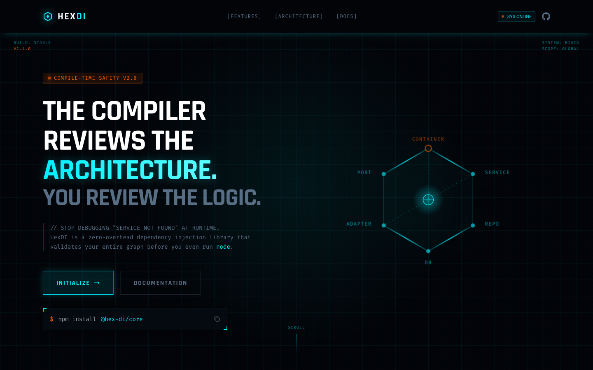

# 02 — Landing Page (Enhanced SVG Architecture)

**File:** `2.html`
**Title:** HexDI - Structural Dependency Injection
**Type:** Marketing landing page
**Layout:** Vertical scroll, full-width sections

---



## Overview

Nearly identical to `1.html` in structure and visual style. The key difference is a significantly enhanced **Module Architecture SVG diagram** in the architecture section — with animated moving dots along paths, glowing radial gradient on the CORE node, and richer label annotations. All other sections (nav, hero, features, code preview, lifetime scopes, comparison, CTA, footer) are the same as the standard landing.

---

## Differences from `01-landing-standard.md`

### Animation Tokens
- `float`: No 3D rotation in this file — simple vertical bob: `translateY(0) ↔ translateY(-10px)` at 6s
- `scanline`: 8s (slower than file 3, same as file 1)
- `pulse-glow`: Same 2s cycle
- `spin-slow`: 20s

### Grid
- Same `bg-grid` at 40px with `rgba(0,240,255,0.05)` opacity (identical to file 1)

### Card
- `.hud-card` `background: rgba(8, 16, 28, 0.7)` — same as file 1

---

## Module Architecture SVG (Enhanced)

This is the primary distinguishing feature. Located in the `#architecture` section.

**Improvements over file 1:**
- `CORE` node has a radial glow background (cyan radial gradient overlaid on the node)
- Animated dots travel along each connecting path using `<animateMotion>` with `calcMode="paced"`
- Arrow labels (`VALIDATES →`, `EXECUTES →`, `INTEGRATES →`, `MOCKS →`) have improved positioning
- Path opacity is higher (`0.5` vs `0.3`)
- Nodes: `CORE` (center, lit/orange), `GRAPH` (top), `RUNTIME` (bottom), `REACT` (left), `TESTING` (right, orange)

**SVG dot animation pattern:**
```html
<circle r="3" fill="#00F0FF">
  <animateMotion dur="3s" repeatCount="indefinite" calcMode="paced">
    <mpath xlink:href="#path-core-to-graph"/>
  </animateMotion>
</circle>
```

---

## Layout Structure

```
┌─────────────────────────────────────────────────────────────┐
│  NAV  fixed h-20  logo | links | status badge + github      │
├─────────────────────────────────────────────────────────────┤
│  HERO  min-h-screen  (identical to file 1)                  │
│  Left: badge + h1 + subtext + buttons + install widget      │
│  Right: hex graph SVG (float, no 3D tilt)                   │
├─────────────────────────────────────────────────────────────┤
│  FEATURES  3×2 grid of hud-cards  (identical to file 1)     │
├─────────────────────────────────────────────────────────────┤
│  CODE PREVIEW  2/5 + 3/5  (identical to file 1)             │
├─────────────────────────────────────────────────────────────┤
│  MODULE ARCHITECTURE  ← ENHANCED SVG with animated dots     │
│  - glowing CORE node                                        │
│  - animateMotion dots on each path                          │
│  - 4-column package cards row (identical)                   │
├─────────────────────────────────────────────────────────────┤
│  LIFETIME SCOPES  3-col  (identical to file 1)              │
├─────────────────────────────────────────────────────────────┤
│  COMPARISON  (identical to file 1)                          │
├─────────────────────────────────────────────────────────────┤
│  CTA  (identical to file 1)                                 │
├─────────────────────────────────────────────────────────────┤
│  FOOTER  (identical to file 1)                              │
└─────────────────────────────────────────────────────────────┘
```

---

## When to Use

Use this design when you want the same foundational layout as `1.html` but with a more dynamic and impressive architecture diagram section.

---

<details>
<summary><strong>HTML Starter Boilerplate</strong></summary>

```html
<!DOCTYPE html>
<html lang="en">
<head>
  <!-- Standard head: Tailwind CDN + fonts + config + CSS (see design-system.md) -->
  <!-- float: translateY(-20px) rotateX(22deg) rotateZ(-8deg), hud-card 15px corners, blur(4px) -->
  <!-- scanline animation: 6s, hud-card corners enlarged to 15px -->
</head>
<body class="bg-hex-bg bg-grid overflow-x-hidden">
  <div class="fixed inset-0 bg-grid opacity-30 pointer-events-none z-0"></div>
  <div class="fixed inset-0 bg-[radial-gradient(circle_at_50%_50%,transparent_0%,rgba(2,4,8,0.8)_100%)] pointer-events-none z-0"></div>

  <nav class="fixed top-0 w-full z-[100] border-b border-hex-primary/20 bg-hex-bg/80 backdrop-blur-xl">
    <div class="max-w-7xl mx-auto px-10 h-20 flex items-center justify-between">
      <!-- Logo + nav links + SYS_v2.4 badge -->
    </div>
  </nav>

  <main class="relative z-10">
    <section class="min-h-screen flex items-center pt-20 relative overflow-hidden">
      <!-- Section scanline overlay -->
      <div class="scanline pointer-events-none"></div>
      <div class="max-w-7xl mx-auto px-10 grid lg:grid-cols-2 gap-16 items-center">
        <div><!-- Badge + H1 + subtext + CTAs --></div>
        <div class="flex justify-end">
          <!-- Hex SVG with rotateX(20deg) rotateZ(-10deg) float animation -->
        </div>
      </div>
    </section>
    <section class="py-24"><div class="max-w-7xl mx-auto px-10">
      <div class="grid md:grid-cols-3 gap-6"><!-- 6× hud-card (15px corners) features --></div>
    </div></section>
    <section class="py-24"><div class="max-w-7xl mx-auto px-10"><!-- Terminal window --></div></section>
    <section class="py-24"><div class="max-w-7xl mx-auto px-10"><!-- Architecture --></div></section>
    <section class="py-24"><div class="max-w-7xl mx-auto px-10">
      <div class="grid md:grid-cols-3 gap-6"><!-- 3× lifetime scope cards --></div>
    </div></section>
    <section class="py-24"><div class="max-w-7xl mx-auto px-10">
      <div class="grid md:grid-cols-2 gap-6"><!-- Comparison --></div>
    </div></section>
    <section class="py-24"><div class="max-w-7xl mx-auto px-10"><!-- CTA card --></div></section>
    <footer class="border-t border-hex-primary/10 py-12"><!-- footer --></footer>
  </main>
</body>
</html>
```

</details>
