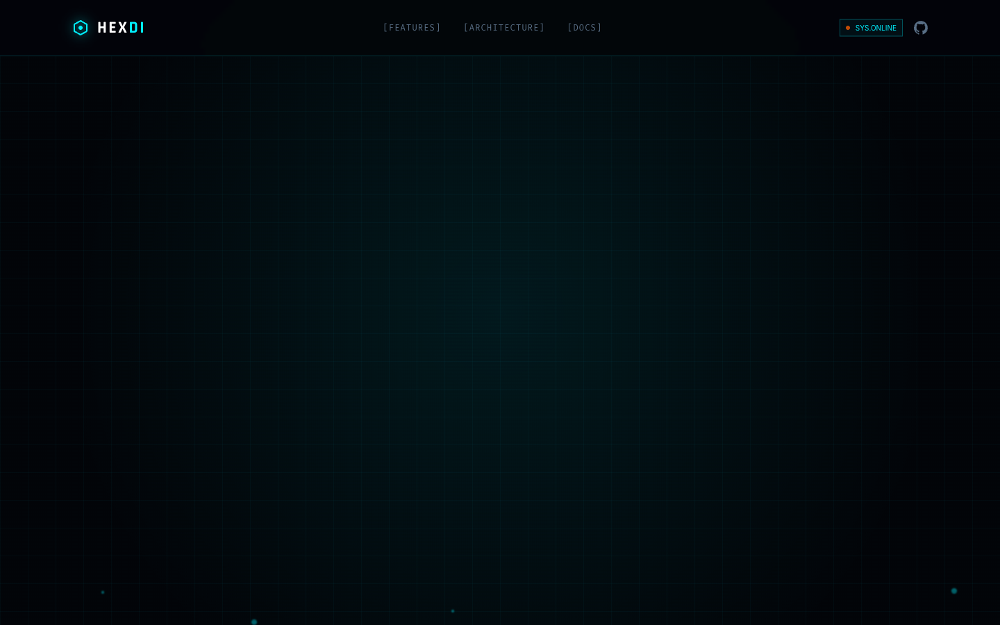

# 04 — Landing Page (Tactical DI)

**File:** `4.html`
**Title:** HexDI - Tactical Dependency Injection
**Type:** Marketing landing page
**Layout:** Vertical scroll, full-width sections

---



## Overview

The "Tactical DI" variant. Introduces 3D perspective card hover effects (`depth-card`), rising particle animations, and fade-up entry animations. The aesthetic remains cyberpunk/tactical but with a more dramatic 3D spatial feel.

---

## Color Palette

Standard HexDI palette. No overrides.
- Background: `#020408`

---

## Animation Tokens

| Name | Duration | Details |
|---|---|---|
| `float` | 6s | `translateY(0) rotateX(20deg) rotateZ(-10deg)` ↔ `translateY(-20px) rotateX(25deg) rotateZ(-5deg)` — more dramatic tilt swing |
| `fade-up` | 1s | `opacity:0 translateY(40px)` → `opacity:1 translateY(0)`, `cubic-bezier(0.16, 1, 0.3, 1)` |
| `particle-float` | 15s | Rising particles: `translateY(0) translateX(0)` → `translateY(-100vh) translateX(20px)`, opacity 0→0.4→0.4→0 |
| `scanline` | 8s | Standard CRT sweep |
| `spin-slow` | 20s | Full rotation |
| `pulse-glow` | 2s | Glow pulse |

---

## New CSS Classes

### `.depth-card`
3D perspective hover on feature cards:
```css
.depth-card {
  transition: transform 0.4s cubic-bezier(0.16, 1, 0.3, 1);
  transform-style: preserve-3d;
}
.depth-card:hover {
  transform: translateZ(20px) rotateY(-5deg);
  box-shadow: 10px 10px 40px rgba(0,240,255,0.15);
}
```

### `.particle-system`
Fixed-position container (`position: fixed; inset: 0; pointer-events: none; z-index: 0`) holding multiple rising particle divs. Each particle:
```css
.particle {
  position: absolute;
  width: 2px; height: 2px;
  background: #00F0FF;
  border-radius: 50%;
  animation: particle-float 15s linear infinite;
  /* staggered via animation-delay */
}
```
Typically 15–20 particles spread across `left: 5%–95%`, with staggered delays.

### `.fade-up`
Applied to hero text elements for entry animation:
```css
.animate-fade-up {
  animation: fade-up 1s cubic-bezier(0.16, 1, 0.3, 1) forwards;
}
```
Staggered with `animation-delay: 0s, 0.1s, 0.2s, ...` on badge, h1, subtext, buttons.

### Background Spotlights
Two named radial gradients available:
- `radial-spotlight`: `radial-gradient(circle at center, rgba(0,240,255,0.15) 0%, rgba(2,4,8,0) 75%)`
- `accent-spotlight`: `radial-gradient(circle at center, rgba(255,94,0,0.1) 0%, rgba(2,4,8,0) 70%)`

---

## Layout Structure

```
┌─────────────────────────────────────────────────────────────┐
│  NAV  fixed h-20  (same as file 1)                          │
├─────────────────────────────────────────────────────────────┤
│  PARTICLE LAYER  fixed, z-index:0, pointer-events:none      │
│  (15-20 rising cyan dots, staggered animation-delay)        │
├─────────────────────────────────────────────────────────────┤
│  HERO  min-h-screen                                         │
│  - text elements use fade-up entry animation                │
│  - radial-spotlight + accent-spotlight bg layers            │
│  Left: fade-in badge + h1 + subtext + buttons               │
│  Right: hex SVG (float with exaggerated rotateX tilt)       │
├─────────────────────────────────────────────────────────────┤
│  FEATURES  3×2 depth-card grid                              │
│  - hover: translateZ(20px) rotateY(-5deg)                   │
├─────────────────────────────────────────────────────────────┤
│  CODE PREVIEW  (same as file 1)                             │
├─────────────────────────────────────────────────────────────┤
│  MODULE ARCHITECTURE  (SVG same as file 2)                  │
├─────────────────────────────────────────────────────────────┤
│  LIFETIME SCOPES  3-col                                     │
├─────────────────────────────────────────────────────────────┤
│  COMPARISON  2-col                                          │
├─────────────────────────────────────────────────────────────┤
│  CTA                                                        │
├─────────────────────────────────────────────────────────────┤
│  FOOTER                                                     │
└─────────────────────────────────────────────────────────────┘
```

---

## When to Use

Use when targeting a "tactical" / game-inspired aesthetic with 3D card interaction and particle atmosphere. The depth-card hover creates strong spatial feedback on the features grid.

---

<details>
<summary><strong>HTML Starter Boilerplate</strong></summary>

```html
<!DOCTYPE html>
<html lang="en">
<head>
  <!-- Standard head: Tailwind CDN + fonts + config + CSS (see design-system.md) -->
  <!-- float: rotateX(20deg) rotateZ(-10deg) ↔ rotateX(22deg) rotateZ(-8deg) -->
  <!-- scanline: 6s duration, holo-slide shimmer on hero overlay -->
  <!-- hud-card: 15px corners, blur(4px) -->
</head>
<body class="bg-hex-bg bg-grid overflow-x-hidden">
  <div class="fixed inset-0 bg-grid opacity-30 pointer-events-none z-0"></div>
  <div class="fixed inset-0 bg-[radial-gradient(circle_at_50%_50%,transparent_0%,rgba(2,4,8,0.8)_100%)] pointer-events-none z-0"></div>

  <nav class="fixed top-0 w-full z-[100] border-b border-hex-primary/20 bg-hex-bg/80 backdrop-blur-xl">
    <div class="max-w-7xl mx-auto px-10 h-20 flex items-center justify-between">
      <!-- Logo + nav links + SYS_v2.4 badge -->
    </div>
  </nav>

  <main class="relative z-10">
    <section class="min-h-screen flex items-center pt-20 relative overflow-hidden">
      <!-- Holo shimmer overlay -->
      <div class="absolute inset-0 pointer-events-none"
           style="background: linear-gradient(45deg, transparent 25%, rgba(0,240,255,0.06) 50%, transparent 75%); background-size: 200% 100%; animation: holo-slide 3s ease-in-out infinite;"></div>
      <!-- 6s scanline -->
      <div class="scanline pointer-events-none" style="animation-duration: 6s;"></div>
      <div class="max-w-7xl mx-auto px-10 grid lg:grid-cols-2 gap-16 items-center">
        <div><!-- Badge + H1 + subtext + CTAs --></div>
        <div class="flex justify-end">
          <!-- Hex SVG animate-float (rotateX/Z variant) -->
        </div>
      </div>
    </section>
    <section class="py-24"><div class="max-w-7xl mx-auto px-10">
      <div class="grid md:grid-cols-3 gap-6"><!-- 6× hud-card (15px corners) features --></div>
    </div></section>
    <section class="py-24"><div class="max-w-7xl mx-auto px-10"><!-- Terminal --></div></section>
    <section class="py-24"><div class="max-w-7xl mx-auto px-10"><!-- Architecture --></div></section>
    <section class="py-24"><div class="max-w-7xl mx-auto px-10">
      <div class="grid md:grid-cols-3 gap-6"><!-- 3× lifetime cards --></div>
    </div></section>
    <section class="py-24"><div class="max-w-7xl mx-auto px-10">
      <div class="grid md:grid-cols-2 gap-6"><!-- Comparison --></div>
    </div></section>
    <section class="py-24"><div class="max-w-7xl mx-auto px-10"><!-- CTA --></div></section>
    <footer class="border-t border-hex-primary/10 py-12"><!-- footer --></footer>
  </main>
</body>
</html>
```

</details>
