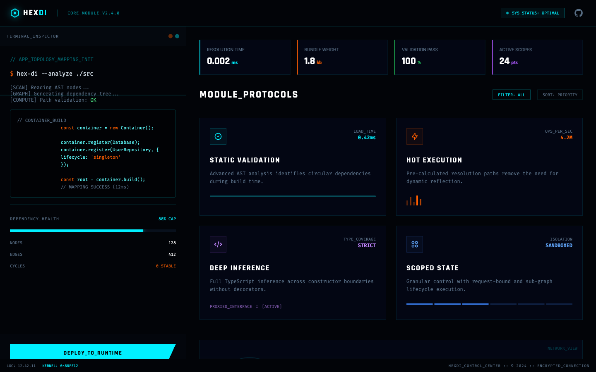

# 13 — Dashboard (Control Panel + Terminal Inspector)

**File:** `13.html`
**Title:** HexDI Dashboard - Control Interface
**Type:** Application control panel / developer tool UI
**Layout:** Full-screen fixed layout with left sidebar (terminal) + right content area

---



## Overview

A full-screen app layout with no scroll. A fixed-height `h-[calc(100vh-64px)]` main area is split into a **left terminal inspector panel** (`w-[450px]`) and a **right content area**. The left pane shows simulated CLI output (AST analysis results, dependency graph data). The right pane shows a service registry and dependency graph visualization.

---

## Color Palette

Standard HexDI palette. No overrides.

---

## Root Layout

```css
body { background: #020408; /* bg-grid */ }
nav { height: 64px; /* h-16 */ }
main { display: flex; height: calc(100vh - 64px); overflow: hidden; }
```

---

## Navigation (h-16, compact)

- Logo: 24px hex SVG + `text-xl font-display`
- Separator: `1px vertical line`
- Version label: `"CORE_MODULE_V2.4.0"` — `text-[10px] font-mono text-hex-primary/60`
- Right: `SYS_STATUS: OPTIMAL` badge + GitHub icon button

---

## Layout Structure

```
┌─────────────────────────────────────────────────────────────────────┐
│  NAV  h-16  border-b border-hex-primary/20                          │
│  logo │ version │                           SYS_STATUS + GitHub     │
├────────────────────────┬────────────────────────────────────────────┤
│  ASIDE (terminal)      │  MAIN CONTENT AREA                         │
│  w-[450px]             │  overflow-y: auto                          │
│  border-r              │                                            │
│                        │  ┌─ DEPENDENCY GRAPH VISUALIZATION ──┐     │
│  Header:               │  │  SVG or canvas-based graph        │     │
│  "Terminal_Inspector"  │  │  showing container/service nodes  │     │
│  + traffic-light dots  │  └───────────────────────────────────┘     │
│                        │                                            │
│  Scrollable body:      │  ┌─ SERVICE REGISTRY ─────────────────┐   │
│  ┌──────────────────┐  │  │  Table/list of registered services │   │
│  │ // APP_TOPOLOGY  │  │  │  with name, lifetime, status       │   │
│  │ $ hex-di --analyze│  │  └───────────────────────────────────┘   │
│  │ [SCAN] AST...    │  │                                            │
│  │ [GRAPH] deps...  │  └────────────────────────────────────────────┘
│  │ [COMPUTE] OK ✓   │
│  │                  │
│  │ const container  │
│  │  = new Container │
│  │  ...code...      │
│  └──────────────────┘
│                        │
│  scanline overlay      │
└────────────────────────┘
```

---

## Left Panel: Terminal Inspector

### Header Bar
```html
<div class="p-4 border-b border-hex-primary/10 bg-hex-surface/30 flex justify-between items-center">
  <span class="font-mono text-[10px] uppercase tracking-widest text-hex-muted">Terminal_Inspector</span>
  <div class="flex gap-1.5">
    <div class="w-2.5 h-2.5 rounded-full bg-hex-accent/40"></div>  <!-- orange dot -->
    <div class="w-2.5 h-2.5 rounded-full bg-hex-primary/40"></div>  <!-- cyan dot -->
  </div>
</div>
```

### Scrollable Terminal Body
```css
.terminal-scroll {
  font-family: 'Fira Code', monospace;
  font-size: 0.875rem;
  overflow-y: auto;
  padding: 1.5rem;
  position: relative;
}
```

**Terminal content pattern:**
```
// APP_TOPOLOGY_MAPPING_INIT           ← dim cyan comment
$ hex-di --analyze ./src              ← orange $ + command

[SCAN] Reading AST nodes...           ← muted text
[GRAPH] Generating dependency tree...
[COMPUTE] Path validation: OK         ← "OK" in green-400

┌─────────────────────────────────┐   ← code block
│ // CONTAINER_BUILD              │   ← muted comment
│ const container = new Container │   ← orange keywords
│ container.register(...)         │
└─────────────────────────────────┘
```

Code blocks: `border border-hex-primary/20 bg-black/40 p-4 rounded text-[11px] text-hex-primaryLight`

### `.scanline` (inside terminal)
```css
.scanline {
  position: absolute;
  top: 0; left: 0;
  width: 100%; height: 100px;
  background: linear-gradient(to bottom, transparent, rgba(0,240,255,0.05), transparent);
  animation: scanline-move 8s linear infinite;
  pointer-events: none; z-index: 50;
}
@keyframes scanline-move { 0% { top: 0% } 100% { top: 100% } }
```

---

## Syntax Highlighting in Terminal

```css
text-hex-accent      → orange: keywords (const, new), $ prompt
text-hex-primary/40  → dim cyan: comments (//)
text-hex-primaryLight → bright cyan: code output
text-green-400       → green: success values (OK)
text-hex-muted       → muted: info lines [SCAN], [GRAPH]
```

---

## When to Use

Use as the **developer tooling / CLI experience** screen. Ideal for showcasing the hex-di inspection/analysis capabilities, as an in-app terminal panel, or as inspiration for any "split terminal + visualization" layout pattern.


---

<details>
<summary><strong>HTML Starter Boilerplate</strong></summary>

```html
<!DOCTYPE html>
<html lang="en">
<head>
  <!-- Standard head + scanline 8s -->
  <!-- body: height 100vh; overflow: hidden -->
  <!-- .terminal-scroll: thin 4px scrollbar -->
  <!-- hud-card: blur(8px) -->
</head>
<body class="bg-hex-bg bg-grid" style="height:100vh; overflow:hidden;">

  <nav class="border-b border-hex-primary/20 bg-hex-bg/90 backdrop-blur-md h-16 flex items-center px-6">
    <div class="flex items-center gap-4">
      <!-- Logo + separator + CORE_MODULE_V2.4.0 label -->
    </div>
    <div class="ml-auto flex items-center gap-4">
      <!-- SYS_STATUS: OPTIMAL + GitHub icon -->
    </div>
  </nav>

  <main class="flex overflow-hidden" style="height:calc(100vh - 64px);">

    <!-- Left: Terminal Inspector (w-[450px]) -->
    <aside class="w-[450px] flex-shrink-0 border-r border-hex-primary/10 flex flex-col overflow-hidden">
      <div class="p-4 border-b border-hex-primary/10 bg-hex-surface/30 flex justify-between items-center">
        <span class="font-mono text-[10px] uppercase tracking-widest text-hex-muted">Terminal_Inspector</span>
        <div class="flex gap-1.5">
          <div class="w-2.5 h-2.5 rounded-full bg-hex-accent/40"></div>
          <div class="w-2.5 h-2.5 rounded-full bg-hex-primary/40"></div>
        </div>
      </div>
      <div class="flex-1 overflow-y-auto terminal-scroll p-6 font-mono text-[11px] relative">
        <div class="scanline"></div>
        <!-- // comment → $ command → [SCAN][GRAPH][COMPUTE] → code block -->
      </div>
    </aside>

    <!-- Right: content -->
    <div class="flex-1 overflow-y-auto p-8">
      <!-- Dependency graph visualization -->
      <!-- Service registry table/list -->
    </div>

  </main>

</body>
</html>
```

</details>
