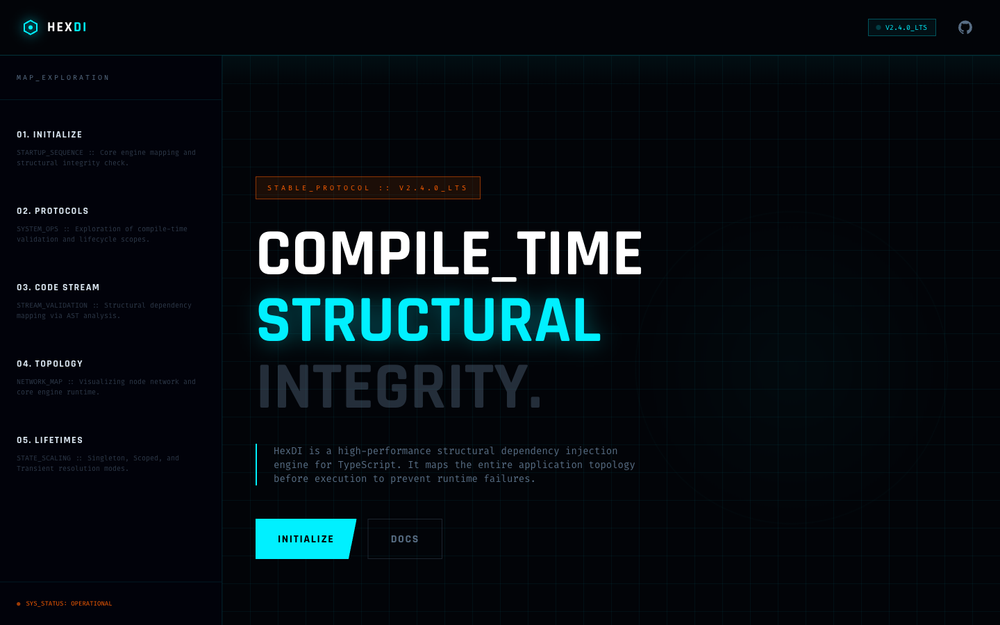

# 18 — Landing Page (v18 / Standard Holo)

**File:** `18.html`
**Title:** HexDI - Structural Dependency Injection
**Type:** Marketing landing page
**Layout:** Vertical scroll, full-width sections

---



## Overview

A standard landing page variant with `overflow: hidden` on body, the full diagonal float animation (`rotateX(20deg) rotateZ(-10deg)`), `holo-slide` shimmer, and 15px corner brackets. Very similar to file 12, but with `holo-slide` available and slightly different CSS ordering. Closest to a "clean baseline" of the polished variants.

---

## Color Palette

Standard HexDI palette. No overrides.

---

## Animation Tokens

| Name | Duration | Details |
|---|---|---|
| `float` | 6s | `translateY(0) rotateX(20deg) rotateZ(-10deg)` ↔ `translateY(-20px) rotateX(22deg) rotateZ(-8deg)` |
| `scanline` | 6s | CRT sweep |
| `holo-slide` | 3s | Shimmer drift |
| `pulse-glow` | 2s | Standard glow |
| `spin-slow` | 20s | Full rotation |

---

## CSS Properties

### `.hud-card`
```css
.hud-card {
  background: rgba(8, 16, 28, 0.4);
  backdrop-filter: blur(8px);
  border: 1px solid rgba(0, 240, 255, 0.1);
  transition: all 0.4s cubic-bezier(0.16, 1, 0.3, 1);
}
.hud-card::before, .hud-card::after {
  width: 15px; height: 15px;   /* standard 15px corners */
}
.hud-card:hover {
  /* hover transition defined (border + bg) */
}
```

### Background Gradients Available
```js
'radar-gradient': radial cyan spotlight (0.12 opacity)
'holo-shimmer':   45deg shimmer gradient
```

---

## Key Comparison with Similar Files

| Property | File 18 | File 12 | File 3 |
|---|---|---|---|
| Float | rotateX(20deg) rotateZ(-10deg) | Same | Same |
| body overflow | `hidden` | `hidden` | `overflow-x: hidden` |
| Scanline | 6s | 6s | 6s |
| Holo-slide | Yes | Yes | Yes |
| Grid | 40px std | 40px std | 160px large |
| Section scanlines | No | No | Yes |
| Mouse parallax | No | No | Yes |
| Corner brackets | 15px | 15px | 15px |
| Hover lift | Transition only | Transition only | `translateY(-5px) scale(1.02)` |

---

## Layout Structure

```
┌─────────────────────────────────────────────────────────────┐
│  NAV  fixed h-20  (standard)                                │
├─────────────────────────────────────────────────────────────┤
│  HERO  min-h-screen  bg-grid (40px)                         │
│  - radar-gradient radial spotlight                          │
│  Left: badge + h1 + subtext + buttons + install widget      │
│  Right: hex SVG (float + rotateX(20deg) rotateZ(-10deg))    │
├─────────────────────────────────────────────────────────────┤
│  FEATURES  3×2 hud-card grid                                │
├─────────────────────────────────────────────────────────────┤
│  CODE PREVIEW  terminal window                              │
├─────────────────────────────────────────────────────────────┤
│  MODULE ARCHITECTURE  SVG + package cards                   │
├─────────────────────────────────────────────────────────────┤
│  LIFETIME SCOPES  3-col                                     │
├─────────────────────────────────────────────────────────────┤
│  COMPARISON  2-col                                          │
├─────────────────────────────────────────────────────────────┤
│  CTA                                                        │
├─────────────────────────────────────────────────────────────┤
│  FOOTER                                                     │
└─────────────────────────────────────────────────────────────┘
```

---

## When to Use

Use as a **clean, standard baseline** of the diagonal-tilt float variant. No special extras, no large grid. The most predictable version of the full-featured standard landing. Good as a starting template when you want the diagonal hex SVG animation without any experimental features.


---

<details>
<summary><strong>HTML Starter Boilerplate</strong></summary>

```html
<!DOCTYPE html>
<html lang="en">
<head>
  <!-- Standard head + holo-slide + scanline 6s -->
  <!-- float: translateY(-20px) rotateX(22deg) rotateZ(-8deg) — clean diagonal baseline -->
  <!-- hud-card: blur(8px), 15px corners, hover: border+bg transition (no lift) -->
  <!-- body: overflow hidden -->
  <!-- CLEANEST diagonal-float baseline — recommended starting template -->
</head>
<body class="bg-hex-bg overflow-hidden" style="-webkit-font-smoothing:antialiased;">

  <div class="fixed inset-0 bg-grid opacity-30 pointer-events-none z-0"></div>
  <div class="fixed inset-0 pointer-events-none z-0" style="background:radial-gradient(circle at 50% 50%,transparent 0%,rgba(2,4,8,0.8)100%)"></div>

  <nav class="fixed top-0 w-full z-[100] border-b border-hex-primary/20 bg-hex-bg/80 backdrop-blur-xl">
    <div class="max-w-7xl mx-auto px-10 h-20 flex items-center justify-between">
      <!-- Logo + [Features][Architecture][Docs] links + SYS_v2.4 badge -->
    </div>
  </nav>

  <main class="relative z-10">
    <section class="min-h-screen flex items-center pt-20 relative">
      <div class="absolute inset-0 bg-radar-gradient opacity-60 pointer-events-none"></div>
      <div class="max-w-7xl mx-auto px-10 grid lg:grid-cols-2 gap-16 items-center relative z-10">
        <div>
          <!-- Orange STABLE_PROTOCOL badge -->
          <!-- H1 text-6xl lg:text-8xl, cyan glow on "Structural" -->
          <!-- Subtext pl-4 border-l-2 -->
          <!-- [Initialize_Core] slant + [View_Docs] ghost -->
          <!-- Install widget -->
        </div>
        <div class="flex justify-end">
          <!-- Hex SVG animate-float (diagonal) -->
          <!-- holo-slide shimmer div bg-holo-shimmer animate-holo-slide -->
        </div>
      </div>
    </section>
    <!-- Features 3x2 → Code terminal → Architecture → Lifetime 3-col → Comparison 2-col → CTA → Footer -->
  </main>

</body>
</html>
```

</details>
