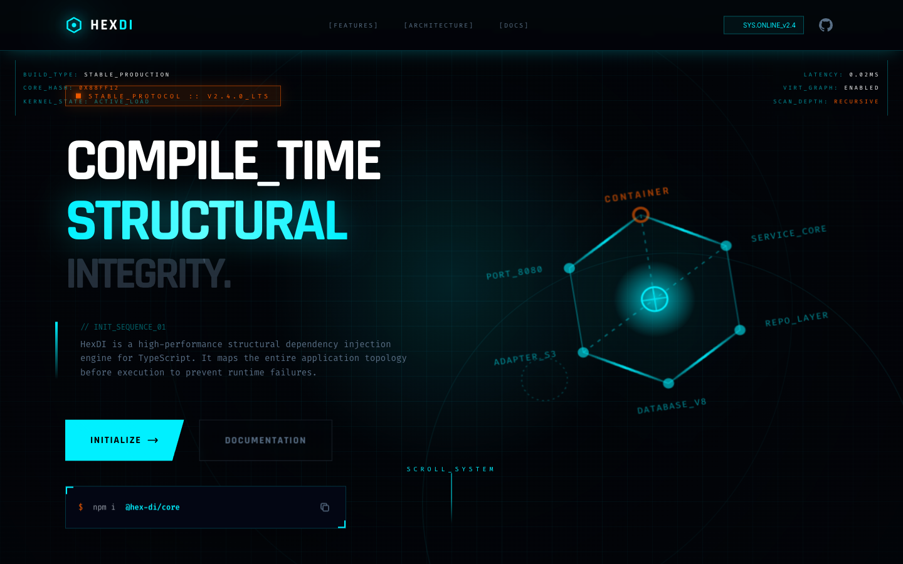

# 03 — Landing Page (Parallax / v3)

**File:** `3.html`
**Title:** HexDI - Structural Dependency Injection
**Type:** Marketing landing page
**Layout:** Vertical scroll, full-width sections

---



## Overview

The "v3" variant. Builds on file 2 with enhanced visual polish: larger background grid, holographic shimmer overlay (`holo-element`), section scanlines, hover lift on cards, JS-driven mouse parallax on the hero SVG, macOS-style traffic lights in the code window, and an animated border underline on features.

---

## Color Palette

Standard HexDI palette. No overrides.

- Background: `#020408`
- Primary: `#00F0FF`
- Accent: `#FF5E00`

---

## Animation Tokens

| Name            | Duration | Details                                                                                            |
| --------------- | -------- | -------------------------------------------------------------------------------------------------- |
| `float`         | 6s       | `translateY(0) rotateX(20deg) rotateZ(-10deg)` ↔ `translateY(-20px) rotateX(22deg) rotateZ(-8deg)` |
| `scanline`      | 6s       | Vertical CRT sweep                                                                                 |
| `scanline-fast` | 3s       | Faster CRT sweep for focused elements                                                              |
| `holo-slide`    | 3s       | Shimmer drift (`background-position: -200% → 200%`)                                                |
| `pulse-glow`    | 2s       | Opacity + box-shadow pulse                                                                         |
| `spin-slow`     | 20s      | Full rotation                                                                                      |

---

## New CSS Classes (vs file 1/2)

### `bg-grid-large`

```css
background-size: 160px 160px;
background-image:
  linear-gradient(rgba(0, 240, 255, 0.08) 1px, transparent 1px),
  linear-gradient(90deg, rgba(0, 240, 255, 0.08) 1px, transparent 1px);
```

Used on hero and feature sections for a spacious "tactical grid" feel.

### `.holo-element`

Shimmer overlay applied to the hero section and selected cards:

```css
::after {
  background: linear-gradient(115deg, transparent 40%, rgba(0, 240, 255, 0.1) 50%, transparent 60%);
  background-size: 300% 100%;
  animation: holo-slide 3s infinite linear;
}
```

### `.section-scanline`

Animated CRT scanline sweeping over each section:

```css
position: absolute;
inset: 0;
height: 100px;
background: linear-gradient(to bottom, transparent, rgba(0, 240, 255, 0.05), transparent);
animation: scanline 6s linear infinite;
```

### `.hud-card` (hover lift)

```css
.hud-card:hover {
  transform: translateY(-5px) scale(1.02);
  box-shadow: 0 10px 30px rgba(0, 240, 255, 0.15);
}
```

Corner brackets expand to 30px on hover (partial frame).

---

## Hero — Mouse Parallax

JavaScript `onmousemove` handler on the hero section moves the SVG hexagon:

```js
document.addEventListener("mousemove", e => {
  const x = (e.clientX / window.innerWidth - 0.5) * 20;
  const y = (e.clientY / window.innerHeight - 0.5) * 20;
  hexSvg.style.transform = `rotateX(${20 + y}deg) rotateZ(${-10 + x}deg)`;
});
```

---

## Code Window Enhancements

- macOS traffic lights at top-left of terminal header:
  ```html
  <div class="flex gap-1.5">
    <div class="w-3 h-3 rounded-full bg-red-500/50"></div>
    <div class="w-3 h-3 rounded-full bg-yellow-500/50"></div>
    <div class="w-3 h-3 rounded-full bg-green-500/50"></div>
    <span class="text-[10px] text-hex-muted uppercase font-mono ml-4">TERMINAL_01</span>
  </div>
  ```

---

## Features Section Enhancements

- Section heading has an animated border underline:
  ```css
  .section-title::after {
    content: '';
    display: block;
    width: 60px; → transitions to 120px on hover
    height: 2px;
    background: #00F0FF;
    transition: width 0.3s ease;
  }
  ```

---

## Layout Structure

```
┌─────────────────────────────────────────────────────────────┐
│  NAV  fixed h-20  (same as file 1)                          │
├─────────────────────────────────────────────────────────────┤
│  HERO  min-h-screen  bg-grid-large + holo-element           │
│  - section-scanline overlay                                 │
│  Left: badge + h1 (text-6xl md:text-8xl) + buttons         │
│  Right: hex SVG (float + mouse parallax JS)                 │
├─────────────────────────────────────────────────────────────┤
│  FEATURES  3×2 hud-cards w/ hover lift + corner expand      │
│  - animated border underline on section heading             │
├─────────────────────────────────────────────────────────────┤
│  CODE PREVIEW  macOS traffic lights in terminal header      │
├─────────────────────────────────────────────────────────────┤
│  MODULE ARCHITECTURE  enhanced SVG (same as file 2)         │
├─────────────────────────────────────────────────────────────┤
│  LIFETIME SCOPES  3-col                                     │
├─────────────────────────────────────────────────────────────┤
│  COMPARISON  2-col                                          │
├─────────────────────────────────────────────────────────────┤
│  CTA                                                        │
├─────────────────────────────────────────────────────────────┤
│  FOOTER                                                     │
└─────────────────────────────────────────────────────────────┘
```

---

## When to Use

The most feature-rich standard landing. Use when you want maximum visual polish: parallax interaction, shimmer overlays, hover lift cards, and large-grid bg.

---

<details>
<summary><strong>HTML Starter Boilerplate</strong></summary>

```html
<!DOCTYPE html>
<html lang="en">
  <head>
    <!-- Standard head: Tailwind CDN + fonts + config + CSS (see design-system.md) -->
    <!-- bg-grid-large (160px cell size), section-scanline overlays per section -->
    <!-- mousemove parallax JS on hex SVG, hover card: translateY(-5px) scale(1.02) -->
  </head>
  <body class="bg-hex-bg overflow-x-hidden" style="background-size: 160px 160px;">
    <div
      class="fixed inset-0 opacity-30 pointer-events-none z-0"
      style="background-size: 160px 160px; background-image: linear-gradient(to right, rgba(0,240,255,0.05) 1px, transparent 1px), linear-gradient(to bottom, rgba(0,240,255,0.05) 1px, transparent 1px);"
    ></div>
    <div
      class="fixed inset-0 bg-[radial-gradient(circle_at_50%_50%,transparent_0%,rgba(2,4,8,0.8)_100%)] pointer-events-none z-0"
    ></div>

    <nav
      class="fixed top-0 w-full z-[100] border-b border-hex-primary/20 bg-hex-bg/80 backdrop-blur-xl"
    >
      <div class="max-w-7xl mx-auto px-10 h-20 flex items-center justify-between">
        <!-- Logo + nav links + SYS_v2.4 badge -->
      </div>
    </nav>

    <main class="relative z-10">
      <section class="min-h-screen flex items-center pt-20 relative overflow-hidden" id="hero">
        <!-- Section scanline -->
        <div class="scanline pointer-events-none"></div>
        <div class="max-w-7xl mx-auto px-10 grid lg:grid-cols-2 gap-16 items-center">
          <div><!-- Badge + H1 + subtext + CTAs --></div>
          <div class="flex justify-end" id="hex-parallax">
            <!-- Hex SVG — position shifts on mousemove via JS -->
          </div>
        </div>
      </section>
      <section class="py-24 relative overflow-hidden">
        <div class="scanline pointer-events-none"></div>
        <div class="max-w-7xl mx-auto px-10">
          <!-- Cards with hover: translateY(-5px) scale(1.02) -->
          <div class="grid md:grid-cols-3 gap-6"><!-- 6× feature cards --></div>
        </div>
      </section>
      <section class="py-24 relative overflow-hidden">
        <div class="scanline pointer-events-none"></div>
        <div class="max-w-7xl mx-auto px-10"><!-- Terminal --></div>
      </section>
      <section class="py-24">
        <div class="max-w-7xl mx-auto px-10"><!-- Architecture --></div>
      </section>
      <section class="py-24">
        <div class="max-w-7xl mx-auto px-10">
          <div class="grid md:grid-cols-3 gap-6"><!-- 3× lifetime cards --></div>
        </div>
      </section>
      <section class="py-24">
        <div class="max-w-7xl mx-auto px-10">
          <div class="grid md:grid-cols-2 gap-6"><!-- Comparison --></div>
        </div>
      </section>
      <section class="py-24">
        <div class="max-w-7xl mx-auto px-10"><!-- CTA --></div>
      </section>
      <footer class="border-t border-hex-primary/10 py-12"><!-- footer --></footer>
    </main>

    <script>
      // Parallax: shift hex SVG on mousemove
      document.addEventListener("mousemove", e => {
        const el = document.getElementById("hex-parallax");
        if (!el) return;
        const x = (e.clientX / window.innerWidth - 0.5) * 20;
        const y = (e.clientY / window.innerHeight - 0.5) * 20;
        el.style.transform = `translate(${x}px, ${y}px)`;
      });
    </script>
  </body>
</html>
```

</details>
