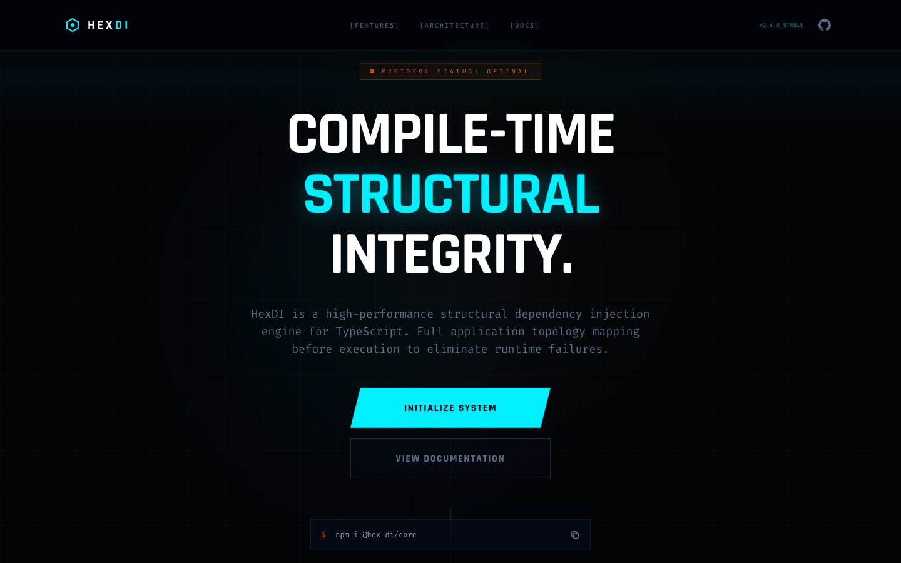

# 08 — Landing Page (Minimal)

**File:** `8.html`
**Title:** HexDI - Structural Dependency Injection
**Type:** Marketing landing page
**Layout:** Vertical scroll, full-width sections

---



## Overview

The most restrained variant of the standard landing. Uses a near-invisible `bg-grid-minimal` (60px, 0.02 opacity), removes the float animation entirely from the hero SVG, slows all animations to the longest durations, adds `abstract-orb` blurred color blobs, and uses a `minimal-pattern` dot grid.

---

## Color Palette

Standard HexDI palette. No overrides.

- Background: `#020408`

---

## Animation Tokens

| Name         | Duration | Details                                                 |
| ------------ | -------- | ------------------------------------------------------- |
| ~~`float`~~  | —        | **Not defined** — hero SVG has no float animation       |
| `pulse-glow` | **4s**   | Slowest variant; opacity only `0.2→0.5` (no box-shadow) |
| `scanline`   | 8s       | Sweeps to `100vh` (not loop-relative)                   |
| `holo-slide` | 3s       | Background shimmer                                      |
| `spin-slow`  | **30s**  | Slowest rotation (vs 20s standard)                      |

---

## CSS Classes

### `.bg-grid-minimal`

```css
background-size: 60px 60px;
background-image:
  linear-gradient(to right, rgba(0, 240, 255, 0.02) 1px, transparent 1px),
  linear-gradient(to bottom, rgba(0, 240, 255, 0.02) 1px, transparent 1px);
```

Almost invisible — creates texture without visual noise.

### `minimal-pattern` (background image)

```css
'minimal-pattern': 'radial-gradient(circle at 2px 2px, rgba(0, 240, 255, 0.05) 1px, transparent 0)'
```

Dot grid pattern at 2px intervals for very subtle texture.

### `.abstract-orb`

Large blurred color blobs used as background atmosphere:

```css
.abstract-orb {
  filter: blur(80px);
  opacity: 0.15;
  animation: pulse-glow 8s ease-in-out infinite;
}
```

Typically 2–3 orbs: cyan (`bg-hex-primary`) and orange (`bg-hex-accent`), positioned in hero corners.

### `.holo-element`

Shimmer overlay (same pattern as file 3):

```css
::after {
  background: linear-gradient(115deg, transparent 40%, rgba(0, 240, 255, 0.1) 50%, transparent 60%);
  background-size: 300% 100%;
  animation: holo-slide 4s infinite linear; /* 4s — slower than standard 3s */
}
```

### `.section-scanline`

```css
height: 150px;
background: linear-gradient(to bottom, transparent, rgba(0, 240, 255, 0.03), transparent);
```

Even more transparent than file 3 (`0.03` vs `0.05`).

### `.clip-path-slant`

```css
clip-path: polygon(5% 0, 100% 0, 95% 100%, 0% 100%);
```

### `.hud-card`

- `background: rgba(8, 16, 28, 0.4)` — same as file 7
- `backdrop-filter: blur(8px)`

---

## Layout Structure

```
┌─────────────────────────────────────────────────────────────┐
│  NAV  fixed h-20  (standard)                                │
├─────────────────────────────────────────────────────────────┤
│  HERO  min-h-screen  bg-grid-minimal                        │
│  - abstract-orb blobs in hero (cyan + orange, blurred)      │
│  - section-scanline overlay (very faint, 0.03)              │
│  Left: badge + h1 + subtext + buttons                       │
│  Right: hex SVG — STATIC (no float animation)               │
├─────────────────────────────────────────────────────────────┤
│  FEATURES  3×2 hud-card (holo-element shimmer)              │
├─────────────────────────────────────────────────────────────┤
│  CODE PREVIEW  (standard)                                   │
├─────────────────────────────────────────────────────────────┤
│  MODULE ARCHITECTURE                                        │
├─────────────────────────────────────────────────────────────┤
│  LIFETIME SCOPES  3-col                                     │
├─────────────────────────────────────────────────────────────┤
│  COMPARISON  2-col                                          │
├─────────────────────────────────────────────────────────────┤
│  CTA                                                        │
├─────────────────────────────────────────────────────────────┤
│  FOOTER                                                     │
└─────────────────────────────────────────────────────────────┘
```

---

## When to Use

Use when targeting a professional, less "flashy" audience who might find heavy animations distracting. The abstract orbs maintain visual interest without aggressive motion. Good for docs/technical-heavy pages where readability matters most.

---

<details>
<summary><strong>HTML Starter Boilerplate</strong></summary>

```html
<!DOCTYPE html>
<html lang="en">
  <head>
    <!-- Standard head: Tailwind CDN + fonts + config + CSS (see design-system.md) -->
    <!-- compact: nav h-14, py-16 sections (vs py-24), tighter gap-4 cards -->
    <!-- hud-card: blur(4px), reduced padding p-4 (vs p-6) -->
  </head>
  <body class="bg-hex-bg bg-grid overflow-x-hidden">
    <div class="fixed inset-0 bg-grid opacity-30 pointer-events-none z-0"></div>
    <div
      class="fixed inset-0 bg-[radial-gradient(circle_at_50%_50%,transparent_0%,rgba(2,4,8,0.8)_100%)] pointer-events-none z-0"
    ></div>

    <!-- Compact nav: h-14 instead of h-20 -->
    <nav
      class="fixed top-0 w-full z-[100] border-b border-hex-primary/20 bg-hex-bg/80 backdrop-blur-xl"
    >
      <div class="max-w-7xl mx-auto px-10 h-14 flex items-center justify-between">
        <!-- Logo + nav links + SYS_v2.4 badge -->
      </div>
    </nav>

    <main class="relative z-10">
      <!-- Hero: pt-14 (compact nav offset), tighter py-16 -->
      <section class="min-h-screen flex items-center pt-14 relative">
        <div class="max-w-7xl mx-auto px-10 grid lg:grid-cols-2 gap-12 items-center">
          <div><!-- Badge + H1 (text-5xl) + subtext + CTAs --></div>
          <div class="flex justify-end"><!-- Hex SVG animate-float (smaller w-64) --></div>
        </div>
      </section>
      <!-- Compact sections: py-16 + gap-4 -->
      <section class="py-16">
        <div class="max-w-7xl mx-auto px-10">
          <div class="grid md:grid-cols-3 gap-4"><!-- 6× compact hud-card p-4 features --></div>
        </div>
      </section>
      <section class="py-16">
        <div class="max-w-7xl mx-auto px-10"><!-- Terminal --></div>
      </section>
      <section class="py-16">
        <div class="max-w-7xl mx-auto px-10"><!-- Architecture --></div>
      </section>
      <section class="py-16">
        <div class="max-w-7xl mx-auto px-10">
          <div class="grid md:grid-cols-3 gap-4"><!-- 3× compact lifetime cards --></div>
        </div>
      </section>
      <section class="py-16">
        <div class="max-w-7xl mx-auto px-10">
          <div class="grid md:grid-cols-2 gap-4"><!-- Comparison --></div>
        </div>
      </section>
      <section class="py-16">
        <div class="max-w-7xl mx-auto px-10"><!-- CTA --></div>
      </section>
      <footer class="border-t border-hex-primary/10 py-8"><!-- footer --></footer>
    </main>
  </body>
</html>
```

</details>
