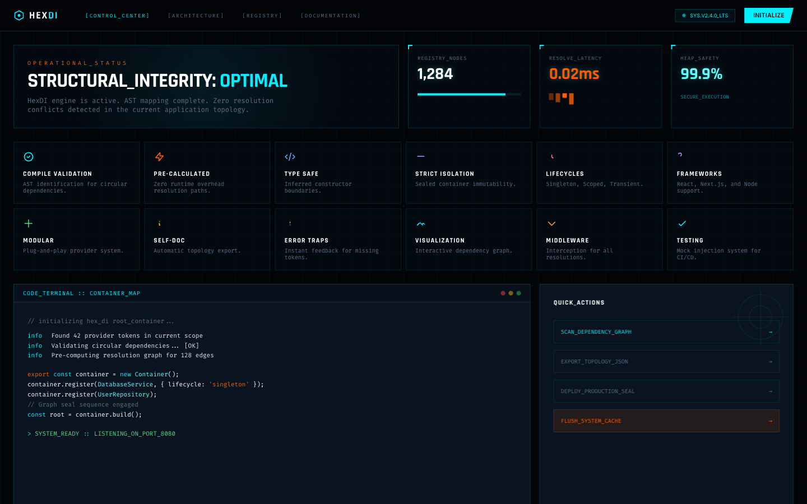

# 10 — System Dashboard

**File:** `10.html`
**Title:** HexDI - System Dashboard
**Type:** Application dashboard / operational view
**Layout:** Full-page dashboard (flex column, compact nav + main content grid)

---



## Overview

A full operational dashboard for the HexDI runtime. Shows live metrics, compact feature cards, and a "STRUCTURAL_INTEGRITY" hero stat panel. Uses a **compact nav** (`h-14`), dense grid layout, and a distinct `stat-value` display typography style. This is an **app screen**, not a marketing page.

---

## Color Palette

Standard HexDI palette. No overrides.

- Uses `radar-gradient` background on the hero stat panel

---

## Root Layout

```css
body {
  min-height: 100vh;
  display: flex;
  flex-direction: column;
}
nav {
  height: 56px; /* h-14 */
}
main {
  flex: 1;
  padding: 1.5rem;
  max-width: 1600px;
}
```

---

## Navigation (`h-14`, compact)

```
┌──────────────────────────────────────────────────────────────┐
│ HexDI logo (20px icon + text-lg)  │ nav links (12px gap-8)  │
│                                   │ [Control_Center] [Arch] │
│                                   │ [Registry] [Docs]        │
│                            ──────────────────────────────── │
│                               SYS.V2.4.0_LTS badge          │
│                               [Initialize] button            │
└──────────────────────────────────────────────────────────────┘
```

Nav links: `text-[9px] font-mono tracking-[0.2em] uppercase`
Initialize button: `bg-hex-primary text-black text-[10px] font-bold px-4 py-1.5 clip-path-slant`

---

## Main Content Grid

### Row 1: Hero Stats (`grid-cols-1 md:grid-cols-4 lg:grid-cols-6 gap-4`)

```
┌──────────────────────────────┬──────────┬──────────┬──────────┐
│  STRUCTURAL_INTEGRITY panel  │ Registry │ Resolve  │ Heap     │
│  lg:col-span-3               │ Nodes    │ Latency  │ Safety   │
│                              │ 1,284    │ 0.02ms   │ 99.9%    │
│  bg-radar-gradient backdrop  │          │          │          │
│  h1: STRUCTURAL_INTEGRITY    │ progress │ bar      │ label    │
│      OPTIMAL (cyan)          │ bar 85%  │ chart    │          │
│  subtext (font-mono text-xs) │ (cyan)   │ (orange) │ (light)  │
└──────────────────────────────┴──────────┴──────────┴──────────┘
```

**Hero panel details:**

- Label: `"Operational_Status"` — `text-[10px] font-mono text-hex-accent tracking-[0.4em] uppercase`
- H1: `text-4xl font-display font-bold text-white` — "STRUCTURAL_INTEGRITY: **OPTIMAL**"
- Subtext: `text-xs text-hex-muted font-mono max-w-md`

**Stat cards (`corner-accent` class):**

```css
.corner-accent::before {
  content: "";
  position: absolute;
  top: 0;
  left: 0;
  width: 20px;
  height: 20px;
  border-top: 2px solid #00f0ff;
  border-left: 2px solid #00f0ff;
}
```

**`.stat-value` typography:**

```css
font-family: Rajdhani;
font-weight: bold;
font-size: text-3xl;
text-shadow: 0 0 10px currentColor; /* glow matching stat color */
```

### Row 2: Compact Feature Cards (`grid-cols-2 md:grid-cols-4 lg:grid-cols-6 gap-2`)

6 micro-cards with 20px icons, tight padding (`p-4`):

| Feature               | Icon style       | Accent |
| --------------------- | ---------------- | ------ |
| Compile Validation    | checkmark circle | cyan   |
| Zero Overhead         | lightning bolt   | orange |
| Deep Type Safety      | shield           | purple |
| React Integration     | atom/react       | blue   |
| Immutable Composition | lock             | indigo |
| Explicit Lifetimes    | clock            | pink   |

**`.compact-card`:**

```css
.compact-card {
  background: rgba(8, 16, 28, 0.4); /* hex-surface/40 */
  border: 1px solid rgba(0, 240, 255, 0.1);
  transition: all 0.2s ease;
}
.compact-card:hover {
  background: rgba(0, 240, 255, 0.05);
  border-color: rgba(0, 240, 255, 0.3);
}
```

### `.hud-border` (used for stat panels)

```css
.hud-border {
  border: 1px solid rgba(0, 240, 255, 0.15);
  background: rgba(8, 16, 28, 0.5);
  position: relative;
}
```

---

## Full Layout Diagram

```
┌─────────────────────────────────────────────────────────────┐
│  NAV  h-14 compact  bg-hex-bg/90 backdrop-blur              │
│  logo + links + SYS version badge + Initialize CTA          │
├─────────────────────────────────────────────────────────────┤
│  MAIN  p-6  max-w-[1600px] mx-auto                          │
│                                                             │
│  ┌─── HERO STATS ROW ─────────────────────────────────┐     │
│  │ Integrity Panel (3 cols) │ Nodes │ Latency │ Heap   │     │
│  └────────────────────────────────────────────────────┘     │
│                                                             │
│  ┌─── COMPACT FEATURE GRID (6 cols) ─────────────────┐     │
│  │ Validate │ Overhead │ Types │ React │ Compose │ LT │     │
│  └────────────────────────────────────────────────────┘     │
└─────────────────────────────────────────────────────────────┘
```

---

## When to Use

Use this as the **app dashboard screen** — the view users see after onboarding or while actively using HexDI tooling. Not a marketing page. Ideal reference for building any operational/monitoring UI with the HexDI design language.

---

<details>
<summary><strong>HTML Starter Boilerplate</strong></summary>

```html
<!DOCTYPE html>
<html lang="en">
  <head>
    <!-- Standard head: Tailwind CDN + fonts + config + CSS (see design-system.md) -->
    <!-- Dashboard: sticky nav h-14, main flex height=calc(100vh-56px) -->
    <!-- No scroll on outer body, stat cards grid 2×4, terminal inspector left panel -->
  </head>
  <body class="bg-hex-bg bg-grid min-h-screen flex flex-col overflow-hidden">
    <!-- Sticky nav h-14 (56px) -->
    <nav
      class="sticky top-0 z-[100] border-b border-hex-primary/20 bg-hex-bg/90 backdrop-blur-xl flex-shrink-0"
    >
      <div class="max-w-full px-6 h-14 flex items-center justify-between">
        <!-- Logo -->
        <div class="flex items-center gap-3">
          <svg width="20" height="20" viewBox="0 0 24 24" fill="none" class="text-hex-primary">
            <path d="M12 2L21 7V17L12 22L3 17V7L12 2Z" stroke="currentColor" stroke-width="2" />
            <circle cx="12" cy="12" r="3" fill="currentColor" />
          </svg>
          <span class="font-display font-bold text-lg tracking-widest uppercase"
            >Hex<span class="text-hex-primary">DI</span></span
          >
        </div>
        <!-- System status -->
        <div class="flex items-center gap-4">
          <div
            class="flex items-center gap-2 text-[10px] font-mono text-hex-primary border border-hex-primary/30 px-3 py-1 bg-hex-bg/60"
          >
            <div class="w-1.5 h-1.5 bg-hex-primary rounded-full animate-ping"></div>
            SYS.ONLINE
          </div>
          <span class="font-mono text-[9px] text-hex-muted uppercase tracking-widest">v2.4.0</span>
        </div>
      </div>
    </nav>

    <!-- Main: flex, fixed height = calc(100vh - 56px) -->
    <main class="flex flex-1 overflow-hidden" style="height: calc(100vh - 56px);">
      <!-- Left: Terminal inspector panel (450px, scrollable) -->
      <aside
        class="w-[450px] flex-shrink-0 border-r border-hex-primary/10 flex flex-col overflow-hidden"
      >
        <div
          class="p-4 border-b border-hex-primary/10 bg-hex-surface/30 flex justify-between items-center"
        >
          <span class="font-mono text-[10px] uppercase tracking-widest text-hex-muted"
            >Terminal_Inspector</span
          >
          <div class="flex gap-1.5">
            <div class="w-2.5 h-2.5 rounded-full bg-hex-accent/40"></div>
            <div class="w-2.5 h-2.5 rounded-full bg-hex-primary/40"></div>
          </div>
        </div>
        <div
          class="flex-1 overflow-y-auto p-6 font-mono text-[11px] relative"
          style="scrollbar-width: thin; scrollbar-color: rgba(0,240,255,0.2) transparent;"
        >
          <div class="scanline pointer-events-none"></div>
          <div class="space-y-2 text-hex-muted">
            <!-- Terminal output content -->
            <div class="text-hex-primary/40">// APP_TOPOLOGY_MAPPING_INIT</div>
            <div>
              <span class="text-hex-accent">$</span>
              <span class="text-hex-primary">hex-di --analyze ./src</span>
            </div>
          </div>
        </div>
      </aside>

      <!-- Right: Main dashboard content (scrollable) -->
      <div
        class="flex-1 overflow-y-auto p-6"
        style="scrollbar-width: thin; scrollbar-color: rgba(0,240,255,0.2) transparent;"
      >
        <!-- Stat cards: 2×4 grid -->
        <div class="grid grid-cols-2 md:grid-cols-4 gap-4 mb-6">
          <!-- 8× stat cards (6a pattern) -->
        </div>

        <!-- Main content area: architecture diagram / charts / graphs -->
        <div class="grid md:grid-cols-2 gap-6 mb-6">
          <div class="hud-card p-6"><!-- Chart or topology diagram --></div>
          <div class="hud-card p-6"><!-- Metrics or log stream --></div>
        </div>

        <!-- Full-width section -->
        <div class="hud-card p-6"><!-- Dependency graph visualization --></div>
      </div>
    </main>
  </body>
</html>
```

</details>
