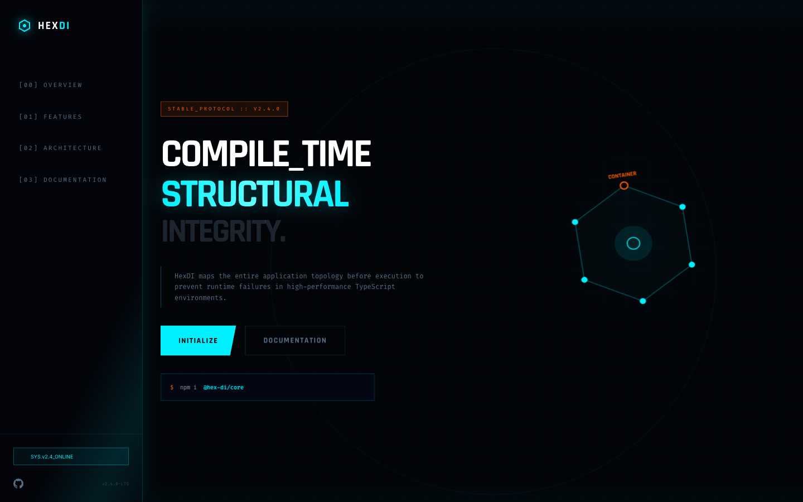

# 12 — Landing Page (v12 / Overflow Hidden)

**File:** `12.html`
**Title:** HexDI - Structural Dependency Injection
**Type:** Marketing landing page
**Layout:** Vertical scroll, full-width sections

---



## Overview

A standard landing page variant nearly identical to files 3 and 7, but with `overflow: hidden` on the body. The float animation uses the same dramatic diagonal tilt as files 3 and 18 (`rotateX(20deg) rotateZ(-10deg)`). Uses the `holo-shimmer` gradient and `holo-slide` animation.

---

## Color Palette

Standard HexDI palette. No overrides.

---

## Key Properties

| Property        | Value                                                                                              |
| --------------- | -------------------------------------------------------------------------------------------------- |
| `body overflow` | `hidden` (clips page at viewport edges)                                                            |
| Float           | `translateY(0) rotateX(20deg) rotateZ(-10deg)` ↔ `translateY(-20px) rotateX(22deg) rotateZ(-8deg)` |
| Scanline        | 6s (same as files 3/7)                                                                             |
| Grid            | `bg-grid` 40px standard                                                                            |
| `holo-slide`    | Available                                                                                          |
| Card backdrop   | `blur(8px)`                                                                                        |
| Corner brackets | Standard 15px                                                                                      |

---

## Layout Structure

```
┌─────────────────────────────────────────────────────────────┐
│  NAV  fixed h-20  (standard)                                │
├─────────────────────────────────────────────────────────────┤
│  HERO  min-h-screen  (overflow:hidden clips edges)          │
│  Left: badge + h1 + subtext + buttons + install widget      │
│  Right: hex SVG (float + rotateX(20deg) rotateZ(-10deg))    │
├─────────────────────────────────────────────────────────────┤
│  FEATURES  3×2 hud-card grid                                │
├─────────────────────────────────────────────────────────────┤
│  CODE PREVIEW                                               │
├─────────────────────────────────────────────────────────────┤
│  MODULE ARCHITECTURE                                        │
├─────────────────────────────────────────────────────────────┤
│  LIFETIME SCOPES  3-col                                     │
├─────────────────────────────────────────────────────────────┤
│  COMPARISON  2-col                                          │
├─────────────────────────────────────────────────────────────┤
│  CTA                                                        │
├─────────────────────────────────────────────────────────────┤
│  FOOTER                                                     │
└─────────────────────────────────────────────────────────────┘
```

---

## When to Use

Use when you want the dramatic diagonal float tilt with standard 40px grid and no special extras (no large grid, no mouse parallax). The `overflow:hidden` prevents any edge glitches from wide SVG animations.

---

<details>
<summary><strong>HTML Starter Boilerplate</strong></summary>

```html
<!DOCTYPE html>
<html lang="en">
  <head>
    <!-- Standard head + holo-slide + scanline 6s -->
    <!-- float: translateY(-20px) rotateX(22deg) rotateZ(-8deg) (identical to 18) -->
    <!-- hud-card: blur(8px), 15px corners -->
    <!-- body: overflow hidden -->
  </head>
  <body class="bg-hex-bg overflow-hidden">
    <div class="fixed inset-0 bg-grid opacity-30 pointer-events-none z-0"></div>
    <div
      class="fixed inset-0 pointer-events-none z-0"
      style="background:radial-gradient(circle at 50% 50%,transparent 0%,rgba(2,4,8,0.8)100%)"
    ></div>
    <nav
      class="fixed top-0 w-full z-[100] border-b border-hex-primary/20 bg-hex-bg/80 backdrop-blur-xl"
    >
      <div class="max-w-7xl mx-auto px-10 h-20 flex items-center justify-between">
        <!-- Logo + links + badge -->
      </div>
    </nav>
    <main class="relative z-10">
      <section class="min-h-screen flex items-center pt-20">
        <div class="max-w-7xl mx-auto px-10 grid lg:grid-cols-2 gap-16 items-center">
          <div><!-- Badge + H1 + subtext + CTAs + install widget --></div>
          <div><!-- Hex SVG animate-float + holo-slide shimmer --></div>
        </div>
      </section>
      <!-- Standard sections → Footer -->
    </main>
  </body>
</html>
```

</details>
