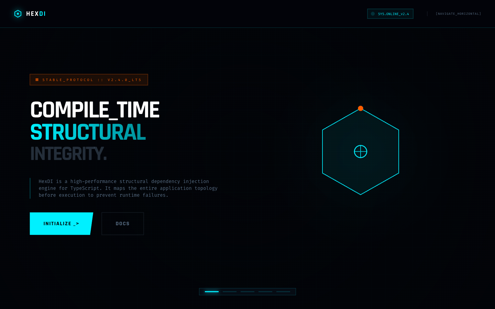

# 17 — Horizontal Scroll Terminal Experience

**File:** `17.html`
**Title:** HexDI - (Horizontal Terminal Experience)
**Type:** Interactive presentation / showcase
**Layout:** Horizontal scroll-snap, 5 panels × 100vw × 100vh

---



## Overview

A fully horizontal scrolling experience. The viewport is fixed (`overflow: hidden`) and a `500vw`-wide container holds 5 panels, each `100vw × 100vh`. CSS scroll-snap locks the view to each panel. A fixed **progress bar** at the bottom shows 5 dots indicating position. The nav includes a `[NAVIGATE_HORIZONTAL]` hint. This is the most interactive variant — it feels like a presentation/slidedeck in the browser.

---

## Color Palette

Standard HexDI palette. No overrides.

---

## Root Layout

```css
body {
  overflow: hidden;
}

.horizontal-scroll-container {
  display: flex;
  width: 500vw; /* 5 sections × 100vw */
  height: 100vh;
  overflow-x: scroll;
  scroll-snap-type: x mandatory;
  /* scrollbar hidden */
}

.scroll-section {
  width: 100vw;
  height: 100vh;
  flex-shrink: 0;
  scroll-snap-align: start;
  position: relative;
  overflow: hidden;
}
```

---

## Navigation

```html
<nav
  class="fixed top-0 w-full z-[100] border-b border-hex-primary/20 bg-hex-bg/80 backdrop-blur-xl"
>
  <div class="max-w-[1920px] mx-auto px-10 h-20 flex items-center justify-between">
    <!-- Logo + glow drop-shadow -->
    <div class="flex gap-4 items-center">
      <!-- SYS.ONLINE_v2.4 badge (animate-ping dot) -->
      <!-- [NAVIGATE_HORIZONTAL] hint text -->
    </div>
  </div>
</nav>
```

`[NAVIGATE_HORIZONTAL]` label: `text-[9px] text-hex-muted font-mono tracking-widest uppercase ml-6 border-l border-hex-muted/30 pl-6`

---

## Progress Indicator (fixed bottom)

```html
<div class="progress-line" id="progress-container">
  <div class="progress-dot active" data-index="0"></div>
  <div class="progress-dot" data-index="1"></div>
  <div class="progress-dot" data-index="2"></div>
  <div class="progress-dot" data-index="3"></div>
  <div class="progress-dot" data-index="4"></div>
</div>
```

```css
.progress-line {
  position: fixed;
  bottom: 40px;
  left: 50%;
  transform: translateX(-50%);
  display: flex;
  gap: 12px;
  z-index: 100;
  padding: 8px 16px;
  background: rgba(8, 16, 28, 0.6);
  backdrop-filter: blur(4px);
  border: 1px solid rgba(0, 240, 255, 0.2);
}

.progress-dot {
  width: 40px;
  height: 3px;
  background: rgba(0, 240, 255, 0.15);
  transition: all 0.3s ease;
}

.progress-dot.active {
  background: #00f0ff;
  box-shadow: 0 0 10px #00f0ff;
}
```

---

## Fixed Background Layers

```html
<!-- bg-grid layer -->
<div class="fixed inset-0 bg-grid opacity-30 pointer-events-none z-0"></div>
<!-- radial vignette -->
<div
  class="fixed inset-0 bg-[radial-gradient(circle_at_50%_50%,transparent_0%,rgba(2,4,8,0.8)_100%)] pointer-events-none z-0"
></div>
```

---

## 5 Panels

### Panel 1: Hero

`grid lg:grid-cols-2 gap-12 items-center max-w-7xl mx-auto`

- Left: orange badge + h1 + subtext + CTA buttons
- Right: hex dependency graph SVG

### Panel 2: Features

Full-panel feature grid (3×2 or 2×3 layout)

### Panel 3: Code Preview

Full terminal window (`min-h-[600px]`) with scanline overlay and syntax-highlighted code

### Panel 4: Architecture

Module architecture SVG diagram centered + package card row

### Panel 5: CTA / Lifetime

Lifetime scopes 3-col + comparison 2-col + CTA block

---

## Layout Diagram

```
←─────────── 500vw total ────────────────────────────────────→

┌──────────┐  ┌──────────┐  ┌──────────┐  ┌──────────┐  ┌──────────┐
│  PANEL 1 │  │  PANEL 2 │  │  PANEL 3 │  │  PANEL 4 │  │  PANEL 5 │
│  100vw   │  │  100vw   │  │  100vw   │  │  100vw   │  │  100vw   │
│  100vh   │  │  100vh   │  │  100vh   │  │  100vh   │  │  100vh   │
│          │  │          │  │          │  │          │  │          │
│  HERO    │  │ FEATURES │  │   CODE   │  │  ARCH    │  │  CTA     │
│  text+   │  │  grid    │  │ terminal │  │  SVG +   │  │ lifetime │
│  hex SVG │  │          │  │          │  │  pkgs    │  │ compare  │
└──────────┘  └──────────┘  └──────────┘  └──────────┘  └──────────┘

Fixed nav (top) ─────────────────────────────────────────────────────
Fixed progress dots (bottom center) ┄ • ┄ ┄ ┄  (5 dots)
```

---

## `.section-header` (used within panels)

```css
.section-header {
  border-left: 4px solid #00f0ff;
  padding-left: 1.5rem;
  margin-bottom: 3rem;
}
```

---

## When to Use

Use for a **presentation / showcase** experience — ideal for conference demos, product launches, or interactive marketing sites where the horizontal narrative flow enhances storytelling. Also a strong reference for implementing any horizontal scroll-snap layout with progress indicators.

---

<details>
<summary><strong>HTML Starter Boilerplate</strong></summary>

```html
<!DOCTYPE html>
<html lang="en">
  <head>
    <!-- Standard head + holo-slide + scanline 6s -->
    <!-- float: translateY(-20px) rotateX(12deg) -->
    <!-- body: overflow:hidden -->
    <!-- scroll container: display flex; width 500vw; height 100vh; overflow-x auto; scroll-snap-type x mandatory -->
  </head>
  <body style="background:#020408; color:#DAE6F0; overflow:hidden;">
    <div class="fixed inset-0 bg-grid opacity-30 pointer-events-none z-0"></div>

    <!-- Fixed nav + [NAVIGATE_HORIZONTAL] hint -->
    <nav
      class="fixed top-0 w-full z-[100] border-b border-hex-primary/20 bg-hex-bg/80 backdrop-blur-xl"
    >
      <div class="max-w-[1920px] mx-auto px-10 h-20 flex items-center justify-between">
        <div class="flex gap-4 items-center">
          <!-- Logo + SYS.ONLINE badge + [NAVIGATE_HORIZONTAL] text-[9px] hint -->
        </div>
      </div>
    </nav>

    <!-- 500vw horizontal scroll container -->
    <div
      style="display:flex; width:500vw; height:100vh; overflow-x:auto; scroll-snap-type:x mandatory; scrollbar-width:none;"
    >
      <section
        style="width:100vw; height:100vh; flex-shrink:0; scroll-snap-align:start; position:relative; overflow:hidden;"
      >
        <!-- Panel 1: Hero — grid lg:grid-cols-2, text + hex graph SVG -->
      </section>
      <section style="width:100vw; height:100vh; flex-shrink:0; scroll-snap-align:start;">
        <!-- Panel 2: Features grid -->
      </section>
      <section style="width:100vw; height:100vh; flex-shrink:0; scroll-snap-align:start;">
        <!-- Panel 3: Code terminal min-h-[600px] + scanline -->
      </section>
      <section style="width:100vw; height:100vh; flex-shrink:0; scroll-snap-align:start;">
        <!-- Panel 4: Architecture SVG + package card row -->
      </section>
      <section style="width:100vw; height:100vh; flex-shrink:0; scroll-snap-align:start;">
        <!-- Panel 5: Lifetime 3-col + Comparison 2-col + CTA -->
      </section>
    </div>

    <!-- Fixed progress dots (5 segments, bottom center) -->
    <div
      id="progress"
      style="position:fixed; bottom:40px; left:50%; transform:translateX(-50%); display:flex; gap:12px; z-index:100; padding:8px 16px; background:rgba(8,16,28,0.6); border:1px solid rgba(0,240,255,0.2);"
    >
      <div
        data-i="0"
        style="width:40px; height:3px; background:#00F0FF; box-shadow:0 0 10px #00F0FF;"
      ></div>
      <div data-i="1" style="width:40px; height:3px; background:rgba(0,240,255,0.15);"></div>
      <div data-i="2" style="width:40px; height:3px; background:rgba(0,240,255,0.15);"></div>
      <div data-i="3" style="width:40px; height:3px; background:rgba(0,240,255,0.15);"></div>
      <div data-i="4" style="width:40px; height:3px; background:rgba(0,240,255,0.15);"></div>
    </div>
    <script>
      const sc = document.querySelector('[style*="500vw"]');
      const dots = document.querySelectorAll("[data-i]");
      sc.addEventListener("scroll", () => {
        const idx = Math.round(sc.scrollLeft / window.innerWidth);
        dots.forEach((d, i) => {
          d.style.background = i === idx ? "#00F0FF" : "rgba(0,240,255,0.15)";
          d.style.boxShadow = i === idx ? "0 0 10px #00F0FF" : "none";
        });
      });
    </script>
  </body>
</html>
```

</details>
