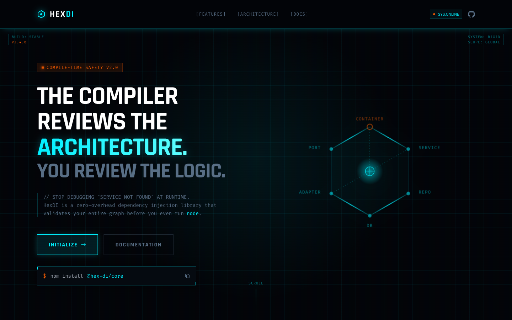
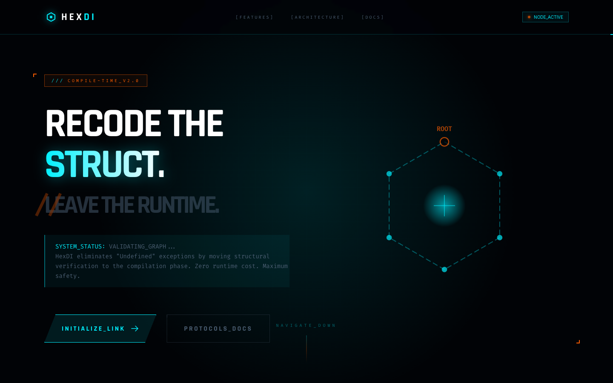
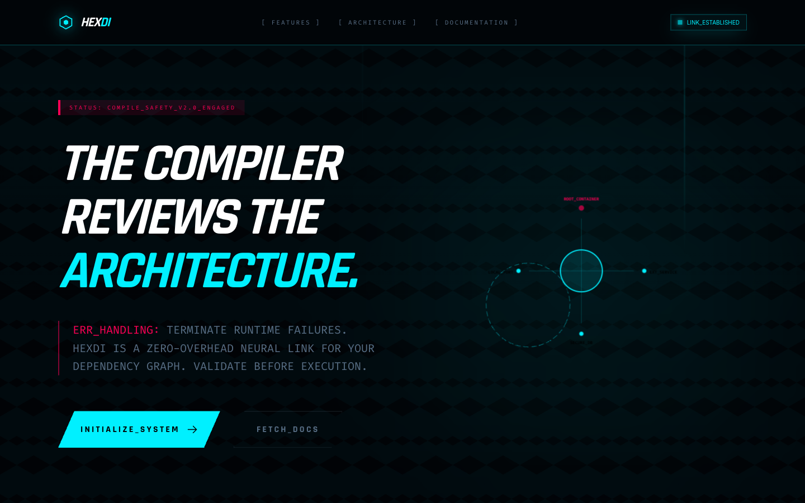
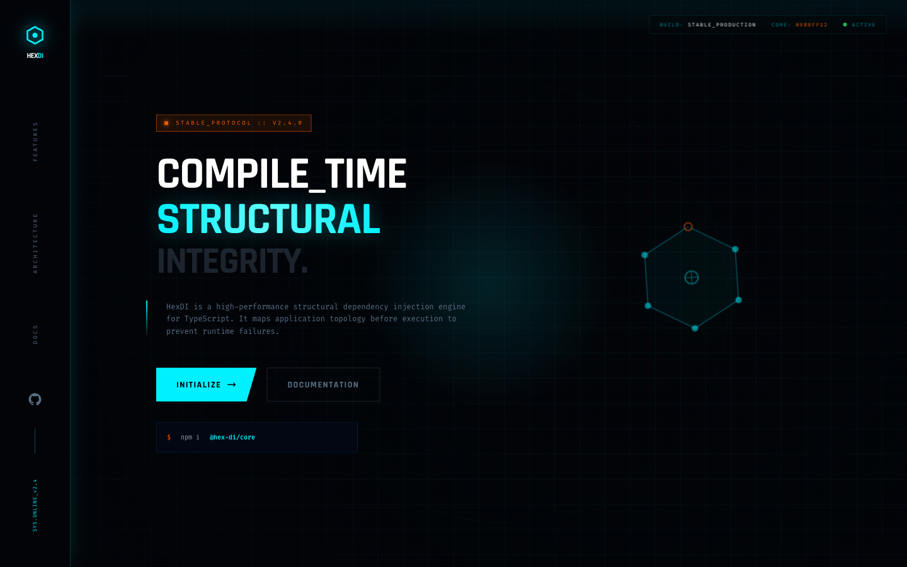
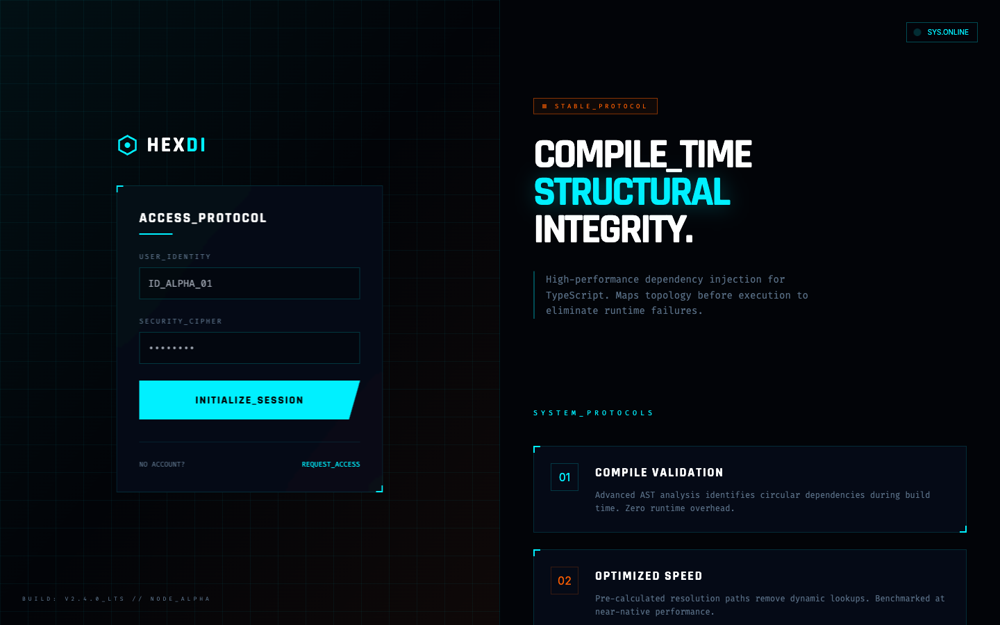
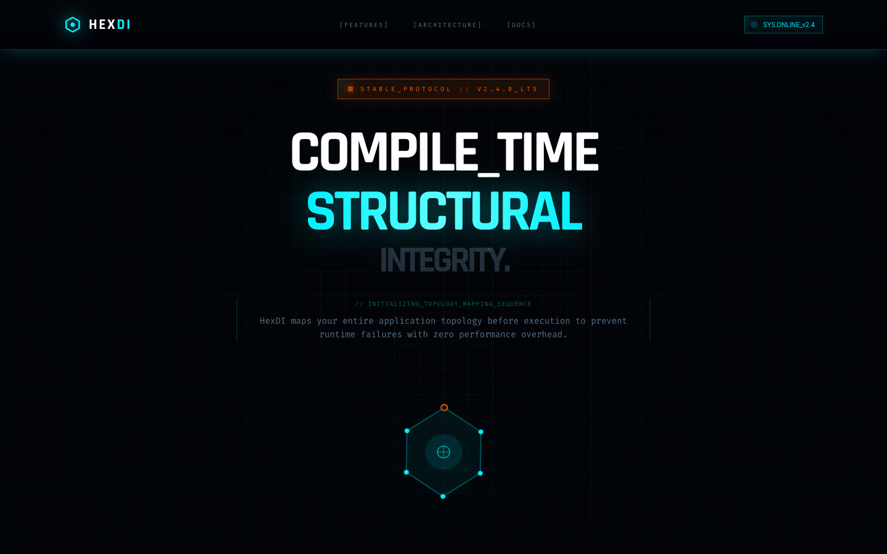
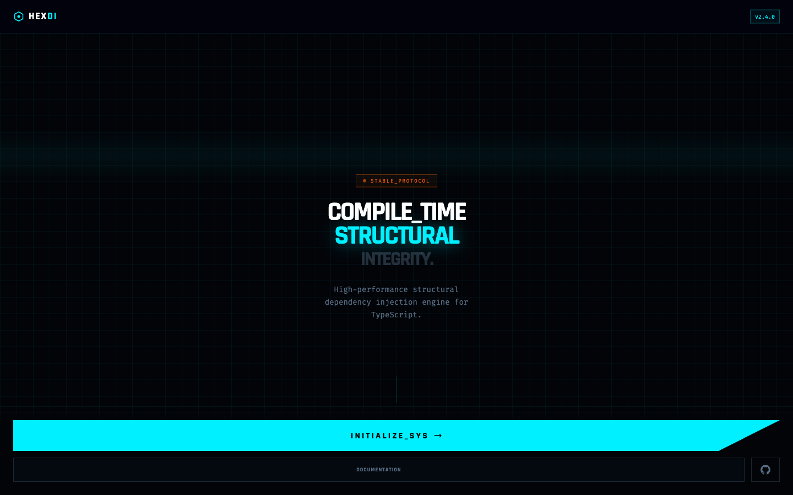
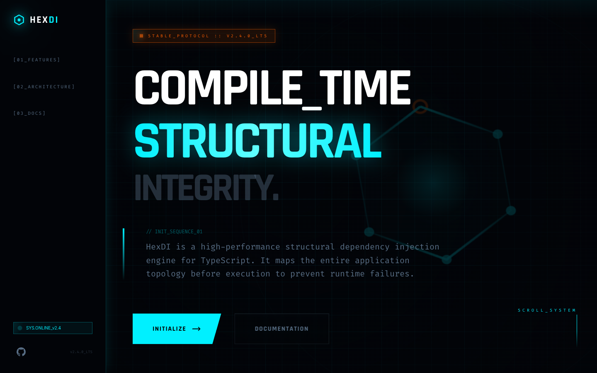
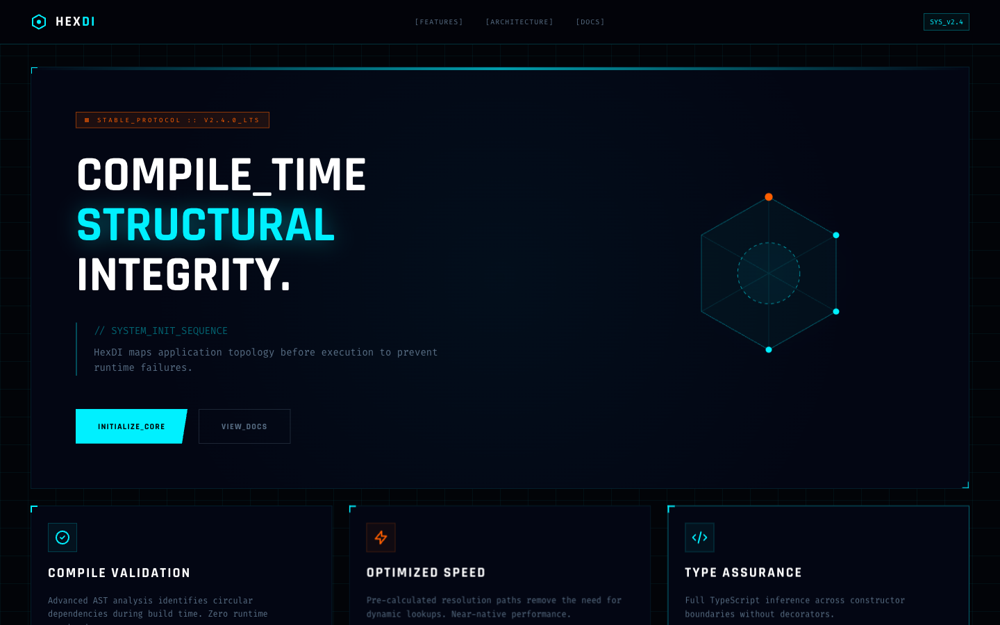

# HexDI Design Inspirations — Index

18 HTML design explorations for the HexDI landing page and application UI. All share a unified dark cyberpunk/tactical design system documented in [`design-system.md`](./design-system.md).

Screenshots are in [`screenshots/`](./screenshots/) (01.png – 18.png, 1440×900).

**Key reference files:**

- [`design-system.md`](./design-system.md) — all shared CSS tokens, animation keyframes, color palette
- [`component-patterns.md`](./component-patterns.md) — copy-paste HTML snippets: navs, heroes, cards, terminals, buttons, layout shells, forms, footer
- Each individual doc has a collapsible `HTML Starter Boilerplate` section with the exact layout shell for that variant

---

## Visual Gallery

|                                                            |                                                         |                                                         |                                                         |
| ---------------------------------------------------------- | ------------------------------------------------------- | ------------------------------------------------------- | ------------------------------------------------------- |
|     |  |  |  |
| **01** Standard                                            | **02** Enhanced SVG                                     | **03** Parallax                                         | **04** Tactical                                         |
|   |      |      |   |
| **05** Cybernetic                                          | **06** Neon                                             | **07** Holo                                             | **08** Minimal                                          |
|           |  |       |       |
| **09** Auth Split                                          | **10** Dashboard                                        | **11** v11                                              | **12** v12                                              |
|    |       |       |     |
| **13** Control Panel                                       | **14** Mobile Snap                                      | **15** Sidebar Nav                                      | **16** Grid-12                                          |
|  |       |                                                         |                                                         |
| **17** Horizontal                                          | **18** v18                                              |                                                         |                                                         |

---

## Quick Reference

| File      | Doc                                                   | Screenshot                | Type          | Layout              | Unique Features                                              |
| --------- | ----------------------------------------------------- | ------------------------- | ------------- | ------------------- | ------------------------------------------------------------ |
| `1.html`  | [01-landing-standard](./01-landing-standard.md)       | [↗](./screenshots/01.png) | Landing       | Vertical scroll     | Foundational design — baseline                               |
| `2.html`  | [02-landing-enhanced](./02-landing-enhanced.md)       | [↗](./screenshots/02.png) | Landing       | Vertical scroll     | Enhanced module architecture SVG with `animateMotion` dots   |
| `3.html`  | [03-landing-parallax](./03-landing-parallax.md)       | [↗](./screenshots/03.png) | Landing       | Vertical scroll     | Mouse parallax, 160px grid, holo-element, hover lift cards   |
| `4.html`  | [04-landing-tactical](./04-landing-tactical.md)       | [↗](./screenshots/04.png) | Landing       | Vertical scroll     | 3D depth-card hover, rising particles, fade-up entry         |
| `5.html`  | [05-landing-cybernetic](./05-landing-cybernetic.md)   | [↗](./screenshots/05.png) | Landing       | Vertical scroll     | Darker palette, scrolling-grid radial mask, glitch text      |
| `6.html`  | [06-landing-neon](./06-landing-neon.md)               | [↗](./screenshots/06.png) | Landing       | Vertical scroll     | Hex tessellation bg, neonPurple accent, chromatic aberration |
| `7.html`  | [07-landing-holo](./07-landing-holo.md)               | [↗](./screenshots/07.png) | Landing       | Vertical scroll     | Holo-shimmer, mild 3D tilt (rotateX+Z)                       |
| `8.html`  | [08-landing-minimal](./08-landing-minimal.md)         | [↗](./screenshots/08.png) | Landing       | Vertical scroll     | Minimal 60px grid, no float, abstract orb blobs              |
| `9.html`  | [09-auth-split](./09-auth-split.md)                   | [↗](./screenshots/09.png) | Auth/Login    | Full-screen H-split | Left auth form + right scrollable marketing content          |
| `10.html` | [10-dashboard-system](./10-dashboard-system.md)       | [↗](./screenshots/10.png) | Dashboard     | Full-page grid      | Stat cards, compact nav, operational metrics UI              |
| `11.html` | [11-landing-v11](./11-landing-v11.md)                 | [↗](./screenshots/11.png) | Landing       | Vertical scroll     | 160px grid, holo-element, X-only tilt, no parallax           |
| `12.html` | [12-landing-v12](./12-landing-v12.md)                 | [↗](./screenshots/12.png) | Landing       | Vertical scroll     | overflow:hidden, diagonal tilt float                         |
| `13.html` | [13-dashboard-control](./13-dashboard-control.md)     | [↗](./screenshots/13.png) | App/Dashboard | Full-screen V-split | Left terminal inspector + right dependency graph             |
| `14.html` | [14-mobile-snap](./14-mobile-snap.md)                 | [↗](./screenshots/14.png) | Mobile        | Snap scroll 5×100vh | Mobile-first, CSS snap, horizontal card carousel             |
| `15.html` | [15-sidebar-nav](./15-sidebar-nav.md)                 | [↗](./screenshots/15.png) | Landing       | Fixed sidebar       | Fixed left sidebar nav (w-64), numbered links                |
| `16.html` | [16-grid12-layout](./16-grid12-layout.md)             | [↗](./screenshots/16.png) | Landing       | CSS Grid-12         | 12-col main grid, blur(12px) cards, X-only tilt              |
| `17.html` | [17-horizontal-terminal](./17-horizontal-terminal.md) | [↗](./screenshots/17.png) | Presentation  | H-scroll 5×100vw    | Horizontal scroll-snap, progress dots, 5-panel narrative     |
| `18.html` | [18-landing-v18](./18-landing-v18.md)                 | [↗](./screenshots/18.png) | Landing       | Vertical scroll     | Clean baseline: diagonal tilt + holo-slide                   |

---

## Design System

**[design-system.md](./design-system.md)** — Complete shared design tokens, patterns, and components:

- Color tokens table
- Typography scale (Rajdhani / Inter / Fira Code)
- Background patterns (grid variants, radial spotlights)
- `.hud-card` full spec with corner brackets
- `.clip-path-slant`, `.holo-element`, `.tactical-border-b`
- All animations (float, scanline, holo-slide, glitch, chroma, etc.)
- Syntax highlighting colors
- Logo / status badge / install widget patterns
- Code window component
- Dependency graph SVG patterns
- Comparison block pattern

---

## Layout Archetypes

### 1. Vertical Scroll Landing (files 1–8, 11–12, 18)

Standard marketing page with top nav + hero + sections. Differences are in animation intensity, grid size, and special effects.

### 2. Auth Split-Screen (file 9)

`flex h-screen overflow-hidden` — left auth form, right scrollable content.

### 3. System Dashboard (file 10)

Compact nav + full-page grid with stat cards. Operational metrics view.

### 4. Terminal Control Panel (file 13)

`h-[calc(100vh-64px)]` flex split — left scrollable terminal inspector (450px), right visualization area.

### 5. Mobile Snap Scroll (file 14)

`scroll-snap-type: y mandatory`, 5 sections × 100vh. Horizontal card carousels within sections.

### 6. Sidebar Navigation Landing (file 15)

Fixed left sidebar (`w-64`) with numbered nav links + scrollable main content.

### 7. Grid-12 Landing (file 16)

`grid-cols-12` main area. Sections placed via `col-span-N` for asymmetric layouts.

### 8. Horizontal Terminal (file 17)

`scroll-snap-type: x mandatory`, 5 panels × 100vw × 100vh. Fixed progress indicator.

---

## Feature Matrix

| Feature             | 1   | 2   | 3   | 4   | 5   | 6   | 7   | 8   | 9   | 10  | 11  | 12  | 13  | 14  | 15  | 16  | 17  | 18  |
| ------------------- | --- | --- | --- | --- | --- | --- | --- | --- | --- | --- | --- | --- | --- | --- | --- | --- | --- | --- |
| Float 3D tilt       | —   | —   | ✓✓  | ✓✓  | —   | —   | ✓   | —   | ✓✓  | —   | ✓   | ✓✓  | —   | —   | ✓✓  | ✓   | —   | ✓✓  |
| Mouse parallax      | —   | —   | ✓   | —   | —   | —   | —   | —   | —   | —   | —   | —   | —   | —   | —   | —   | —   | —   |
| Holo-element        | —   | —   | ✓   | —   | —   | —   | ✓   | ✓   | —   | —   | ✓   | ✓   | —   | —   | ✓   | ✓   | —   | ✓   |
| Glitch text         | —   | —   | —   | —   | ✓   | —   | —   | —   | —   | —   | —   | —   | —   | —   | —   | —   | —   | —   |
| Chromatic text      | —   | —   | —   | —   | —   | ✓   | —   | —   | —   | —   | —   | —   | —   | —   | —   | —   | —   | —   |
| Hover lift          | —   | —   | ✓   | —   | —   | —   | —   | —   | —   | —   | ✓   | —   | —   | —   | ✓   | —   | —   | —   |
| 3D depth cards      | —   | —   | —   | ✓   | —   | —   | —   | —   | —   | —   | —   | —   | —   | —   | —   | —   | —   | —   |
| Particles           | —   | —   | —   | ✓   | —   | —   | —   | —   | —   | —   | —   | —   | —   | —   | —   | —   | —   | —   |
| Hex tessellation    | —   | —   | —   | —   | —   | ✓   | —   | —   | —   | —   | —   | —   | —   | —   | —   | —   | —   | —   |
| Large grid (160px)  | —   | —   | ✓   | —   | —   | —   | —   | —   | —   | —   | ✓   | —   | —   | —   | ✓   | —   | —   | —   |
| Minimal grid (60px) | —   | —   | —   | —   | —   | —   | —   | ✓   | —   | —   | —   | —   | —   | —   | —   | —   | —   | —   |

**Float 3D tilt legend:** ✓ = rotateX only, ✓✓ = rotateX+Z diagonal

---

## Color Variants

| Files     | bg                 | accent                                    |
| --------- | ------------------ | ----------------------------------------- |
| 1–4, 7–18 | `#020408`          | `#FF5E00` (orange)                        |
| 5         | `#010306` (deeper) | `#FF5E00` (orange)                        |
| 6         | `#010306` (deeper) | `#FF0055` (red-pink) + `#BC13FE` (purple) |

---

## Navigation to Key Patterns

**Looking for a specific component?**

- **Auth / login form** → [09-auth-split](./09-auth-split.md)
- **Terminal / CLI output display** → [13-dashboard-control](./13-dashboard-control.md)
- **Operational metrics / stat cards** → [10-dashboard-system](./10-dashboard-system.md)
- **Sidebar navigation** → [15-sidebar-nav](./15-sidebar-nav.md)
- **Horizontal scroll presentation** → [17-horizontal-terminal](./17-horizontal-terminal.md)
- **Mobile snap scroll** → [14-mobile-snap](./14-mobile-snap.md)
- **Glitch text effect** → [05-landing-cybernetic](./05-landing-cybernetic.md)
- **Chromatic aberration effect** → [06-landing-neon](./06-landing-neon.md)
- **Mouse parallax on SVG** → [03-landing-parallax](./03-landing-parallax.md)
- **3D perspective card hover** → [04-landing-tactical](./04-landing-tactical.md)
- **Hex tessellation background** → [06-landing-neon](./06-landing-neon.md)
- **Abstract orb blobs** → [08-landing-minimal](./08-landing-minimal.md)
- **Animated architecture SVG** → [02-landing-enhanced](./02-landing-enhanced.md)
- **hud-card full spec** → [design-system](./design-system.md)
