# Architecture Overview

The guard package is organized into five layers, each with a distinct responsibility. Dependencies flow strictly downward -- enforcement depends on evaluation, evaluation depends on policy, and policy depends on tokens.

## Module Map

```mermaid
graph TB
    subgraph Tokens
        P[Permissions]
        R[Roles]
        PG[Permission Groups]
    end

    subgraph Policy["Policy Layer"]
        C[Combinators<br/>allOf · anyOf · not]
        L[Leaf Policies<br/>hasPermission · hasRole · hasAttribute]
        PC[PolicyConstraint<br/>Serializable JSON data]
    end

    subgraph Evaluation
        E[evaluate&#40;&#41;]
        EA[evaluateAsync&#40;&#41;]
        D["Decision<br/>Allow / Deny"]
        T[EvaluationTrace]
    end

    subgraph Enforcement["DI Enforcement"]
        EP[enforcePolicy&#40;&#41;]
        PGH[Port Gate Hook]
        RG[Role Gate]
    end

    subgraph Audit["Audit & GxP"]
        AT[AuditTrail]
        WAL[Write-Ahead Log]
        CB[Circuit Breaker]
        MA[Meta-Audit]
    end

    P --> R
    PG --> P
    P & R --> L
    L --> C
    C & L --> PC
    PC --> E & EA
    E --> D
    D --> T
    PC --> EP
    EP --> AT
    AT --> WAL
    AT --> CB
    AT --> MA
    EP --> D
```



## Layer Imports

Each layer has a clear set of exports. A typical usage touches all five:

```typescript
// Tokens
import { createPermission, createRole } from "@hex-di/guard";
// Policy
import { hasPermission, allOf, not } from "@hex-di/guard";
// Evaluation
import { evaluate } from "@hex-di/guard";
// Enforcement
import { enforcePolicy } from "@hex-di/guard";
// Audit & GxP
import { createWriteAheadLog, createCircuitBreaker } from "@hex-di/guard";
```

## Layer Descriptions

### Tokens

The foundation layer. Permissions are branded nominal values created via `Symbol.for()`, giving them cross-boundary identity. Roles aggregate permissions into named sets with DAG-based inheritance. Permission groups bundle related permissions for convenient distribution.

### Policy Layer

Policies are serializable discriminated unions -- plain JSON data, not callbacks. Leaf policies (`hasPermission`, `hasRole`, `hasAttribute`) check a single condition against an `AuthSubject`. Combinators (`allOf`, `anyOf`, `not`) compose leaf policies into trees. The resulting `PolicyConstraint` is the unit of authorization logic.

### Evaluation

Pure functions that walk a policy tree against an `AuthSubject` and produce a `Decision`. The synchronous `evaluate()` handles the common case. `evaluateAsync()` supports async attribute resolution for policies that depend on external data. Every evaluation produces a full `EvaluationTrace` tree for debugging and audit.

### DI Enforcement

The integration point with HexDI's dependency graph. `enforcePolicy()` wraps an adapter so that policy evaluation runs automatically at resolution time. Port gate hooks (`createPortGateHook`, `createRoleGate`) provide coarse-grained gating at the container level -- blocking entire ports based on roles or policies.

### Audit & GxP

Infrastructure for regulated environments. The audit trail records every authorization decision. Write-ahead logging ensures durability. A circuit breaker protects against audit trail failures. Meta-audit tracks changes to the audit system itself. Retention policies, archiving, and decommissioning handle the full lifecycle.

## Hexagonal Architecture

The guard package follows hexagonal (ports & adapters) principles:

- **Ports** define the contracts: `AuditTrailPort`, `SubjectProviderPort`
- **Adapters** implement the contracts: audit trail implementations, subject providers
- **Core** remains pure: policy evaluation has no side effects, no I/O, no framework dependencies
- **Integration** is at the boundary: `enforcePolicy()` bridges the pure evaluation core with HexDI's runtime container

This means you can use the policy evaluation engine standalone (without HexDI) or swap audit trail implementations without touching authorization logic.
