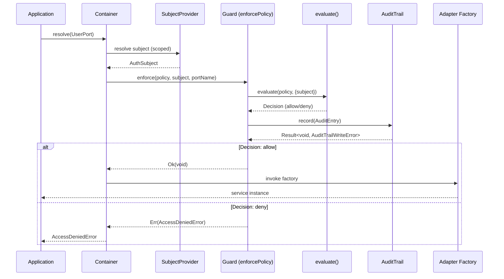

# Guard Adapter & DI Integration

The enforcement layer bridges the pure evaluation core with HexDI's runtime container. `enforcePolicy()` wraps adapters so that policy evaluation runs automatically at resolution time.

## `enforcePolicy()`

Wraps an existing adapter with policy enforcement. When the guarded adapter is resolved from the container, the guard intercepts resolution, resolves the current subject, evaluates the policy, and either proceeds with the original factory or returns an `AccessDeniedError`.

```typescript
import { enforcePolicy } from "@hex-di/guard";

const GuardedUserAdapter = enforcePolicy(UserAdapter, {
  policy: hasPermission(ReadUsers),
  subjectPort: SubjectProviderPort,
});

// Register in graph instead of UserAdapter
const graph = GraphBuilder.create().add(GuardedUserAdapter).build();
```

The guarded adapter has the same port signature as the original -- downstream consumers don't know (or care) that authorization is happening.

## Enforcement Sequence

The full enforcement flow at resolution time:



### Step-by-Step Walkthrough

1. **Application requests a port** -- `container.resolve(UserPort)`
2. **Subject resolution** -- the container resolves the `SubjectProviderPort` (scoped to the current request/session) to get the `AuthSubject`
3. **Policy evaluation** -- the guard calls `evaluate()` with the policy and subject, producing a `Decision`
4. **Audit recording** -- the decision is recorded in the audit trail (if configured), including the policy, subject, decision, and timestamp
5. **Allow path** -- if the decision grants access, the original adapter factory is invoked and the service instance is returned
6. **Deny path** -- if the decision denies access, an `AccessDeniedError` is returned through the `Result` channel

## `AccessDeniedError`

Returned when a policy evaluation denies access.

```typescript
type AccessDeniedError = {
  readonly _tag: "AccessDeniedError";
  readonly policy: PolicyConstraint;
  readonly subjectId: string;
  readonly portName: string;
  readonly decision: Decision;
  readonly message: string;
};
```

The error includes the full `Decision` with its trace, making it straightforward to diagnose why access was denied.

## `AuditWriteFailedError` and `failOnAuditError`

If the audit trail write fails, behavior depends on configuration:

```typescript
const GuardedAdapter = enforcePolicy(UserAdapter, {
  policy: hasPermission(ReadUsers),
  subjectPort: SubjectProviderPort,
  failOnAuditError: true, // deny access if audit write fails
});
```

- **`failOnAuditError: true`** -- access is denied if the audit trail write fails, even if the policy evaluation granted access. Required for GxP environments.
- **`failOnAuditError: false`** (default) -- audit failures are logged but don't block access.

## `createGuardGraph()`

Creates a standalone graph fragment containing the guard infrastructure (subject provider, audit trail, guard adapter). Useful when you want guard functionality without manually wiring each piece.

```typescript
import { createGuardGraph } from "@hex-di/guard";

const guardGraph = createGuardGraph({
  subjectProvider: MySubjectAdapter,
  auditTrail: MyAuditTrailAdapter,
});

const graph = GraphBuilder.create().merge(guardGraph).add(GuardedUserAdapter).build();
```

## `createGuardHealthCheck()`

Returns a health check adapter that monitors the guard infrastructure -- verifying the audit trail is writable, the subject provider is functional, and the circuit breaker is healthy.

```typescript
import { createGuardHealthCheck } from "@hex-di/guard";

const healthCheck = createGuardHealthCheck();
```

## `CompletenessMonitor`

Tracks that every guarded resolution produces a corresponding audit entry. Detects cases where audit entries are missing (e.g., due to race conditions or failures).

```typescript
import { CompletenessMonitor } from "@hex-di/guard";

// The monitor compares resolution events against audit entries
// and reports any gaps in coverage
```
