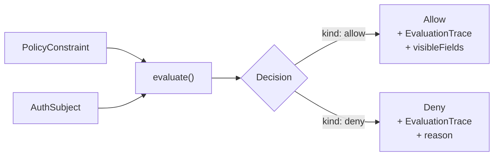

# Evaluation

The evaluation layer is the pure core of the guard system. It takes a policy and a subject, walks the policy tree, and produces a `Decision` with a full trace.

## `evaluate()`

Synchronous, pure evaluation. No side effects, no I/O.

```typescript
import { evaluate } from "@hex-di/guard";

const decision = evaluate(policy, subject);

if (decision.granted) {
  // Access allowed
  // decision.visibleFields may restrict field access
} else {
  // Access denied
  // decision.trace describes why
}
```

## `evaluateAsync()`

For policies that depend on async attribute resolution (e.g., fetching attributes from a remote service).

```typescript
import { evaluateAsync } from "@hex-di/guard";

const decision = await evaluateAsync(policy, subject, {
  attributeResolver: async key => fetchAttribute(key),
});
```

The async variant evaluates the policy tree the same way, but `hasAttribute` checks can await the resolver for attributes not present in the subject.

## Evaluation Flow



## `Decision` Type

Every evaluation produces a `Decision`:

```typescript
type Decision = {
  readonly granted: boolean;
  readonly kind: "allow" | "deny";
  readonly evaluationId: string;
  readonly evaluatedAt: Date;
  readonly subjectId: string;
  readonly durationMs: number;
  readonly trace: EvaluationTrace;
  readonly visibleFields?: ReadonlySet<string>;
  readonly reason?: string; // present on deny
};
```

The `Decision` carries full context for debugging and audit:

- **`evaluationId`** -- unique identifier for this evaluation instance
- **`evaluatedAt`** -- timestamp of evaluation
- **`subjectId`** -- the subject that was evaluated
- **`durationMs`** -- wall-clock time of the evaluation
- **`trace`** -- recursive tree mirroring the policy structure
- **`visibleFields`** -- field-level visibility from the policy (if configured)
- **`reason`** -- human-readable denial reason (on deny decisions)

## `EvaluationTrace`

The trace is a recursive tree that mirrors the policy structure. Each node records what happened during evaluation of that policy node.

```typescript
type EvaluationTrace = {
  readonly policyKind: string;
  readonly result: "allow" | "deny";
  readonly reason?: string;
  readonly durationMs: number;
  readonly children?: readonly EvaluationTrace[];
  readonly label?: string;
};
```

For a composed policy like `allOf(hasPermission(Read), not(hasAttribute("suspended", true)))`, the trace tree would have:

- A root `allOf` node with result and duration
  - A child `hasPermission` node with its result
  - A child `not` node with its result
    - A grandchild `hasAttribute` node with its result

This makes it straightforward to pinpoint exactly which sub-policy caused a denial.

## `EvaluationContext`

For policies that check resource attributes or signatures, pass an `EvaluationContext`:

```typescript
const decision = evaluate(policy, subject, {
  resource: {
    type: "document",
    attributes: { visibility: "private", ownerId: "user-1" },
  },
  signatures: [{ type: "approval", signedBy: "manager-1", signedAt: new Date() }],
});
```

## `EvaluateOptions`

Control evaluation behavior:

```typescript
const decision = evaluate(policy, subject, {
  maxDepth: 10, // limit policy tree depth (prevents deeply nested policies)
});
```

The `maxDepth` option protects against excessively deep policy trees, returning a denial if the limit is exceeded.
