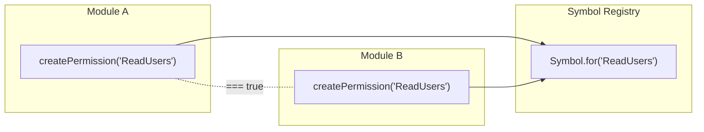

# Permissions

Permissions are the atomic units of authorization. Each permission is a branded nominal token -- a value that carries its identity at both the type level and runtime.

## Why Branded Nominals?

TypeScript's structural type system means two objects with the same shape are interchangeable. For authorization, this is dangerous: you don't want `ReadUsers` to accidentally satisfy a check for `WriteUsers` just because they're both strings.

Branded nominal tokens solve this by giving each permission a unique phantom type brand. Two permissions with different names are different types, caught at compile time.

## Cross-Boundary Identity with `Symbol.for()`

Permissions use `Symbol.for()` under the hood, which means:

- Two `createPermission("ReadUsers")` calls in different modules produce the **same** runtime value
- Identity comparison (`===`) works across module boundaries, bundle splits, and even separate packages
- No global registry, no side effects -- `Symbol.for()` is the registry



## Creating Permissions

```typescript
import { createPermission } from "@hex-di/guard";

const ReadUsers = createPermission("ReadUsers");
const WriteUsers = createPermission("WriteUsers");
const DeleteUsers = createPermission("DeleteUsers");
```

Each call returns a branded permission token. The string name is used for:

- `Symbol.for()` identity
- Serialization (policies reference permissions by name)
- Debugging and error messages

## Permission Groups

When you have a set of related permissions, bundle them into a named group:

```typescript
import { createPermissionGroup } from "@hex-di/guard";

const UserPermissions = createPermissionGroup("UserPermissions", {
  read: ReadUsers,
  write: WriteUsers,
  delete: DeleteUsers,
});

// Access individual permissions
UserPermissions.read; // === ReadUsers
UserPermissions.write; // === WriteUsers
UserPermissions.delete; // === DeleteUsers
```

Groups are convenience wrappers -- they don't change how permissions work. Every permission in the group retains its individual identity. Groups are useful for:

- Organizing permissions by domain (UserPermissions, OrderPermissions)
- Passing related permissions as a bundle to role definitions
- IDE autocompletion when working with large permission sets
