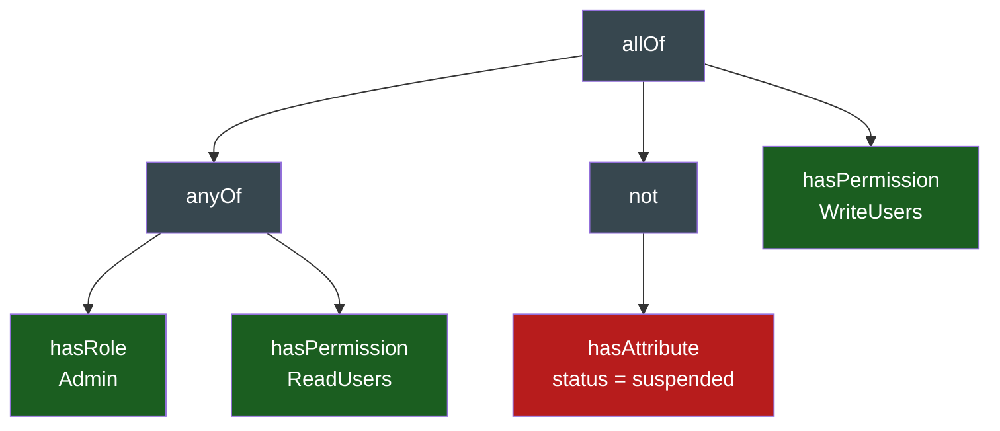

# Policies & Composition

Policies are serializable discriminated unions composed through algebraic combinators. Every policy is plain JSON data -- no callbacks, no closures, no hidden state.

## Policy as Data

A `PolicyConstraint` is a discriminated union with a `_tag` field identifying the policy kind. This design enables:

- **Serialization** -- policies round-trip through JSON without loss
- **Introspection** -- you can walk the policy tree programmatically
- **Explanation** -- human-readable descriptions are derived from data
- **Storage** -- persist policies in databases, transmit over networks

## Leaf Combinators

Leaf policies check a single condition against an `AuthSubject`.

### `hasPermission(permission)`

Checks that the subject has a specific permission in their permission set.

```typescript
import { hasPermission } from "@hex-di/guard";

const canRead = hasPermission(ReadUsers);
```

### `hasRole(role)`

Checks that the subject has a specific role.

```typescript
import { hasRole } from "@hex-di/guard";

const isAdmin = hasRole(AdminRole);
```

### `hasAttribute(key, value)`

Checks that a subject attribute matches a specific value.

```typescript
import { hasAttribute } from "@hex-di/guard";

const isActive = hasAttribute("status", "active");
```

### `hasResourceAttribute(key, value)`

Checks a resource-level attribute from the `EvaluationContext`.

```typescript
import { hasResourceAttribute } from "@hex-di/guard";

const isPublic = hasResourceAttribute("visibility", "public");
```

### `hasSignature(signatureType)`

Checks that an electronic signature of the specified type is present in the evaluation context.

```typescript
import { hasSignature } from "@hex-di/guard";

const requiresApproval = hasSignature("approval");
```

### `hasRelationship(relationship)`

Checks that the subject has a specific relationship to the resource.

```typescript
import { hasRelationship } from "@hex-di/guard";

const isOwner = hasRelationship("owner");
```

## Logical Combinators

Logical combinators compose policies into trees.

### `allOf(...policies)`

All sub-policies must grant. Short-circuits on the first denial.

```typescript
import { allOf } from "@hex-di/guard";

const canEdit = allOf(hasPermission(WriteUsers), hasAttribute("status", "active"));
```

### `anyOf(...policies)`

At least one sub-policy must grant. Short-circuits on the first grant.

```typescript
import { anyOf } from "@hex-di/guard";

const canAccess = anyOf(hasRole(AdminRole), hasPermission(ReadUsers));
```

### `not(policy)`

Inverts the decision of a sub-policy.

```typescript
import { not } from "@hex-di/guard";

const notSuspended = not(hasAttribute("status", "suspended"));
```

### `withLabel(label, policy)`

Attaches a human-readable label to a policy node for debugging and audit trail readability.

```typescript
import { withLabel } from "@hex-di/guard";

const policy = withLabel(
  "Can edit active users",
  allOf(hasPermission(WriteUsers), hasAttribute("status", "active"))
);
```

### `anyOfRoles(...roles)`

Shorthand for `anyOf(hasRole(r1), hasRole(r2), ...)`.

```typescript
import { anyOfRoles } from "@hex-di/guard";

const isStaff = anyOfRoles(AdminRole, EditorRole, ModeratorRole);
```

## Policy Composition Tree

Composed policies form a tree structure. The evaluator walks the tree depth-first, short-circuiting where possible.



This tree represents:

```typescript
allOf(
  anyOf(hasRole("Admin"), hasPermission(ReadUsers)),
  not(hasAttribute("status", "suspended")),
  hasPermission(WriteUsers)
);
```

## Short-Circuit Evaluation

- **`allOf`** stops at the first `deny` -- remaining sub-policies are not evaluated
- **`anyOf`** stops at the first `allow` -- remaining sub-policies are not evaluated
- **`not`** always evaluates its single child

This means policy ordering can affect performance but never correctness. Place cheap checks (permission lookups) before expensive ones (attribute resolution).

## Combinator Reference

| Combinator                         | Description                    |
| ---------------------------------- | ------------------------------ |
| `hasPermission(p)`                 | Subject has permission `p`     |
| `hasRole(r)`                       | Subject has role `r`           |
| `hasAttribute(key, value)`         | Subject attribute matches      |
| `hasResourceAttribute(key, value)` | Resource attribute matches     |
| `hasSignature(type)`               | Electronic signature present   |
| `hasRelationship(rel)`             | Subject-resource relationship  |
| `allOf(...policies)`               | All policies must grant        |
| `anyOf(...policies)`               | At least one policy must grant |
| `not(policy)`                      | Inverts the decision           |
| `withLabel(label, policy)`         | Annotate with label            |
| `anyOfRoles(...roles)`             | Any of the listed roles        |

## Field-Level Visibility

Policies can control which fields of a resource are visible using the `fields` option and `fieldStrategy`.

```typescript
const policy = hasPermission(ReadUsers, {
  fields: ["name", "email"],
  fieldStrategy: "include", // only these fields are visible
});
```

When evaluation grants access, the `Decision` includes a `visibleFields` set that the enforcement layer can use to filter response data.
