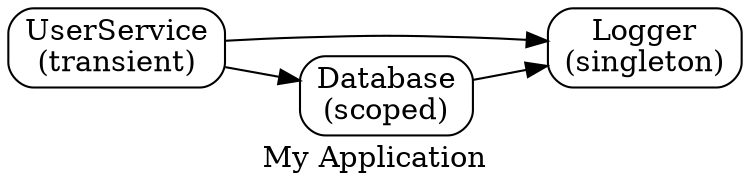

# @hex-di/graph

The compile-time validation layer of HexDI providing dependency graph construction with type-safe adapter registration and actionable error messages.

## Installation

```bash
npm install @hex-di/graph @hex-di/ports
# or
pnpm add @hex-di/graph @hex-di/ports
# or
yarn add @hex-di/graph @hex-di/ports
```

> **Note:** `@hex-di/ports` is a peer dependency and must be installed alongside `@hex-di/graph`.

## Requirements

- **TypeScript 5.0+** - Required for the `const` type parameter modifier that preserves tuple types in `requires` arrays
- **Node.js 18.0+** - Minimum supported runtime version

> ⚠️ **Important**: Compile-time cycle detection has a depth limit (default: 50 levels). Graphs deeper than this limit will have cycles detected at runtime instead. See [Limitations](#compile-time-cycle-detection-depth-limit) for details. Most production graphs are well under this limit.

## Quick Start

### Using `defineService` (Recommended)

The `defineService` helper combines port and adapter creation in one step with sensible defaults:

```typescript
import { defineService, GraphBuilder } from "@hex-di/graph";

// Define service interfaces
interface Logger {
  log(message: string): void;
}

interface Database {
  query(sql: string): Promise<unknown>;
}

interface UserService {
  getUser(id: string): Promise<{ id: string; name: string }>;
}

// Define services - port and adapter in one step
const [LoggerPort, LoggerAdapter] = defineService<"Logger", Logger>("Logger", {
  // defaults: requires=[], lifetime="singleton"
  factory: () => ({
    log: msg => console.log(msg),
  }),
});

const [DatabasePort, DatabaseAdapter] = defineService<"Database", Database>("Database", {
  requires: [LoggerPort],
  factory: ({ Logger }) => {
    Logger.log("Initializing database...");
    return {
      query: async sql => {
        /* ... */
      },
    };
  },
});

const [UserServicePort, UserServiceAdapter] = defineService<"UserService", UserService>(
  "UserService",
  {
    requires: [LoggerPort, DatabasePort],
    lifetime: "scoped",
    factory: ({ Logger, Database }) => ({
      getUser: async id => {
        Logger.log(`Fetching user ${id}`);
        const result = await Database.query(`SELECT * FROM users WHERE id = '${id}'`);
        return result as { id: string; name: string };
      },
    }),
  }
);

// Build the dependency graph
const graph = GraphBuilder.create()
  .provide(LoggerAdapter)
  .provide(DatabaseAdapter)
  .provide(UserServiceAdapter)
  .build();

// graph is ready for use with @hex-di/runtime
```

### Using `createPort` and `createAdapter` (Explicit)

For more control, use the lower-level APIs separately:

```typescript
import { createPort } from "@hex-di/ports";
import { createAdapter, GraphBuilder } from "@hex-di/graph";

// Create port tokens
const LoggerPort = createPort<"Logger", Logger>("Logger");

// Create adapters
const LoggerAdapter = createAdapter({
  provides: LoggerPort,
  requires: [],
  lifetime: "singleton",
  factory: () => ({
    log: msg => console.log(msg),
  }),
});
```

## Core Concepts

### Adapters

An adapter is a typed declaration that connects a service implementation to a port. It captures:

1. **Provides** - Which port this adapter satisfies
2. **Requires** - Which ports this adapter depends on
3. **Lifetime** - How long service instances should live
4. **Factory** - A function that creates the service instance

```typescript
const MyAdapter = createAdapter({
  provides: MyPort, // Single port this adapter implements
  requires: [DepA, DepB], // Array of port dependencies
  lifetime: "singleton", // 'singleton' | 'scoped' | 'transient'
  factory: deps => {
    // Receives typed dependencies object
    return new MyServiceImpl(deps.DepA, deps.DepB);
  },
});
```

### GraphBuilder

The `GraphBuilder` is an immutable builder that accumulates adapters and tracks dependencies at the type level:

```typescript
const builder1 = GraphBuilder.create(); // GraphBuilder<never, never>
const builder2 = builder1.provide(LoggerAdapter); // GraphBuilder<LoggerPort, never>
const builder3 = builder2.provide(UserServiceAdapter); // GraphBuilder<LoggerPort | UserServicePort, LoggerPort | DatabasePort>
```

Each `.provide()` call returns a **new** builder instance. The original is unchanged.

### Lifetime Scopes

| Lifetime      | Description                            | Use Case                             |
| ------------- | -------------------------------------- | ------------------------------------ |
| `'singleton'` | One instance for entire application    | Shared resources, connection pools   |
| `'scoped'`    | One instance per scope (e.g., request) | Request-specific state, transactions |
| `'transient'` | New instance every resolution          | Stateful services, isolation needed  |

### Compile-Time Validation

The graph validates dependencies at compile time. When you call `.build()`, TypeScript checks that all required ports are provided:

```typescript
// This compiles - all dependencies satisfied
const valid = GraphBuilder.create()
  .provide(LoggerAdapter)
  .provide(UserServiceAdapter) // requires Logger - satisfied
  .build();

// This produces a compile error - Database is missing
const invalid = GraphBuilder.create()
  .provide(UserServiceAdapter) // requires Logger AND Database
  .provide(LoggerAdapter) // provides Logger, but Database missing
  .build();
// Error: Type 'MissingDependencyError<typeof DatabasePort>' is not assignable...
// __message: "Missing dependencies: Database"
```

### Validation Pipeline

When you call `.provide()`, the graph validates each adapter through a pipeline of checks. Validation stops at the **first error**, so you'll see one error at a time:

```
┌─────────────────────────────────────────────────────────────────────────┐
│                        .provide(adapter)                                 │
└───────────────────────────────┬─────────────────────────────────────────┘
                                │
                                ▼
                  ┌─────────────────────────────┐
                  │   1. Duplicate Detection    │
                  │   "Is this port already     │
                  │    provided?"               │
                  └──────────────┬──────────────┘
                                 │
              ┌──────────────────┼──────────────────┐
              │ Yes                                 │ No
              ▼                                     ▼
┌─────────────────────────┐           ┌─────────────────────────────┐
│ DuplicateProviderError  │           │   2. Cycle Detection        │
│ "Duplicate provider     │           │   "Would this create a      │
│  for: Logger"           │           │    circular dependency?"    │
└─────────────────────────┘           └──────────────┬──────────────┘
                                                     │
                                    ┌────────────────┼────────────────┐
                                    │ Yes                             │ No
                                    ▼                                 ▼
                     ┌─────────────────────────┐      ┌─────────────────────────────┐
                     │ CircularDependencyError │      │   3. Captive Detection      │
                     │ "Circular dependency:   │      │   "Does a long-lived service│
                     │  A -> B -> C -> A"      │      │    depend on short-lived?"  │
                     └─────────────────────────┘      └──────────────┬──────────────┘
                                                                     │
                                                    ┌────────────────┼────────────────┐
                                                    │ Yes                             │ No
                                                    ▼                                 ▼
                                     ┌─────────────────────────┐     ┌─────────────────────────┐
                                     │ CaptiveDependencyError  │     │   ✓ Success             │
                                     │ "Singleton 'Cache'      │     │   Adapter added to      │
                                     │  cannot depend on       │     │   graph                 │
                                     │  Scoped 'Request'"      │     └─────────────────────────┘
                                     └─────────────────────────┘
```

**Why this order?**

| Stage     | Priority | Rationale                                                        |
| --------- | -------- | ---------------------------------------------------------------- |
| Duplicate | 1st      | Cheapest check; prevents confusing downstream errors             |
| Cycle     | 2nd      | Must validate before adding to graph; prevents infinite loops    |
| Captive   | 3rd      | Requires knowing full graph structure; validates lifetime safety |

**Practical impact:** When fixing validation errors, resolve them in order. If you see a duplicate error, don't assume there are no other issues—additional errors may surface after fixing the duplicate.

## Compile-Time Error Examples

### Missing Dependencies

When required dependencies are not provided, you get a clear error message:

```typescript
const UserServiceAdapter = createAdapter({
  provides: UserServicePort,
  requires: [LoggerPort, DatabasePort],
  // ...
});

const graph = GraphBuilder.create().provide(UserServiceAdapter).build(); // Error!
```

**Error message in IDE:**

```
Type 'MissingDependencyError<...>' is not assignable to type 'Graph<...>'
  __message: "Missing dependencies: Logger" | "Missing dependencies: Database"
```

**Fix:** Add the missing adapters:

```typescript
const graph = GraphBuilder.create()
  .provide(LoggerAdapter)
  .provide(DatabaseAdapter)
  .provide(UserServiceAdapter)
  .build(); // OK!
```

### Duplicate Providers

When the same port is provided twice, you get an error:

```typescript
const ConsoleLoggerAdapter = createAdapter({
  provides: LoggerPort,
  // ...
});

const FileLoggerAdapter = createAdapter({
  provides: LoggerPort, // Same port!
  // ...
});

const graph = GraphBuilder.create()
  .provide(ConsoleLoggerAdapter)
  .provide(FileLoggerAdapter) // Error!
  .build();
```

**Error message in IDE:**

```
Type 'DuplicateProviderError<...>' is not assignable...
  __message: "Duplicate provider for: Logger"
```

## API Reference

### `defineService(name, config)` (Recommended)

Creates a port and adapter in a single step with sensible defaults.

#### Parameters

| Parameter | Type     | Description                       |
| --------- | -------- | --------------------------------- |
| `name`    | `string` | Unique name for the port          |
| `config`  | `object` | Service configuration (see below) |

#### Config Properties

| Property    | Type                 | Default       | Description                             |
| ----------- | -------------------- | ------------- | --------------------------------------- |
| `requires`  | `readonly Port[]`    | `[]`          | Array of port dependencies              |
| `lifetime`  | `Lifetime`           | `"singleton"` | Service lifetime scope                  |
| `factory`   | `(deps) => T`        | (required)    | Factory function                        |
| `finalizer` | `(instance) => void` | (optional)    | Cleanup function called during disposal |

#### Returns

`readonly [Port<T, TName>, Adapter<...>]` - A frozen tuple of port and adapter.

#### Examples

```typescript
// Minimal - no deps, singleton (default)
const [LoggerPort, LoggerAdapter] = defineService<"Logger", Logger>("Logger", {
  factory: () => new ConsoleLogger(),
});

// With dependencies
const [UserServicePort, UserServiceAdapter] = defineService<"UserService", UserService>(
  "UserService",
  {
    requires: [LoggerPort, DatabasePort],
    lifetime: "scoped",
    factory: ({ Logger, Database }) => new UserServiceImpl(Logger, Database),
  }
);

// With finalizer
const [DbPort, DbAdapter] = defineService<"Database", Database>("Database", {
  factory: () => new DatabaseConnection(),
  finalizer: db => db.close(),
});
```

### `defineAsyncService(name, config)`

Creates a port and async adapter in a single step. Async services are always singletons.

> **Why are async services singleton-only?**
>
> Async services typically involve expensive initialization (database connections, file loading, external API authentication). Running async initialization per-request would be inefficient and could exhaust resources. The `initialize()` method in `@hex-di/runtime` runs all async adapters at container startup in priority order, which relies on singleton semantics.
>
> For per-request async operations, use a singleton service that exposes async methods rather than an async factory.

#### Parameters

| Parameter | Type     | Description                       |
| --------- | -------- | --------------------------------- |
| `name`    | `string` | Unique name for the port          |
| `config`  | `object` | Service configuration (see below) |

#### Config Properties

| Property    | Type                   | Default  | Description                |
| ----------- | ---------------------- | -------- | -------------------------- |
| `requires`  | `readonly Port[]`      | `[]`     | Array of port dependencies |
| `factory`   | `(deps) => Promise<T>` | required | Async factory function     |
| `finalizer` | `(instance) => void`   | optional | Cleanup function           |

#### Returns

`readonly [Port<T, TName>, Adapter<..., "singleton", "async">]` - A frozen tuple.

#### Example

```typescript
const [ConfigPort, ConfigAdapter] = defineAsyncService<"Config", Config>("Config", {
  factory: async () => await loadConfigFromFile(),
});

const [DatabasePort, DatabaseAdapter] = defineAsyncService<"Database", Database>("Database", {
  requires: [ConfigPort],
  factory: async ({ Config }) => await connectToDb(Config.dbUrl),
});
// Initialization order is automatic: Config first (no deps), then Database
```

### `createAdapter(config)`

Creates a typed adapter with dependency metadata.

#### Config Properties

| Property   | Type              | Description                                                   |
| ---------- | ----------------- | ------------------------------------------------------------- |
| `provides` | `Port<T, string>` | The port this adapter implements                              |
| `requires` | `readonly Port[]` | Array of port dependencies (empty array for none)             |
| `lifetime` | `Lifetime`        | Service lifetime: `'singleton'`, `'scoped'`, or `'transient'` |
| `factory`  | `(deps) => T`     | Factory function receiving resolved dependencies              |

#### Returns

`Adapter<TProvides, TRequires, TLifetime>` - A frozen adapter object.

#### Example

```typescript
import { createAdapter } from "@hex-di/graph";

const CacheAdapter = createAdapter({
  provides: CachePort,
  requires: [ConfigPort],
  lifetime: "singleton",
  factory: deps => {
    const ttl = deps.Config.get("cache.ttl");
    return new RedisCache({ ttl });
  },
});
```

#### Adapter Clonability (`clonable`)

The `clonable` flag controls whether an adapter's instances can be used with forked inheritance mode in child containers.

| Property   | Type      | Default | Description                                    |
| ---------- | --------- | ------- | ---------------------------------------------- |
| `clonable` | `boolean` | `false` | Whether instances can be safely shallow-cloned |

When `clonable: true`, the adapter's instances can be used with forked inheritance mode, which creates a shallow clone for child containers. When `false` (default), forked mode will fail at compile time.

**Mark as clonable only for services that:**

- Have no resource handles (sockets, file handles, connections)
- Have no external references that would become shared
- Are value-like objects where shallow cloning produces valid instances

```typescript
// Value object - safe to clone
const ConfigAdapter = createAdapter({
  provides: ConfigPort,
  requires: [],
  lifetime: "singleton",
  clonable: true, // Safe: pure data, no handles
  factory: () => ({
    get: key => process.env[key],
  }),
});

// Resource holder - NOT safe to clone
const DatabaseAdapter = createAdapter({
  provides: DatabasePort,
  requires: [ConfigPort],
  lifetime: "singleton",
  clonable: false, // Unsafe: holds connection pool
  factory: deps => {
    const pool = createPool(deps.Config.get("DB_URL"));
    return { query: sql => pool.query(sql) };
  },
});
```

**Type Inference:**

```typescript
import { InferClonable, IsClonableAdapter } from "@hex-di/graph";

type IsClonable = InferClonable<typeof ConfigAdapter>; // true
type Check = IsClonableAdapter<typeof DatabaseAdapter>; // false
```

### `GraphBuilder.create()`

Creates a new empty GraphBuilder.

#### Returns

`GraphBuilder<never, never>` - An empty, frozen builder.

### `GraphBuilder.provide(adapter)`

Registers an adapter with the graph, returning a new builder.

#### Parameters

| Parameter | Type      | Description             |
| --------- | --------- | ----------------------- |
| `adapter` | `Adapter` | The adapter to register |

#### Returns

- On success: `GraphBuilder<TProvides | AdapterProvides, TRequires | AdapterRequires>`
- On duplicate: `DuplicateProviderError<DuplicatePort>`

### `GraphBuilder.provideMany(adapters)`

Registers multiple adapters at once, returning a new builder. This is a convenience method for batch registration.

#### Parameters

| Parameter  | Type        | Description                   |
| ---------- | ----------- | ----------------------------- |
| `adapters` | `Adapter[]` | Array of adapters to register |

#### Returns

- On success: `GraphBuilder<TProvides | AllAdapterProvides, TRequires | AllAdapterRequires>`
- On duplicate: `DuplicateProviderError<DuplicatePort>`

#### Example

```typescript
// Instead of chaining multiple .provide() calls:
const graph = GraphBuilder.create()
  .provideMany([LoggerAdapter, DatabaseAdapter, UserServiceAdapter])
  .build();

// Equivalent to:
const graph = GraphBuilder.create()
  .provide(LoggerAdapter)
  .provide(DatabaseAdapter)
  .provide(UserServiceAdapter)
  .build();
```

### `GraphBuilder.override(adapter)`

Registers an adapter as an override for a parent container's adapter. Use this when building child graphs that need to replace a parent's adapter (e.g., test mocks, environment-specific implementations).

#### Parameters

| Parameter | Type      | Description                        |
| --------- | --------- | ---------------------------------- |
| `adapter` | `Adapter` | The adapter to mark as an override |

#### Returns

- On success: `GraphBuilder<TProvides | AdapterProvides, TRequires | AdapterRequires>` with override tracking
- On duplicate: `DuplicateProviderError<DuplicatePort>`

#### Important Limitation

Override validation is performed at **runtime**, not compile time. The type system does not verify that the overridden port exists in the parent container.

#### Example

```typescript
// Parent provides production Logger
const parentGraph = GraphBuilder.create()
  .provide(ProductionLoggerAdapter)
  .provide(DatabaseAdapter)
  .build();

// Child overrides Logger with mock for testing
const MockLoggerAdapter = createAdapter({
  provides: LoggerPort,
  requires: [],
  lifetime: "singleton",
  factory: () => ({
    log: vi.fn(),
  }),
});

const childFragment = GraphBuilder.create()
  .override(MockLoggerAdapter) // Replaces parent's Logger
  .provide(CacheAdapter) // Adds new Cache port
  .buildFragment();

// Create child container with overrides
const childContainer = parentContainer.createChild(childFragment);
```

### `GraphBuilder.build()`

Validates and builds the dependency graph.

#### Returns

- On success: `Graph<TProvides>` - The validated graph
- On missing deps: `MissingDependencyError<MissingPorts>` - Error type

### `GraphBuilder.buildFragment()`

Builds a graph fragment for child containers **without** validating that all dependencies are satisfied internally.

#### Returns

`Graph<TProvides, TAsyncPorts, TOverrides>` - Always returns a Graph (no error type)

#### When to Use

| Method            | Use When                        | Validates Dependencies |
| ----------------- | ------------------------------- | ---------------------- |
| `build()`         | Creating root container graphs  | Yes                    |
| `buildFragment()` | Creating child container graphs | No                     |

#### Example

```typescript
// ConfigAdapter requires LoggerPort which parent provides
const ConfigAdapter = createAdapter({
  provides: ConfigPort,
  requires: [LoggerPort], // Will come from parent
  lifetime: "scoped",
  factory: deps => ({
    getValue: key => {
      deps.Logger.log(`Getting config: ${key}`);
      return process.env[key];
    },
  }),
});

// Use buildFragment() when dependencies come from parent
const childGraph = GraphBuilder.create().provide(ConfigAdapter).buildFragment(); // No error about missing Logger

// build() would produce error:
// "ERROR: Missing adapters for Logger. Call .provide() first."
```

#### Root vs Child Graph Pattern

```typescript
// Root graph - all dependencies must be satisfied
const rootGraph = GraphBuilder.create()
  .provide(LoggerAdapter)
  .provide(DatabaseAdapter)
  .provide(UserServiceAdapter)
  .build(); // Validates completeness

// Child graph - can depend on parent's adapters
const childGraph = GraphBuilder.create()
  .override(MockDatabaseAdapter) // Override parent's Database
  .provide(CacheAdapter) // Add new service
  .buildFragment(); // Skip validation

const rootContainer = Container.create(rootGraph);
const childContainer = rootContainer.createChild(childGraph);
```

### Type Utilities

#### `Adapter<TProvides, TRequires, TLifetime>`

The branded adapter type capturing the full contract.

```typescript
type MyAdapter = Adapter<typeof LoggerPort, never, "singleton">;
```

#### `Graph<TProvides>`

The validated graph returned by `.build()`.

```typescript
type MyGraph = Graph<typeof LoggerPort | typeof DatabasePort>;
```

#### `Lifetime`

Union type of lifetime options.

```typescript
type Lifetime = "singleton" | "scoped" | "transient";
```

#### `ResolvedDeps<TRequires>`

Maps a port union to a typed dependencies object.

```typescript
type Deps = ResolvedDeps<typeof LoggerPort | typeof DatabasePort>;
// { Logger: Logger; Database: Database }
```

#### `InferAdapterProvides<A>`

Extracts the provided port from an adapter.

```typescript
type Provided = InferAdapterProvides<typeof LoggerAdapter>;
// typeof LoggerPort
```

#### `InferAdapterRequires<A>`

Extracts the required ports union from an adapter.

```typescript
type Required = InferAdapterRequires<typeof UserServiceAdapter>;
// typeof LoggerPort | typeof DatabasePort
```

#### `InferAdapterLifetime<A>`

Extracts the lifetime literal from an adapter.

```typescript
type Life = InferAdapterLifetime<typeof LoggerAdapter>;
// 'singleton'
```

#### `InferGraphProvides<G>`

Extracts provided ports from a GraphBuilder.

```typescript
type Provided = InferGraphProvides<typeof builder>;
// typeof LoggerPort | typeof DatabasePort
```

#### `InferGraphRequires<G>`

Extracts required ports from a GraphBuilder.

```typescript
type Required = InferGraphRequires<typeof builder>;
// typeof ConfigPort
```

#### `UnsatisfiedDependencies<TProvides, TRequires>`

Computes missing dependencies via union subtraction.

```typescript
type Missing = UnsatisfiedDependencies<typeof LoggerPort, typeof LoggerPort | typeof DatabasePort>;
// typeof DatabasePort
```

#### `IsSatisfied<TProvides, TRequires>`

Boolean type predicate for dependency satisfaction.

```typescript
type Satisfied = IsSatisfied<typeof LoggerPort | typeof DatabasePort, typeof LoggerPort>;
// true
```

#### `MissingDependencyError<MissingPorts>`

Error type with readable message for missing dependencies.

```typescript
type Error = MissingDependencyError<typeof LoggerPort>;
// { __message: "Missing dependencies: Logger"; ... }
```

#### `DuplicateProviderError<DuplicatePort>`

Error type with readable message for duplicate providers.

```typescript
type Error = DuplicateProviderError<typeof LoggerPort>;
// { __message: "Duplicate provider for: Logger"; ... }
```

### Programmatic Error Handling

For runtime scenarios where you need to process error messages programmatically, use the error parsing utilities:

#### `isGraphError(message)`

Checks if a string is a graph validation error message.

```typescript
import { isGraphError } from "@hex-di/graph";

const message = "ERROR: Circular dependency: A -> B -> A. Fix: ...";
if (isGraphError(message)) {
  console.error("Validation failed:", message);
}
```

#### `parseGraphError(message)`

Parses a graph error message into structured information for programmatic handling.

```typescript
import { parseGraphError, GraphErrorCode } from "@hex-di/graph";

const message = "ERROR: Duplicate adapter for 'Logger'. Fix: Remove one .provide() call...";
const parsed = parseGraphError(message);

if (parsed) {
  console.log(parsed.code); // "DUPLICATE_ADAPTER"
  console.log(parsed.details); // { portName: "Logger" }

  // Handle different error types
  switch (parsed.code) {
    case GraphErrorCode.DUPLICATE_ADAPTER:
      console.log(`Remove duplicate adapter for: ${parsed.details.portName}`);
      break;
    case GraphErrorCode.CIRCULAR_DEPENDENCY:
      console.log(`Break cycle at: ${parsed.details.cyclePath}`);
      break;
    case GraphErrorCode.CAPTIVE_DEPENDENCY:
      console.log(
        `Fix lifetime mismatch: ${parsed.details.dependentName} -> ${parsed.details.captiveName}`
      );
      break;
    case GraphErrorCode.MISSING_DEPENDENCY:
      console.log(`Add adapters for: ${parsed.details.missingPorts}`);
      break;
  }
}
```

#### `GraphErrorCode`

Enum of all possible error codes for type-safe error handling:

```typescript
import { GraphErrorCode } from "@hex-di/graph";

// Available codes:
// - GraphErrorCode.DUPLICATE_ADAPTER
// - GraphErrorCode.CIRCULAR_DEPENDENCY
// - GraphErrorCode.CAPTIVE_DEPENDENCY
// - GraphErrorCode.MISSING_DEPENDENCY
// - GraphErrorCode.LIFETIME_INCONSISTENCY
// - GraphErrorCode.INVALID_OVERRIDE
// - GraphErrorCode.MULTIPLE_ERRORS
```

#### Use Case: Building Developer Tools

```typescript
import { parseGraphError, GraphErrorCode } from "@hex-di/graph";

function highlightGraphError(message: string): void {
  const parsed = parseGraphError(message);
  if (!parsed) return;

  switch (parsed.code) {
    case GraphErrorCode.CIRCULAR_DEPENDENCY:
      // Highlight cycle in dependency graph visualization
      const cyclePath = parsed.details.cyclePath.split(" -> ");
      highlightNodes(cyclePath);
      break;

    case GraphErrorCode.CAPTIVE_DEPENDENCY:
      // Suggest lifetime change in IDE
      suggestLifetimeChange(parsed.details.dependentName, parsed.details.captiveLifetime);
      break;
  }
}
```

### Advanced Type Utilities

These utilities are for debugging and advanced use cases.

#### `InspectValidation<B>`

Extracts detailed validation state from a GraphBuilder for debugging. Useful for understanding which validations pass vs fail before calling `build()`.

```typescript
const builder = GraphBuilder.create().provide(LoggerAdapter).provide(UserServiceAdapter); // Requires Database, Logger

type State = InspectValidation<typeof builder>;
// {
//   provides: typeof LoggerPort | typeof UserServicePort,
//   requires: typeof LoggerPort | typeof DatabasePort,
//   unsatisfiedDeps: typeof DatabasePort,  // Missing!
//   depGraph: { Logger: never, UserService: "Logger" | "Database" },
//   lifetimeMap: { Logger: 1, UserService: 2 }
// }
```

#### `InferGraphAsyncPorts<G>`

Extracts the async ports from a Graph or GraphBuilder.

```typescript
type AsyncPorts = InferGraphAsyncPorts<typeof graph>;
// typeof ConfigPort | typeof DatabasePort (if both are async)
```

#### `InferGraphOverrides<G>`

Extracts the override ports from a Graph or GraphBuilder. Override ports are those added via `override()` method in child graphs.

```typescript
type Overrides = InferGraphOverrides<typeof childGraph>;
// typeof LoggerPort (if Logger was overridden)
```

#### `InferClonable<A>`

Extracts the clonable flag from an adapter.

```typescript
type IsClonable = InferClonable<typeof ConfigAdapter>;
// true | false
```

#### `IsClonableAdapter<A>`

Type predicate for checking if an adapter is clonable.

```typescript
type CanClone = IsClonableAdapter<typeof ConfigAdapter>;
// true
```

#### Cycle Detection Types

##### `WouldCreateCycle<DepGraph, Provides, Requires>`

Type-level predicate that checks if adding an adapter would create a circular dependency.

```typescript
type WouldCycle = WouldCreateCycle<ExistingGraph, "UserService", "Logger" | "Database">;
// true | false
```

##### `CircularDependencyError<Path>`

Error type returned when a cycle is detected during `provide()`.

```typescript
// When detected:
type Error = CircularDependencyError<"A -> B -> C -> A">;
// { __errorBrand: "CircularDependencyError", __cyclePath: "A -> B -> C -> A" }
```

#### Captive Dependency Types

##### `CaptiveDependencyError<Dependent, DepLifetime, Captive, CaptiveLifetime>`

Error type returned when a longer-lived service tries to depend on a shorter-lived one.

```typescript
type Error = CaptiveDependencyError<"UserCache", "Singleton", "RequestContext", "Scoped">;
// Error message: Singleton 'UserCache' cannot depend on Scoped 'RequestContext'
```

## Advanced Usage Guide

### Async Adapters with Automatic Initialization Order

Async adapters are automatically initialized in the correct order using topological sort based on their dependencies. Adapters with no async dependencies initialize first, and independent adapters at the same level initialize in parallel for maximum performance.

```typescript
import { defineAsyncService, GraphBuilder } from "@hex-di/graph";

// Config has no dependencies - initializes first
const [ConfigPort, ConfigAdapter] = defineAsyncService<"Config", Config>("Config", {
  factory: async () => {
    const config = await loadConfigFromFile();
    console.log("Config loaded");
    return config;
  },
});

// Database depends on Config - initializes second
const [DatabasePort, DatabaseAdapter] = defineAsyncService<"Database", Database>("Database", {
  requires: [ConfigPort],
  factory: async ({ Config }) => {
    console.log("Connecting to database...");
    return await connectToDatabase(Config.get("DATABASE_URL"));
  },
  finalizer: async db => {
    console.log("Closing database connection...");
    await db.close();
  },
});

// Cache also depends on Config - initializes in parallel with Database
const [CachePort, CacheAdapter] = defineAsyncService<"Cache", Cache>("Cache", {
  requires: [ConfigPort],
  factory: async ({ Config }) => {
    console.log("Initializing cache...");
    return await createRedisClient(Config.get("REDIS_URL"));
  },
  finalizer: async cache => {
    await cache.disconnect();
  },
});

const graph = GraphBuilder.create()
  .provide(ConfigAdapter)
  .provide(DatabaseAdapter)
  .provide(CacheAdapter)
  .build();

// With @hex-di/runtime:
// await container.initialize();
// Runs: Config first, then Database and Cache in parallel
// await container.dispose();    // Runs finalizers in reverse order: Cache → Database
```

**Priority Guidelines:**

| Range   | Use Case                                           |
| ------- | -------------------------------------------------- |
| 0-50    | Configuration, environment setup                   |
| 50-100  | Database connections, external services            |
| 100-200 | Caches, queues, messaging                          |
| 200+    | Application services that depend on infrastructure |

### Lazy Resolution (Breaking Circular Dependencies)

When two services legitimately need to reference each other, use `lazyPort()` to break the cycle:

```typescript
import { createAdapter, lazyPort, GraphBuilder } from "@hex-di/graph";
import { createPort } from "@hex-di/ports";

interface UserService {
  getUser(id: string): User;
  notifyUser(id: string, message: string): void;
}

interface NotificationService {
  send(userId: string, message: string): void;
  getUserName(userId: string): string;
}

const UserServicePort = createPort<"UserService", UserService>("UserService");
const NotificationServicePort = createPort<"NotificationService", NotificationService>(
  "NotificationService"
);

// UserService depends on NotificationService normally
const UserServiceAdapter = createAdapter({
  provides: UserServicePort,
  requires: [NotificationServicePort],
  lifetime: "singleton",
  factory: ({ NotificationService }) => ({
    getUser: id => ({ id, name: `User ${id}` }),
    notifyUser: (id, message) => NotificationService.send(id, message),
  }),
});

// NotificationService depends on UserService LAZILY to break the cycle
const NotificationServiceAdapter = createAdapter({
  provides: NotificationServicePort,
  requires: [lazyPort(UserServicePort)], // <-- Lazy dependency
  lifetime: "singleton",
  factory: ({ LazyUserService }) => ({
    send: (userId, message) => console.log(`Sending "${message}" to ${userId}`),
    getUserName: userId => {
      const userService = LazyUserService(); // Thunk resolves when called
      return userService.getUser(userId).name;
    },
  }),
});

// Build succeeds - no circular dependency error
const graph = GraphBuilder.create()
  .provide(UserServiceAdapter)
  .provide(NotificationServiceAdapter)
  .build();
```

**Key Points:**

- Use `lazyPort(OriginalPort)` in the `requires` array
- Factory receives `LazyPortName` (e.g., `LazyUserService`) as a thunk `() => T`
- Call the thunk only when needed, not during factory execution
- Only provide the **original** adapters - lazy adapters are auto-generated

### Graph Inspection and Debugging

Use `builder.inspect()` to examine graph state at any point:

```typescript
const builder = GraphBuilder.create().provide(LoggerAdapter).provide(DatabaseAdapter);

const info = builder.inspect();

console.log(info.summary);
// "Graph(2 adapters, 0 unsatisfied): Logger, Database"

console.log(info.adapterCount); // 2
console.log(info.provides); // ["Logger (singleton)", "Database (scoped)"]
console.log(info.unsatisfiedRequirements); // []
console.log(info.isComplete); // true
console.log(info.maxChainDepth); // 1
console.log(info.dependencyMap); // { Logger: [], Database: ["Logger"] }
console.log(info.orphanPorts); // ["Database"] (not required by anyone)

// Check for depth warnings (when approaching 50-level limit)
if (info.depthWarning) {
  console.warn(info.depthWarning);
}

// Iterate suggestions for actionable guidance
for (const suggestion of info.suggestions) {
  console.log(`[${suggestion.type}] ${suggestion.message}`);
  console.log(`  → ${suggestion.action}`);
}
```

**Suggestion Types:**

| Type               | Description                                |
| ------------------ | ------------------------------------------ |
| `missing_adapter`  | Required port has no provider              |
| `depth_warning`    | Chain depth approaching compile-time limit |
| `orphan_port`      | Port provided but never required           |
| `disposal_warning` | Potential finalizer ordering issues        |

### Graph Visualization

Export your dependency graph for visualization using DOT (Graphviz) or Mermaid format:

```typescript
import { GraphBuilder, inspectGraph, toDotGraph, toMermaidGraph } from "@hex-di/graph";

const graph = GraphBuilder.create()
  .provide(LoggerAdapter)
  .provide(DatabaseAdapter)
  .provide(CacheAdapter)
  .provide(UserServiceAdapter)
  .build();

const info = inspectGraph(graph);

// Generate Graphviz DOT format
const dot = toDotGraph(info, {
  title: "My Application",
  direction: "LR", // Left-to-right layout
  showLifetimes: true, // Show (singleton), (scoped), etc.
  showOrphans: true, // Highlight unused ports
  highlightMissing: true, // Red color for missing deps
});

console.log(dot);
// Render at: https://dreampuf.github.io/GraphvizOnline/
// Or CLI: dot -Tpng graph.dot -o graph.png

// Generate Mermaid format (for GitHub, Notion, etc.)
const mermaid = toMermaidGraph(info, {
  title: "My Application",
  direction: "TB",
});

console.log(mermaid);
// Paste into any Mermaid-compatible renderer
```

**Example DOT Output:**



### Error Recovery Patterns

Handle validation errors programmatically for tooling, CI/CD, or user feedback:

```typescript
import { parseGraphError, isGraphError, GraphErrorCode } from "@hex-di/graph";

function handleGraphValidationError(errorMessage: string): void {
  if (!isGraphError(errorMessage)) {
    throw new Error(`Unknown error: ${errorMessage}`);
  }

  const parsed = parseGraphError(errorMessage);
  if (!parsed) {
    console.error("Could not parse error:", errorMessage);
    return;
  }

  switch (parsed.code) {
    case GraphErrorCode.MISSING_DEPENDENCY:
      console.error(`Missing adapters: ${parsed.details.missingPorts}`);
      console.log("Fix: Add the missing adapters using .provide()");
      break;

    case GraphErrorCode.CIRCULAR_DEPENDENCY:
      console.error(`Circular dependency detected: ${parsed.details.cyclePath}`);
      console.log("Fix: Use lazyPort() to break the cycle, or restructure dependencies");
      break;

    case GraphErrorCode.CAPTIVE_DEPENDENCY:
      console.error(
        `Lifetime mismatch: ${parsed.details.dependentLifetime} '${parsed.details.dependentName}' ` +
          `cannot depend on ${parsed.details.captiveLifetime} '${parsed.details.captiveName}'`
      );
      console.log(
        "Fix: Change lifetimes to be compatible (longer-lived cannot depend on shorter-lived)"
      );
      break;

    case GraphErrorCode.DUPLICATE_ADAPTER:
      console.error(`Duplicate adapter for port: ${parsed.details.portName}`);
      console.log("Fix: Remove one .provide() call, or use .override() for child graphs");
      break;

    case GraphErrorCode.LIFETIME_INCONSISTENCY:
      console.error(
        `Lifetime mismatch during merge: ${parsed.details.portName} has ` +
          `${parsed.details.lifetimeA} in one graph and ${parsed.details.lifetimeB} in another`
      );
      break;

    case GraphErrorCode.MULTIPLE_ERRORS:
      console.error("Multiple validation errors occurred. Fix them one at a time.");
      break;
  }
}

// Example: CI/CD integration
function validateGraphInCI(builder: GraphBuilder): boolean {
  const info = builder.inspect();

  if (!info.isComplete) {
    console.error("Graph validation failed:");
    for (const suggestion of info.suggestions) {
      if (suggestion.type === "missing_adapter") {
        console.error(`  - ${suggestion.message}`);
      }
    }
    return false;
  }

  if (info.depthWarning) {
    console.warn(`Warning: ${info.depthWarning}`);
  }

  console.log(`Graph validated: ${info.adapterCount} adapters, max depth ${info.maxChainDepth}`);
  return true;
}
```

### Testing Patterns with Child Graphs

Use `buildFragment()` and `override()` for test isolation:

```typescript
import { GraphBuilder, createAdapter } from "@hex-di/graph";
import { vi, describe, it, expect, beforeEach } from "vitest";

// Production graph
const productionGraph = GraphBuilder.create()
  .provide(LoggerAdapter)
  .provide(DatabaseAdapter)
  .provide(UserServiceAdapter)
  .build();

describe("UserService", () => {
  // Create mock adapters
  const mockLogger = {
    log: vi.fn(),
  };

  const mockDatabase = {
    query: vi.fn().mockResolvedValue([{ id: "1", name: "Test User" }]),
  };

  const MockLoggerAdapter = createAdapter({
    provides: LoggerPort,
    requires: [],
    lifetime: "singleton",
    factory: () => mockLogger,
  });

  const MockDatabaseAdapter = createAdapter({
    provides: DatabasePort,
    requires: [],
    lifetime: "singleton",
    factory: () => mockDatabase,
  });

  // Test graph with overrides
  const testFragment = GraphBuilder.create()
    .override(MockLoggerAdapter) // Replace production Logger
    .override(MockDatabaseAdapter) // Replace production Database
    .buildFragment(); // Don't validate - parent provides what we need

  beforeEach(() => {
    vi.clearAllMocks();
  });

  it("should fetch user from database", async () => {
    // Create test container from production + test fragment
    // const testContainer = productionContainer.createChild(testFragment);

    // Verify mock was called
    expect(mockDatabase.query).toHaveBeenCalled();
  });
});
```

**Testing Best Practices:**

1. **Use `override()` for replacements** - Marks adapters as intentional overrides
2. **Use `buildFragment()` for test graphs** - Skips validation since parent provides dependencies
3. **Create fresh mocks per test** - Use `beforeEach` to reset state
4. **Keep production graph separate** - Don't modify the real graph in tests

## Type-Level Patterns

### Union Subtraction for Dependency Tracking

The graph tracks dependencies using TypeScript's union types and `Exclude`:

```typescript
// Provided ports accumulate via union
type Provided = LoggerPort | DatabasePort;

// Required ports also accumulate via union
type Required = LoggerPort | DatabasePort | ConfigPort;

// Missing = Required - Provided
type Missing = Exclude<Required, Provided>;
// = ConfigPort
```

This pattern, inspired by Effect-TS, enables compile-time dependency verification without runtime checks.

### Template Literal Error Messages

Error types use template literal types to produce readable messages:

```typescript
type MissingDependencyError<P> = {
  __message: `Missing dependencies: ${InferPortName<P>}`;
};

// When P = typeof LoggerPort | typeof DatabasePort
// __message = "Missing dependencies: Logger" | "Missing dependencies: Database"
```

### Immutable Builder Pattern

Following Effect-TS Layer composition, each `.provide()` returns a new builder:

```typescript
const base = GraphBuilder.create().provide(LoggerAdapter);
const withDb = base.provide(DatabaseAdapter);
const withCache = base.provide(CacheAdapter);

// base is unchanged - both withDb and withCache branch from it
```

This enables safe composition patterns without mutation concerns.

### Branded Types for Nominal Typing

Adapters use a branded type pattern for nominal typing:

```typescript
declare const __adapterBrand: unique symbol;

type Adapter<P, R, L> = {
  [__adapterBrand]: [P, R, L]; // Brand carries type params
  // ... other properties
};
```

This ensures two adapters with different type parameters are never compatible, even if structurally similar.

## Escape Hatches & Performance Tuning

When compile-time validation becomes too slow or restrictive, use these escape hatches:

| Method               | When to Use                      | Trade-off                           |
| -------------------- | -------------------------------- | ----------------------------------- |
| `provideUnchecked()` | 100+ adapters, rapid prototyping | Skips compile-time validation       |
| `withMaxDepth<N>()`  | Deep dependency chains (>50)     | Increases type instantiation depth  |
| `buildFragment()`    | Child graphs with parent deps    | Skips unsatisfied requirement check |

### Reproducible Inspections

For snapshot testing and debugging, use a deterministic seed for correlation IDs:

```typescript
import { inspectGraph } from "@hex-di/graph";

// Deterministic correlation ID for snapshot testing
const inspection = inspectGraph(graph, { seed: "test-case-1" });
// inspection.correlationId is now reproducible across test runs
```

The correlation ID appears in error messages and inspection output, making it easy to trace issues back to specific graph configurations.

### FAQ

**Q: Why do merge types appear duplicated (`MergeResult` vs `MergeWithResult`)?**

A: TypeScript lacks Higher-Kinded Types (HKT), requiring explicit type duplication for `merge()` vs `mergeWith()`. While the validation logic is shared internally, the type signatures must be distinct to handle different option types. See `src/builder-types/merge-types.ts` for implementation details.

**Q: When should I use `provideFirstError()` instead of `provide()`?**

A: Use `provideFirstError()` when compile times are slow (50+ adapters) and you prefer faster type-checking over seeing all errors at once. For most projects, `provide()` (which shows all errors) is recommended.

## Limitations

### Compile-Time Cycle Detection Depth Limit

The type-level cycle detection algorithm has a **maximum depth of 50 levels** by default. This limit exists due to TypeScript's recursion constraints.

**What this means:**

- Cycles at depth 1-50 are detected at compile time with actionable error messages
- Cycles at depth 51+ will **NOT** be detected at compile time (they pass type validation)
- Deep cycles are still caught at runtime when the container attempts resolution

**Why 50?**

| Value        | Pros                                  | Cons                            |
| ------------ | ------------------------------------- | ------------------------------- |
| Lower (30)   | Faster type checking                  | May miss legitimate deep graphs |
| **50**       | Catches most cycles safely (balanced) | Very deep graphs need runtime   |
| Higher (100) | Catches deeper cycles                 | Risks TS2589 errors             |

**If your graph is deeper than 50 levels:**

1. **Architectural Review**: Deep chains often indicate design issues. Consider flattening the hierarchy.

2. **Use `buildFragment()`**: Skip compile-time validation for deep subgraphs, deferring to runtime checks.

3. **Split Graphs**: Build smaller subgraphs independently, then merge at runtime.

4. **Runtime Monitoring**: Use `builder.inspect()` to check `maxChainDepth`:

```typescript
const info = builder.inspect();
if (info.maxChainDepth > 25) {
  console.warn(
    `Deep dependency chain (${info.maxChainDepth}). ` +
      `Cycles beyond depth 50 won't be caught at compile time.`
  );
}
```

> **Note**: Production dependency graphs rarely exceed 15 levels. If you're hitting the 50-level limit, it's worth reconsidering your architecture.

## Troubleshooting

### Common Error Messages

#### "ERROR: Circular dependency detected: A -> B -> A"

**Problem**: Your adapters form a dependency cycle where A requires B and B requires A.

**Solutions**:

1. **Use lazy resolution** to break the cycle:

```typescript
import { lazyPort } from "@hex-di/graph";

const AAdapter = createAdapter({
  provides: APort,
  requires: [lazyPort(BPort)], // Lazy reference breaks cycle
  lifetime: "singleton",
  factory: ({ B }) => ({
    doSomething: () => B().process(), // Call B() to resolve lazily
  }),
});
```

2. **Restructure dependencies** - Extract shared logic into a third service that both can depend on.

3. **Use events/callbacks** - Instead of direct dependency, use an event emitter or callback pattern.

#### "ERROR: Missing adapters for Logger, Database. Call .provide() first."

**Problem**: Your graph references ports that don't have adapters registered.

**Solutions**:

1. **Add the missing adapters**:

```typescript
const graph = GraphBuilder.create()
  .provide(UserServiceAdapter) // Requires Logger, Database
  .provide(LoggerAdapter) // Add missing adapter
  .provide(DatabaseAdapter) // Add missing adapter
  .build();
```

2. **Check for typos** in port names - ensure the port used in `requires` matches the one in `provides`.

3. **Use `builder.validate()`** to get a detailed list of missing dependencies:

```typescript
const result = builder.validate();
if (!result.valid) {
  console.log("Missing:", result.unsatisfiedRequirements);
  console.log("Suggestions:", result.suggestions);
}
```

#### "ERROR: Duplicate adapter for Logger"

**Problem**: You're trying to register two adapters for the same port.

**Solutions**:

1. **Use `override()`** if intentionally replacing:

```typescript
const testGraph = productionGraph.override(MockLoggerAdapter);
```

2. **Check for duplicate registrations** in merged graphs:

```typescript
// This will fail - both graphs provide Logger
const merged = graph1.merge(graph2); // Error if both have LoggerAdapter

// Use mergeWith to handle conflicts
const merged = graph1.mergeWith(graph2, { onConflict: "keep-left" });
```

#### "ERROR: Captive dependency: Transient 'UserService' depends on Scoped 'RequestContext'"

**Problem**: A shorter-lived service depends on a longer-lived one, which can cause memory leaks or stale data.

**Solutions**:

1. **Adjust lifetimes** - Make the dependent service have a longer or equal lifetime:

```typescript
const UserServiceAdapter = createAdapter({
  provides: UserServicePort,
  requires: [RequestContextPort],
  lifetime: "scoped", // Change from "transient" to "scoped"
  factory: deps => new UserService(deps),
});
```

2. **Use lazy resolution** for the dependency:

```typescript
const UserServiceAdapter = createAdapter({
  provides: UserServicePort,
  requires: [lazyPort(RequestContextPort)],
  lifetime: "transient",
  factory: ({ RequestContext }) => ({
    // Resolve fresh context on each call
    getContext: () => RequestContext(),
  }),
});
```

#### Type Error: "Type 'string' is not assignable to type 'never'"

**Problem**: TypeScript inferred `never` because of a type mismatch in your adapter.

**Solutions**:

1. **Check the port type matches the factory return**:

```typescript
interface Logger {
  log(msg: string): void;
}

// Wrong - missing required method
const BadAdapter = createAdapter({
  provides: LoggerPort,
  factory: () => ({}), // Error: missing 'log' method
});

// Correct
const GoodAdapter = createAdapter({
  provides: LoggerPort,
  factory: () => ({
    log: msg => console.log(msg),
  }),
});
```

2. **Ensure requires array matches port types**:

```typescript
// Wrong - port type doesn't match
const Adapter = createAdapter({
  provides: ServicePort,
  requires: [WrongPort], // Type mismatch
  factory: deps => new Service(deps.Logger), // 'Logger' doesn't exist
});
```

#### TS2589: "Type instantiation is excessively deep and possibly infinite"

**Problem**: Your dependency graph is too deep for TypeScript's type checker.

**Solutions**:

1. **Increase max depth** (if graph is legitimate):

```typescript
const builder = GraphBuilder.withMaxDepth<100>().create();
```

2. **Use `buildFragment()`** to skip compile-time validation:

```typescript
const fragment = builder.buildFragment(); // Skips depth check
```

3. **Split into smaller graphs** and merge at runtime.

4. **Restructure** - Consider flattening your dependency hierarchy.

### Runtime Issues

#### "Circular dependency detected at runtime"

**Problem**: A cycle exists but wasn't caught at compile time (graph deeper than 50 levels).

**Solution**: Use `builder.inspect()` to analyze:

```typescript
const info = builder.inspect();
console.log("Max depth:", info.maxChainDepth);
console.log("Depth limit exceeded:", info.depthLimitExceeded);

// Use runtime cycle detection
import { detectCycleAtRuntime } from "@hex-di/graph";
const cycle = detectCycleAtRuntime(builder.adapters);
if (cycle) {
  console.log("Cycle found:", cycle.join(" -> "));
}
```

#### Async initialization order issues

**Problem**: Async services aren't initializing in the expected order.

**Solution**: Initialization order is automatically determined by the dependency graph using topological sort. If you need service A before service B, declare B as requiring A:

```typescript
const ConfigAdapter = createAsyncAdapter({
  provides: ConfigPort,
  requires: [], // No dependencies - initializes first
  factory: async () => loadConfig(),
});

const DatabaseAdapter = createAsyncAdapter({
  provides: DatabasePort,
  requires: [ConfigPort], // Depends on Config - initializes after
  factory: async ({ Config }) => connectDb(Config),
});
// Independent adapters at the same level initialize in parallel
```

## Migration Guides

### From InversifyJS

InversifyJS uses decorators and a service identifier pattern. Here's how to migrate:

**InversifyJS:**

```typescript
import { injectable, inject, Container } from "inversify";

const TYPES = {
  Logger: Symbol.for("Logger"),
  Database: Symbol.for("Database"),
};

@injectable()
class ConsoleLogger implements Logger {
  log(msg: string) {
    console.log(msg);
  }
}

@injectable()
class PostgresDatabase implements Database {
  constructor(@inject(TYPES.Logger) private logger: Logger) {}
  query(sql: string) {
    this.logger.log(`Executing: ${sql}`);
  }
}

const container = new Container();
container.bind<Logger>(TYPES.Logger).to(ConsoleLogger).inSingletonScope();
container.bind<Database>(TYPES.Database).to(PostgresDatabase).inSingletonScope();

const db = container.get<Database>(TYPES.Database);
```

**@hex-di/graph:**

```typescript
import { defineService, GraphBuilder } from "@hex-di/graph";

// No decorators needed - ports replace symbols
const [LoggerPort, LoggerAdapter] = defineService<"Logger", Logger>("Logger", {
  factory: () => ({
    log: msg => console.log(msg),
  }),
});

const [DatabasePort, DatabaseAdapter] = defineService<"Database", Database>("Database", {
  requires: [LoggerPort], // Explicit dependencies - no @inject
  factory: ({ Logger }) => ({
    query: sql => {
      Logger.log(`Executing: ${sql}`);
    },
  }),
});

// Build graph with compile-time validation
const graph = GraphBuilder.create().provide(LoggerAdapter).provide(DatabaseAdapter).build(); // Type error if dependencies missing!

// Use with @hex-di/runtime
const container = createContainer(graph);
const db = container.resolve(DatabasePort);
```

**Key Differences:**

| InversifyJS                 | @hex-di/graph                |
| --------------------------- | ---------------------------- |
| `@injectable()` decorator   | No decorators needed         |
| `@inject(SYMBOL)` decorator | `requires: [Port]` array     |
| `Symbol.for("Name")`        | `createPort<"Name", Type>()` |
| Runtime binding errors      | Compile-time type errors     |
| `container.bind().to()`     | `builder.provide(adapter)`   |
| `inSingletonScope()`        | `lifetime: "singleton"`      |

### From tsyringe

tsyringe uses decorators and auto-injection. Here's how to migrate:

**tsyringe:**

```typescript
import { container, injectable, inject, singleton } from "tsyringe";

@singleton()
class Logger {
  log(msg: string) {
    console.log(msg);
  }
}

@injectable()
class UserService {
  constructor(@inject("Logger") private logger: Logger) {}

  getUser(id: string) {
    this.logger.log(`Getting user ${id}`);
    return { id, name: "John" };
  }
}

container.register("Logger", { useClass: Logger });
container.register("UserService", { useClass: UserService });

const userService = container.resolve(UserService);
```

**@hex-di/graph:**

```typescript
import { defineService, GraphBuilder } from "@hex-di/graph";

const [LoggerPort, LoggerAdapter] = defineService<"Logger", Logger>("Logger", {
  // lifetime defaults to "singleton"
  factory: () => ({
    log: msg => console.log(msg),
  }),
});

const [UserServicePort, UserServiceAdapter] = defineService<"UserService", UserService>(
  "UserService",
  {
    requires: [LoggerPort],
    lifetime: "transient", // Unlike singleton default
    factory: ({ Logger }) => ({
      getUser: id => {
        Logger.log(`Getting user ${id}`);
        return { id, name: "John" };
      },
    }),
  }
);

const graph = GraphBuilder.create().provide(LoggerAdapter).provide(UserServiceAdapter).build();
```

**Key Differences:**

| tsyringe                  | @hex-di/graph           |
| ------------------------- | ----------------------- |
| `@singleton()` decorator  | `lifetime: "singleton"` |
| `@injectable()` decorator | Not needed              |
| `@inject("token")`        | `requires: [Port]`      |
| String tokens             | Typed ports             |
| Runtime resolution        | Compile-time validation |
| `container.register()`    | `builder.provide()`     |

### From Awilix

Awilix uses a resolver pattern. Here's how to migrate:

**Awilix:**

```typescript
import { createContainer, asClass, asFunction, InjectionMode } from "awilix";

class Logger {
  log(msg: string) {
    console.log(msg);
  }
}

class Database {
  constructor(private deps: { logger: Logger }) {}
  query(sql: string) {
    this.deps.logger.log(sql);
  }
}

const container = createContainer({
  injectionMode: InjectionMode.PROXY,
});

container.register({
  logger: asClass(Logger).singleton(),
  database: asClass(Database).singleton(),
});

const db = container.resolve("database");
```

**@hex-di/graph:**

```typescript
import { defineService, GraphBuilder } from "@hex-di/graph";

const [LoggerPort, LoggerAdapter] = defineService<"Logger", Logger>("Logger", {
  factory: () => ({ log: msg => console.log(msg) }),
});

const [DatabasePort, DatabaseAdapter] = defineService<"Database", Database>("Database", {
  requires: [LoggerPort],
  factory: ({ Logger }) => ({
    query: sql => Logger.log(sql),
  }),
});

const graph = GraphBuilder.create().provide(LoggerAdapter).provide(DatabaseAdapter).build();
```

**Key Differences:**

| Awilix                        | @hex-di/graph             |
| ----------------------------- | ------------------------- |
| `asClass()`/`asFunction()`    | `createAdapter()`         |
| Camel-case string tokens      | Typed ports               |
| Proxy injection mode          | Explicit `requires` array |
| Runtime resolution            | Compile-time validation   |
| `container.register({})`      | `builder.provide()`       |
| `.singleton()`/`.transient()` | `lifetime: "singleton"`   |

### From NestJS

NestJS has a built-in DI system with modules. For pure DI needs:

**NestJS:**

```typescript
import { Injectable, Module, Inject } from "@nestjs/common";

@Injectable()
class LoggerService {
  log(msg: string) {
    console.log(msg);
  }
}

@Injectable()
class UserService {
  constructor(private logger: LoggerService) {}
  getUser(id: string) {
    this.logger.log(`Getting ${id}`);
  }
}

@Module({
  providers: [LoggerService, UserService],
  exports: [UserService],
})
class UserModule {}
```

**@hex-di/graph:**

```typescript
import { defineService, GraphBuilder } from "@hex-di/graph";

// Services as factory functions instead of classes
const [LoggerPort, LoggerAdapter] = defineService<"Logger", LoggerService>("Logger", {
  factory: () => ({ log: msg => console.log(msg) }),
});

const [UserServicePort, UserServiceAdapter] = defineService<"UserService", UserService>(
  "UserService",
  {
    requires: [LoggerPort],
    factory: ({ Logger }) => ({
      getUser: id => Logger.log(`Getting ${id}`),
    }),
  }
);

// Modules become graph compositions
const createUserModule = () =>
  GraphBuilder.create().provide(LoggerAdapter).provide(UserServiceAdapter);

// Export for composition
export { UserServicePort, createUserModule };
```

**Key Differences:**

| NestJS                   | @hex-di/graph                   |
| ------------------------ | ------------------------------- |
| `@Injectable()`          | Not needed                      |
| `@Module({ providers })` | `GraphBuilder.provide()`        |
| Constructor injection    | `factory({ deps })`             |
| Module imports           | `graph.merge()`                 |
| Dynamic modules          | Child graphs with `forParent()` |

### Common Migration Patterns

#### Converting Classes to Factories

Most DI libraries use classes. @hex-di/graph prefers factory functions:

```typescript
// Class-based (other DI libraries)
class UserService {
  constructor(
    private logger: Logger,
    private db: Database
  ) {}
  async getUser(id: string) {
    this.logger.log(`Fetching ${id}`);
    return this.db.query(`SELECT * FROM users WHERE id = ?`, [id]);
  }
}

// Factory-based (@hex-di/graph)
const UserServiceAdapter = createAdapter({
  provides: UserServicePort,
  requires: [LoggerPort, DatabasePort],
  factory: ({ Logger, Database }) => ({
    getUser: async (id: string) => {
      Logger.log(`Fetching ${id}`);
      return Database.query(`SELECT * FROM users WHERE id = ?`, [id]);
    },
  }),
});
```

#### Converting Decorators to Explicit Dependencies

```typescript
// Decorator-based
@injectable()
class Service {
  constructor(
    @inject("Logger") private logger: Logger,
    @inject("Config") private config: Config
  ) {}
}

// Explicit dependencies
const ServiceAdapter = createAdapter({
  provides: ServicePort,
  requires: [LoggerPort, ConfigPort], // All deps listed here
  factory: ({ Logger, Config }) => new Service(Logger, Config),
});
```

#### Converting Dynamic Registration to Static Graphs

```typescript
// Dynamic (runtime registration)
if (process.env.NODE_ENV === "test") {
  container.register("Logger", MockLogger);
} else {
  container.register("Logger", ConsoleLogger);
}

// Static with override (@hex-di/graph)
const productionGraph = GraphBuilder.create()
  .provide(ConsoleLoggerAdapter)
  .provide(DatabaseAdapter)
  .build();

const testGraph = GraphBuilder.create()
  .provide(MockLoggerAdapter) // Different adapter
  .provide(DatabaseAdapter)
  .build();

// Or use override for child graphs
const testGraph = productionGraph.override(MockLoggerAdapter);
```

## Integration with HexDI

This package is part of the HexDI ecosystem:

- **@hex-di/ports** - Port token system (peer dependency)
- **@hex-di/graph** - Dependency graph construction (this package)
- **@hex-di/runtime** - Container implementation that consumes graphs
- **@hex-di/react** - React bindings for dependency injection
- **@hex-di/testing** - Testing utilities and mock helpers

## For Maintainers

If you're modifying the type-level validation system, see:

- **[ARCHITECTURE.md](./ARCHITECTURE.md)** - Internal architecture documentation with algorithm explanations
- **[Type-Level Programming Guide](../../docs/advanced/type-level-programming.md)** - Patterns used in the validation system

Key source files:

- `src/validation/cycle-detection.ts` - DFS algorithm for circular dependency detection
- `src/validation/captive-dependency.ts` - Lifetime hierarchy enforcement
- `src/graph/builder.ts` - GraphBuilder with ProvideResult validation chains

## License

MIT
