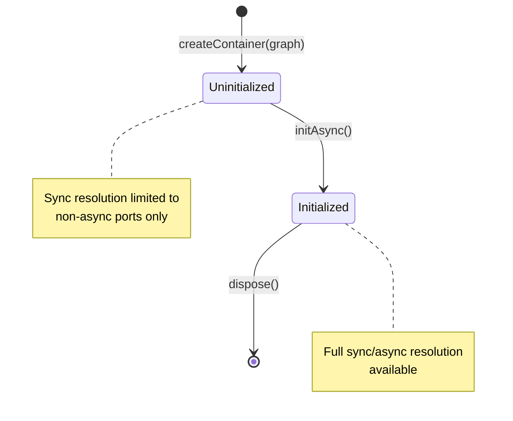
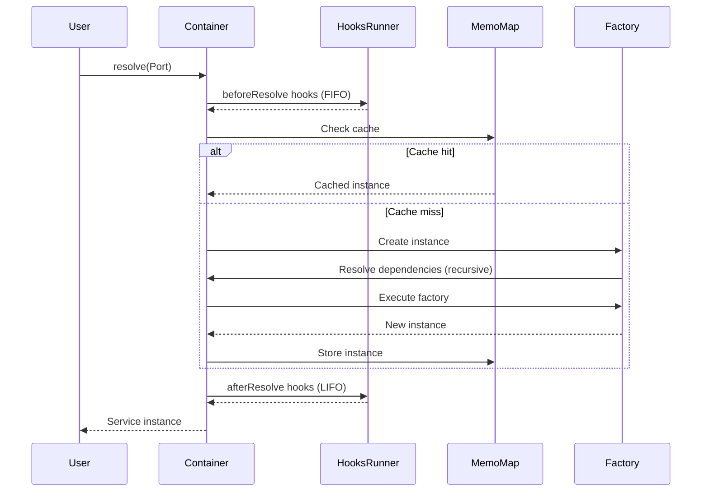
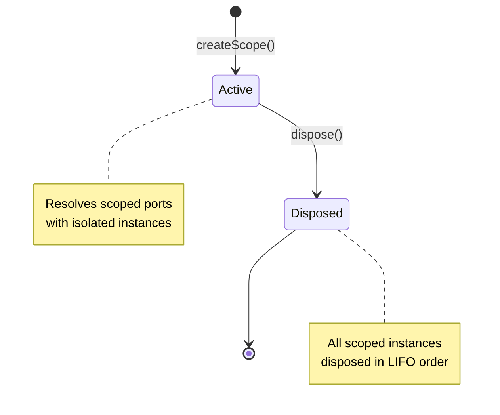

# @hex-di/runtime Architecture

This document explains the architectural design and internal structure of the `@hex-di/runtime` package.

## Hexagonal Architecture Position

`@hex-di/runtime` sits in the **Runtime Layer** of the HexDI ecosystem, between the Graph layer and framework-specific Presentation layers. Dependencies flow strictly inward.

```
┌─────────────────────────────────────────────────────────────────────┐
│                         HexDI Ecosystem                              │
├─────────────────────────────────────────────────────────────────────┤
│                                                                      │
│  ┌─────────────────────────────────────────────────────────────┐    │
│  │               PRESENTATION LAYER (Outermost)                 │    │
│  │   @hex-di/react      React hooks & context providers         │    │
│  │   @hex-di/hono       Hono framework integration              │    │
│  │   @hex-di/devtools   Browser DevTools extension              │    │
│  └─────────────────────────────────────────────────────────────┘    │
│                              │                                       │
│                              ▼                                       │
│  ┌─────────────────────────────────────────────────────────────┐    │
│  │                 RUNTIME LAYER (This Package)                 │    │◄── YOU ARE HERE
│  │   @hex-di/runtime    Container, resolution, lifecycle        │    │
│  │   @hex-di/testing    Test utilities, mock helpers            │    │
│  └─────────────────────────────────────────────────────────────┘    │
│                              │                                       │
│                              ▼                                       │
│  ┌─────────────────────────────────────────────────────────────┐    │
│  │                      GRAPH LAYER                             │    │
│  │   @hex-di/graph      Compile-time validation, graph builder  │    │
│  └─────────────────────────────────────────────────────────────┘    │
│                              │                                       │
│                              ▼                                       │
│  ┌─────────────────────────────────────────────────────────────┐    │
│  │                  PORTS LAYER (Innermost)                     │    │
│  │   @hex-di/ports      Port tokens, zero runtime dependencies  │    │
│  └─────────────────────────────────────────────────────────────┘    │
│                                                                      │
└─────────────────────────────────────────────────────────────────────┘
```

### Layer Responsibilities

| Layer            | Package            | Responsibility                                                  |
| ---------------- | ------------------ | --------------------------------------------------------------- |
| **Ports**        | `@hex-di/ports`    | Port tokens, `createPort()`, type inference utilities.          |
| **Graph**        | `@hex-di/graph`    | Compile-time validation, `GraphBuilder`, dependency graph.      |
| **Runtime**      | `@hex-di/runtime`  | Container implementation, service resolution, lifecycle.        |
| **Presentation** | `@hex-di/react`... | Framework-specific integrations (hooks, providers, middleware). |

### Dependency Rules

1. **This package depends on `@hex-di/ports` and `@hex-di/graph`**
   - Uses validated graphs from `@hex-di/graph`
   - Uses port types from `@hex-di/ports`
2. **No dependencies on outer layers** - no `@hex-di/react`, no `@hex-di/hono`
3. **Framework-agnostic** - runtime works without any framework
4. **Zero external runtime dependencies** - only dev dependencies for testing

## Package Overview

`@hex-di/runtime` provides the runtime dependency injection container that executes validated dependency graphs. Key responsibilities:

- **Service Resolution**: Resolving port tokens to service instances
- **Lifecycle Management**: Managing singleton/scoped/transient lifetimes
- **Async Initialization**: Coordinating async service startup
- **Scope Management**: Creating and disposing scoped contexts
- **Child Containers**: Supporting inheritance hierarchies
- **Override System**: Providing test doubles and configuration overrides
- **Inspection**: Runtime graph introspection for debugging
- **Tracing**: Performance monitoring and dependency tracking

## Container Lifecycle State Machine

Containers exist in one of two phases:



### Phase Details

| Phase           | Description                                  | Sync Resolution      | Async Resolution |
| --------------- | -------------------------------------------- | -------------------- | ---------------- |
| `uninitialized` | Newly created container before `initAsync()` | Non-async ports only | All ports        |
| `initialized`   | Container after successful `initAsync()`     | All ports            | All ports        |

**Why Phase-Dependent Resolution?**

Async factories (e.g., database connections) require initialization before their instances can be used synchronously. The type system enforces that:

1. Before `initAsync()`, you can only sync-resolve ports that have synchronous factories
2. After `initAsync()`, all ports can be sync-resolved (instances are cached)
3. Async resolution (`resolveAsync()`) works in any phase

This prevents runtime errors where code tries to synchronously access a service whose factory hasn't executed yet.

### Initialization Process

```typescript
// Create container - phase: 'uninitialized'
const container = createContainer({ graph, name: "App" });

// Can only sync-resolve non-async ports
const logger = container.resolve(LoggerPort); // OK - sync factory

// Attempting to sync-resolve async port would be a type error:
// const db = container.resolve(DatabasePort); // ERROR: Database has async factory

// Initialize all async factories - phase transitions to 'initialized'
await container.initAsync();

// Now can sync-resolve everything (instances are cached)
const db = container.resolve(DatabasePort); // OK - instance ready
```

## Resolution Flow

### Synchronous Resolution



### Key Aspects

1. **Hook Execution Order**:
   - `beforeResolve`: FIFO (first registered, first called)
   - `afterResolve`: LIFO (last registered, first called)
   - This follows the middleware pattern for wrapping behavior

2. **Cache (MemoMap) Behavior**:
   - Singleton: Cached at container level, shared across all scopes
   - Scoped: Cached at scope level, isolated per scope
   - Transient: Never cached, always creates new instance

3. **Recursive Resolution**:
   - Dependencies are resolved before the dependent service
   - Circular dependencies throw `CircularDependencyError` at runtime
   - Resolution depth is tracked for debugging

4. **Error Handling**:
   - Factory errors are wrapped in `FactoryError`
   - All resolution errors extend `ContainerError`
   - Errors include context (port name, factory type, stack trace)

### Asynchronous Resolution

Async resolution follows the same flow but:

- Can occur in `uninitialized` phase
- Executes async factories with `await`
- Returns `Promise<Service>` instead of `Service`
- Still respects cache for already-initialized instances

## Scope Lifecycle

Scopes are isolated caching contexts for scoped-lifetime services:



### Scope Properties

- **Parent Reference**: Each scope has a reference to its parent container
- **Isolated Cache**: Scoped services are cached per-scope, not shared
- **LIFO Disposal**: Services disposed in reverse creation order
- **Singleton Access**: Scopes can resolve singletons from parent container

### Disposal Process

When `scope.dispose()` is called:

1. Collect all disposable instances (those with `[Symbol.dispose]()` or `[Symbol.asyncDispose]()`)
2. Sort by resolution order (first resolved = last disposed)
3. Call disposal methods in LIFO order
4. Aggregate errors if multiple disposals fail
5. Mark scope as disposed (further resolutions throw)

**Why LIFO?**

Consider a database connection and a repository:

```typescript
// Resolution order: 1. Database, 2. UserRepository
const db = scope.resolve(DatabasePort);
const repo = scope.resolve(UserRepositoryPort); // depends on db
```

Disposal must be reversed: UserRepository first (might run cleanup queries), then Database (closes connection). LIFO ensures dependencies are disposed before their dependents.

## Module Organization

```
packages/runtime/src/
├── container/               # Container implementations
│   ├── base-impl.ts        #   Base container logic (resolve, hooks)
│   ├── root-impl.ts        #   Root container (createContainer)
│   ├── child-impl.ts       #   Child containers (createChild)
│   ├── factory.ts          #   Container factory functions
│   ├── override-builder.ts #   Override builder pattern
│   ├── wrappers.ts         #   Container/Scope wrapper types
│   └── wrapper-utils.ts    #   Shared wrapper utilities
├── types/                   # TypeScript type definitions
│   ├── brands.ts           #   Brand symbols (ContainerBrand, ScopeBrand)
│   ├── container.ts        #   Container type and members
│   ├── scope.ts            #   Scope type and members
│   ├── options.ts          #   Container options, phases
│   ├── inference.ts        #   Type inference utilities
│   ├── inheritance.ts      #   Child container inheritance modes
│   └── override-types.ts   #   Override system types
├── resolution/              # Resolution engine
│   ├── engine.ts           #   Sync resolution logic
│   ├── async-engine.ts     #   Async resolution logic
│   ├── hooks.ts            #   Hook type definitions
│   ├── hooks-runner.ts     #   Hook execution (FIFO/LIFO)
│   └── context.ts          #   Resolution context tracking
├── scope/                   # Scope implementation
│   └── impl.ts             #   Scope lifecycle and disposal
├── errors/                  # Error hierarchy
│   └── index.ts            #   ContainerError subclasses
├── inspection/              # Runtime introspection
│   └── ...                 #   Inspector API, snapshot generation
├── tracing/                 # Performance tracing
│   └── ...                 #   Trace collectors, enableTracing()
├── util/                    # Utilities
│   ├── memo-map.ts         #   Caching implementation
│   └── string-similarity.ts#   Levenshtein distance (error suggestions)
├── index.ts                 # Public API exports
└── internal.ts              # Internal exports (for testing)
```

### Public vs Internal Boundaries

**Public API** (exported from `index.ts`):

- `createContainer()`, `createLazyContainer()`
- `Container`, `Scope` types
- `ContainerError` hierarchy
- `inspect()`, `trace()`, `enableTracing()` functions
- Hook types (`ResolutionHooks`, contexts)
- Inspector API types

**Internal API** (exported from `internal.ts`):

- `BaseContainerImpl` - for `@hex-di/testing`
- Implementation classes (not for general use)
- Internal symbols and utilities

**Strictly Internal** (not exported):

- `MemoMap` implementation details
- Hook runner internals
- Resolution engine internals

## Key Abstractions

### Container vs ContainerImpl

**Container** is a branded interface type:

```typescript
type Container<TProvides, TExtends, TAsyncPorts, TPhase> = {
  readonly [ContainerBrand]: { TProvides; TExtends; TAsyncPorts; TPhase };
  resolve<P>(port: P): ResolvedService<P>;
  // ... other methods
};
```

**ContainerImpl** is the internal implementation:

```typescript
class BaseContainerImpl {
  // Runtime implementation - no generics
  resolve(port: Port): unknown {
    // Resolution logic
  }
}
```

This separation provides:

- **Type safety**: Branded types prevent structural compatibility
- **Zero overhead**: No runtime class hierarchy
- **Flexibility**: Implementation can change without affecting types

### Branded Types for Type Safety

The runtime uses branded types for nominal typing:

```typescript
const ContainerBrand: unique symbol = Symbol("hex-di.Container");
const ScopeBrand: unique symbol = Symbol("hex-di.Scope");
```

Why brands instead of classes?

1. **Type-level guarantees**: Container and Scope are not structurally compatible
2. **No runtime overhead**: Symbols are erased in compiled output
3. **Phase tracking**: Type parameters carry compile-time phase information
4. **Nominal typing**: Can't accidentally pass Scope where Container expected

### Phase-Dependent Resolution

Container types use a type-state pattern:

```typescript
type Container<TProvides, TExtends, TAsyncPorts, TPhase> = ...;
```

The `TPhase` parameter determines what `resolve()` accepts:

- `'uninitialized'`: Can only sync-resolve non-async ports
- `'initialized'`: Can sync-resolve all ports

This is enforced at the type level:

```typescript
resolve<P extends Port>(
  port: P
): TPhase extends 'initialized'
  ? Service<P>
  : P extends TAsyncPorts
    ? never
    : Service<P>
```

**Benefits**:

- Prevents sync access to uninitialized async services
- No runtime checks needed (zero cost)
- Clear error messages at compile time
- Type system guides correct usage

### Override Builder Pattern

The override system uses a fluent builder:

```typescript
container.override(UserServicePort).withAdapter(mockUserServiceAdapter).build();
```

**Design Goals**:

1. Type-safe: Each step validates ports exist
2. Immutable: Each step returns new builder
3. Clear: Method names express intent
4. Composable: Can chain multiple overrides

The builder validates:

- Port exists in parent graph
- Dependencies of override adapter are satisfied
- No circular dependencies introduced

See `design-decisions.md` for detailed rationale.

## Performance Characteristics

| Operation                     | Complexity | Notes                                          |
| ----------------------------- | ---------- | ---------------------------------------------- |
| Singleton resolution (cached) | O(1)       | Direct MemoMap lookup                          |
| Scoped resolution (cached)    | O(1)       | Direct MemoMap lookup                          |
| Transient resolution          | O(deps)    | Always creates new instance                    |
| Scope creation                | O(1)       | Allocates new MemoMap                          |
| Scope disposal                | O(n log n) | Sorts disposables, then disposes in LIFO order |
| Hook execution                | O(h)       | Iterates registered hooks (typically 0-3)      |

### Optimization Features

1. **Lazy Hook Execution**: When no hooks registered, hook code path is skipped entirely
2. **Optional Timestamps**: Can disable timestamp capture for production (`performance.disableTimestamps: true`)
3. **Efficient Cache**: MemoMap uses native Map for O(1) lookups
4. **Minimal Allocations**: Reuses context objects where possible

### Benchmarks

Typical resolution performance (see `packages/runtime/benchmarks/`):

- Singleton resolution: ~10,000 ops/ms (cached)
- Scoped resolution: ~8,000 ops/ms (cached)
- Transient resolution: ~2,000 ops/ms (with deps)
- Scope creation: ~50,000 ops/ms
- Scope disposal: ~10,000 ops/ms

## Container Hierarchies

### Root Containers

Created via `createContainer()`:

- Independent graph
- No parent
- Cannot access services from other roots

### Child Containers

Created via `container.createChild()`:

- Inherits parent's ports
- Can add new ports via child graph
- Three inheritance modes per port:
  - `shared`: Use parent's singleton instance (default)
  - `forked`: Snapshot copy from parent
  - `isolated`: Fresh instance in child

**Use Cases**:

- Feature modules with isolated configuration
- Multi-tenancy (one child per tenant)
- A/B testing (different configurations)

### Scopes

Created via `container.createScope()`:

- Isolated cache for scoped-lifetime services
- Share singleton instances with parent
- Disposable (LIFO cleanup)

**Use Cases**:

- HTTP request scopes (one per request)
- Background jobs (one per job)
- User sessions (one per session)

## Extension Points

### Resolution Hooks

Hooks enable instrumentation without modifying core logic:

```typescript
const hooks: ResolutionHooks = {
  beforeResolve: ctx => {
    console.log(`Resolving ${ctx.portName}`);
  },
  afterResolve: ctx => {
    if (ctx.error) {
      console.error(`Failed: ${ctx.portName}`, ctx.error);
    }
  },
};
```

Hooks are used by:

- `@hex-di/devtools`: Visualizing resolution
- Tracing system: Performance monitoring
- Testing: Spying on resolutions

### Inspector API

Provides runtime introspection:

```typescript
const inspector = container.inspector;
const snapshot = inspector.getSnapshot();

snapshot.singletons.forEach(entry => {
  console.log(`${entry.portName}: resolved at ${entry.resolvedAt}`);
});
```

Used for:

- DevTools integration
- Debugging (what's cached?)
- Testing assertions

### Tracing System

Built-in performance monitoring:

```typescript
import { enableTracing, trace } from "@hex-di/runtime";

enableTracing(container);
container.resolve(UserServicePort);

const traces = trace.getTraces();
traces.forEach(t => {
  console.log(`${t.portName}: ${t.duration}ms at depth ${t.depth}`);
});
```

## References

- [Container API Documentation](../src/types/container.ts)
- [Scope API Documentation](../src/types/scope.ts)
- [Resolution Hooks Documentation](../src/resolution/hooks.ts)
- [Error Types Documentation](../src/errors/index.ts)
- [@hex-di/graph Architecture](../../graph/ARCHITECTURE.md)
