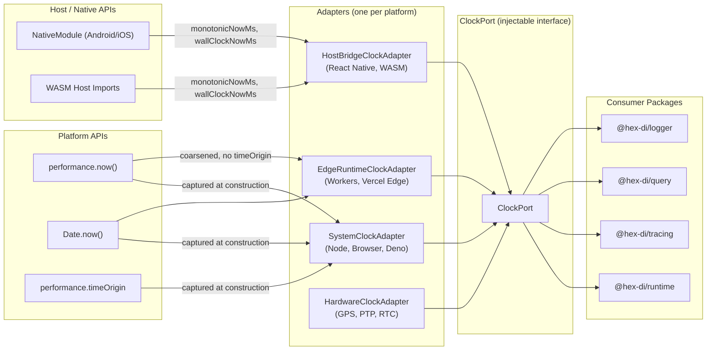
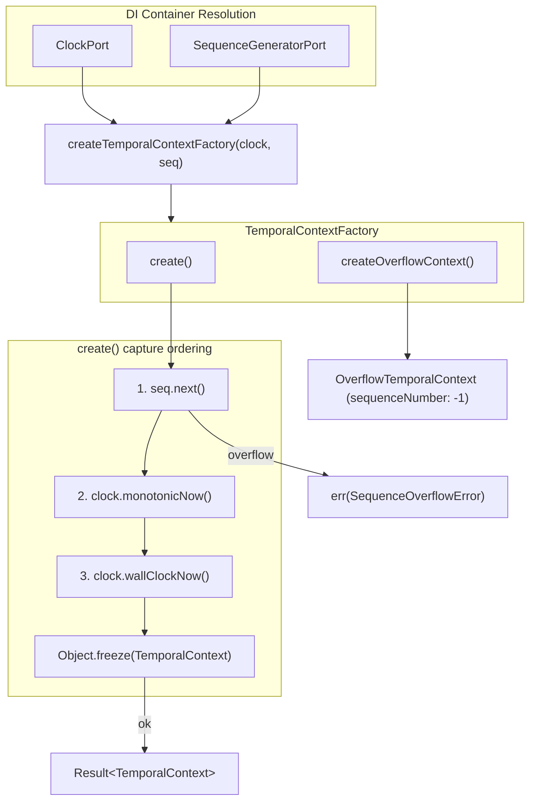
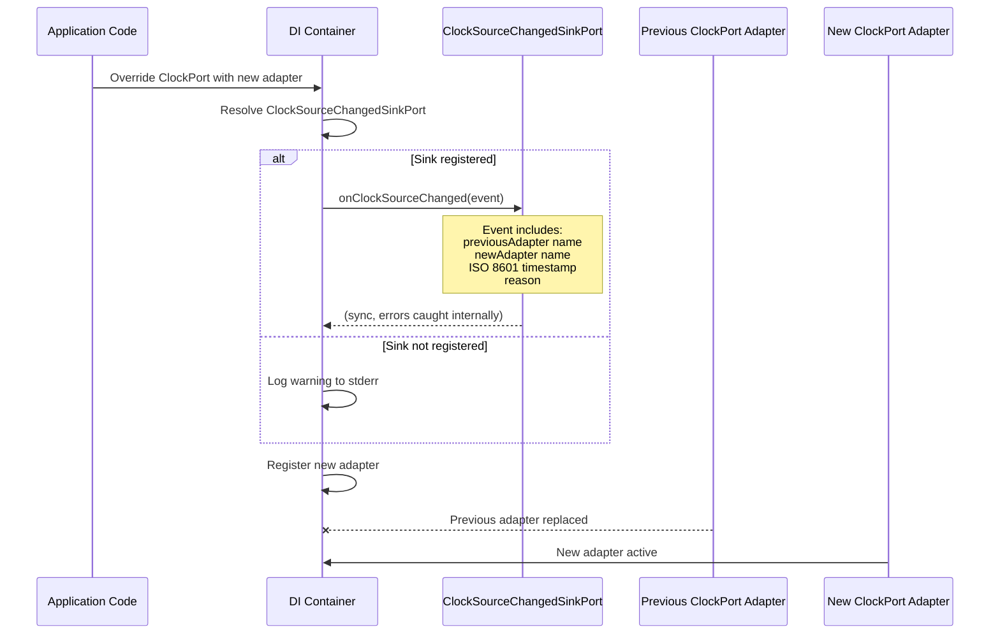

# 01 - Overview

## 1.1 Overview

`@hex-di/clock` is a foundational package providing injectable clock and sequence generation abstractions for the HexDI ecosystem.

### Problem

The HexDI monorepo currently has **three independent timing implementations** and multiple raw `Date.now()` call sites:

| Package           | Function                | Mechanism                                                 |
| ----------------- | ----------------------- | --------------------------------------------------------- |
| `@hex-di/runtime` | `monotonicNow()`        | `performance.now()` with `Date.now()` fallback            |
| `@hex-di/tracing` | `getHighResTimestamp()` | `perf.timeOrigin + perf.now()` with `Date.now()` fallback |
| `@hex-di/query`   | `Clock` interface       | `Date.now()` (injectable)                                 |
| `@hex-di/logger`  | raw `Date.now()`        | not injectable                                            |
| `@hex-di/saga`    | raw `Date.now()`        | not injectable                                            |
| `@hex-di/store`   | raw `Date.now()`        | not injectable                                            |

This fragmentation creates three issues:

1. **GxP non-compliance.** GxP environments require a configurable, NTP-synchronized clock source. With six independent timing call sites, there is no single point of configuration. Deploying an NTP-validated clock requires patching each package individually.

2. **Inconsistent behavior.** Some packages use monotonic time (immune to NTP jumps), others use wall-clock time (subject to clock adjustments). The inconsistency makes cross-package event correlation unreliable.

3. **Untestable timing.** Only `@hex-di/query` has an injectable clock interface. All other packages use hardcoded `performance.now()` or `Date.now()` calls, making deterministic time-dependent testing impossible without Vitest fake timers.

### Solution

A single `@hex-di/clock` package that provides:

- **`ClockPort`** -- an injectable port with three time functions covering all use cases (monotonic, wall-clock, high-resolution), returning branded timestamp types for compile-time domain safety.
- **`SequenceGeneratorPort`** -- an injectable monotonically-increasing counter for event ordering, decoupled from time precision.
- **`TimerSchedulerPort`** -- an injectable port for scheduling future work (`setTimeout`, `setInterval`, `sleep`), enabling deterministic timer testing via DI.
- **`CachedClockPort`** -- a structurally separate port for high-throughput scenarios where clock read overhead matters, with explicit staleness semantics.
- **`SystemClockAdapter`** -- a default adapter using platform APIs (`performance.now()`, `Date.now()`) with cross-platform detection.
- **`VirtualClockAdapter`** -- a test adapter with manual time control, auto-advance, and linked timer scheduling for deterministic testing.

All HexDI packages migrate to consume `ClockPort` instead of their local implementations.

## 1.2 Design Principles

### Port-First

The clock is defined as a port (interface), not as a concrete implementation. Consumers depend on the port; adapters provide the implementation. This enables:

- Swapping the system clock for a virtual clock in tests.
- Swapping the system clock for an NTP-validated clock in GxP deployments.
- Swapping the system clock for a simulated clock in replay/debugging scenarios.

### Three Time Functions, Three Use Cases

Not all time is the same:

| Function         | Returns                     | Use Case                                        | NTP-Immune |
| ---------------- | --------------------------- | ----------------------------------------------- | ---------- |
| `monotonicNow()` | Relative milliseconds       | Duration measurement, ordering within a process | Yes        |
| `wallClockNow()` | Epoch milliseconds          | Calendar timestamps, cross-process correlation  | No         |
| `highResNow()`   | Epoch milliseconds (sub-ms) | Tracing spans, high-precision audit timestamps  | No         |

Consumers choose the function that matches their semantic need.

### Sequence Numbers Are Not Clocks

The `SequenceGeneratorPort` is deliberately separate from `ClockPort`. Sequence numbers provide **total ordering** within a scope, independent of time precision. Even if two events share the same monotonic timestamp (due to platform-coarsened resolution), their sequence numbers are always distinct.

### Result-Based Error Handling

All fallible operations in `@hex-di/clock` return `Result<T, E>` from `@hex-di/result` instead of throwing exceptions. Factory functions that can fail at startup (`createSystemClock()`), sequence operations that can overflow (`next()`), and control functions that reject invalid input (`advance()` with negative values) all communicate failure through `err()` values. This eliminates try/catch in consumer code and makes error paths explicit at the type level.

### Zero-Cost When Unused

The package has no side effects, no global state, and no initialization cost beyond adapter construction. Packages that import only the port type pay zero runtime cost.

## 1.3 Data Flow Diagrams

### Platform API → Adapter → ClockPort → Consumer



### TemporalContextFactory Composition



### Clock Source Override with Audit Event



## 1.4 Package Structure

```
packages/clock/
  src/
    ports/
      clock.ts              # ClockPort interface, branded timestamp types (MonotonicTimestamp, WallClockTimestamp, HighResTimestamp)
      sequence.ts           # SequenceGeneratorPort interface (no reset())
      diagnostics.ts        # ClockDiagnosticsPort interface (GxP source attestation)
      timer-scheduler.ts    # TimerSchedulerPort interface, TimerHandle
      cached-clock.ts       # CachedClockPort, CachedClockLifecycle, CachedClockAdapter interfaces
      index.ts              # Port re-exports
    branded.ts              # asMonotonic(), asWallClock(), asHighRes() branding utility functions
    temporal-context.ts     # TemporalContext, OverflowTemporalContext, TemporalContextFactory (utility, not port)
    signature-validation.ts # validateSignableTemporalContext(), SignatureValidationError (21 CFR 11.50 enforcement)
    deserialization.ts      # deserializeTemporalContext(), deserializeOverflowTemporalContext(), deserializeClockDiagnostics()
    record-integrity.ts     # computeTemporalContextDigest(), verifyTemporalContextDigest() (SHA-256 per-record integrity)
    gxp-metadata.ts         # getClockGxPMetadata(), ClockGxPMetadata (clock version identification)
    adapters/
      system-clock.ts       # SystemClockAdapter (default) + ClockDiagnosticsPort + ClockCapabilities
      system-timer.ts       # SystemTimerScheduler (default TimerSchedulerPort adapter)
      cached-clock.ts       # SystemCachedClock (default CachedClockAdapter)
      edge-runtime-clock.ts # EdgeRuntimeClockAdapter (Workers, Vercel Edge) + ClockDiagnosticsPort
      host-bridge-clock.ts  # HostClockBridge adapter (React Native, WASM, embedded)
      index.ts              # Adapter re-exports
    events/
      clock-source-changed.ts  # ClockSourceChangedEvent (adapter swap audit event)
    testing/
      virtual-clock.ts      # VirtualClockAdapter (with auto-advance support)
      virtual-sequence.ts   # VirtualSequenceGenerator (has reset())
      virtual-timer.ts      # VirtualTimerScheduler (linked to VirtualClockAdapter)
      virtual-cached-clock.ts # VirtualCachedClock (deterministic cached clock)
      index.ts              # Testing re-exports
    index.ts                # Public API surface
  tests/
    clock-port.test.ts
    clock-port.test-d.ts
    sequence-generator.test.ts
    sequence-generator.test-d.ts
    system-clock.test.ts
    system-clock.test-d.ts
    system-clock-startup.test.ts
    system-clock-fallback.test.ts
    virtual-clock.test.ts
    virtual-sequence.test.ts
    clock-diagnostics.test.ts
    clock-diagnostics.test-d.ts
    temporal-context.test.ts
    temporal-context.test-d.ts
    signature-validation.test.ts
    signature-validation.test-d.ts
    deserialization.test.ts
    deserialization.test-d.ts
    record-integrity.test.ts
    record-integrity.test-d.ts
    graph-integration.test.ts
    graph-integration.test-d.ts
    clock-source-change.test.ts
    clock-source-change.test-d.ts
    clock-source-bridge.test.ts
    clock-source-bridge.test-d.ts
    gxp-metadata.test.ts
    gxp-metadata.test-d.ts
    hardware-clock.test-d.ts
    branded-timestamps.test.ts        # DoD 17: branded type runtime + unit tests
    branded-timestamps.test-d.ts      # DoD 17: branded type compile-time tests
    system-timer.test.ts              # DoD 18: SystemTimerScheduler tests
    system-timer.test-d.ts            # DoD 18: SystemTimerScheduler type tests
    virtual-timer.test.ts             # DoD 19-20: VirtualTimerScheduler tests (incl. blockUntil)
    virtual-timer.test-d.ts           # DoD 19-20: VirtualTimerScheduler type tests
    cached-clock.test.ts              # DoD 21-22: CachedClock system + virtual tests
    cached-clock.test-d.ts            # DoD 21-23: CachedClock type tests
    clock-capabilities.test.ts        # DoD 24: ClockCapabilities tests
    clock-capabilities.test-d.ts      # DoD 24: ClockCapabilities type tests
    edge-runtime-clock.test.ts        # DoD 25: EdgeRuntimeClockAdapter tests
    edge-runtime-clock.test-d.ts      # DoD 25: EdgeRuntimeClockAdapter type tests
    host-bridge-clock.test.ts         # DoD 26: HostClockBridge adapter tests
    host-bridge-clock.test-d.ts       # DoD 26: HostClockBridge type tests
    gxp-clock.test.ts
    gxp-iq-clock.test.ts
    gxp-oq-clock.test.ts
    gxp-pq-clock.test.ts
  package.json
  tsconfig.json
  vitest.config.ts
```

### Export Map

```json
{
  ".": "./src/index.ts",
  "./testing": "./src/testing/index.ts"
}
```

The `./testing` entry point provides `VirtualClockAdapter`, `VirtualSequenceGenerator`, `VirtualTimerScheduler`, `VirtualCachedClock`, `ClockTimeoutError`, and associated factories without polluting the main entry point with test utilities.

## 1.5 Quick Start

### 30-Second Setup

```typescript
import { GraphBuilder } from "@hex-di/graph";
import { createContainer } from "@hex-di/runtime";
import { ClockPort, SystemClockAdapter, SystemSequenceGeneratorAdapter } from "@hex-di/clock";

const graph = GraphBuilder.create()
  .provide(SystemClockAdapter)
  .provide(SystemSequenceGeneratorAdapter)
  .build();

const container = createContainer({ graph, name: "App" });
const clock = container.resolve(ClockPort);

clock.wallClockNow();   // epoch ms (for timestamps)
clock.monotonicNow();   // relative ms (for durations)
clock.highResNow();     // epoch ms, sub-ms precision (for tracing)
```

### Measure a Duration

```typescript
const start = clock.monotonicNow();
await doWork();
const elapsed = clock.monotonicNow() - start; // number (ms)
```

### Create an Audit Timestamp

```typescript
import { createTemporalContextFactory, SequenceGeneratorPort } from "@hex-di/clock";

const seq = container.resolve(SequenceGeneratorPort);
const factory = createTemporalContextFactory(clock, seq);

const ctx = factory.create(); // Result<TemporalContext, SequenceOverflowError>
if (ctx.isOk()) {
  console.log(ctx.value);
  // { sequenceNumber: 1, monotonicTimestamp: ..., wallClockTimestamp: ... }
}
```

### Test with Deterministic Time

```typescript
import { createVirtualClock, createVirtualSequenceGenerator } from "@hex-di/clock/testing";

const clock = createVirtualClock();
clock.monotonicNow(); // 0
clock.advance(100);
clock.monotonicNow(); // 100

const seq = createVirtualSequenceGenerator();
seq.next(); // ok(1)
seq.next(); // ok(2)
seq.reset(); // back to 0 (testing only)
```

### Schedule Timers (Testable)

```typescript
import { SystemTimerSchedulerAdapter, TimerSchedulerPort } from "@hex-di/clock";

const graph = GraphBuilder.create()
  .provide(SystemClockAdapter)
  .provide(SystemSequenceGeneratorAdapter)
  .provide(SystemTimerSchedulerAdapter)
  .build();

const container = createContainer({ graph, name: "App" });
const timer = container.resolve(TimerSchedulerPort);

const handle = timer.setTimeout(() => console.log("fired"), 1000);
timer.clearTimeout(handle);
await timer.sleep(500); // Promise-based delay
```

### Progressive API Tiers

`@hex-di/clock` exports are organized into three tiers (see §8 API Reference for the full classification):

| Tier | Audience | Key Exports |
|------|----------|-------------|
| **Tier 1 — Essential** | All consumers | `ClockPort`, `SequenceGeneratorPort`, `SystemClockAdapter`, `SystemSequenceGeneratorAdapter`, `createVirtualClock`, `createVirtualSequenceGenerator` |
| **Tier 2 — Extended** | Timer/cache/platform consumers | `TimerSchedulerPort`, `CachedClockPort`, `SystemTimerSchedulerAdapter`, `SystemCachedClockAdapter`, `EdgeRuntimeClockAdapter`, `createHostBridgeClockAdapter` |
| **Tier 3 — GxP & Advanced** | Regulated/audit environments | `ClockDiagnosticsPort`, `TemporalContextFactory`, `SignableTemporalContext`, record integrity functions, deserialization, retention utilities |

Most consumers only need Tier 1. Start there.
