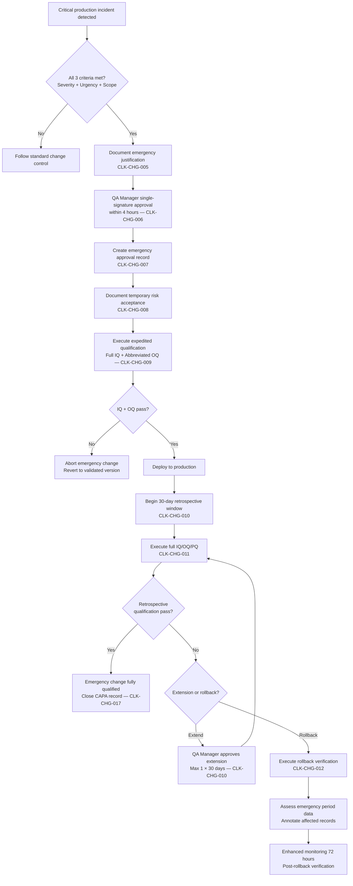

# 6.3 Verification and Change Control — GxP Compliance

> **Part of:** [GxP Compliance (§6)](./README.md) | **Previous:** [§6.2 Qualification Protocols](./02-qualification-protocols.md) | **Next:** [§6.4 Resolution and Precision](./04-resolution-and-precision.md)

> For the generic change control framework, see [../../cross-cutting/gxp/08-change-control.md](../../cross-cutting/gxp/08-change-control.md). This section contains clock-specific change control and verification requirements.

### Periodic Adapter Integrity Verification (EU GMP Annex 11, Section 11)

Annex 11, Section 11 requires periodic evaluation of computerized systems to confirm they remain in a validated state. `@hex-di/clock` provides one-time diagnostics via `ClockDiagnosticsPort.getDiagnostics()` at construction time. Periodic runtime verification of adapter integrity (adapter name consistency, freeze status, monotonicity heartbeat) is the responsibility of the ecosystem's GxP monitoring infrastructure.

Without ecosystem monitoring infrastructure, no periodic integrity checks are performed. GxP deployments MUST deploy ecosystem GxP monitoring infrastructure to satisfy Annex 11, Section 11 periodic evaluation requirements.

### Change Control Requirements (21 CFR 11.10(k)(2), EU GMP Annex 11 Section 10)

21 CFR 11.10(k)(2) requires adequate controls over systems documentation, including revision and change control procedures. EU GMP Annex 11, Section 10 requires that changes to computerized systems be made in a controlled manner. The following change control requirements apply to `@hex-di/clock` in GxP deployments.

REQUIREMENT (CLK-CHG-001): GxP deployments MUST use exact version pinning for `@hex-di/clock` in their package manager lockfile. Semver ranges (`^`, `~`, `>=`) MUST NOT be used. The exact validated version MUST be recorded in the computerized system validation plan.

REQUIREMENT (CLK-CHG-002): Version upgrades of `@hex-di/clock` MUST require documented QA approval before deployment. The approval record MUST include: the current validated version, the target version, the changelog review outcome, and the approver's signature.

REQUIREMENT (CLK-CHG-003): After any `@hex-di/clock` version upgrade, the full IQ/OQ/PQ protocol MUST be re-executed on all deployment targets. Partial re-qualification is NOT acceptable — the entire validation suite MUST pass before the upgraded version enters GxP production use.

REQUIREMENT (CLK-CHG-004): GxP organizations MUST maintain configuration management documentation that records the validated version of `@hex-di/clock`, the deployment targets where it is validated, and the date of last qualification for each target.

**Re-qualification triggers:** The following changes MUST trigger full IQ/OQ/PQ re-execution:

- `@hex-di/clock` version upgrade (including patch versions)
- Platform upgrade (Node.js runtime version, OS version)
- Hardware change on deployment target (CPU, memory configuration)
- NTP configuration change (server addresses, drift thresholds, leap smear settings)
- Container graph changes affecting `ClockPort`, `SequenceGeneratorPort`, or `ClockDiagnosticsPort` registrations
- Ecosystem GxP monitoring adapter version upgrade (when deployed alongside `@hex-di/clock`)

**Rationale:** Even patch-level version changes may alter timing behavior (e.g., a fix to the clamped fallback changes monotonic precision characteristics). Full re-qualification ensures that no behavioral regression is introduced silently. The cost of re-qualification is justified by the high impact rating of `wallClockNow()` and `highResNow()` in the GAMP 5 risk classification.

### Emergency Change Control Procedure (21 CFR 11.10(k)(2), EU GMP Annex 11 Section 10)

The standard change control process above requires full IQ/OQ/PQ re-qualification before any version change enters GxP production. While this is appropriate for planned changes, it does not account for critical production incidents requiring urgent clock library updates (e.g., a security vulnerability in the timing API, a data integrity defect producing incorrect timestamps, or a platform-level CVE affecting `performance.now()`).

Without an emergency change procedure, organizations would be forced to choose between operational safety (applying the critical patch immediately) and regulatory compliance (completing full re-qualification first). This procedure provides a controlled expedited path that maintains regulatory defensibility.

#### Emergency Change Process Flow

#### Emergency Change Criteria

A change qualifies for the emergency procedure when **all** of the following conditions are met:

1. **Severity:** The issue poses an immediate risk to one or more of:
   - Patient safety (e.g., corrupted dosing timestamps in batch records)
   - Data integrity (e.g., a defect producing duplicate sequence numbers or falsified timestamps)
   - System security (e.g., CVE with CVSS score >= 7.0 affecting clock infrastructure)
2. **Urgency:** The risk cannot be acceptably mitigated by operational workarounds (e.g., manual timestamp recording, process suspension) for the duration of standard change control.
3. **Scope:** The change is limited to `@hex-di/clock` and/or its direct ecosystem dependencies (clock-related monitoring components). Changes affecting multiple unrelated packages do not qualify for this expedited procedure.

REQUIREMENT (CLK-CHG-005): The determination that a change qualifies as an emergency MUST be documented with a written justification addressing all three criteria above, signed by the QA Manager (or designee with documented delegation authority).

#### Expedited Approval Authority

| Standard Change                          | Emergency Change                                           |
| ---------------------------------------- | ---------------------------------------------------------- |
| QA Lead approval + full review committee | QA Manager single-signature approval                       |
| Full changelog review                    | Targeted review of the specific fix and its impact surface |
| No time constraint                       | Decision within 4 hours of emergency declaration           |

REQUIREMENT (CLK-CHG-006): Emergency change approval MUST be granted by the QA Manager or a pre-designated QA delegate. The delegation MUST be documented in advance (not at the time of the emergency) and the delegate MUST have equivalent qualification to the QA Manager for clock infrastructure assessment.

REQUIREMENT (CLK-CHG-007): The emergency approval record MUST include:

1. Emergency justification (referencing the three criteria above)
2. Current validated version and target version
3. Description of the specific defect or vulnerability being addressed
4. Assessment of the change's impact on timing behavior (does it affect monotonicity, precision, sequence generation, or startup self-test behavior?)
5. Approver signature and timestamp
6. Risk acceptance statement (see below)

#### Temporary Risk Acceptance

When an emergency change is deployed before full re-qualification, the organization accepts a temporary residual risk: the new version has not been validated to the same standard as the previous version. This risk MUST be documented and time-bounded.

REQUIREMENT (CLK-CHG-008): The emergency approval record MUST include a risk acceptance statement documenting:

1. The specific validation gaps (e.g., "OQ and PQ protocols not yet executed on production hardware")
2. The interim mitigations in place (e.g., "increased monitoring adapter frequency from 60s to 10s", "manual audit trail review every 4 hours")
3. The maximum acceptable duration of temporary risk acceptance (see Retrospective Qualification below)
4. The fallback plan if the emergency change introduces a regression (version rollback procedure per standard change control)

#### Expedited Qualification

Emergency changes MUST complete a minimum expedited qualification before deployment:

| Protocol      | Standard Change | Emergency Change                                                                                                                          |
| ------------- | --------------- | ----------------------------------------------------------------------------------------------------------------------------------------- |
| IQ (30 steps) | Full            | Full (all 30 steps)                                                                                                                       |
| OQ (8 steps)  | Full            | IQ + abbreviated OQ: OQ-1 (monotonicity, 10,000 calls instead of 1,000,000) and OQ-3 (sequence uniqueness, 1,000 calls instead of 10,000) |
| PQ (5 steps)  | Full            | Deferred to retrospective qualification                                                                                                   |

REQUIREMENT (CLK-CHG-009): Emergency changes MUST pass the full IQ protocol and the abbreviated OQ protocol before production deployment. PQ is deferred but MUST be completed within the retrospective qualification window.

#### Retrospective Full Qualification Window

REQUIREMENT (CLK-CHG-010): Full IQ/OQ/PQ re-qualification MUST be completed within **30 calendar days** of emergency deployment. If retrospective qualification is not completed within 30 days, the organization MUST either:

1. Revert to the last fully qualified version, or
2. Extend the temporary risk acceptance with a new risk assessment and QA Manager approval (maximum one 30-day extension; a second extension requires escalation to the Quality Director or equivalent)

If PQ cannot be completed within the 30-day window (e.g., due to scheduling constraints, environment unavailability, or PQ failure requiring root cause investigation and re-execution), the organization MUST document an extension request with: (a) the reason PQ could not be completed on schedule, (b) the revised target completion date, (c) interim risk mitigation measures in effect during the extension period (e.g., enhanced monitoring frequency, manual audit trail review, restricted production scope), and (d) QA Manager approval signature. The extension request MUST be filed before the 30-day window expires. If PQ fails during the retrospective window, the failure MUST be investigated per the standard deviation management SOP before re-execution; the investigation time counts against the 30-day window (or extension window if granted).

REQUIREMENT (CLK-CHG-011): The retrospective qualification MUST use the standard (non-abbreviated) IQ/OQ/PQ protocols. Abbreviated OQ results from the emergency deployment MAY be referenced as supporting evidence but do not replace the full protocol execution.

#### Rollback Verification Procedure

If retrospective qualification fails and rollback to the last fully qualified version is required, the rollback itself MUST be verified to ensure no data corruption occurred during the emergency period and the previously validated version is restored correctly.

REQUIREMENT (CLK-CHG-012): When executing a version rollback after a failed retrospective qualification, the organization MUST complete the following verification steps:

1. **Full IQ on the previous version:** Execute the complete IQ protocol (all 30 steps) on the rollback target version to confirm the previously validated version is correctly installed on all deployment targets. This verifies that the rollback restored the exact validated version and not an intermediate or corrupted state.

2. **Abbreviated OQ for data integrity verification:** Execute OQ-1 (monotonicity, 10,000 calls), OQ-3 (sequence uniqueness, 1,000 calls), and OQ-6 (GxP mode rejection) to verify that no timing behavior corruption occurred during the emergency period. This abbreviated OQ is specifically scoped to detect data integrity issues, not to re-qualify operational performance (which was already qualified for the previous version).

3. **QA-approved rollback decision:** The rollback decision MUST be documented with QA Manager approval, including: (a) the reason the retrospective qualification failed, (b) the emergency version being rolled back from, (c) the validated version being rolled back to, (d) the date and time of the rollback execution, and (e) the name of the person executing the rollback.

4. **Emergency period data assessment:** The organization MUST assess whether audit trail records generated during the emergency period (between emergency deployment and rollback) require annotation. If the retrospective qualification failed due to a behavioral regression (e.g., incorrect timestamps, non-monotonic values), all audit trail records generated during the emergency period MUST be annotated with a data integrity note indicating the records were produced by a version that subsequently failed qualification. The annotation MUST include: the affected time window, the nature of the qualification failure, and a risk assessment of the affected records' reliability.

5. **Post-rollback monitoring:** After rollback, the organization MUST implement enhanced monitoring (RECOMMENDED: monitoring adapter frequency increased to 10-second intervals) for a minimum of 72 hours to confirm the rolled-back version is operating correctly.

REQUIREMENT (CLK-CHG-013): Rollback verification evidence (IQ results, abbreviated OQ results, QA approval, data assessment, monitoring logs) MUST be retained as part of the emergency change record and made available for regulatory inspection.

#### Rollback Verification Test Cases

The following test cases verify each step of the rollback verification procedure. GxP organizations MUST execute these as part of any version rollback after a failed retrospective qualification.

| Test ID | Rollback Step | Test Procedure | Expected Outcome | Pass Criteria |
|---|---|---|---|---|
| RB-1 | Step 1: Full IQ on previous version | Execute IQ-1 through IQ-30 on the rolled-back version on all deployment targets. | All 30 IQ steps pass. The rolled-back version matches the previously validated version exactly. | 30/30 IQ steps pass. No deviations. `APPROVAL_RECORD.json` `specRevision` matches pre-emergency value. |
| RB-2 | Step 2: Abbreviated OQ — monotonicity | Execute OQ-1 with 10,000 calls on the rolled-back version. | All 10,000 monotonic reads are non-regressing. No data integrity corruption from the emergency period. | Zero regressions detected. Mean monotonic delta consistent with pre-emergency baseline (within 10%). |
| RB-3 | Step 2: Abbreviated OQ — sequence uniqueness | Execute OQ-3 with 1,000 calls. | All 1,000 sequence numbers are unique and strictly increasing. | Zero duplicates. Sequence starts from 1 (fresh generator after rollback restart). |
| RB-4 | Step 2: Abbreviated OQ — GxP mode | Execute OQ-6 (GxP mode rejection). | GxP mode correctly rejects unfrozen platform APIs and accepts frozen APIs. | OQ-6 passes on all deployment targets. |
| RB-5 | Step 3: QA-approved rollback decision | Verify QA Manager approval document contains all 5 required fields (reason, emergency version, validated version, date/time, executor). | All fields present and signed. | Document review: all 5 fields populated with valid content. |
| RB-6 | Step 4: Emergency period data assessment | Query audit trail for records generated between emergency deployment and rollback timestamps. Run `verifyTemporalContextDigest()` on all records. | Affected records identified and integrity verified or annotated. | All records within the emergency window processed. If qualification failure was behavioral: 100% of records annotated with data integrity note. |
| RB-7 | Step 5: Post-rollback monitoring | Verify enhanced monitoring (10-second intervals) is active. Collect 72 hours of monitoring data. | No anomalies detected during the 72-hour monitoring period. | Zero L2+ incidents during monitoring window. Monitoring heartbeat log shows continuous 10-second checks. |

#### Post-Emergency Review

REQUIREMENT (CLK-CHG-014): Within **14 calendar days** of emergency deployment, the organization MUST conduct a post-emergency review addressing:

1. **Root cause analysis:** What caused the defect or vulnerability? Could it have been detected earlier?
2. **Detection gap assessment:** Why was the issue not caught by existing IQ/OQ/PQ protocols, FMEA analysis, or ecosystem monitoring? Does the FMEA need updating?
3. **Process improvement:** What changes to development, testing, or deployment processes would prevent recurrence?
4. **Emergency procedure assessment:** Was the emergency change procedure itself adequate? Are improvements needed?
5. **Deviation documentation:** The emergency change MUST be documented as a quality deviation per the organization's deviation management SOP, with corrective and preventive actions (CAPA) assigned and tracked to closure.

REQUIREMENT (CLK-CHG-015): The post-emergency review record MUST be retained as part of the computerized system validation plan and made available for regulatory inspection.

#### CAPA Closeout Criteria (21 CFR 211.192, ICH Q10)

Corrective and Preventive Actions (CAPAs) assigned during the post-emergency review MUST be tracked to closure using objective, verifiable criteria. A CAPA that remains open indefinitely represents an uncontrolled quality risk. The following closeout criteria define the minimum evidence required before a CAPA may be closed.

REQUIREMENT (CLK-CHG-016): Each CAPA assigned during the post-emergency review MUST satisfy **all** of the following closeout criteria before it may be marked as closed:

| Criterion                       | Evidence Required                                                                                                                                                                                                                                                                                                                                                                                                      | Verified By              |
| ------------------------------- | ---------------------------------------------------------------------------------------------------------------------------------------------------------------------------------------------------------------------------------------------------------------------------------------------------------------------------------------------------------------------------------------------------------------------- | ------------------------ |
| **Root cause addressed**        | The corrective action directly addresses the root cause identified in the post-emergency review. Documentation MUST demonstrate a causal link between the root cause and the corrective action, not merely a temporal correlation.                                                                                                                                                                                     | QA Reviewer              |
| **Implementation verified**     | The corrective action has been implemented in the codebase, infrastructure, or organizational procedure. For code changes: the relevant commit SHA, the affected files, and the test results MUST be documented. For procedural changes: the updated SOP version and effective date MUST be documented.                                                                                                                | CAPA Owner + QA Reviewer |
| **Effectiveness confirmed**     | Evidence demonstrates that the corrective action prevents recurrence of the original failure mode. Acceptable evidence includes: (a) updated test cases that would have detected the original defect, with passing results; (b) updated FMEA with revised RPN reflecting the new mitigation; (c) a monitoring period (minimum 30 days) with no recurrence of the failure mode.                                         | QA Reviewer              |
| **Preventive action validated** | If a preventive action was assigned (addressing systemic process gaps beyond the immediate incident), it has been implemented and validated. For process changes: evidence that the updated process was followed for at least one subsequent change cycle. For detection improvements: evidence that the new detection mechanism is operational (e.g., new test case added to CI, new monitoring adapter check enabled). | QA Reviewer              |
| **Regression testing passed**   | The full IQ/OQ/PQ protocol passes on all deployment targets after the corrective action is applied. This may be satisfied by the retrospective full qualification (see Retrospective Full Qualification Window above) if the corrective action was part of the emergency change.                                                                                                                                       | GxP Validation Engineer  |
| **Documentation complete**      | The CAPA record includes: CAPA ID, description, assigned owner, assigned date, root cause reference, corrective action description, preventive action description (if applicable), implementation evidence, effectiveness evidence, closeout date, and closeout approver signature.                                                                                                                                    | QA Reviewer              |

REQUIREMENT (CLK-CHG-017): CAPA closeout MUST be approved by the QA Reviewer role (see ./10-personnel-and-access-control.md). The CAPA owner CANNOT self-approve closeout — independent review is required to prevent bias in effectiveness assessment.

REQUIREMENT (CLK-CHG-018): CAPAs MUST be closed within **90 calendar days** of assignment. If a CAPA cannot be closed within 90 days, the CAPA owner MUST provide a written justification to the QA Manager, including: the reason for delay, a revised target closeout date, and interim mitigations in place to control the residual risk. The QA Manager MUST approve the extension in writing. A maximum of one 90-day extension is permitted; CAPAs exceeding 180 days MUST be escalated to the Quality Director or equivalent for disposition.

REQUIREMENT (CLK-CHG-019): Closed CAPA records MUST be retained as part of the computerized system validation plan for the same duration as the audit trail records they relate to (see ./05-alcoa-mapping.md, Data Archival and Backup Requirements) and made available for regulatory inspection.

REQUIREMENT (CLK-CHG-020): The FMEA risk analysis (./11-fmea-risk-analysis.md) MUST be reviewed and updated as part of CAPA closeout whenever the corrective or preventive action changes a failure mode's severity, occurrence, or detection score. The updated FMEA MUST be approved by the QA Reviewer before the CAPA is marked as closed.

#### CAPA Record Template

Organizations implementing the emergency change control procedure for the first time may use the following template structure for CAPA records. This template satisfies the documentation requirements defined in the closeout criteria above and the post-emergency review requirements.

REQUIREMENT (CLK-CHG-021): GxP organizations MAY adapt this template to fit their quality management system, but MUST retain all fields marked as mandatory. Additional fields MAY be added.

| Field | Mandatory | Description |
| --- | --- | --- |
| **CAPA ID** | Yes | Unique identifier (e.g., `CAPA-CLK-YYYY-NNN`) |
| **Emergency Change Reference** | Yes | The emergency approval record ID that triggered this CAPA |
| **Date Opened** | Yes | Date the CAPA was assigned during the post-emergency review |
| **CAPA Owner** | Yes | Name and role of the person responsible for implementing the CAPA |
| **Root Cause Reference** | Yes | Reference to the root cause analysis from the post-emergency review (section number or document ID) |
| **Root Cause Summary** | Yes | Brief description of the root cause identified |
| **Corrective Action Description** | Yes | Specific action to address the root cause. MUST include: what will change, where (file/SOP/infrastructure), and how it addresses the root cause |
| **Preventive Action Description** | No (if none identified) | Systemic process improvement to prevent recurrence. If none identified, document the rationale |
| **Target Closeout Date** | Yes | Must be within 90 calendar days of date opened |
| **Implementation Evidence** | Yes (at closeout) | For code changes: commit SHA, affected files, PR/MR reference. For procedural changes: updated SOP version and effective date |
| **Effectiveness Evidence** | Yes (at closeout) | Updated test cases with passing results, updated FMEA with revised RPN, or 30-day monitoring period with no recurrence |
| **Regression Test Results** | Yes (at closeout) | IQ/OQ/PQ protocol results confirming no regression after corrective action |
| **FMEA Update Required** | Yes | Yes/No. If Yes: reference the updated FMEA revision and affected failure mode IDs |
| **Closeout Date** | Yes (at closeout) | Date the CAPA was verified as complete |
| **Closeout Approver** | Yes (at closeout) | QA Reviewer name, title, and signature (must be independent of CAPA owner) |
| **Retention Period** | Yes | Same as audit trail records per ./05-alcoa-mapping.md |

REQUIREMENT (CLK-CHG-022): Each CAPA record MUST be stored under configuration control (version-controlled document or validated quality management system record) with full change history.

---

