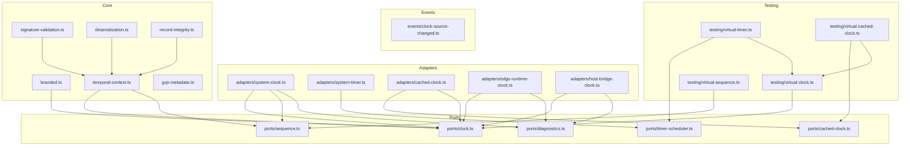

# @hex-di/clock -- Overview

## Package Metadata

| Field | Value |
|-------|-------|
| Name | `@hex-di/clock` |
| Version | 0.0.0 (pre-release) |
| License | MIT |
| Repository | `hex-di/hex-di` monorepo — `libs/clock/core/` |
| Module format | ESM (TypeScript source) |
| Side effects | None |
| Node version | ≥ 18.0.0 |
| TypeScript version | ≥ 5.0 |

## Mission

`@hex-di/clock` provides injectable clock, sequence generation, and timer scheduling abstractions for the HexDI ecosystem. It replaces six fragmented timing implementations across the monorepo with a single port-based architecture that enables deterministic testing, GxP-compliant deployments, and cross-platform support.

## Design Philosophy

1. **Port-First** — The clock is defined as a port (interface), not a concrete implementation. Consumers depend on `ClockPort`; adapters provide the implementation. This enables swapping system clocks for virtual clocks in tests, NTP-validated clocks in GxP deployments, and simulated clocks in replay scenarios.

2. **Three Time Functions, Three Use Cases** — Not all time is the same. `monotonicNow()` provides NTP-immune elapsed time for duration measurement. `wallClockNow()` provides epoch time for calendar timestamps. `highResNow()` provides sub-millisecond epoch time for tracing spans. Consumers choose the function matching their semantic need.

3. **Sequence Numbers Are Not Clocks** — `SequenceGeneratorPort` is deliberately separate from `ClockPort`. Sequence numbers provide total ordering within a scope, independent of time precision. Even when two events share the same monotonic timestamp, their sequence numbers are always distinct.

4. **Result-Based Error Handling** — All fallible operations return `Result<T, E>` from `@hex-di/result` instead of throwing exceptions. Factory functions, sequence operations, and control functions communicate failure through `err()` values, making error paths explicit at the type level.

5. **Zero-Cost When Unused** — The package has no side effects, no global state, and no initialization cost beyond adapter construction. Packages that import only the port type pay zero runtime cost.

## Runtime Requirements

| Requirement | Value |
|-------------|-------|
| Node.js | ≥ 18.0.0 |
| TypeScript | ≥ 5.0 |
| Build | Unbundled TypeScript source (ESM) |
| Test | Vitest + Stryker (mutation) |
| Dependencies | `@hex-di/result`, `@hex-di/core` |

## Public API Surface

### Ports

| Export | Kind | Source file |
|--------|------|-------------|
| `ClockPort` | Directed port | `src/ports/clock.ts` |
| `SequenceGeneratorPort` | Directed port | `src/ports/sequence.ts` |
| `ClockDiagnosticsPort` | Directed port | `src/ports/diagnostics.ts` |
| `ClockSourceChangedSinkPort` | Directed port | `src/events/clock-source-changed.ts` |
| `TimerSchedulerPort` | Directed port | `src/ports/timer-scheduler.ts` |
| `RetentionPolicyPort` | Directed port | `src/ports/retention-policy.ts` |

### Branded Timestamp Types

| Export | Kind | Source file |
|--------|------|-------------|
| `MonotonicTimestamp` | Branded type (`number & { [MonotonicBrand]: true }`) | `src/ports/clock.ts` |
| `WallClockTimestamp` | Branded type (`number & { [WallClockBrand]: true }`) | `src/ports/clock.ts` |
| `HighResTimestamp` | Branded type (`number & { [HighResBrand]: true }`) | `src/ports/clock.ts` |

### Branding Utility Functions

| Export | Kind | Source file |
|--------|------|-------------|
| `asMonotonic` | `(ms: number) => MonotonicTimestamp` | `src/branded.ts` |
| `asWallClock` | `(ms: number) => WallClockTimestamp` | `src/branded.ts` |
| `asHighRes` | `(ms: number) => HighResTimestamp` | `src/branded.ts` |
| `asMonotonicValidated` | `(ms: number) => Result<MonotonicTimestamp, BrandingValidationError>` | `src/branded.ts` |
| `asWallClockValidated` | `(ms: number) => Result<WallClockTimestamp, BrandingValidationError>` | `src/branded.ts` |
| `asHighResValidated` | `(ms: number) => Result<HighResTimestamp, BrandingValidationError>` | `src/branded.ts` |

### Factory Functions

| Export | Kind | Source file |
|--------|------|-------------|
| `createSystemClock` | `(options?) => Result<ClockPort & ClockDiagnosticsPort, ClockStartupError>` | `src/adapters/system-clock.ts` |
| `createSystemSequenceGenerator` | `() => SequenceGeneratorPort` | `src/adapters/system-clock.ts` |
| `createSystemTimerScheduler` | `() => TimerSchedulerPort` | `src/adapters/system-timer.ts` |
| `createCachedClock` | `(options) => CachedClockAdapter` | `src/adapters/cached-clock.ts` |
| `createEdgeRuntimeClock` | `(options?) => Result<ClockPort & ClockDiagnosticsPort, ClockStartupError>` | `src/adapters/edge-runtime-clock.ts` |
| `createHostBridgeClock` | `(bridge, options) => Result<ClockPort & ClockDiagnosticsPort, ClockStartupError>` | `src/adapters/host-bridge-clock.ts` |
| `createTemporalContextFactory` | `(clock, seq) => TemporalContextFactory` | `src/temporal-context.ts` |
| `createClockSourceBridge` | `(clock) => ClockSource` | `src/adapters/system-clock.ts` |
| `createProcessInstanceId` | `() => string` | `src/adapters/system-clock.ts` |
| `setupPeriodicClockEvaluation` | `(clock, diagnostics, timer, config) => { stop }` | `src/adapters/system-clock.ts` |
| `getClockGxPMetadata` | `() => ClockGxPMetadata` | `src/gxp-metadata.ts` |

### Adapter Constants

| Export | Kind | Source file |
|--------|------|-------------|
| `SystemClockAdapter` | DI adapter constant | `src/adapters/system-clock.ts` |
| `SystemSequenceGeneratorAdapter` | DI adapter constant | `src/adapters/system-clock.ts` |
| `SystemClockDiagnosticsAdapter` | DI adapter constant | `src/adapters/system-clock.ts` |
| `SystemTimerSchedulerAdapter` | DI adapter constant | `src/adapters/system-timer.ts` |
| `SystemCachedClockAdapter` | DI adapter constant | `src/adapters/cached-clock.ts` |
| `EdgeRuntimeClockAdapter` | DI adapter constant | `src/adapters/edge-runtime-clock.ts` |

### Adapter Factory Functions

| Export | Kind | Source file |
|--------|------|-------------|
| `createSystemClockAdapter` | `(options?) => Adapter` | `src/adapters/system-clock.ts` |
| `createEdgeRuntimeClockAdapter` | `(options?) => Adapter` | `src/adapters/edge-runtime-clock.ts` |
| `createHostBridgeClockAdapter` | `(bridge, options) => Adapter` | `src/adapters/host-bridge-clock.ts` |

### Record Integrity Functions

| Export | Kind | Source file |
|--------|------|-------------|
| `computeTemporalContextDigest` | `(ctx) => TemporalContextDigest` | `src/record-integrity.ts` |
| `computeOverflowTemporalContextDigest` | `(ctx) => TemporalContextDigest` | `src/record-integrity.ts` |
| `verifyTemporalContextDigest` | `(ctx, digest) => boolean` | `src/record-integrity.ts` |

### Deserialization Functions

| Export | Kind | Source file |
|--------|------|-------------|
| `deserializeTemporalContext` | `(raw) => Result<TemporalContext, DeserializationError>` | `src/deserialization.ts` |
| `deserializeOverflowTemporalContext` | `(raw) => Result<OverflowTemporalContext, DeserializationError>` | `src/deserialization.ts` |
| `deserializeClockDiagnostics` | `(raw) => Result<ClockDiagnostics, DeserializationError>` | `src/deserialization.ts` |

### Validation Functions

| Export | Kind | Source file |
|--------|------|-------------|
| `validateSignableTemporalContext` | `(ctx) => Result<SignableTemporalContext, SignatureValidationError>` | `src/signature-validation.ts` |
| `validateRetentionMetadata` | `(metadata) => Result<RetentionMetadata, RetentionValidationError>` | `src/temporal-context.ts` |
| `isOverflowTemporalContext` | Type guard | `src/temporal-context.ts` |

### Error Types

| Export | Kind | Source file |
|--------|------|-------------|
| `ClockStartupError` | Error type | `src/adapters/system-clock.ts` |
| `ClockRangeError` | Error type | `src/testing/virtual-clock.ts` |
| `SequenceOverflowError` | Error type | `src/ports/sequence.ts` |
| `SignatureValidationError` | Error type | `src/signature-validation.ts` |
| `DeserializationError` | Error type | `src/deserialization.ts` |
| `BrandingValidationError` | Error type | `src/branded.ts` |
| `ClockTimeoutError` | Error type | `src/testing/virtual-timer.ts` |
| `RetentionValidationError` | Error type | `src/temporal-context.ts` |

### Testing Entry Point (`@hex-di/clock/testing`)

| Export | Kind | Source file |
|--------|------|-------------|
| `createVirtualClock` | Factory function | `src/testing/virtual-clock.ts` |
| `createVirtualSequenceGenerator` | Factory function | `src/testing/virtual-sequence.ts` |
| `createVirtualTimerScheduler` | Factory function | `src/testing/virtual-timer.ts` |
| `createVirtualCachedClock` | Factory function | `src/testing/virtual-cached-clock.ts` |
| `VirtualClockAdapter` | Interface | `src/testing/virtual-clock.ts` |
| `VirtualSequenceGenerator` | Interface | `src/testing/virtual-sequence.ts` |
| `VirtualTimerScheduler` | Interface | `src/testing/virtual-timer.ts` |
| `ClockTimeoutError` | Error type | `src/testing/virtual-timer.ts` |

## Subpath Exports

| Subpath | Entry point | Description |
|---------|-------------|-------------|
| `.` | `./src/index.ts` | Production API: ports, adapters, factories, utilities |
| `./testing` | `./src/testing/index.ts` | Test utilities: virtual clock, virtual sequence, virtual timer, virtual cached clock |

## Module Dependency Graph

## Source File Map

| Source file | Responsibility |
|-------------|---------------|
| `src/ports/clock.ts` | `ClockPort` interface, branded timestamp types (`MonotonicTimestamp`, `WallClockTimestamp`, `HighResTimestamp`) |
| `src/ports/sequence.ts` | `SequenceGeneratorPort` interface, `SequenceOverflowError` |
| `src/ports/diagnostics.ts` | `ClockDiagnosticsPort` interface, `ClockDiagnostics`, `ClockCapabilities` |
| `src/ports/timer-scheduler.ts` | `TimerSchedulerPort` interface, `TimerHandle` |
| `src/ports/cached-clock.ts` | `CachedClockPort`, `CachedClockLifecycle`, `CachedClockAdapter` interfaces |
| `src/branded.ts` | Branding utilities (`asMonotonic`, `asWallClock`, `asHighRes` + validated variants), `BrandingValidationError` |
| `src/temporal-context.ts` | `TemporalContext`, `OverflowTemporalContext`, `TemporalContextFactory`, `RetentionMetadata`, validation |
| `src/signature-validation.ts` | `SignableTemporalContext`, `validateSignableTemporalContext`, 21 CFR 11.50 enforcement |
| `src/deserialization.ts` | `deserializeTemporalContext`, `deserializeOverflowTemporalContext`, `deserializeClockDiagnostics` |
| `src/record-integrity.ts` | SHA-256 per-record integrity (`computeTemporalContextDigest`, `verifyTemporalContextDigest`) |
| `src/gxp-metadata.ts` | `getClockGxPMetadata`, `ClockGxPMetadata` (version identification for GxP deployments) |
| `src/combinators/async.ts` | `withTimeout`, `raceClocks` async clock combinators |
| `src/duration.ts` | `MonotonicDuration`, `WallClockDuration` branded types; `elapsed`, `asMonotonicDuration`, `asWallClockDuration`, `durationGt`, `durationLt`, `durationBetween` |
| `src/temporal-interop.ts` | `toTemporalInstant`, `fromTemporalInstant` TC39 Temporal proposal conversion utilities |
| `src/process-instance-id.ts` | `createProcessInstanceId` recommended pattern for multi-process sequence scoping |
| `src/context/clock-context.ts` | `createClockContext`, `ClockContext` — AsyncLocalStorage-based per-request clock propagation |
| `src/adapters/system-clock.ts` | `SystemClockAdapter` factory with startup self-test (ST-1 through ST-5), platform API capture, `setupPeriodicClockEvaluation` |
| `src/adapters/system-timer.ts` | `SystemTimerScheduler` factory, platform timer API capture |
| `src/adapters/cached-clock.ts` | `SystemCachedClock` with background interval updater |
| `src/adapters/edge-runtime-clock.ts` | `EdgeRuntimeClockAdapter` for V8 isolate edge runtimes (Workers, Vercel Edge) |
| `src/adapters/host-bridge-clock.ts` | `HostClockBridge` adapter for React Native, WASM, embedded environments |
| `src/events/clock-source-changed.ts` | `ClockSourceChangedEvent`, `ClockSourceChangedSinkPort` for adapter swap audit events |
| `src/testing/virtual-clock.ts` | `VirtualClockAdapter` with `advance()`, `set()`, `jumpWallClock()`, auto-advance |
| `src/testing/virtual-sequence.ts` | `VirtualSequenceGenerator` with `setCounter()`, `reset()` |
| `src/testing/virtual-timer.ts` | `VirtualTimerScheduler` linked to virtual clock, deterministic timer firing |
| `src/testing/virtual-cached-clock.ts` | `VirtualCachedClock` reading directly from virtual clock |
| `src/testing/assertions.ts` | `assertMonotonic`, `assertSequential`, `assertTemporalOrdering` test assertion helpers |

## Specification & Process Files

| File | Responsibility |
|------|---------------|
| `overview.md` | This document — package metadata, mission, API surface, source file map |
| `01-overview.md` | Problem statement, solution description, data flow diagrams, package structure |
| `02-clock-port.md` | ClockPort interface, branded timestamps, TimerSchedulerPort, CachedClockPort, ClockCapabilities, async combinators, duration types, Temporal API interop |
| `03-sequence-generator.md` | SequenceGeneratorPort, overflow handling, ordering guarantees, multi-process deployments |
| `04-platform-adapters.md` | SystemClockAdapter, startup self-test, EdgeRuntimeClockAdapter, HostClockBridge, HardwareClockAdapter, benchmark specification |
| `05-testing-support.md` | VirtualClockAdapter, VirtualSequenceGenerator, VirtualTimerScheduler, VirtualCachedClock, testing assertion helpers, testing recipes |
| `compliance/` | GxP regulatory compliance: FMEA, ALCOA+, IQ/OQ/PQ, change control, recovery, traceability |
| `07-integration.md` | Container registration, migration guide, clock source change auditing, AsyncLocalStorage clock context |
| `08-api-reference.md` | Complete API reference tables for all exports |
| `09-definition-of-done.md` | 37 DoD groups with 692 enumerated tests across 68 test files |
| `invariants.md` | Runtime guarantees with INV-CK-N identifiers |
| `glossary.md` | Domain terminology with cross-references |
| `traceability.md` | Forward/backward requirement traceability |
| `risk-assessment.md` | Per-invariant FMEA risk analysis |
| `roadmap.md` | Planned future work |
| `decisions/` | Architecture Decision Records (ADR-CK-NNN format) |
| `type-system/phantom-brands.md` | Phantom brand pattern for all five branded types (`MonotonicTimestamp`, `WallClockTimestamp`, `HighResTimestamp`, `MonotonicDuration`, `WallClockDuration`); compile-time properties; branding utilities |
| `type-system/structural-safety.md` | Structural irresettability (`SequenceGeneratorPort`), structural incompatibility (`CachedClockPort`), port intersection types, opaque `TimerHandle` pattern |
| `process/` | Governance documents: requirement ID scheme, definitions of done, test strategy, change control |
| `README.md` | Document control, revision history, approval records |
