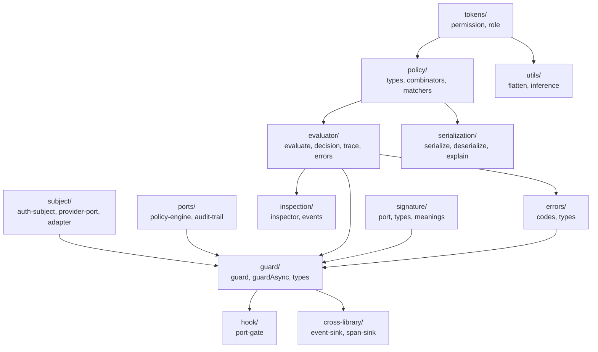

# @hex-di/guard — Overview

> **Document Control**
>
> | Property         | Value                                                         |
> |------------------|---------------------------------------------------------------|
> | Document ID      | GUARD-OVERVIEW                                                |
> | Revision         | 4.3                                                           |
> | Effective Date   | 2026-02-20                                                    |
> | Status           | Effective                                                     |
> | Author           | HexDI Engineering                                             |
> | Reviewer         | GxP Compliance Review                                         |
> | Approved By      | Technical Lead, Quality Assurance Manager                     |
> | Classification   | GxP Functional Specification — Overview (URS)                 |
> | DMS Reference    | Git VCS (GPG-signed tag: guard/v0.2.5)                        |
> | Change History   | 4.3 (2026-02-20): Source File Map: updated §16 DoD row from DoD 1–27/1168 → DoD 1–29/1294; updated process/definitions-of-done.md row from 27 DoD/1168 → 29 DoD/1294 (CCR-GUARD-045) |
> |                  | 4.2 (2026-02-20): Renamed api-reference.md → 14-api-reference.md to restore numbered chapter convention; all cross-references updated (CCR-GUARD-043) |
> |                  | 4.1 (2026-02-20): Resolved duplicate Document IDs: deleted 14-api-reference.md stub (GUARD-14 now unambiguous → api-reference.md); assigned GUARD-15-IDX to appendices/README.md; GUARD-15 now exclusively tracks 15-appendices.md (CCR-GUARD-042) |
> |                  | 4.0 (2026-02-20): Removed 9 dangling compliance/*.md rows from Specification & Process Files table; content lives in 17-gxp-compliance/ sub-docs already listed (CCR-GUARD-040) |
> |                  | 3.0 (2026-02-20): Added 36 missing spec files to Specification & Process Files table (numbered chapters 01–17, 17-gxp-compliance/ subdocs, compliance/ files, appendices/ individual entries); fixed GUARD-URS → GUARD-00-URS and corrected GUARD-15-D/GUARD-15-N document IDs (CCR-GUARD-036) |
> |                  | 2.0 (2026-02-20): Added roadmap.md, roadmap/ecosystem-extensions.md, roadmap/developer-experience.md, comparisons/competitors.md, appendices/architectural-decisions.md, appendices/type-relationship-diagram.md, appendices/stride-threat-model.md, type-system/phantom-brands.md, type-system/structural-safety.md, process/ci-maintenance.md to Specification & Process Files table (CCR-GUARD-032) |
> |                  | 1.0 (2026-02-19): Initial canonical overview (CCR-GUARD-020) |

---

## Package Metadata

| Field              | Value                                                          |
|--------------------|----------------------------------------------------------------|
| Name               | `@hex-di/guard`                                               |
| Version            | 0.2.5                                                          |
| License            | MIT                                                            |
| Repository         | `packages/guard/` in the hex-di monorepo                      |
| Module format      | ESM only (`"type": "module"`)                                  |
| Side effects       | None                                                           |
| Node version       | >= 20                                                          |
| TypeScript version | >= 5.4                                                         |

**Related packages:**

| Package                    | Version | Location                           |
|----------------------------|---------|------------------------------------|
| `@hex-di/guard-testing`    | 0.2.5   | `packages/guard-testing/`          |
| `@hex-di/guard-validation` | 0.2.5   | `packages/guard-validation/`       |
| `integrations/react-guard` | 0.2.5   | `integrations/react-guard/`        |

---

## Mission

`@hex-di/guard` provides compile-time-safe, container-integrated authorization for the HexDI ecosystem. Permissions and roles are branded nominal tokens. Policies are discriminated unions composed through algebraic combinators. Authorization decisions are injected into the dependency graph — visible in inspection, traceable in spans, audited in GxP mode, and scoped to requests — without exposing any mutable global state.

---

## Design Philosophy

1. **Policies are pure data.** Every policy node is a serializable discriminated union variant with a `readonly kind` discriminant. No callbacks, no `evaluate` methods on policy objects, no closures. `serializePolicy` / `deserializePolicy` is always a lossless round-trip.

2. **Branded tokens, not strings.** Permissions and roles are branded nominal types using `Symbol.for()`. A typo in a permission name is a compile error. Two `Permission<'user', 'read'>` values from different modules are structurally identical — `user:read` means the same thing everywhere.

3. **Authorization at resolution time, not route time.** The `guard()` wrapper injects `PolicyEnginePort` and `SubjectProviderPort` into an adapter's `requires` tuple. The guarded port cannot be resolved without passing its policy. This makes authorization a structural property of the graph, not a manual check.

4. **Deny-overrides, audit-first.** When `guard()` evaluates a policy, the audit entry is written before the allow/deny action is taken. Denied attempts are always recorded. In GxP mode, `failOnAuditError` defaults to `true` — a failed audit write blocks the operation.

5. **Zero external dependencies.** `@hex-di/guard` depends only on `@hex-di/core` as a peer dependency. No external authorization libraries (casl, casbin, accesscontrol) are vendored, wrapped, or imported.

6. **Subject is scoped, not global.** The authorization subject is provided via a scoped `SubjectProviderPort` adapter. Each request scope gets its own immutable subject. No mid-request permission changes. No global mutable auth state.

---

## Runtime Requirements

| Requirement      | Value                                         |
|------------------|-----------------------------------------------|
| Node.js          | >= 20 (AsyncLocalStorage, structuredClone)    |
| TypeScript       | >= 5.4 (variadic tuple types, const inference)|
| Build tooling    | tsup (ESM + `.d.ts`)                          |
| Test tooling     | vitest >= 2.0                                 |
| Peer deps        | `@hex-di/core` >= 0.2.5                       |

---

## Public API Surface

### `@hex-di/guard` — Permission tokens

| Export                  | Kind       | Source file                              |
|-------------------------|------------|------------------------------------------|
| `Permission<R, A>`      | Type       | `src/tokens/permission.ts`               |
| `PERMISSION_BRAND`      | Const      | `src/tokens/permission.ts`               |
| `createPermission()`    | Function   | `src/tokens/permission.ts`               |
| `PermissionGroupMap<R>` | Type       | `src/tokens/permission-group.ts`         |
| `createPermissionGroup()` | Function | `src/tokens/permission-group.ts`         |
| `InferResource
`      | Type       | `src/utils/inference.ts`                 |
| `InferAction
`        | Type       | `src/utils/inference.ts`                 |
| `FormatPermission
`   | Type       | `src/utils/inference.ts`                 |
| `InferPermissions<G>`   | Type       | `src/utils/inference.ts`                 |
| `NotAPermissionError`   | Class      | `src/errors/types.ts`                    |

### `@hex-di/guard` — Role tokens

| Export                         | Kind       | Source file                              |
|--------------------------------|------------|------------------------------------------|
| `Role`                         | Type       | `src/tokens/role.ts`                     |
| `ROLE_BRAND`                   | Const      | `src/tokens/role.ts`                     |
| `createRole()`                 | Function   | `src/tokens/role.ts`                     |
| `flattenPermissions()`         | Function   | `src/utils/flatten.ts`                   |
| `FlattenRolePermissions<R>`    | Type       | `src/utils/inference.ts`                 |
| `ValidateRoleInheritance<R>`   | Type       | `src/utils/inference.ts`                 |
| `NotARoleError`                | Class      | `src/errors/types.ts`                    |
| `CircularRoleInheritanceError` | Class      | `src/errors/types.ts`                    |

### `@hex-di/guard` — Policy types and combinators

| Export                       | Kind       | Source file                              |
|------------------------------|------------|------------------------------------------|
| `Policy`                     | Type       | `src/policy/types.ts`                    |
| `PolicyKind`                 | Type       | `src/policy/types.ts`                    |
| `HasPermissionPolicy`        | Type       | `src/policy/types.ts`                    |
| `HasRolePolicy`              | Type       | `src/policy/types.ts`                    |
| `HasAttributePolicy`         | Type       | `src/policy/types.ts`                    |
| `HasResourceAttributePolicy` | Type       | `src/policy/types.ts`                    |
| `HasSignaturePolicy`         | Type       | `src/policy/types.ts`                    |
| `HasRelationshipPolicy`      | Type       | `src/policy/types.ts`                    |
| `AllOfPolicy`                | Type       | `src/policy/types.ts`                    |
| `AnyOfPolicy`                | Type       | `src/policy/types.ts`                    |
| `NotPolicy`                  | Type       | `src/policy/types.ts`                    |
| `LabeledPolicy`              | Type       | `src/policy/types.ts`                    |
| `FieldStrategy`              | Type       | `src/policy/types.ts`                    |
| `hasPermission()`            | Function   | `src/policy/combinators.ts`              |
| `hasRole()`                  | Function   | `src/policy/combinators.ts`              |
| `hasAttribute()`             | Function   | `src/policy/combinators.ts`              |
| `hasResourceAttribute()`     | Function   | `src/policy/combinators.ts`              |
| `hasSignature()`             | Function   | `src/policy/combinators.ts`              |
| `hasRelationship()`          | Function   | `src/policy/combinators.ts`              |
| `allOf()`                    | Function   | `src/policy/combinators.ts`              |
| `anyOf()`                    | Function   | `src/policy/combinators.ts`              |
| `not()`                      | Function   | `src/policy/combinators.ts`              |
| `withLabel()`                | Function   | `src/policy/combinators.ts`              |
| `PolicyConstraint`           | Interface  | `src/policy/constraint.ts`               |
| `eq()`, `neq()`              | Functions  | `src/policy/matchers.ts`                 |
| `inArray()`, `exists()`      | Functions  | `src/policy/matchers.ts`                 |
| `subject()`, `resource()`    | Functions  | `src/policy/matchers.ts`                 |
| `literal()`                  | Function   | `src/policy/matchers.ts`                 |
| `InferPolicyRequirements
` | Type       | `src/utils/inference.ts`                 |

### `@hex-di/guard` — Policy evaluator

| Export                   | Kind       | Source file                              |
|--------------------------|------------|------------------------------------------|
| `evaluate()`             | Function   | `src/evaluator/evaluate.ts`              |
| `evaluateAsync()`        | Function   | `src/evaluator/evaluate.ts`              |
| `Decision`               | Type       | `src/evaluator/decision.ts`              |
| `Allow`                  | Type       | `src/evaluator/decision.ts`              |
| `Deny`                   | Type       | `src/evaluator/decision.ts`              |
| `EvaluationTrace`        | Type       | `src/evaluator/trace.ts`                 |
| `PolicyEvaluationError`  | Class      | `src/evaluator/errors.ts`                |
| `AccessDeniedError`      | Class      | `src/evaluator/errors.ts`                |

### `@hex-di/guard` — Guard adapter and ports

| Export                     | Kind       | Source file                              |
|----------------------------|------------|------------------------------------------|
| `guard()`                  | Function   | `src/guard/guard.ts`                     |
| `guardAsync()`             | Function   | `src/guard/guard.ts`                     |
| `GuardedAdapter<A>`        | Type       | `src/guard/types.ts`                     |
| `GuardedAsyncAdapter<A>`   | Type       | `src/guard/types.ts`                     |
| `AppendAclPorts<R>`        | Type       | `src/guard/types.ts`                     |
| `HasPortNamed<N, T>`       | Type       | `src/guard/types.ts`                     |
| `PolicyEnginePort`         | Port       | `src/ports/policy-engine.ts`             |
| `PolicyEngine`             | Interface  | `src/ports/policy-engine.ts`             |
| `AuditTrailPort`           | Port       | `src/ports/audit-trail.ts`               |
| `AuditTrail`               | Interface  | `src/ports/audit-trail.ts`               |
| `AuditEntry`               | Type       | `src/ports/audit-trail.ts`               |
| `NoopAuditTrail`           | Class      | `src/ports/audit-trail.ts`               |
| `SubjectProviderPort`      | Port       | `src/subject/provider-port.ts`           |
| `SubjectProvider`          | Interface  | `src/subject/provider-port.ts`           |
| `createSubjectAdapter()`   | Function   | `src/subject/adapter.ts`                 |
| `AuditTrailWriteError`     | Class      | `src/errors/types.ts`                    |

### `@hex-di/guard` — AuthSubject

| Export                     | Kind       | Source file                              |
|----------------------------|------------|------------------------------------------|
| `AuthSubject`              | Interface  | `src/subject/auth-subject.ts`            |
| `PrecomputedSubject`       | Interface  | `src/subject/auth-subject.ts`            |
| `AttributeResolverPort`    | Port       | `src/subject/attribute-resolver.ts`      |
| `AttributeResolver`        | Interface  | `src/subject/attribute-resolver.ts`      |
| `RelationshipResolverPort` | Port       | `src/subject/relationship-resolver.ts`   |
| `RelationshipResolver`     | Interface  | `src/subject/relationship-resolver.ts`   |

### `@hex-di/guard` — Electronic signatures

| Export                        | Kind       | Source file                              |
|-------------------------------|------------|------------------------------------------|
| `SignatureServicePort`        | Port       | `src/signature/port.ts`                  |
| `SignatureService`            | Interface  | `src/signature/port.ts`                  |
| `NoopSignatureService`        | Class      | `src/signature/port.ts`                  |
| `ElectronicSignature`         | Type       | `src/signature/types.ts`                 |
| `SignatureCaptureRequest`     | Type       | `src/signature/types.ts`                 |
| `ReauthenticationChallenge`   | Type       | `src/signature/types.ts`                 |
| `ReauthenticationToken`       | Type       | `src/signature/types.ts`                 |
| `SignatureValidationResult`   | Type       | `src/signature/types.ts`                 |
| `SignatureError`              | Class      | `src/signature/types.ts`                 |
| `SignatureMeanings`           | Const      | `src/signature/meanings.ts`              |

### `@hex-di/guard` — Port gate hook and cross-library

| Export                      | Kind       | Source file                              |
|-----------------------------|------------|------------------------------------------|
| `createPortGateHook()`      | Function   | `src/hook/port-gate.ts`                  |
| `GuardEventSinkPort`        | Port       | `src/cross-library/event-sink.ts`        |
| `GuardSpanSinkPort`         | Port       | `src/cross-library/span-sink.ts`         |
| `GuardEvent`                | Type       | `src/cross-library/event-sink.ts`        |

### `@hex-di/guard` — Serialization and inspection

| Export                    | Kind       | Source file                              |
|---------------------------|------------|------------------------------------------|
| `serializePolicy()`       | Function   | `src/serialization/serialize.ts`         |
| `deserializePolicy()`     | Function   | `src/serialization/deserialize.ts`       |
| `explainPolicy()`         | Function   | `src/serialization/explain.ts`           |
| `GuardInspector`          | Interface  | `src/inspection/inspector.ts`            |
| `GuardInspectorEvent`     | Type       | `src/inspection/events.ts`               |
| `GuardLibraryInspectorPort` | Port     | `src/inspection/inspector.ts`            |

### `@hex-di/guard` — Error codes

| Export              | Kind       | Source file                              |
|---------------------|------------|------------------------------------------|
| `ErrorCodes`        | Const      | `src/errors/codes.ts`                    |

### `@hex-di/guard-testing`

| Export                               | Kind       | Source file                              |
|--------------------------------------|------------|------------------------------------------|
| `createTestSubject()`                | Function   | `src/subject.ts`                         |
| `resetSubjectCounter()`              | Function   | `src/subject.ts`                         |
| `testPolicy()`                       | Function   | `src/policy.ts`                          |
| `testGuard()`                        | Function   | `src/guard.ts`                           |
| `setupGuardMatchers()`               | Function   | `src/matchers.ts`                        |
| `createTestGuardWrapper()`           | Function   | `src/react.tsx`                          |
| `createMemoryPolicyEngine()`         | Function   | `src/memory-policy-engine.ts`            |
| `createStaticSubjectProvider()`      | Function   | `src/static-subject-provider.ts`         |
| `createAuditTrailConformanceSuite()` | Function   | `src/conformance.ts`                     |
| `createSubjectProviderConformanceSuite()` | Function | `src/conformance.ts`                   |
| `GuardFixtures`                      | Const      | `src/fixtures.ts`                        |

### `@hex-di/guard-validation`

| Export                        | Kind       | Source file                              |
|-------------------------------|------------|------------------------------------------|
| `runIQ()`                     | Function   | `src/iq.ts`                              |
| `runOQ()`                     | Function   | `src/oq.ts`                              |
| `runPQ()`                     | Function   | `src/pq.ts`                              |
| `generateTraceabilityMatrix()` | Function  | `src/traceability.ts`                    |
| `IQResult`                    | Type       | `src/types.ts`                           |
| `OQResult`                    | Type       | `src/types.ts`                           |
| `PQResult`                    | Type       | `src/types.ts`                           |
| `TraceabilityMatrix`          | Type       | `src/types.ts`                           |

### `integrations/react-guard`

| Export                       | Kind       | Source file                                          |
|------------------------------|------------|------------------------------------------------------|
| `SubjectProvider`            | Component  | `src/providers/subject-provider.tsx`                 |
| `Can`                        | Component  | `src/components/can.tsx`                             |
| `Cannot`                     | Component  | `src/components/cannot.tsx`                          |
| `useCan()`                   | Hook       | `src/hooks/use-can.ts`                               |
| `useCanDeferred()`           | Hook       | `src/hooks/use-can-deferred.ts`                      |
| `usePolicy()`                | Hook       | `src/hooks/use-policy.ts`                            |
| `usePolicyDeferred()`        | Hook       | `src/hooks/use-policy-deferred.ts`                   |
| `useSubject()`               | Hook       | `src/hooks/use-subject.ts`                           |
| `useSubjectDeferred()`       | Hook       | `src/hooks/use-subject-deferred.ts`                  |
| `usePolicies()`              | Hook       | `src/hooks/use-policies.ts`                          |
| `usePoliciesDeferred()`      | Hook       | `src/hooks/use-policies-deferred.ts`                 |
| `createGuardHooks()`         | Factory    | `src/factories/create-guard-hooks.tsx`               |
| `CanResult`                  | Type       | `src/types.ts`                                       |
| `PolicyResult`               | Type       | `src/types.ts`                                       |
| `PoliciesDecisions<M>`       | Type       | `src/types.ts`                                       |
| `PoliciesResult<M>`          | Type       | `src/types.ts`                                       |

---

## Subpath Exports

| Subpath                        | Resolves to                        | Purpose                                    |
|--------------------------------|------------------------------------|--------------------------------------------|
| `@hex-di/guard`                | `packages/guard/src/index.ts`      | Core authorization primitives              |
| `@hex-di/guard-testing`        | `packages/guard-testing/src/index.ts` | Test utilities and conformance suites   |
| `@hex-di/guard-validation`     | `packages/guard-validation/src/index.ts` | IQ/OQ/PQ qualification protocols      |
| `integrations/react-guard`     | `integrations/react-guard/src/index.ts` | React Provider, hooks, and components  |

---

## Module Dependency Graph

---

## Source File Map

### `packages/guard/src/`

| File                                  | Responsibility                                                                |
|---------------------------------------|-------------------------------------------------------------------------------|
| `tokens/permission.ts`                | `Permission<R,A>` branded type, `PERMISSION_BRAND`, `createPermission()`     |
| `tokens/permission-group.ts`          | `PermissionGroupMap<R>`, `createPermissionGroup()` mapped type factory        |
| `tokens/role.ts`                      | `Role` branded type, `ROLE_BRAND`, `createRole()` with eager permission flatten |
| `tokens/index.ts`                     | Re-exports from tokens module                                                  |
| `policy/types.ts`                     | `Policy` discriminated union (10 variants), `PolicyKind`, `FieldStrategy`     |
| `policy/combinators.ts`               | `hasPermission`, `hasRole`, `hasAttribute`, `hasResourceAttribute`, `hasSignature`, `hasRelationship`, `allOf`, `anyOf`, `not`, `withLabel` |
| `policy/constraint.ts`                | `PolicyConstraint` interface for external engine adapters                      |
| `policy/matchers.ts`                  | Matcher DSL: `eq`, `neq`, `inArray`, `exists`, `subject`, `resource`, `literal` |
| `policy/index.ts`                     | Re-exports from policy module                                                  |
| `evaluator/evaluate.ts`               | Pure `evaluate()` and `evaluateAsync()` functions                              |
| `evaluator/decision.ts`               | `Decision`, `Allow`, `Deny` discriminated union types                          |
| `evaluator/trace.ts`                  | `EvaluationTrace` tree structure with `complete` flag                          |
| `evaluator/errors.ts`                 | `PolicyEvaluationError` (ACL003–ACL007), `AccessDeniedError` (ACL001)         |
| `evaluator/index.ts`                  | Re-exports from evaluator module                                               |
| `guard/guard.ts`                      | `guard()` and `guardAsync()` adapter wrapper functions                         |
| `guard/types.ts`                      | `GuardedAdapter`, `GuardedAsyncAdapter`, `AppendAclPorts`, `HasPortNamed`      |
| `guard/index.ts`                      | Re-exports from guard module                                                   |
| `subject/auth-subject.ts`             | `AuthSubject`, `PrecomputedSubject` interfaces                                 |
| `subject/provider-port.ts`            | `SubjectProviderPort` scoped outbound port definition                          |
| `subject/adapter.ts`                  | `createSubjectAdapter()` helper for scoped subject injection                   |
| `subject/attribute-resolver.ts`       | `AttributeResolverPort`, `AttributeResolver` interface                         |
| `subject/relationship-resolver.ts`    | `RelationshipResolverPort`, `RelationshipResolver` with depth/cycle control    |
| `subject/index.ts`                    | Re-exports from subject module                                                 |
| `hook/port-gate.ts`                   | `createPortGateHook()` for coarse-grained, subject-free port gating            |
| `hook/index.ts`                       | Re-exports from hook module                                                    |
| `serialization/serialize.ts`          | `serializePolicy()` — Policy → JSON-serializable record                        |
| `serialization/deserialize.ts`        | `deserializePolicy()` — JSON record → Policy (validates and reconstructs)      |
| `serialization/explain.ts`            | `explainPolicy()` — Policy → human-readable string                             |
| `serialization/index.ts`              | Re-exports from serialization module                                           |
| `signature/types.ts`                  | `ElectronicSignature`, `SignatureCaptureRequest`, `ReauthenticationChallenge`, `ReauthenticationToken`, `SignatureValidationResult`, `SignatureError` |
| `signature/port.ts`                   | `SignatureServicePort`, `SignatureService` interface, `NoopSignatureService`   |
| `signature/meanings.ts`               | `SignatureMeanings` constants (reviewed, approved, witnessed, etc.)            |
| `signature/index.ts`                  | Re-exports from signature module                                               |
| `inspection/inspector.ts`             | `GuardInspector` interface and `GuardLibraryInspectorPort`                     |
| `inspection/events.ts`                | `GuardInspectorEvent` discriminated union                                      |
| `inspection/index.ts`                 | Re-exports from inspection module                                              |
| `cross-library/event-sink.ts`         | `GuardEventSinkPort`, `GuardEvent` for logger/SIEM integration                 |
| `cross-library/span-sink.ts`          | `GuardSpanSinkPort` for tracing integration                                    |
| `ports/policy-engine.ts`              | `PolicyEnginePort`, `PolicyEngine` interface, built-in memory engine           |
| `ports/audit-trail.ts`                | `AuditTrailPort`, `AuditTrail` interface, `AuditEntry` type, `NoopAuditTrail` |
| `errors/codes.ts`                     | `ErrorCodes` constant map (ACL001–ACL032)                                      |
| `errors/types.ts`                     | All error classes: `NotAPermissionError`, `NotARoleError`, `CircularRoleInheritanceError`, `AccessDeniedError`, `AuditTrailWriteError`, `SignatureError`, `ScopeExpiredError`, `ConfigurationError` |
| `utils/flatten.ts`                    | `flattenPermissions()` runtime DAG traversal                                   |
| `utils/inference.ts`                  | Utility types: `InferResource`, `InferAction`, `FormatPermission`, `InferPermissions`, `InferPolicyRequirements`, `FlattenRolePermissions`, `ValidateRoleInheritance` |
| `index.ts`                            | Public API barrel — all exports                                                |

### `packages/guard-testing/src/`

| File                              | Responsibility                                                               |
|-----------------------------------|------------------------------------------------------------------------------|
| `subject.ts`                      | `createTestSubject()`, `resetSubjectCounter()` for deterministic test subjects |
| `fixtures.ts`                     | Pre-built permission groups, roles, subjects for common test scenarios       |
| `policy.ts`                       | `testPolicy()` — single-call policy evaluation helper                        |
| `guard.ts`                        | `testGuard()` — guard adapter test helper with mocked ports                  |
| `matchers.ts`                     | `setupGuardMatchers()` — registers `toAllow`, `toDeny`, `toAllowWith`, `toDenyWith` vitest matchers |
| `react.tsx`                       | `createTestGuardWrapper()` — React test wrapper with test subject context     |
| `memory-policy-engine.ts`         | `createMemoryPolicyEngine()` — in-memory policy engine adapter               |
| `static-subject-provider.ts`      | `createStaticSubjectProvider()` — static subject for unit tests              |
| `conformance.ts`                  | `createAuditTrailConformanceSuite()` (17 tests), `createSubjectProviderConformanceSuite()` (12 tests) |
| `index.ts`                        | Public API barrel                                                            |

### `packages/guard-validation/src/`

| File                | Responsibility                                                                  |
|---------------------|---------------------------------------------------------------------------------|
| `iq.ts`             | `runIQ()` — Installation Qualification: package integrity, subpath exports, peer deps |
| `oq.ts`             | `runOQ()` — Operational Qualification: all DoD items, all test pyramid levels   |
| `pq.ts`             | `runPQ()` — Performance Qualification: soak test, latency baselines             |
| `traceability.ts`   | `generateTraceabilityMatrix()` — exports RTM as structured data                 |
| `types.ts`          | `QualificationCheck`, `IQResult`, `OQResult`, `PQResult`, `TraceabilityMatrix` |
| `index.ts`          | Public API barrel                                                               |

### `integrations/react-guard/src/`

| File                                    | Responsibility                                                              |
|-----------------------------------------|-----------------------------------------------------------------------------|
| `providers/subject-provider.tsx`        | `SubjectProvider` — React context provider with Suspense support            |
| `components/can.tsx`                    | `Can` — conditional rendering component (suspends on null subject)          |
| `components/cannot.tsx`                 | `Cannot` — inverse conditional rendering component                          |
| `hooks/use-can.ts`                      | `useCan(permission)` → `boolean` (suspends)                                 |
| `hooks/use-can-deferred.ts`             | `useCanDeferred(permission)` → `CanResult` (never suspends)                 |
| `hooks/use-policy.ts`                   | `usePolicy(policy)` → `Decision` (suspends)                                 |
| `hooks/use-policy-deferred.ts`          | `usePolicyDeferred(policy)` → `PolicyResult` (never suspends)               |
| `hooks/use-subject.ts`                  | `useSubject()` → `AuthSubject` (suspends)                                   |
| `hooks/use-subject-deferred.ts`         | `useSubjectDeferred()` → `AuthSubject \| null` (never suspends)             |
| `hooks/use-policies.ts`                 | `usePolicies(map)` → `PoliciesDecisions<M>` (suspends)                      |
| `hooks/use-policies-deferred.ts`        | `usePoliciesDeferred(map)` → `PoliciesResult<M>` (never suspends)           |
| `factories/create-guard-hooks.tsx`      | `createGuardHooks()` factory — returns 11 type-safe bound hook members      |
| `context/subject-context.ts`            | Internal React context holding `AuthSubject` + pending `Promise`            |
| `types.ts`                              | `CanResult`, `PolicyResult`, `PoliciesDecisions<M>`, `PoliciesResult<M>`    |
| `index.ts`                              | Public API barrel                                                           |

---

## Specification & Process Files

| Document                                             | Document ID       | Responsibility                                                    |
|------------------------------------------------------|-------------------|--------------------------------------------------------------------|
| `overview.md` (this file)                            | GUARD-OVERVIEW    | Package metadata, API surface, module graph, source file map       |
| `README.md`                                          | GUARD-00          | Document Control hub — navigation index for all guard specification chapters |
| `urs.md`                                             | GUARD-00-URS      | User Requirements Specification (URS-GUARD-001..021)               |
| `glossary.md`                                        | GUARD-GLOSSARY    | Domain terminology and cross-references                            |
| `invariants.md`                                      | GUARD-INV         | Runtime guarantees (INV-GD-001..037)                               |
| `traceability.md`                                    | GUARD-TRACE       | Forward/backward traceability matrix                               |
| `risk-assessment.md`                                 | GUARD-RISK        | FMEA per-invariant risk analysis (FM-01..36)                       |
| `01-overview.md`                                     | GUARD-01          | §1 Overview & design philosophy: mission, principles, scope definition |
| `02-permission-types.md`                             | GUARD-02          | §2 Permission types: branded nominal tokens, PermissionRegistry, dedup detection |
| `03-role-types.md`                                   | GUARD-03          | §3 Role types: DAG inheritance, cycle detection, flattenPermissions() |
| `04-policy-types.md`                                 | GUARD-04          | §4 Policy types: 10 discriminated-union policy kinds               |
| `05-policy-evaluator.md`                             | GUARD-05          | §5 Policy evaluator: evaluate(), evaluateAsync(), EvaluationTrace  |
| `06-subject.md`                                      | GUARD-06          | §6 Subject: AuthSubject, SubjectProviderPort, AttributeResolver    |
| `07-guard-adapter.md`                                | GUARD-07          | §7 Guard adapter: guard() wrapper, port-level authorization        |
| `08-port-gate-hook.md`                               | GUARD-08          | §8 Port gate hook: useGuardPortGate, subject-free coarse gating    |
| `09-serialization.md`                                | GUARD-09          | §9 Serialization: JSON round-trip, hashPolicy, schema versioning   |
| `10-cross-library.md`                                | GUARD-10          | §10 Cross-library integration: Logger/Tracing/Clock port bridges   |
| `11-react-integration.md`                            | GUARD-11          | §11 React integration: SubjectProvider, Can/Cannot, createGuardHooks() |
| `12-inspection.md`                                   | GUARD-12          | §12 Inspection: GuardInspector, LibraryInspector bridge, DevTools  |
| `13-testing.md`                                      | GUARD-13          | §13 Testing: matchers, fixtures, conformance suites, BDD           |
| `14-api-reference.md`                                   | GUARD-14          | §14 Complete API reference (all public exports, type signatures, error codes) |
| `15-appendices.md`                                   | GUARD-15          | §15 Appendices numbered chapter (navigation to appendices/ directory)  |
| `16-definition-of-done.md`                           | GUARD-16          | §16 Definition of Done: test enumeration (DoD 1–29, 1294 tests)   |
| `17-gxp-compliance.md`                               | GUARD-17          | §17 GxP compliance guide — index to 17-gxp-compliance/ subdirectory |
| `behaviors/01-permission-types.md`                   | GUARD-02          | BEH-GD-001..004: Permission token specifications                   |
| `behaviors/02-role-types.md`                         | GUARD-03          | BEH-GD-005..008: Role token and inheritance specifications         |
| `behaviors/03-policy-types.md`                       | GUARD-04          | BEH-GD-009..014: Policy discriminated union specifications         |
| `behaviors/04-policy-evaluator.md`                   | GUARD-05          | BEH-GD-015..019: Policy evaluation specifications                  |
| `behaviors/05-subject.md`                            | GUARD-06          | BEH-GD-020..024: AuthSubject and subject provider specifications   |
| `behaviors/06-guard-adapter.md`                      | GUARD-07          | BEH-GD-025..029: guard() adapter wrapper specifications            |
| `behaviors/07-port-gate-hook.md`                     | GUARD-08          | BEH-GD-030..031: Port gate hook specifications                     |
| `behaviors/08-serialization.md`                      | GUARD-09          | BEH-GD-032..037: Policy serialization specifications               |
| `behaviors/09-cross-library.md`                      | GUARD-10          | BEH-GD-038..041: Cross-library event/span emission specifications  |
| `behaviors/10-react-integration.md`                  | GUARD-11          | BEH-GD-042..048: React integration specifications                  |
| `behaviors/11-inspection.md`                         | GUARD-12          | BEH-GD-049..053: GuardInspector and DevTools specifications        |
| `behaviors/12-testing.md`                            | GUARD-13          | BEH-GD-054..062: Testing utilities specifications                  |
| `process/definitions-of-done.md`                     | GUARD-DOD         | Acceptance criteria (29 DoD items, 1294 target tests)              |
| `process/test-strategy.md`                           | GUARD-TST         | Test pyramid, coverage targets, IQ/OQ/PQ protocol reference        |
| `process/requirement-id-scheme.md`                   | GUARD-RIS         | ID format specification for all guard requirement schemes          |
| `process/change-control.md`                          | GUARD-CCR         | Change categories and approval workflow                            |
| `process/document-control-policy.md`                 | GUARD-DCP         | Git-based document versioning policy                               |
| `process/ci-maintenance.md`                          | GUARD-CI          | CI pipeline configuration, test execution, and release process     |
| `compliance/gxp.md`                                  | GUARD-GXP         | GxP/ALCOA+ compliance mapping — governance index for 17-gxp-compliance/ |
| `17-gxp-compliance/01-regulatory-context.md`         | GUARD-17-01       | Regulatory context: 21 CFR Part 11, EU GMP Annex 11, GAMP 5 scope |
| `17-gxp-compliance/02-audit-trail-contract.md`       | GUARD-17-02       | Audit trail contract: hash chain, WAL, append-only semantics       |
| `17-gxp-compliance/03-clock-synchronization.md`      | GUARD-17-03       | Clock synchronization: NTP, drift detection, dual-timing strategy  |
| `17-gxp-compliance/04-data-retention.md`             | GUARD-17-04       | Data retention: required periods, archival, deletion policy        |
| `17-gxp-compliance/05-audit-trail-review.md`         | GUARD-17-05       | Audit trail review: periodic review requirements and interface     |
| `17-gxp-compliance/06-administrative-controls.md`    | GUARD-17-06       | Administrative controls: personnel, access, role segregation       |
| `17-gxp-compliance/07-electronic-signatures.md`      | GUARD-17-07       | Electronic signatures: 21 CFR 11.50–11.100, biometric requirements |
| `17-gxp-compliance/08-compliance-verification.md`    | GUARD-17-08       | Compliance verification: checklist and evidence collection         |
| `17-gxp-compliance/09-validation-plan.md`            | GUARD-17-09       | Validation plan: IQ/OQ/PQ protocols, DQ evidence, lifecycle       |
| `17-gxp-compliance/10-risk-assessment.md`            | GUARD-17-10       | Risk assessment: FMEA methodology, FM-01..36 detailed failure modes |
| `17-gxp-compliance/11-traceability-matrix.md`        | GUARD-17-11       | GxP traceability matrix: requirement-to-test-to-evidence chain     |
| `17-gxp-compliance/12-decommissioning.md`            | GUARD-17-12       | Decommissioning: archive schema, chain-of-custody, deletion procedure |
| `decisions/` (ADR-GD-001..056)                       | GUARD-ADR-*       | Architectural Decision Records (56 ADRs)                           |
| `roadmap.md`                                         | GUARD-RMP         | Version-controlled implementation roadmap with status tracking     |
| `roadmap/ecosystem-extensions.md`                    | GUARD-18          | Ecosystem extension specs (§74–78): distributed eval, framework adapters, persistence, query conversion, WASM |
| `roadmap/developer-experience.md`                    | GUARD-19          | Developer experience specs (§79–83): CLI tool, playground, VS Code extension, coverage analysis, diff & migration |
| `comparisons/competitors.md`                         | GUARD-15-B        | Appendix B: Competitive comparison matrix with scoring dimensions  |
| `appendices/README.md`                               | GUARD-15-IDX      | Appendices directory index (cross-reference hub for all appendix sub-files) |
| `appendices/architectural-decisions.md`              | GUARD-15-A        | Appendix A: ADR summary matrix cross-referencing all 56 ADRs       |
| `appendices/type-relationship-diagram.md`            | GUARD-15-D        | Appendix D: Type relationship diagram for Permission, Role, Policy, Decision, Subject |
| `appendices/hex-di-pattern-comparison.md`            | GUARD-15-E        | Appendix E: Comparison with existing hex-di patterns               |
| `appendices/supplier-qualification.md`               | GUARD-15-G        | Appendix G: Open-source supplier qualification (GAMP 5)            |
| `appendices/adapter-integration-patterns.md`         | GUARD-15-H        | Appendix H: Reference adapter integration patterns                 |
| `appendices/inspector-walkthrough.md`                | GUARD-15-I        | Appendix I: Regulatory inspector walkthrough script                |
| `appendices/audit-schema-versioning.md`              | GUARD-15-J        | Appendix J: Audit entry schema versioning policy                   |
| `appendices/deviation-report-template.md`            | GUARD-15-K        | Appendix K: Deviation report template                              |
| `appendices/operational-risk-guidance.md`            | GUARD-15-M        | Appendix M: Operational risk guidance                              |
| `appendices/stride-threat-model.md`                  | GUARD-15-N        | Appendix N: STRIDE security threat model analysis (39 threats across 6 categories) |
| `appendices/clock-spec-summary.md`                   | GUARD-15-O        | Appendix O: Condensed clock specification summary                  |
| `appendices/predicate-rules-mapping.md`              | GUARD-15-P        | Appendix P: Predicate rules mapping template                       |
| `appendices/data-dictionary.md`                      | GUARD-15-Q        | Appendix Q: Data dictionary                                        |
| `appendices/operational-log-schema.md`               | GUARD-15-R        | Appendix R: Operational log event schema                           |
| `appendices/error-recovery-runbook.md`               | GUARD-15-S        | Appendix S: Consolidated error recovery runbook                    |
| `appendices/implementation-verification.md`          | GUARD-15-T        | Appendix T: Implementation verification requirements               |
| `appendices/composition-examples.md`                 | GUARD-15-U        | Appendix U: Cross-enhancement composition examples                 |
| `appendices/consumer-validation-checklist.md`        | GUARD-15-V        | Appendix V: Consumer integration validation checklist              |
| `appendices/error-code-reference.md`                 | GUARD-ERR         | ACL001..ACL032 error code reference                                |
| `type-system/phantom-brands.md`                      | —                 | Phantom-branded type patterns: `Permission<R,A>`, `Role` symbol intersection, cross-domain assignment blocking |
| `type-system/structural-safety.md`                   | —                 | Structural incompatibility patterns: irresettability, port intersection, opaque discriminated unions |
| `scripts/verify-traceability.sh`                     | GUARD-SCRIPT      | Automated traceability consistency validation                      |
