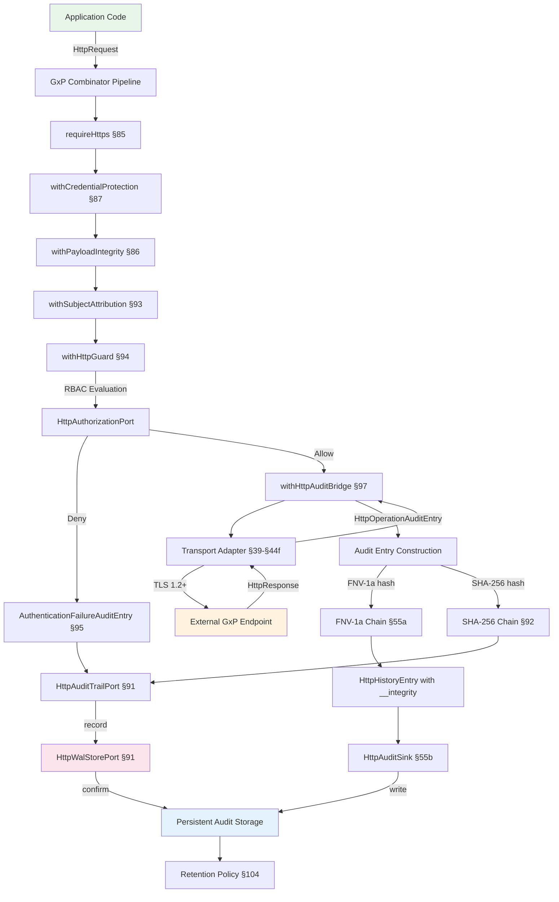
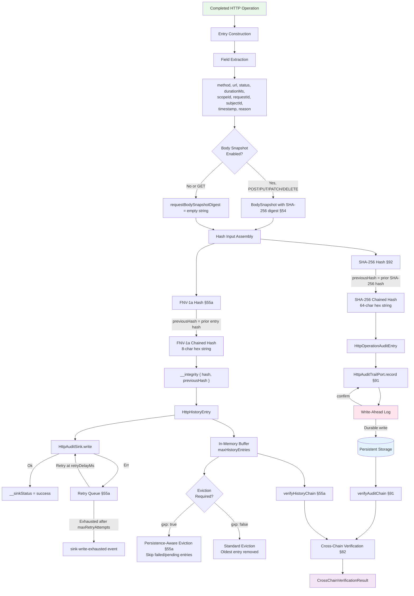
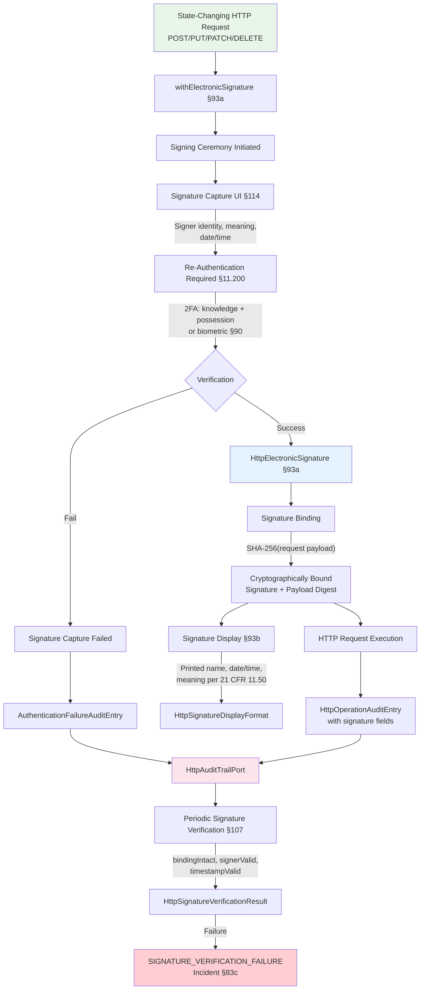
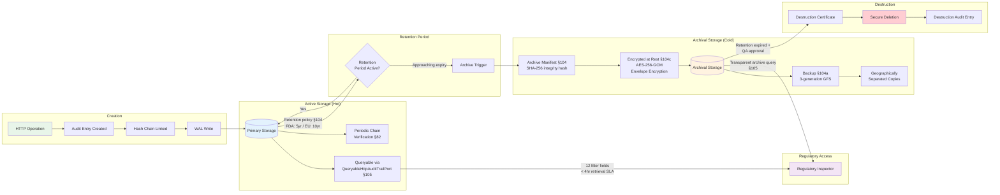

# 17 - GxP Compliance Guide

### Normative Language

The key words "MUST", "MUST NOT", "REQUIRED", "SHALL", "SHALL NOT", "SHOULD", "SHOULD NOT", "RECOMMENDED", "MAY", and "OPTIONAL" in this document are to be interpreted as described in [RFC 2119](https://www.ietf.org/rfc/rfc2119.txt). In pharmaceutical context, "MUST" carries the same weight as "SHALL" per ICH guidelines.

This chapter provides GxP compliance guidance specific to the HTTP transport layer implemented by `@hex-di/http-client`. It is intended for teams deploying this library in regulated environments (pharmaceutical, biotech, medical devices, clinical trials, laboratories) where 21 CFR Part 11, EU GMP Annex 11, and ALCOA+ data integrity principles apply.

> **Ecosystem Integration:** This library follows the HexDi port-based architecture. GxP capabilities (audit trails, authorization, electronic signatures, clock synchronization, crash recovery) are consumed through **ports defined by this spec**. Any HexDi ecosystem library — or custom adapter — can satisfy these ports. The `@hex-di/guard`, `@hex-di/clock`, and `@hex-di/audit` libraries are examples of adapter providers, but no specific library is a hard dependency. For full regulatory compliance, adapters MUST be registered for all REQUIRED ports (see §79 Port-Based Requirements).

---

## 79. Regulatory Context (HTTP Transport Scope)

### Applicable Regulations

| Regulation                  | Requirement                     | HTTP Client Relevance                                                                                                                                                     |
| --------------------------- | ------------------------------- | ------------------------------------------------------------------------------------------------------------------------------------------------------------------------- |
| **21 CFR 11.10(c)**         | Protection of records           | HTTP payloads in transit MUST be protected against tampering                                                                                                              |
| **21 CFR 11.10(e)**         | Audit trails for record changes | HTTP operations that create, modify, or delete GxP records MUST be audit-trailed                                                                                          |
| **21 CFR 11.30**            | Controls for open systems       | HTTP over untrusted networks requires TLS, digital signatures, encryption                                                                                                 |
| **21 CFR 11.50**            | Signature manifestations        | Electronic signatures applied to GxP records transmitted via HTTP MUST include signer identity, date/time, and meaning. Delegated to `HttpSignatureServicePort` (§93a)    |
| **21 CFR 11.100**           | Electronic signature controls   | Electronic signatures MUST be unique to one individual and verified before use. Delegated to `HttpSignatureServicePort` (§93a)                                            |
| **EU GMP Annex 11 §7**      | Data storage and integrity      | HTTP payloads constitute data in transit; integrity MUST be verifiable                                                                                                    |
| **EU GMP Annex 11 §9**      | Audit trails                    | Changes to GxP-relevant data via HTTP MUST produce audit records                                                                                                          |
| **EU GMP Annex 11 §10**     | Change management               | Changes to HTTP client configuration MUST be controlled and documented. See §88 of this spec                                                                              |
| **EU GMP Annex 11 §12**     | Security and access control     | HTTP operations carrying GxP data MUST enforce access control. See §85-§87 of this spec                                                                                   |
| **EU GMP Annex 11 §16**     | Business continuity             | HTTP client MUST support continuity during transient failures (circuit breakers, retry). Crash recovery of audit data requires a `HttpWalStorePort` adapter (§91)         |
| **ALCOA+ (all principles)** | Data integrity                  | HTTP operations MUST satisfy Attributable, Legible, Contemporaneous, Original, Accurate, Complete, Consistent, Enduring, Available                                        |
| **MHRA DI Guidance**        | Cloud-hosted data controls      | HTTP operations to cloud APIs MUST enforce TLS and credential protection                                                                                                  |
| **WHO TRS 1033 Annex 4**   | Data integrity and traceability | HTTP audit trails MUST satisfy data integrity requirements including traceability, retention, and completeness. See §104 (retention), §100 (traceability)                 |
| **PIC/S PI 041**            | Data management and integrity   | HTTP operations MUST comply with ALCOA+ data management practices; audit trail review and data governance per PIC/S guidance. See §80, §104, §105                         |

> **Software Classification:** This library is classified as GAMP 5 Category 5 (Custom Applications) software for GxP environments. See §108 for the formal classification statement, supply chain classification, and Category 5 implications. Category 5 software requires full validation including risk assessment, IQ/OQ/PQ qualification, and periodic review per GAMP 5 2nd Edition Appendix M4.

> **Training Requirements:** Personnel deploying this library in GxP environments MUST meet role-specific training requirements. See §109 for the training role matrix, record structure, and refresh triggers.

> **Port Dependencies:** GxP features depend on port adapters documented in §79 (Port-Based Requirements). Any HexDi ecosystem library or custom adapter can satisfy these ports.

### In-Scope Controls (Built Into @hex-di/http-client)

The following GxP-relevant controls are built into `@hex-di/http-client` without requiring any external port adapters:

| Control                        | Implementation                                                                                                                 | Spec Section |
| ------------------------------ | ------------------------------------------------------------------------------------------------------------------------------ | ------------ |
| **FNV-1a hash chain**          | `HttpHistoryEntry.__integrity` with chained hashes (non-GxP only; SHA-256 via HttpAuditTrailPort is REQUIRED when `gxp: true`) | §55a         |
| **Tamper detection**           | `verifyHistoryChain()` validates chain integrity                                                                               | §55a         |
| **Audit externalization**      | `HttpAuditSink` interface for long-term storage                                                                                | §55b         |
| **Error immutability**         | `Object.freeze()` on all error constructors                                                                                    | §23          |
| **Monotonic timing**           | `monotonicNow()` for immune-to-NTP duration measurement                                                                        | §54, §55a    |
| **Disabled-audit warning**     | `HTTP_WARN_001` emitted when recording is off                                                                                  | §55c         |
| **Request attribution**        | `scopeId`, `requestId` on every history entry                                                                                  | §54          |
| **Sequence ordering**          | Monotonic `sequenceNumber` on all entries and events                                                                           | §54, §56     |
| **GxP fail-fast**              | `gxp: true` validates `HttpAuditTrailPort` presence and rejects `mode: "off"` at construction time                             | §54, §55a    |
| **Body snapshot**              | `BodySnapshot` captures structured body metadata with SHA-256 digest for GxP audit completeness                                | §54          |
| **Persistence-aware eviction** | Entries with failed/pending sink writes protected from eviction when `gxp: true`                                               | §55a         |

> **FNV-1a limitation:** The FNV-1a 32-bit hash used in `@hex-di/http-client` is a non-cryptographic hash with ~1 in 4.3 billion collision probability per pair. It is effective for detecting accidental corruption but trivially invertible and insufficient for defending against deliberate adversarial tampering per NIST SP 800-38D and FDA Guidance for Industry: Cybersecurity. FNV-1a MUST NOT be the sole audit integrity mechanism in 21 CFR Part 11 or EU GMP Annex 11 regulated environments. Register an `HttpAuditTrailPort` adapter providing SHA-256 cryptographic audit chains per FIPS 180-4.

```
REQUIREMENT: When `gxp: true` is set in HttpClientInspectorConfig, SHA-256 audit
             integrity via HttpAuditTrailPort (§91-§97 of this spec) MUST be active.
             The createHttpClientInspectorAdapter factory MUST verify at construction
             time that an HttpAuditTrailPort adapter providing SHA-256 hash chains is
             registered. If HttpAuditTrailPort is not registered, the factory MUST
             throw a ConfigurationError with error code "GXP_AUDIT_INSUFFICIENT" and
             the message: "GxP mode requires SHA-256 audit integrity via
             HttpAuditTrailPort. FNV-1a hash chains alone do not satisfy 21 CFR Part 11
             or EU GMP Annex 11 audit trail requirements." FNV-1a remains active as a
             secondary tamper-detection layer but is not sufficient on its own for GxP.
             Reference: 21 CFR 11.10(c), EU GMP Annex 11 §7.
```

```
REQUIREMENT: If the HttpAuditTrailPort providing SHA-256 becomes unavailable at
             runtime (e.g., audit backend connectivity loss, HSM failure, adapter
             disposal), all GxP HTTP operations MUST be blocked with error code
             "GXP_AUDIT_DEGRADED" and an HttpRequestError stating: "SHA-256 audit
             integrity is temporarily unavailable. GxP operations are blocked per
             21 CFR 11.10(c) until audit integrity is restored." The HTTP client
             MUST NOT fall back to FNV-1a-only audit recording for any GxP
             operation. This requirement complements CF-02 (§115.2) by ensuring
             runtime loss — not just construction-time absence — is handled.
             Reference: 21 CFR 11.10(c), EU GMP Annex 11 §7, §13.
```

### Now-In-Scope Controls (Moved to This Spec)

The following GxP controls are defined within this specification as sections §84-§103:

| Control                          | Combinator / Feature                            | Spec Section | Regulatory Driver                   |
| -------------------------------- | ----------------------------------------------- | ------------ | ----------------------------------- |
| **HTTPS enforcement**            | `requireHttps()` combinator                     | §85          | 21 CFR 11.30                        |
| **Payload integrity**            | `withPayloadIntegrity()` combinator             | §86          | 21 CFR 11.10(c)                     |
| **Credential protection**        | `withCredentialProtection()` combinator         | §87          | 21 CFR 11.300                       |
| **Access control**               | `requireHttps()` + `withCredentialProtection()` | §85, §87     | EU GMP Annex 11 §12                 |
| **Configuration change control** | `HttpClientConfigurationAuditEntry`             | §88          | EU GMP Annex 11 §10                 |
| **Payload schema validation**    | `withPayloadValidation()` combinator            | §89          | 21 CFR 11.10(h)                     |
| **Token lifecycle management**   | `withTokenLifecycle()` combinator               | §90          | 21 CFR 11.300                       |
| **SHA-256 audit trail**          | `HttpAuditTrailPort` with cryptographic chains  | §92          | 21 CFR 11.10(e)                     |
| **Electronic signature bridge**  | `withElectronicSignature()` combinator          | §93a         | 21 CFR 11.50, 11.70, 11.100, 11.200 |

### Port-Based Requirements (GxP Mode)

When `gxp: true` is set, the HTTP client requires adapters for specific ports. These ports are **defined by this spec** — any HexDi ecosystem library or custom adapter can satisfy them.

| Port | Purpose | Regulatory Driver | Error Code If Missing |
|------|---------|-------------------|-----------------------|
| `HttpAuditTrailPort` (§91) | SHA-256 audit chain integrity | 21 CFR 11.10(e), EU GMP Annex 11 §7 | `GXP_AUDIT_INSUFFICIENT` |
| `HttpWalStorePort` (§91) | Write-ahead log crash recovery | EU GMP Annex 11 §16 | `GXP_WAL_PORT_MISSING` |
| `HttpClockSourcePort` (§96) | Temporal consistency with drift detection | ALCOA+ Contemporaneous, EU GMP Annex 11 §9 | `GXP_CLOCK_PORT_MISSING` |
| `HttpSubjectProviderPort` (§93) | Subject attribution | 21 CFR 11.10(d), ALCOA+ Attributable | `GXP_SUBJECT_PORT_MISSING` |
| `HttpSignatureServicePort` (§93a) | Electronic signature lifecycle delegation | 21 CFR 11.50, 11.100 | `GXP_SIGNATURE_PORT_MISSING` |
| `HttpAuthorizationPort` (§94) | RBAC and access control evaluation | 21 CFR 11.10(d), 11.10(g) | `GXP_AUTHORIZATION_PORT_MISSING` |

```
REQUIREMENT: When `gxp: true` is set in the HTTP client configuration, the
             `createGxPHttpClient` factory (§103) and the `createHttpAuditTrailAdapter`
             factory (§91) MUST verify at construction time that adapters are
             registered for all REQUIRED ports listed above. If any REQUIRED port
             adapter is missing, the factory MUST throw a ConfigurationError with
             the corresponding error code and a message identifying which port
             is absent and the regulatory driver requiring it.
             No specific library is mandated — any adapter satisfying the port
             contract is acceptable. This follows the hexagonal architecture
             principle: ports define contracts, adapters implement them, and the
             container composes them.
             Reference: GAMP 5 Category 5, 21 CFR 11.10(a), EU GMP Annex 11 §4.
```

> **Ecosystem adapter providers:** The HexDi ecosystem provides ready-made adapters for these ports:
> - `@hex-di/guard` can provide adapters for `HttpAuthorizationPort`, `HttpSubjectProviderPort`, and `HttpSignatureServicePort`
> - `@hex-di/clock` can provide adapters for `HttpClockSourcePort`
> - `@hex-di/audit` can provide adapters for `HttpAuditTrailPort` and `HttpWalStorePort`
>
> Organizations MAY also implement custom adapters for any of these ports. The HTTP client validates the port contract, not the adapter's provenance.

### Delegated Capabilities (Consumed via Ports)

The following GxP capabilities are consumed through ports, not implemented by the HTTP client:

| Capability                         | Port                          | Spec Section | Regulatory Driver    |
| ---------------------------------- | ----------------------------- | ------------ | -------------------- |
| **Electronic signature lifecycle** | `HttpSignatureServicePort`    | §93a         | 21 CFR 11.50, 11.100 |
| **Crash recovery (WAL)**           | `HttpWalStorePort`            | §91          | EU GMP Annex 11 §16  |
| **Authorization evaluation**       | `HttpAuthorizationPort`       | §94          | 21 CFR 11.10(d)      |
| **Clock synchronization**          | `HttpClockSourcePort`         | §96          | ALCOA+ Contemporaneous |

> **Electronic signatures:** The core electronic signature lifecycle (capture, verification, storage) is delegated to `HttpSignatureServicePort` (§93a). `@hex-di/http-client` provides a **transport-level bridge** via the `withElectronicSignature()` combinator that binds captured signatures to specific HTTP operations. This bridge satisfies 21 CFR 11.70 (signature/record linking) by cryptographically binding signatures to HTTP request content. The `withElectronicSignature()` combinator delegates to `HttpSignatureServicePort` for actual signature capture and 2FA verification — it does not implement signature lifecycle itself.

```
REQUIREMENT: GxP deployments that transmit, modify, or store regulated data via HTTP
             MUST use HTTP transport combinators (sections 84-90 of this spec) for
             full compliance coverage. The built-in controls in @hex-di/http-client
             provide basic audit integrity (FNV-1a hash chain, error freezing, monotonic
             timing) but do NOT satisfy the full scope of 21 CFR Part 11 or EU GMP
             Annex 11 requirements for transport security, credential management, or
             cryptographic audit trails.
             Reference: 21 CFR 11.10(e), 21 CFR 11.30, EU GMP Annex 11 §7, §9, §12.
```

```
REQUIREMENT: For browser-based GxP deployments, CORS hardening is REQUIRED per
             13-advanced.md section 68a (CORS Considerations for GxP Data). The
             CORS configuration MUST be validated during OQ (see OQ-HT-64 in §99b).
             For Content Security Policy (CSP) considerations when inspection
             data is displayed in browser-based review interfaces, see the
             relevant ecosystem library's React integration documentation.
             These cross-cutting security controls complement the transport-level
             controls in this chapter and the transport security controls in sections 84-90.
             Reference: 21 CFR 11.30, ALCOA+ Complete.
```

---

## 79a. GxP Data Flow Diagrams

This section provides formal Data Flow Diagrams (DFDs) for GxP HTTP operations, satisfying GAMP 5 §D.5 and ALCOA+ Legible requirements for visual representation of regulated data paths.

### DFD-1: Normal GxP HTTP Operation Flow

This diagram shows the end-to-end data flow for a standard GxP HTTP operation from client request through audit trail persistence.



### DFD-2: Audit Trail Data Flow (Dual Hash Chain Architecture)

This diagram details how audit data flows through the FNV-1a and SHA-256 dual hash chain architecture from entry creation through persistent storage and verification.



### DFD-3: Electronic Signature Capture Flow

This diagram shows the data flow for electronic signature operations on GxP HTTP requests, per 21 CFR 11.50/11.70/11.100/11.200.



### DFD-4: Audit Data Lifecycle

This diagram shows the complete lifecycle of HTTP audit trail data from creation through retention, archival, and eventual destruction, per EU GMP Annex 11 §5 (Data Lifecycle) and §7 (Data Storage).



**Lifecycle Phases:**

| Phase | Duration | Storage Type | Integrity Mechanism | Access SLA | Regulatory Reference |
| ----- | -------- | ------------ | ------------------- | ---------- | -------------------- |
| **Active** | Current operations | Hot (database/append-only log) | SHA-256 hash chain + FNV-1a secondary | Real-time query | 21 CFR 11.10(e) |
| **Retention** | 5 years (FDA) / 10 years (EU GMP) | Hot or warm | Hash chain preserved | < 4 hours | 21 CFR 211.180, EU GMP Annex 11 §7 |
| **Archival** | Beyond active retention | Cold (encrypted, compressed) | Archive manifest with SHA-256 | < 72 hours | EU GMP Annex 11 §17 |
| **Destruction** | Post-retention expiry | N/A | Destruction certificate | N/A | MHRA DI Guidance §6.20 |

---

## 80. ALCOA+ Mapping for HTTP Operations

This section maps all 9 ALCOA+ data integrity principles to their implementation in `@hex-di/http-client`.

| ALCOA+ Principle    | HTTP Client Implementation                                                                                                                                                                                                                                                                                                                                                                  | Consumer Responsibility                                                                                                                                                                                        |
| ------------------- | ------------------------------------------------------------------------------------------------------------------------------------------------------------------------------------------------------------------------------------------------------------------------------------------------------------------------------------------------------------------------------------------- | -------------------------------------------------------------------------------------------------------------------------------------------------------------------------------------------------------------- |
| **Attributable**    | `scopeId` on `ActiveRequest` and `HttpHistoryEntry` identifies the scope (user/session) that initiated the request. `requestId` uniquely identifies each operation.                                                                                                                                                                                                                         | Consumers MUST configure scoped clients with meaningful `scopeId` values that trace back to authenticated users.                                                                                               |
| **Legible**         | `HttpHistoryEntry` fields use standard types (string URLs, numeric status codes, ISO timestamps). Error messages are human-readable. `CombinatorInfo` provides readable config summaries.                                                                                                                                                                                                   | Consumers SHOULD externalize audit entries via `HttpAuditSink` to a searchable, queryable store.                                                                                                               |
| **Contemporaneous** | `monotonicNow()` timestamps on `startedAtMono` and `completedAtMono` are captured at the moment of request start and completion. `sequenceNumber` provides monotonic ordering.                                                                                                                                                                                                              | Consumers MUST NOT post-date or pre-date audit entries. `HttpAuditSink.write()` is called synchronously after entry creation.                                                                                  |
| **Original**        | `Object.freeze()` on all error objects prevents mutation after creation. `__integrity` hash chain ensures entries are not modified after recording. `HttpHistoryEntry` fields are `readonly`.                                                                                                                                                                                               | Consumers MUST NOT reconstruct or transform entries before writing to the audit sink. The sink receives the original entry.                                                                                    |
| **Accurate**        | `durationMs` is computed from `completedAtMono - startedAtMono` (monotonic, not wall-clock). Status codes, URLs, and error reasons are captured directly from the transport adapter response.                                                                                                                                                                                                | Consumers SHOULD enable `verifyHistoryChain()` checks periodically to confirm entry accuracy has not been compromised.                                                                                         |
| **Complete**        | Every completed request produces an `HttpHistoryEntry` (when mode is `"full"` or `"lightweight"`). `HTTP_WARN_001` is emitted when recording is disabled. `BodySnapshot` captures request/response body metadata when `captureBodySnapshot` is enabled. `gxp: true` rejects `mode: "off"` at construction time. Retry queue ensures failed sink writes are retried before data loss occurs. | Consumers in GxP environments MUST NOT set `mode: "off"`. The warning exists as a compliance safety net. Consumers SHOULD enable `captureBodySnapshot` for POST/PUT/PATCH/DELETE operations carrying GxP data. |
| **Consistent**      | Hash chain links entries in insertion order. `sequenceNumber` is strictly monotonic. `verifyHistoryChain()` detects gaps or reordering.                                                                                                                                                                                                                                                     | Consumers SHOULD compare `sequenceNumber` values in externalized entries to detect missing records.                                                                                                            |
| **Enduring**        | `HttpAuditSink` interface externalizes entries to persistent storage. In-memory buffer is bounded by `maxHistoryEntries` but sink receives entries before eviction. Retry queue recovers from transient sink failures. Persistence-aware eviction (when `gxp: true`) protects unpersisted entries from eviction. `gxp: true` requires a durable `auditSink` at construction time.           | Consumers MUST implement `HttpAuditSink` with durable storage (database, append-only log) for GxP retention requirements. For full crash recovery, register an `HttpWalStorePort` adapter (§91).               |
| **Available**       | `HttpClientInspector` provides real-time query access. MCP resources (§57) expose audit data to AI diagnostics. `HttpClientSnapshot` is serializable.                                                                                                                                                                                                                                       | Consumers SHOULD configure MCP resource exposure for regulatory inspection access.                                                                                                                             |

---

## 80a. Transport Adapter Switchover Data Integrity

When a GxP deployment changes the underlying transport adapter (e.g., migrating from `FetchHttpClientAdapter` to `UndiciHttpClientAdapter` or `BunHttpClientAdapter`), hash chain continuity and ALCOA+ Consistent compliance must be maintained.

### Switchover Scenarios

| Scenario                        | Example                                               | Risk Level                                                          |
| ------------------------------- | ----------------------------------------------------- | ------------------------------------------------------------------- |
| **Runtime adapter replacement** | Switching from Fetch to Undici in a new release       | Medium — hash chain continues if same `HttpAuditTrailPort` instance |
| **Gradual traffic migration**   | Canary deployment routing % of traffic to new adapter | High — two adapter instances may produce interleaved audit entries  |
| **Platform migration**          | Moving from Node.js to Bun runtime                    | High — adapter change coincides with runtime change                 |

### Requirements

```
REQUIREMENT: Transport adapter switchovers MUST NOT break hash chain continuity.
             The hash chain is maintained by HttpAuditTrailPort (§91 of this spec)
             and HttpHistoryEntry.__integrity (§55a), NOT by the transport adapter.
             When the transport adapter changes, the audit trail port instance MUST
             remain the same (or be migrated per §104b) to preserve sequential
             hash chaining. The new adapter's first request MUST chain from the
             previous adapter's last entry.
             Reference: ALCOA+ Consistent, 21 CFR 11.10(e).
```

```
REQUIREMENT: During gradual traffic migration (canary/blue-green deployments)
             where two adapter instances serve traffic concurrently, both instances
             MUST share the same HttpAuditTrailPort instance or use a coordinated
             sequencing mechanism that guarantees: (1) globally monotonic
             sequenceNumber values across both adapters, (2) unbroken hash chain
             linking entries from both adapters in sequence order, and (3) no
             duplicate sequenceNumber values. If shared HttpAuditTrailPort is
             not feasible, the deployment MUST use a merge-and-rechain procedure
             after cutover that produces a unified, verified hash chain.
             Reference: ALCOA+ Consistent, ALCOA+ Complete.
```

```
REQUIREMENT: Transport adapter switchovers in GxP environments MUST be recorded
             as HttpClientConfigurationAuditEntry records (§88) with: (1) the
             previous adapter identifier, (2) the new adapter identifier,
             (3) the switchover timestamp, (4) the reason for the change, and
             (5) the sequenceNumber of the last entry produced by the previous
             adapter. This enables auditors to identify the exact point in the
             audit trail where the adapter changed.
             Reference: EU GMP Annex 11 §10, 21 CFR 11.10(e).
```

```
REQUIREMENT: Organizations MUST validate adapter switchovers as part of OQ
             (§99b) per 21 CFR 11.10(a). The validation MUST include:
             (1) hash chain verification spanning entries from both the old
             and new adapters, (2) cross-correlation check confirming
             evaluationId links remain valid, (3) timestamp consistency check
             confirming monotonic ordering across the switchover boundary, and
             (4) comparison of HTTP response metadata fields populated by each
             adapter to detect behavioral differences. Switchover validation
             results MUST be documented as part of the change control record (§88).
             Reference: 21 CFR 11.10(a), EU GMP Annex 11 §10.
```

---

## 80b. Consumer Validation Responsibilities

This section quantifies the validation burden on organizations deploying `@hex-di/http-client` in GxP environments. The library provides composable GxP controls at the transport layer, but certain controls are intentionally deferred to the consumer's infrastructure, platform, or operational procedures. Organizations MUST validate these deferred controls as part of their site-specific Validation Plan (§83a).

### Deferred Controls Requiring Consumer Validation

| # | Deferred Control | Library Provides | Consumer MUST Provide | Regulatory Driver | Validation Evidence |
| - | ---------------- | ---------------- | --------------------- | ----------------- | ------------------- |
| CV-01 | **TLS implementation** | `requireHttps()` combinator enforces URL scheme and reports negotiated TLS version | Actual TLS handshake, cipher negotiation, and certificate chain verification via platform TLS stack (OpenSSL, BoringSSL, etc.) | 21 CFR 11.30, EU GMP Annex 11 §12 | IQ: Verify platform TLS library version; OQ: Confirm TLS 1.2+ negotiation with target endpoints |
| CV-02 | **DNS resolution security** | Mitigation guidance in §84; `withSsrfProtection()` blocks private IPs post-resolution | DNSSEC validation, DNS-over-HTTPS/TLS, or static host resolution for critical GxP endpoints | 21 CFR 11.30, NIST SP 800-81-2 | IQ: Document DNS resolver configuration; OQ: Verify DNSSEC validation or compensating controls |
| CV-03 | **Audit trail persistent storage** | `HttpAuditSink` interface; `HttpAuditTrailPort` contract; retry queue for transient failures | Durable storage backend (database, append-only log) implementing `HttpAuditSink` with ACID properties | 21 CFR 11.10(e), ALCOA+ Enduring | IQ: Verify storage backend deployment; OQ: Confirm write durability under failure; PQ: Verify retention period compliance |
| CV-04 | **Identity provider integration** | `HttpSubjectProviderPort` contract; `withSubjectAttribution()` combinator | IAM system (LDAP, OIDC, SAML) providing authenticated user identity per scope | 21 CFR 11.10(d), ALCOA+ Attributable | IQ: Verify IAM connectivity; OQ: Confirm user identity resolution; PQ: Verify segregation of duties |
| CV-05 | **Clock source** | `HttpClockSourcePort` contract; 1-second drift threshold; UTC-Z mandate | NTP-synchronized system clock or dedicated time server for the runtime environment | ALCOA+ Contemporaneous, EU GMP Annex 11 §9 | IQ: Verify NTP configuration; OQ: Confirm drift < 1 second against reference |
| CV-06 | **Key management** | `HttpAuditEncryptionPort` contract; key ceremony procedures in §104c | KMS or HSM providing encryption keys for audit data-at-rest encryption | 21 CFR 11.30, EU GMP Annex 11 §12 | IQ: Verify KMS deployment; OQ: Confirm encryption/decryption round-trip; PQ: Verify key rotation |
| CV-07 | **Certificate revocation infrastructure** | `CertificateRevocationPolicy` contract; OCSP/CRL method priority | Network access to OCSP responders and/or CRL distribution points; or documented justification for disabling | 21 CFR 11.30, NIST SP 800-52r2 | IQ: Verify OCSP/CRL endpoint accessibility; OQ: Confirm revocation detection for revoked certificates |
| CV-08 | **Backup and restore infrastructure** | `HttpAuditArchivalPort` contract; 3-generation GFS backup specification in §104a | Backup storage, scheduling, monitoring, and verified restore procedures | EU GMP Annex 11 §7, 21 CFR 11.10(c) | IQ: Verify backup infrastructure; OQ: Execute verified restore; PQ: Confirm retention period coverage |
| CV-09 | **Network infrastructure** | Transport adapter abstraction; timeout and retry combinators | Firewall rules, load balancer configuration, network segmentation for GxP traffic | EU GMP Annex 11 §12, 21 CFR 11.30 | IQ: Document network topology; OQ: Verify connectivity to all GxP endpoints |
| CV-10 | **Operational procedures** | Incident classification framework (§83c); periodic review triggers (§83b); change control process (§116) | SOPs for incident response, periodic review execution, change control approvals, and deviation handling | EU GMP Annex 11 §10, §13, GAMP 5 | IQ: Verify SOPs exist; OQ: Execute tabletop incident exercise; PQ: Confirm SOP adherence during live operations |
| CV-11 | **DNS security risk acceptance** | DNS security mitigation guidance in §84; `withSsrfProtection()` blocks post-resolution private IPs | Organization MUST document DNS resolution security controls (DNSSEC, DoH/DoT) or formally accept residual DNS risk per ICH Q9 risk acceptance criteria | 21 CFR 11.30, NIST SP 800-81-2 | IQ: Document DNS resolver and security controls; OQ: Verify DNSSEC validation or document risk acceptance with compensating controls (e.g., certificate pinning §85); PQ: Confirm DNS monitoring is operational |

```
REQUIREMENT: Organizations MUST document the validation approach for each deferred
             control (CV-01 through CV-11) in Section 7 (Test Strategy) of the
             Validation Plan (§83a). For each control, the Validation Plan MUST
             specify: (1) the consumer-provided component, (2) the qualification
             level (IQ/OQ/PQ), (3) the acceptance criteria, and (4) the responsible
             role from §109. Controls that are not applicable to the deployment
             (e.g., CV-06 if encryption is not required) MUST be documented as
             "Not Applicable" with a risk-based justification referencing the FMEA
             (§98).
             Reference: GAMP 5 §D.4, EU GMP Annex 11 §4.
```

```
REQUIREMENT: The site-specific Validation Plan (§83a) MUST include a Consumer
             Validation Matrix that maps each CV-XX item to the organization's
             specific infrastructure components, responsible personnel, and
             target completion dates. The matrix MUST be reviewed and approved
             by the QA Approver identified in the Validation Plan before IQ
             begins. Incomplete consumer validation items MUST block progression
             from OQ to PQ.
             Reference: GAMP 5 §D.8, EU GMP Annex 11 §4.3.
```

### Consumer Validation Effort Estimate

The following table provides guidance on the relative validation effort for each deferred control, enabling organizations to plan their validation activities. Effort estimates are based on GAMP 5 Category 5 validation expectations for a single GxP deployment.

| Control | IQ Effort | OQ Effort | PQ Effort | Total Relative Effort |
| ------- | --------- | --------- | --------- | --------------------- |
| CV-01 (TLS) | Low — version check | Medium — endpoint verification | Low — included in pipeline | Medium |
| CV-02 (DNS) | Low — configuration check | Low — resolution verification | N/A | Low |
| CV-03 (Audit storage) | Medium — backend deployment | High — durability + failure testing | High — retention verification | High |
| CV-04 (Identity) | Medium — IAM connectivity | High — identity resolution + SoD | Medium — live user verification | High |
| CV-05 (Clock) | Low — NTP check | Low — drift measurement | Low — ongoing monitoring | Low |
| CV-06 (KMS) | Medium — KMS deployment | Medium — round-trip verification | Low — rotation verification | Medium |
| CV-07 (Revocation) | Low — endpoint accessibility | Medium — revoked cert detection | Low — ongoing monitoring | Medium |
| CV-08 (Backup) | Medium — infrastructure | High — verified restore | Medium — retention coverage | High |
| CV-09 (Network) | Low — topology documentation | Medium — connectivity verification | Low — included in pipeline | Medium |
| CV-10 (Procedures) | Medium — SOP creation | Medium — tabletop exercise | High — live SOP adherence | High |
| CV-11 (DNS security) | Low — resolver documentation | Low — DNSSEC/DoH verification or risk acceptance | Low — ongoing monitoring | Low |

> **Note:** These effort estimates are relative guidance, not time commitments. Actual effort depends on the organization's existing infrastructure maturity, regulatory jurisdiction requirements, and the number of GxP endpoints being validated.

---

## 81. Ecosystem Port Integration

This section maps the HTTP client's built-in features to the port-based GxP enhancements that extend them for full regulatory compliance. The "Enhancement" column describes the capability; the "Port" column identifies which HTTP client port provides it.

| HTTP Client Feature                  | GxP Enhancement                              | Port / Section      | Relationship                                                                                                                                               |
| ------------------------------------ | -------------------------------------------- | ------------------- | ---------------------------------------------------------------------------------------------------------------------------------------------------------- |
| FNV-1a hash chain (`__integrity`)    | SHA-256 hash chain                           | `HttpAuditTrailPort` §92 | Port adapter upgrades the hash algorithm from FNV-1a (tamper detection) to SHA-256 (cryptographic integrity)                                         |
| `HttpAuditSink.write()`              | Durable audit recording                      | `HttpAuditTrailPort` §92 | Port adapter provides write guarantees, sequential ordering, and regulatory-grade persistence                                                        |
| `monotonicNow()` timing              | Clock drift detection and correction         | `HttpClockSourcePort` §96 | Port adapter adds NTP monitoring, drift detection, and correction capabilities                                                                       |
| `Object.freeze()` error immutability | Credential redaction in error messages       | §87 (this spec)     | `withCredentialProtection()` sanitizes error messages before they reach callers; frozen errors contain only redacted content                                |
| `HTTP_WARN_001` audit warning        | Compliance warning framework                 | §55c (this spec)    | HTTP audit warnings integrate into ecosystem-wide compliance warning patterns                                                                              |
| `errorCode()` (HTTP0xx namespace)    | Transport security error codes               | §85-§90 (this spec) | Transport security combinators add HTTPS_xxx error codes that complement the HTTP client's error namespace                                                 |
| `HttpClientInspector` snapshot       | GxP inspection with regulatory metadata      | §92 (this spec)     | Regulatory context (validation status, qualification evidence) enriches snapshots                                                                           |
| `HttpHistoryEntry.scopeId`           | Actor attribution with electronic signatures | `HttpSubjectProviderPort` §93, `HttpSignatureServicePort` §93a | Port adapters bind scopeId to authenticated identities with signature evidence |

---

## 81a. GxP Combinator Requirement Levels

This section defines the normative requirement levels for GxP-related HTTP client combinators. Combinators are classified as REQUIRED, RECOMMENDED, or CONDITIONAL based on their regulatory significance.

| Combinator                   | Level                                                  | Condition                                                           | Spec Section | Regulatory Driver                              |
| ---------------------------- | ------------------------------------------------------ | ------------------------------------------------------------------- | ------------ | ---------------------------------------------- |
| `requireHttps()`             | **REQUIRED**                                           | Always; MUST be first combinator in chain                           | §85          | 21 CFR 11.30, EU GMP Annex 11 §12              |
| `withHttpAuditBridge()`      | **REQUIRED**                                           | Always; fail-fast validated at construction                         | §91, §97     | 21 CFR 11.10(e), ALCOA+ Complete               |
| `withCredentialProtection()` | **REQUIRED**                                           | Always                                                              | §87          | 21 CFR 11.300, OWASP                           |
| `withPayloadIntegrity()`     | **REQUIRED** (Category 1) / RECOMMENDED (Category 2-3) | REQUIRED for Category 1 GxP endpoints; RECOMMENDED for Category 2-3 | §86          | 21 CFR 11.10(c), ALCOA+ Accurate               |
| `withSubjectAttribution()`   | **REQUIRED**                                           | Always; user accountability is mandatory for all GxP operations     | §93          | 21 CFR 11.10(d), ALCOA+ Attributable           |
| `withPayloadValidation()`    | RECOMMENDED                                            | When structured data exchange is used                               | §89          | 21 CFR 11.10(h)                                |
| `withTokenLifecycle()`       | RECOMMENDED                                            | When session-based authentication is used                           | §90          | 21 CFR 11.300, EU GMP Annex 11 §12             |
| `withAuthFailureAudit()`     | CONDITIONAL                                            | REQUIRED when the system authenticates users for GxP HTTP operations; MAY be omitted only when authentication failure auditing is entirely delegated to an external system that provides equivalent 21 CFR 11.300 unauthorized use detection | §95          | 21 CFR 11.10(e), 11.300                        |
| `withAuthenticationPolicy()` | CONDITIONAL                                            | When MFA is mandated by organizational policy                       | §90          | 21 CFR 11.200, 11.300                          |
| `withElectronicSignature()`  | CONDITIONAL                                            | When electronic signatures are required for HTTP operations         | §93a         | 21 CFR 11.50, 11.70, 11.100                    |
| `withHttpGuard()`            | **REQUIRED**                                           | Always; default-deny posture enforced in GxP mode                   | §94          | 21 CFR 11.10(d), 11.10(g), EU GMP Annex 11 §12 |
| `withCorsHardening()`        | CONDITIONAL                                            | When browser-based GxP applications access regulated endpoints      | §112         | 21 CFR 11.30, EU GMP Annex 11 §12              |
| `rateLimit()`                | CONDITIONAL                                            | When endpoint rate limiting is needed for business continuity       | §113         | EU GMP Annex 11 §16                            |

```
REQUIREMENT: When `gxp: true` is set in the HTTP client configuration, omission of any
             REQUIRED combinator (requireHttps, withHttpAuditBridge, withCredentialProtection,
             withHttpGuard, withSubjectAttribution) MUST produce a ConfigurationError at
             construction time. The error MUST identify which REQUIRED combinator(s) are
             missing and reference the corresponding regulatory driver(s).
             The withHttpGuard() combinator is REQUIRED because all HTTP operations on
             regulated data MUST be gated by explicit access control policies with a
             default-deny posture. The withSubjectAttribution() combinator is REQUIRED
             because ALCOA+ Attributable mandates that every GxP operation be traceable
             to a specific individual — subject attribution is not optional in regulated
             environments. For Category 1 GxP endpoints (§84), withPayloadIntegrity()
             is also REQUIRED; its absence for a Category 1 endpoint MUST produce a
             ConfigurationError referencing §86 and the endpoint's data classification.
             Reference: GAMP 5 Category 5, 21 CFR 11.10(a), 21 CFR 11.10(c),
             21 CFR 11.10(d), EU GMP Annex 11 §12, ALCOA+ Attributable.
```

```
REQUIREMENT: When `gxp: true` is set and a CONDITIONAL combinator's condition applies
             (e.g., MFA mandated but withAuthenticationPolicy omitted), the system MUST
             emit a WARNING at construction time identifying the unmet condition and the
             regulatory implication of the omission.
             Reference: ICH Q9 Section 4 (Risk Communication).
```

```
RECOMMENDED: Organizations SHOULD use the `createGxPHttpClient` factory pattern (§103)
             to ensure all REQUIRED and applicable CONDITIONAL combinators are included
             by default. This factory pre-applies the REQUIRED combinators in the correct
             order and enables CONDITIONAL combinators based on the provided configuration.
```

### createGxPHttpClient Factory Usage Guidance

The `createGxPHttpClient` factory (§103) is the RECOMMENDED entry point for GxP deployments. It encapsulates the correct combinator ordering and ensures all REQUIRED combinators are applied. Usage:

```typescript
// Recommended GxP entry point — all REQUIRED combinators applied automatically
const gxpClient = createGxPHttpClient({
  // REQUIRED port adapters — factory validates these at construction time
  auditTrail: httpAuditTrailAdapter,       // §91 — SHA-256 audit chain
  subjectProvider: httpSubjectAdapter,      // §93 — user attribution
  authorization: httpAuthorizationAdapter,  // §94 — RBAC evaluation
  clockSource: httpClockSourceAdapter,      // §96 — NTP-synchronized timestamps
  walStore: httpWalStoreAdapter,            // §91 — crash recovery WAL

  // CONDITIONAL combinators — enabled based on deployment needs
  electronicSignature: httpSignatureAdapter, // §93a — when e-sig required
  payloadValidation: {                       // §89 — when structured data
    schemas: endpointSchemaMap,
  },
  tokenLifecycle: {                          // §90 — when session-based auth
    refreshThresholdMs: 60_000,
  },

  // GxP endpoint classification (§84)
  endpointClassification: gxpEndpointMap,

  // Inspector configuration
  inspector: {
    mode: "full",
    captureBodySnapshot: "request-and-response",
    gxp: true,
  },
});
```

The factory performs the following at construction time:
1. Validates all REQUIRED port adapters are provided (throws `ConfigurationError` if missing)
2. Applies REQUIRED combinators in normative order: `requireHttps` → `withCredentialProtection` → `withPayloadIntegrity` → `withSubjectAttribution` → `withHttpGuard` → `withHttpAuditBridge`
3. Applies CONDITIONAL combinators based on provided configuration
4. Validates combinator chain via `getCombinatorChain()` (§81b)
5. Returns a fully-configured `HttpClient` ready for GxP operations

```
REQUIREMENT: Organizations that bypass createGxPHttpClient and manually compose the
             combinator pipeline via pipe() MUST document their pipeline configuration
             in the site-specific Validation Plan (§83a) and MUST include OQ test cases
             verifying all REQUIRED combinators are present per §81a. The HttpClientInspector
             WARNING mechanism provides defense-in-depth but MUST NOT be the sole
             mechanism for detecting missing combinators in production deployments.
             Reference: GAMP 5 §D.4, 21 CFR 11.10(a).
```

### Compliance Validation Lint Rules

Organizations MAY implement automated compliance validation via lint rules or static analysis to supplement the runtime GxP combinator validation (§81b). The following lint rules are RECOMMENDED for CI/CD pipelines:

| Rule ID | Severity | Pattern | Purpose |
| ------- | -------- | ------- | ------- |
| `gxp/require-factory` | Warning | Detect `pipe(httpClient, ...)` without `createGxPHttpClient` | Encourage use of the validated factory entry point |
| `gxp/no-mode-off` | Error | Detect `mode: "off"` in `HttpClientInspectorConfig` when `gxp: true` | Prevent accidental audit disablement |
| `gxp/require-body-snapshot` | Warning | Detect `captureBodySnapshot: "off"` for state-changing operations on Category 1 endpoints | Ensure body audit completeness for critical data |
| `gxp/no-missing-reason` | Error | Detect POST/PUT/PATCH/DELETE to GxP endpoints without `reason` parameter | Enforce reason-for-change per 21 CFR 11.10(e) |
| `gxp/require-audit-sink` | Error | Detect `gxp: true` without `auditSink` configuration | Prevent silent audit data loss |

```
RECOMMENDED: Organizations SHOULD integrate GxP compliance lint rules into their CI/CD
             pipeline as a pre-deployment gate. Lint failures with Error severity MUST
             block deployment. Lint failures with Warning severity SHOULD be reviewed
             and documented. The lint rule set SHOULD be maintained under change control
             (§116) and reviewed during periodic compliance reviews.
             Reference: GAMP 5 §D.4 (verification activities), 21 CFR 11.10(a).
```

---

## 81b. GxP Combinator Validation Protocol

When `gxp: true` is set, the HTTP client factory MUST validate at construction time that all REQUIRED combinators (§81a) are present in the combinator chain. This validation provides a fail-fast mechanism that catches misconfiguration at startup rather than at the first HTTP request.

### Validation Mechanism

The `createGxPHttpClient` factory (§103) reads the combinator chain via `getCombinatorChain()` (§54) and verifies that each REQUIRED combinator is present:

| REQUIRED Combinator          | Combinator Name in Chain     | Regulatory Driver                              |
| ---------------------------- | ---------------------------- | ---------------------------------------------- |
| `requireHttps()`             | `"requireHttps"`             | 21 CFR 11.30, EU GMP Annex 11 §12              |
| `withHttpAuditBridge()`      | `"withHttpAuditBridge"`      | 21 CFR 11.10(e), ALCOA+ Complete               |
| `withCredentialProtection()` | `"withCredentialProtection"` | 21 CFR 11.300, OWASP                           |
| `withHttpGuard()`            | `"withHttpGuard"`            | 21 CFR 11.10(d), 11.10(g), EU GMP Annex 11 §12 |
| `withSubjectAttribution()`   | `"withSubjectAttribution"`   | 21 CFR 11.10(d), ALCOA+ Attributable           |

```
REQUIREMENT: The `createGxPHttpClient` factory MUST read the combinator chain via
             getCombinatorChain() after pipeline construction and verify that every
             REQUIRED combinator from §81a is present (requireHttps, withPayloadIntegrity,
             withCredentialProtection, withHttpGuard, withSubjectAttribution,
             withHttpAuditBridge). For Category 1 endpoints (§84), withPayloadIntegrity
             is unconditionally REQUIRED. If any REQUIRED combinator is missing, the
             factory MUST throw a ConfigurationError
             with error code "MISSING_REQUIRED_GXP_COMBINATOR" and a message that identifies:
             (1) the missing combinator name, (2) the regulatory driver requiring it,
             and (3) the spec section defining the combinator.
             Example message: "GxP validation failed: REQUIRED combinator
             'withHttpGuard' is missing from the combinator chain. This combinator
             is required by 21 CFR 11.10(d), 11.10(g) and EU GMP Annex 11 §12.
             See spec §94."
             Reference: GAMP 5 Category 5, 21 CFR 11.10(a).
```

```
REQUIREMENT: When the `createGxPHttpClient` factory is NOT used (i.e., the caller
             constructs the combinator pipeline manually via pipe()), the
             HttpClientInspector MUST emit a WARNING at construction time for each
             missing REQUIRED combinator detected via getCombinatorChain(). This
             defense-in-depth mechanism catches misconfiguration even when the
             recommended factory is bypassed. The WARNING MUST include the same
             diagnostic information as the ConfigurationError (combinator name,
             regulatory driver, spec section).
             Reference: ICH Q9 Section 4 (Risk Communication).
```

### Known Limitation: Runtime-Only Enforcement

The GxP combinator validation protocol operates at **runtime** (construction time), not at **compile time**. TypeScript's type system cannot currently enforce that a specific set of combinators has been applied to an `HttpClient` pipeline, because all combinators share the same function signature `(client: HttpClient) => HttpClient`. This means:

1. **Missing REQUIRED combinators are detected at application startup**, not during `tsc` compilation. The `createGxPHttpClient` factory throws `ConfigurationError` immediately, so the failure is deterministic and early — but it is not a compile-time guarantee.

2. **Compensating controls** that mitigate this limitation:
   - The `createGxPHttpClient` factory (§103) provides a single validated entry point that enforces all REQUIRED combinators at construction time
   - The `HttpClientInspector` WARNING mechanism (above) provides defense-in-depth when the factory is bypassed
   - OQ checks OQ-HT-70 through OQ-HT-73 verify combinator presence in the qualification protocol
   - The Validation Plan (§83a) requires documentation of the combinator pipeline configuration
   - Periodic review (§83b) checks for configuration drift

3. **Future consideration:** If TypeScript introduces branded function composition or effect-tracking capabilities, compile-time enforcement of REQUIRED combinators could be explored. Until then, the runtime factory + OQ verification approach provides equivalent assurance for GxP purposes.

```
OBSERVATION: The runtime-only enforcement of REQUIRED combinators is a known limitation
             documented per ICH Q9 risk communication principles. The compensating
             controls (factory validation, inspector warnings, OQ checks, Validation Plan
             documentation, periodic review) collectively provide equivalent assurance to
             compile-time enforcement. Organizations SHOULD document this limitation and
             its compensating controls in their site-specific Validation Plan (§83a
             section 5, Risk Assessment).
```

---

## 82. Cross-Chain Integrity Verification

When both the HTTP client's built-in FNV-1a chain and an `HttpAuditTrailPort` adapter providing SHA-256 chains are active, two independent hash chains exist for HTTP operations. This section specifies how to verify consistency between them.

### CrossChainVerificationResult

```typescript
interface CrossChainVerificationResult {
  /** Unique identifier for this verification evaluation. */
  readonly evaluationId: string;

  /** Whether the SHA-256 audit trail chain (via HttpAuditTrailPort) is intact. */
  readonly auditTrailChainIntact: boolean;

  /** Whether the HTTP client's built-in FNV-1a chain is intact. */
  readonly httpChainIntact: boolean;

  /**
   * Whether timestamps are consistent between chains.
   * Checks that entries with the same requestId have matching
   * monotonic timestamps (within a tolerance of 1ms).
   */
  readonly timestampConsistent: boolean;

  /**
   * Whether correlation IDs (requestId, scopeId) match between chains.
   * Every entry in the HTTP chain with a corresponding authorization audit entry
   * must have matching requestId and scopeId values.
   */
  readonly correlationValid: boolean;

  /** ISO 8601 UTC timestamp of the verification. */
  readonly verifiedAt: string;

  /** Number of entries compared. */
  readonly entriesCompared: number;

  /** Discrepancies found (empty when all checks pass). */
  readonly discrepancies: ReadonlyArray<{
    readonly requestId: string;
    readonly field: string;
    readonly httpValue: string;
    readonly auditTrailValue: string;
  }>;
}
```

```
REQUIREMENT: When `gxp: true` is set and both the HTTP client's FNV-1a chain and an
             HttpAuditTrailPort adapter (SHA-256 chain) are active, cross-chain consistency
             checks using CrossChainVerificationResult MUST be performed at least once
             per container lifecycle (e.g., during graceful shutdown) and on-demand
             when audit integrity concerns arise. When both chains are active, the
             runtime MUST execute cross-chain verification during graceful shutdown
             and MUST expose a `verifyCrossChain()` method on the HttpClientInspector
             for on-demand verification. Discrepancies between the two chains MUST
             produce a CRITICAL alert and MUST be recorded as an
             HttpClientConfigurationAuditEntry with configurationKey
             "CROSS_CHAIN_INTEGRITY_VIOLATION".
             Reference: EU GMP Annex 11 §7 (data integrity), ALCOA+ Consistent,
             21 CFR 11.10(e).
```

```
REQUIREMENT: Organizations MUST additionally schedule periodic cross-chain
             verification at a configurable interval (REQUIRED: hourly for
             active scopes) to detect integrity divergence earlier than graceful
             shutdown. Automated cross-chain verification results MUST be
             included in periodic review documentation (§83b).
             Reference: EU GMP Annex 11 §7, ALCOA+ Consistent.
```

### Verification Logic

Cross-chain verification proceeds as follows:

1. Call `verifyHistoryChain()` on the HTTP client history to verify the FNV-1a chain.
2. Call `verifyAuditChain()` on the `HttpAuditTrailPort` to verify the SHA-256 chain.
3. For each `requestId` present in both chains, compare monotonic timestamps and correlation fields.
4. Report discrepancies with the specific field and values that differ.

```typescript
// Example: periodic cross-chain verification
const httpHistory = inspector.getHistory();
const auditTrailEntries = auditTrail.getEntries();

const result: CrossChainVerificationResult = {
  evaluationId: generateEvaluationId(),
  httpChainIntact: verifyHistoryChain(httpHistory),
  auditTrailChainIntact: auditTrail.verifyChain(),
  timestampConsistent: verifyTimestampConsistency(httpHistory, auditTrailEntries),
  correlationValid: verifyCorrelation(httpHistory, auditTrailEntries),
  verifiedAt: new Date().toISOString(),
  entriesCompared: httpHistory.length,
  discrepancies: findDiscrepancies(httpHistory, auditTrailEntries),
};

if (!result.httpChainIntact || !result.auditTrailChainIntact) {
  logger.error("Audit chain integrity violation detected", { evaluationId: result.evaluationId });
}
```

---

## 83. Audit Entry Schema Versioning Strategy

When `HttpAuditSink` entries are externalized to persistent storage, the entry schema may evolve across library versions. This section specifies versioning conventions for externalized audit entries.

```
RECOMMENDED: Externalized HttpHistoryEntry records SHOULD include a schemaVersion field
             indicating the version of the entry schema used at creation time. The
             schemaVersion follows the library's semver version (e.g., "0.1.0") and
             enables downstream consumers to apply appropriate deserialization logic.
             Reference: EU GMP Annex 11 §7 (data integrity), ALCOA+ Enduring.
```

### Schema Versioning Interface

```typescript
interface VersionedAuditEntry {
  /** Schema version of this entry (semver, e.g., "0.1.0"). */
  readonly schemaVersion: string;

  /** The audit entry data. */
  readonly entry: HttpHistoryEntry;

  /** ISO 8601 UTC timestamp of externalization. */
  readonly externalizedAt: string;

  /** Source library identifier. */
  readonly source: "http-client";
}
```

### Migration Rules

1. **New fields are optional.** When a new library version adds fields to `HttpHistoryEntry`, the new fields MUST have default values. Consumers MUST treat missing fields as their default values.
2. **Existing fields are not removed.** Fields present in a schema version MUST NOT be removed in subsequent versions. They MAY be deprecated (ignored by consumers) but MUST remain in the serialized form.
3. **Unknown versions are rejected.** When a consumer encounters a `schemaVersion` it does not recognize (i.e., a version newer than the consumer's library), it MUST reject the entry with a clear error rather than silently misinterpreting fields.
4. **Backward compatibility window.** Consumers SHOULD support at least the current major version and one prior major version of the schema.

### Relationship to Ecosystem Audit Schemas

Other HexDi ecosystem libraries may define their own audit entry schemas. When multiple libraries are deployed:

- HTTP client entries use `source: "http-client"` and the HTTP client's `schemaVersion`.
- Other ecosystem libraries use their own `source` identifier and `schemaVersion`.
- Cross-chain verification (§82) operates on entries from both sources and MUST handle schema version differences gracefully.

---

## 83a. Validation Plan Reference

This section defines the Validation Plan outline for HTTP transport controls in GxP environments, as required by GAMP 5 (Category 5 software validation) and EU GMP Annex 11 §4 (Validation).

> **Ecosystem Validation Plan Integration:** When other HexDi ecosystem libraries are deployed alongside `@hex-di/http-client`, the HTTP transport validation activities described here SHOULD be incorporated into the organization's master Validation Plan. This section serves as the standalone Validation Plan outline for HTTP transport controls.

### Validation Plan Outline

The Validation Plan for `@hex-di/http-client` GxP transport controls MUST address the following:

| Section                               | Content                                                                                                                                                                                                                          | Reference            |
| ------------------------------------- | -------------------------------------------------------------------------------------------------------------------------------------------------------------------------------------------------------------------------------- | -------------------- |
| **1. Purpose and Scope**              | Define the scope of validation: which HTTP endpoints carry GxP data, which combinators are required, which regulatory frameworks apply.                                                                                          | GAMP 5 §D.4          |
| **2. Validation Strategy**            | Specify the approach: risk-based validation per ICH Q9, leveraging FMEA (§98) for risk assessment, IQ/OQ/PQ (§99) for qualification.                                                                                             | GAMP 5 §D.5          |
| **3. System Description**             | Describe the HTTP client architecture: transport adapters, combinator pipeline, audit bridge, integration with authorization via HttpAuthorizationPort. Reference spec sections 01-16 for base HTTP client and sections 84-97 for transport security. | EU GMP Annex 11 §4.2 |
| **4. Roles and Responsibilities**     | Define who performs validation activities: system owner, QA reviewer, IT infrastructure team. Include shared responsibilities between library (this spec) and consumer (ALCOA+ mapping §80).                                     | GAMP 5 §D.6          |
| **5. Risk Assessment**                | Reference the FMEA in §98. Document the risk classification of each HTTP endpoint (critical, major, minor) based on ICH Q9 severity criteria.                                                                                    | ICH Q9 §4            |
| **6. Qualification Protocol**         | Reference IQ/OQ/PQ in §99. Specify acceptance criteria for each qualification phase. Document any deviations from the standard protocol.                                                                                         | GAMP 5 §D.8          |
| **7. Test Environment Specification** | Document the test environment: network isolation requirements, test certificate authority configuration, controlled clock sources (NTP server or mock), known-good TLS endpoints for OQ verification.                            | GAMP 5 §D.9          |
| **8. Traceability Matrix**            | Reference the regulatory traceability matrix in §100. Map each requirement to its test evidence.                                                                                                                                 | EU GMP Annex 11 §4.3 |
| **9. Deviation Handling**             | Define the process for handling deviations: how PQ threshold failures are escalated, who approves risk acceptances, how deviations are documented.                                                                               | GAMP 5 §D.10         |
| **10. Validation Report**             | Define the format and content of the final validation report: summary of IQ/OQ/PQ results, list of deviations and resolutions, overall compliance assessment.                                                                    | EU GMP Annex 11 §4.4 |
| **11. Periodic Review Schedule**      | Reference §83b (Periodic Review and Revalidation). Define the initial periodic review schedule.                                                                                                                                  | EU GMP Annex 11 §11  |

```
REQUIREMENT: GxP deployments of @hex-di/http-client MUST have a documented
             Validation Plan that covers at minimum sections 1-10 of the outline
             above. The Validation Plan MUST be approved by the system owner and
             QA before qualification activities commence. The Plan MUST reference
             the specific version of @hex-di/http-client being validated.
             Reference: GAMP 5 §D.4, EU GMP Annex 11 §4.
```

```
REQUIREMENT: The Validation Plan MUST include a Test Environment Specification
             (section 7) documenting: (a) network isolation controls preventing
             test HTTP traffic from reaching production GxP systems, (b) test
             certificate authority used for TLS verification tests, (c) clock
             source configuration (real NTP or deterministic mock for timestamp
             tests), (d) test audit sink configuration and retention, and
             (e) test subject identities used for attribution and RBAC tests.
             Reference: GAMP 5 §D.9.
```

```
RECOMMENDED: Organizations SHOULD automate IQ/OQ/PQ execution and report
             generation using CI/CD pipelines. The qualification protocol
             produces machine-readable JSON reports suitable for regulatory
             submission and supports headless execution.
```

### Validation Plan Template

The following template provides a fill-in starting point for organizations preparing a Validation Plan. Each section corresponds to the outline above.

---

#### VP Section 1: Purpose and Scope

| Field | Value |
|-------|-------|
| **System Name** | _[Organization's name for the HTTP client deployment, e.g., "LIMS API Gateway"]_ |
| **Library Version** | _[@hex-di/http-client version, e.g., "1.0.0"]_ |
| **Ecosystem Adapter Versions** | _[List all port adapter provider libraries and versions, e.g., "@hex-di/guard 0.1.0", "@hex-di/clock 0.1.0"]_ |
| **Applicable Regulations** | _[Check all that apply: ☐ FDA 21 CFR Part 11, ☐ EU GMP Annex 11, ☐ ICH Q9, ☐ Other: ___]_ |
| **GxP Endpoint Inventory** | _[List all endpoints carrying GxP data with their Category (1/2/3) per §84]_ |
| **GAMP 5 Classification** | Category 5 — Custom Applications (per §108) |

#### VP Section 2: Validation Strategy

| Field | Value |
|-------|-------|
| **Risk Methodology** | ICH Q9 with FMEA scoring per §98 |
| **Qualification Approach** | IQ/OQ/PQ per §99 |
| **Test Coverage Target** | _[Minimum: 90% requirement coverage, recommended: 100%]_ |
| **Mutation Testing Target** | _[Per §16: ≥85% unit, ≥90% combinator, ≥85% integration]_ |

#### VP Section 3: System Description

_[Insert architecture diagram showing: transport adapter selection, combinator pipeline composition, audit bridge integration, port-based authorization flow. Reference spec sections 01-16 for base HTTP client and sections 84-97 for transport security.]_

#### VP Section 4: Roles and Responsibilities

| Role | Assigned To | Responsibilities |
|------|-------------|-----------------|
| **System Owner** | _[Name, title]_ | Overall accountability for validation |
| **QA Reviewer** | _[Name, title]_ | Review and approve validation documentation |
| **Developer** | _[Name, title]_ | Implement and unit-test GxP HTTP client adapters |
| **Validator** | _[Name, title]_ | Execute IQ/OQ/PQ, maintain FMEA and traceability |
| **System Administrator** | _[Name, title]_ | Deploy, configure, manage audit trail storage |

#### VP Section 5: Risk Assessment

| Field | Value |
|-------|-------|
| **FMEA Reference** | §98 (43 failure modes) |
| **Highest RPN Before Mitigation** | _[From FMEA]_ |
| **Highest RPN After Mitigation** | ≤ 8 (all mitigated per §98) |
| **Endpoint Risk Classification** | _[Table mapping each endpoint to Category 1/2/3 per §84]_ |

#### VP Section 6: Qualification Protocol

| Phase | Acceptance Criteria | Reference |
|-------|-------------------|-----------|
| **IQ** | All components installed, versions verified, port adapter compatibility confirmed, deferred fields populated, encryption port accessible, NTP verified | §99 IQ-HT-01 through IQ-HT-07 |
| **OQ** | All OQ checks pass (OQ-HT-01 through OQ-HT-96, OQ-HT-ADV-01 through OQ-HT-ADV-05, OQ-HT-CF-01 through OQ-HT-SK-03), 119 total checks | §99 OQ section |
| **PQ** | Performance benchmarks met (PQ-HT-01 through PQ-HT-21), pharmaceutical business process scenarios verified (PQ-BP-01 through PQ-BP-06) | §99 PQ section |

#### VP Section 7: Test Environment Specification

| Component | Configuration |
|-----------|--------------|
| **Network Isolation** | _[How test HTTP traffic is prevented from reaching production GxP systems]_ |
| **Test Certificate Authority** | _[CA used for TLS verification tests, e.g., self-signed CA with SPKI pinning]_ |
| **Clock Source** | _[Real NTP server address or deterministic mock for timestamp tests]_ |
| **Audit Sink** | _[Test audit trail storage configuration and retention policy]_ |
| **Test Subject Identities** | _[Test user accounts with roles for attribution and RBAC testing]_ |

#### VP Section 8: Traceability Matrix

Reference: §100 (62-finding regulatory traceability matrix). The traceability matrix MUST be reviewed and header fields populated during IQ before OQ begins.

#### VP Section 9: Deviation Handling

| Deviation Type | Escalation Path | Approval Authority |
|---------------|----------------|-------------------|
| **PQ threshold failure** | _[Process for escalating failed PQ benchmarks]_ | _[QA + System Owner]_ |
| **OQ check failure** | _[Process for investigating and resolving OQ failures]_ | _[QA]_ |
| **Risk acceptance** | _[Process for accepting known risks with justification]_ | _[QA + Management]_ |

#### VP Section 10: Validation Report

The Validation Report MUST include: (1) summary of IQ/OQ/PQ results with pass/fail counts, (2) list of deviations and resolutions, (3) overall compliance assessment, (4) list of open items (if any) with risk acceptance, (5) recommendation for release or remediation.

#### VP Section 11: Periodic Review Schedule

| Field | Value |
|-------|-------|
| **Review Frequency** | _[Minimum: annual per §83b]_ |
| **First Review Due** | _[Date, 12 months after initial validation]_ |
| **Review Scope** | Per §83b: configuration drift, IQ re-execution, OQ sampling, audit chain integrity, change history, incident review, dependency updates, FMEA currency |
| **Revalidation Triggers** | Per §83b: major/minor upgrades, regulatory changes, security incidents, infrastructure changes, FMEA changes, periodic review findings |

#### VP Section 12: GxP Configuration Profile

_[Map each item in Appendix E (§15) to the organization's deployment configuration. Document which RECOMMENDED items are adopted and which are omitted with justification.]_

#### VP Section 13: IAM Integration

| Field | Value |
|-------|-------|
| **IAM System** | _[e.g., Azure AD, Okta, custom]_ |
| **SubjectProviderPort Implementation** | _[How subject identity is resolved from IAM]_ |
| **Role Mapping** | _[How IAM roles map to HttpOperationPolicy definitions]_ |
| **Token Refresh Mechanism** | _[OAuth2/OIDC token endpoint, refresh flow]_ |
| **Deprovisioning Procedure** | _[Effect on active HTTP client sessions when a user is deprovisioned]_ |

#### VP Section 14: Data Sovereignty

| Storage Type | Geographic Location | Data Transfer Mechanism |
|-------------|-------------------|----------------------|
| **Active Audit Trail** | _[e.g., EU-West-1]_ | _[N/A or approved transfer mechanism]_ |
| **Archival Storage** | _[e.g., EU-West-1]_ | _[N/A or approved transfer mechanism]_ |
| **Backup Storage** | _[e.g., EU-Central-1]_ | _[N/A or approved transfer mechanism]_ |

---

## 83b. Periodic Review and Revalidation

This section defines the periodic review and revalidation requirements for HTTP transport controls in GxP environments, as required by EU GMP Annex 11 §11 and GAMP 5 operational phase guidance.

### Review Schedule

```
REQUIREMENT: GxP deployments of @hex-di/http-client MUST undergo periodic review
             at least annually to confirm that the system remains in a validated
             state. The review MUST be documented and approved by QA.
             Reference: EU GMP Annex 11 §11.
```

### Periodic Review Scope

Each periodic review MUST include:

| Area                      | Review Activity                                                                                                                                                                      | Evidence Required                |
| ------------------------- | ------------------------------------------------------------------------------------------------------------------------------------------------------------------------------------ | -------------------------------- |
| **Configuration Drift**   | Compare current HTTP client configuration against the validated baseline. Verify combinator pipeline, TLS settings, RBAC policies, and audit sink configuration.                     | Configuration comparison report  |
| **IQ Re-execution**       | Re-run Installation Qualification checks (IQ-HT-01 through IQ-HT-07 from §99a).                                                                                                      | IQ report with pass/fail results |
| **OQ Sampling**           | Re-run a representative subset of Operational Qualification checks. At minimum: OQ-HT-01 (HTTPS enforcement), OQ-HT-07 (credential redaction), OQ-HT-12 (audit bridge completeness). | OQ report with pass/fail results |
| **Audit Trail Integrity** | Run `verifyAuditChain()` on the HTTP audit trail to confirm hash chain integrity. If cross-chain verification (§82) is configured, run `CrossChainVerificationResult` check.         | Chain verification report        |
| **Change History**        | Review all `HttpClientConfigurationAuditEntry` records since the last review. Verify all changes were authorized and documented.                                                     | Change log review summary        |
| **Incident Review**       | Review any incidents related to HTTP transport security (credential leaks, TLS failures, audit gaps) since the last review.                                                          | Incident resolution evidence     |
| **Dependency Updates**    | Review security advisories for `@hex-di/http-client` and its port adapter providers. Verify that critical/high severity patches have been applied.                                   | Dependency audit report          |
| **FMEA Currency**         | Review the FMEA (§98) for any new failure modes introduced by changes since the last review.                                                                                         | Updated FMEA if changes found    |
| **Training Compliance**   | Verify all personnel assigned to the 6 training roles (§109, Appendix G) have current training records. Confirm annual refresher and assessment completion per TM-01 through TM-12.  | Training compliance report        |
| **Supplier Assessment**   | Review supplier assessment records (§108a) for all Category 3 third-party transport libraries. Verify no Critical/High CVEs unpatched and maintenance activity within 6 months.       | Supplier assessment refresh report |
| **Consumer Validation**   | Verify all 11 consumer validation controls (CV-01 through CV-11, §80b) remain current. Confirm infrastructure changes (NTP, KMS, TLS stack, IAM) have been reflected in CV evidence. | Updated CV evidence package       |

### Revalidation Triggers

Beyond the annual schedule, revalidation MUST be triggered by:

| Trigger                                                                                        | Scope of Revalidation            | Reference                |
| ---------------------------------------------------------------------------------------------- | -------------------------------- | ------------------------ |
| **Major version upgrade** of `@hex-di/http-client`                                             | Full IQ/OQ/PQ                    | GAMP 5 operational phase |
| **Minor version upgrade** with GxP-affecting changes                                           | OQ + affected PQ checks          | GAMP 5 operational phase |
| **Regulatory change** affecting 21 CFR Part 11 or EU GMP Annex 11                              | FMEA review + affected OQ checks | EU GMP Annex 11 §11      |
| **Security incident** involving HTTP transport (credential leak, MITM, audit gap)              | Full OQ + root cause analysis    | ICH Q9 §4                |
| **Infrastructure change** (TLS stack upgrade, certificate authority change, NTP server change) | IQ + affected OQ checks          | EU GMP Annex 11 §10      |
| **FMEA revision** introducing new failure modes with RPN >= 15                                 | OQ checks for new mitigations    | ICH Q9 §4                |

```
REQUIREMENT: Revalidation triggered by security incidents MUST include a root
             cause analysis and verification that the incident has been fully
             remediated. The revalidation report MUST reference the incident
             number and resolution evidence. Revalidation MUST be completed
             before the system is returned to GxP production use.
             Reference: EU GMP Annex 11 §11, ICH Q9 §4.
```

```
RECOMMENDED: Organizations SHOULD automate periodic review checks using CI/CD
             pipelines that run IQ and OQ sampling checks on a scheduled basis
             (e.g., monthly). Automated checks SHOULD produce reports that feed
             into the annual periodic review documentation, reducing manual
             review effort while maintaining continuous compliance assurance.
```

### Configuration Drift Detection Procedure

Configuration drift occurs when runtime GxP parameter values diverge from the validated baseline documented in the Validation Plan (§83a, VP Section 12) and Appendix F. Drift MUST be detected proactively rather than discovered reactively during incidents.

```
REQUIREMENT: Organizations MUST implement a configuration drift detection procedure
             that compares runtime GxP parameter values against the validated baseline
             at least quarterly. For Category 1 endpoints (as classified per §81a),
             organizations MUST implement continuous or near-real-time drift detection
             (maximum detection latency: 1 hour) due to the elevated patient safety
             and data integrity risk associated with these endpoints. The procedure MUST:
             (1) Extract current runtime values for all 39 Configuration Specification
                 parameters listed in Appendix F (CS-1 through CS-10),
             (2) Compare each value against the corresponding Validation Plan baseline,
             (3) Flag any deviation as a potential configuration drift event,
             (4) Record each drift event as an HttpClientConfigurationAuditEntry (§88)
                 with configurationKey "CONFIGURATION_DRIFT_DETECTED" and the
                 drifted parameter name, expected value, and actual value,
             (5) Escalate Critical parameter drifts (parameters with Regulatory Minimum
                 in Appendix F) to QA within 24 hours,
             (6) Produce a Configuration Drift Report as evidence for periodic review.
             Parameters where drift is detected MUST be either restored to the validated
             baseline or documented as a controlled change via the Change Request process
             (§116). Unresolved drift MUST block the next periodic review sign-off.
             Reference: EU GMP Annex 11 §11, GAMP 5 §D.6, 21 CFR 11.10(j).
```

| Drift Severity | Criteria | Response |
|---------------|----------|----------|
| **Critical** | Parameter with Regulatory Minimum (Appendix F) deviates from validated value | Immediate investigation; QA notification within 24 hours; system quarantine if data integrity at risk |
| **Major** | Parameter with MUST/REQUIRED validation rule deviates from validated value | Investigation within 5 business days; corrective action required before next periodic review |
| **Minor** | Parameter with RECOMMENDED/SHOULD rule deviates from documented value | Documented in Configuration Drift Report; addressed during next periodic review |

### 83d. CAPA Procedures for Recurring Deviations

When deviations from GxP transport controls recur across multiple periodic review cycles or qualification attempts, a formal Corrective and Preventive Action (CAPA) process MUST be initiated to address the systemic root cause.

```
REQUIREMENT: Organizations MUST implement a CAPA procedure for recurring GxP
             transport deviations. A CAPA MUST be initiated when:
             (1) The same OQ check fails in two or more consecutive qualification
                 cycles (IQ/OQ/PQ or periodic review),
             (2) The same configuration drift event is detected in two or more
                 consecutive drift detection cycles,
             (3) The same incident type (per §83c classification) occurs three or
                 more times within a 12-month period,
             (4) A deviation recurs after a prior corrective action was implemented.
             Each CAPA MUST include: (a) CAPA ID (CAPA-HTTP-NNN), (b) deviation
             history (dates, descriptions, prior corrective actions), (c) root cause
             analysis using 5-Why or Ishikawa methodology, (d) corrective action plan
             with responsible party and target date, (e) preventive action to eliminate
             recurrence, (f) effectiveness verification criteria and verification date,
             (g) QA approval of CAPA closure. Open CAPAs MUST be tracked in the
             periodic review documentation and MUST NOT be closed without effectiveness
             verification evidence.
             Reference: ICH Q10 §3.2 (CAPA System), EU GMP Annex 11 §10, 21 CFR 11.10(j).
```

| CAPA Field | Description |
|-----------|-------------|
| **CAPA ID** | CAPA-HTTP-NNN (sequential within organization) |
| **Deviation History** | Chronological list of all occurrences with dates, affected components, and prior corrective actions |
| **Root Cause Analysis** | 5-Why analysis or Ishikawa diagram identifying systemic cause |
| **Corrective Action** | Immediate remediation to address current deviation |
| **Preventive Action** | Systemic change to prevent recurrence (e.g., automated monitoring, process change, training update) |
| **Effectiveness Verification** | Criteria and timeline for verifying preventive action effectiveness |
| **QA Approval** | QA signature and date confirming CAPA closure |

---

## 83b-1. System Decommissioning Guidance

EU GMP Annex 11 §11 and GAMP 5 operational phase guidance require that system decommissioning be planned and documented. This section defines the decommissioning requirements when `@hex-di/http-client` is retired from a GxP environment.

### Decommissioning Triggers

| Trigger | Description | Reference |
|---------|-------------|-----------|
| System replacement | New HTTP client library or system replaces `@hex-di/http-client` in the GxP environment | EU GMP Annex 11 §11 |
| Regulatory change | Regulatory requirement renders the library unsuitable for continued GxP use | EU GMP Annex 11 §11 |
| End of support | Library is no longer maintained and Critical/High CVEs cannot be patched | GAMP 5 operational phase |
| Business decision | Organizational decision to retire the system | EU GMP Annex 11 §11 |

### Decommissioning Requirements

```
REQUIREMENT: Before decommissioning @hex-di/http-client from a GxP environment,
             organizations MUST complete the following decommissioning procedure:
             (1) **Data migration:** All audit trail data MUST be migrated to the
                 replacement system or archived per §104 retention requirements.
                 Migration MUST use the procedures in Appendix I (Migration Runbook).
                 Hash chain integrity MUST be verified in the target system before
                 source system decommissioning proceeds.
             (2) **Retention verification:** Verify that all audit data subject to
                 regulatory retention periods (§104, CV-03) will remain accessible
                 for the full retention period in the target system or archive.
             (3) **Access continuity:** Ensure QueryableHttpAuditTrailPort query
                 capabilities (§105) remain available for the retained audit data
                 in the target system, including the 4-hour inspector access SLA.
             (4) **Change Request:** Submit a formal CR (§116) documenting the
                 decommissioning rationale, data migration plan, retention coverage,
                 and regulatory notification requirements.
             (5) **Decommissioning audit entry:** Record a final
                 HttpClientConfigurationAuditEntry with configurationKey
                 "SYSTEM_DECOMMISSIONED" in both the source (before shutdown)
                 and target (after migration) systems.
             (6) **Post-decommissioning verification:** After decommissioning,
                 verify the target system or archive passes a periodic review
                 (§83b) within 90 days to confirm continued compliance.
             (7) **Documentation retention:** The Validation Plan, IQ/OQ/PQ reports,
                 FMEA, and all qualification evidence MUST be retained for the
                 full regulatory retention period even after system decommissioning.
             Reference: EU GMP Annex 11 §11, 21 CFR 11.10(c), GAMP 5 operational phase.
```

```
REQUIREMENT: Encryption keys used for audit data-at-rest encryption (§104c) MUST
             NOT be decommissioned until all data encrypted with those keys has been
             either (1) migrated and re-encrypted under the target system's key
             management, or (2) confirmed to have exceeded its retention period and
             been purged per §104 purge requirements. Key decommissioning during
             system decommissioning MUST follow the key ceremony procedures in §104c.
             Reference: NIST SP 800-57, 21 CFR 11.10(d).
```

---

## 83c. HTTP Transport Incident Classification Framework

EU GMP Annex 11 §13 requires that all incidents, not only system failures and data errors, shall be reported and assessed. This section defines an incident classification framework specific to HTTP transport security events, enabling consistent severity assessment, escalation, and response across GxP deployments.

### Incident Severity Levels

| Severity          | Definition                                                                                                  | Response SLA                                                 | Escalation                                                                                                  |
| ----------------- | ----------------------------------------------------------------------------------------------------------- | ------------------------------------------------------------ | ----------------------------------------------------------------------------------------------------------- |
| **Critical (S1)** | Patient safety impact, data integrity breach, or regulatory non-compliance. Requires immediate containment. | Response within 1 hour; containment within 4 hours           | Immediate notification to QA, system owner, and Qualified Person (QP). Regulatory notification if required. |
| **Major (S2)**    | GxP data at risk but no confirmed breach. Security control failure detected. Requires urgent investigation. | Response within 4 hours; remediation within 24 hours         | Notification to QA and system owner within 4 hours.                                                         |
| **Moderate (S3)** | Degraded security posture without confirmed data impact. Compensating controls in effect.                   | Response within 24 hours; remediation within 5 business days | Included in next periodic review (§83b).                                                                    |
| **Minor (S4)**    | Configuration issue or warning condition. No security control failure.                                      | Response within 5 business days                              | Tracked in operational log; reviewed during periodic review.                                                |

### HTTP Transport Incident Types

| Incident Type                      | Description                                                                                                                        | Default Severity | Example                                                                               |
| ---------------------------------- | ---------------------------------------------------------------------------------------------------------------------------------- | ---------------- | ------------------------------------------------------------------------------------- |
| **CREDENTIAL_EXPOSURE**            | Authentication credentials detected in logs, errors, audit entries, or external systems despite `withCredentialProtection()` (§87) | Critical (S1)    | Authorization header value appeared in application log file                           |
| **AUDIT_CHAIN_BREAK**              | Hash chain verification failure detected in HTTP audit trail                                                                       | Critical (S1)    | `verifyAuditChain()` reports gap between sequenceNumber 1042 and 1044                 |
| **AUDIT_ENTRY_LOSS**               | HTTP operations executed without corresponding audit entries                                                                       | Critical (S1)    | Request count exceeds audit entry count for a scope                                   |
| **CERTIFICATE_COMPROMISE**         | Server or client certificate private key compromised or revoked unexpectedly                                                       | Critical (S1)    | OCSP check returns "revoked" for a previously valid production certificate            |
| **TLS_DOWNGRADE**                  | Connection negotiated TLS version below configured minimum                                                                         | Major (S2)       | TLS 1.1 connection detected when `minTlsVersion` is "1.2"                             |
| **SIGNATURE_VERIFICATION_FAILURE** | Electronic signature binding verification failed for a GxP record                                                                  | Major (S2)       | `verify()` returns `bindingIntact: false` for a previously captured signature         |
| **SIGNER_REVOCATION**              | Signer identity revoked after signature capture; signed records at risk                                                            | Major (S2)       | `checkSignerStatus()` returns "revoked" for signer with active signed records         |
| **SEPARATION_OF_DUTIES_BYPASS**    | Subject performed conflicting roles despite `conflictingRoles` enforcement                                                         | Major (S2)       | Same subjectId appears as both data-entry and data-approval on same batch record      |
| **REVOCATION_CHECK_DEGRADED**      | All certificate revocation checking methods failing (OCSP/CRL unavailable)                                                         | Moderate (S3)    | Soft-fail mode allowing connections without revocation verification for >1 hour       |
| **AUDIT_CONFIRMATION_DELAY**       | Audit entries unconfirmed beyond WARNING threshold (>30s)                                                                          | Moderate (S3)    | `unconfirmedEntries()` returns entries older than 30 seconds                          |
| **TOKEN_LIFECYCLE_CIRCUIT_OPEN**   | Token refresh circuit-breaker opened; all authenticated requests blocked                                                           | Moderate (S3)    | Token provider returning errors; circuit-breaker tripped after 3 consecutive failures |
| **CONFIGURATION_DRIFT**            | Current HTTP client configuration does not match validated baseline                                                                | Moderate (S3)    | Periodic review detects combinator ordering different from Validation Plan            |
| **PIN_ROTATION_OVERDUE**           | Certificate pin rotation not performed within scheduled window                                                                     | Minor (S4)       | Pin label "production-ca-2024" still active 30 days after scheduled rotation          |
| **PAYLOAD_VALIDATION_WARNING**     | Payload schema validation in "warn" mode detecting invalid payloads                                                                | Minor (S4)       | Response body failing JSON Schema validation but not rejected                         |
| **CLOCK_SKEW_WARNING**             | Clock drift detected between HTTP client and audit trail service                                                                   | Minor (S4)       | Timestamps differ by >500ms between HttpAuditTrailPort entries and HttpHistoryEntries  |
| **CORS_BLOCK**                     | CORS preflight or actual request blocked for GxP data endpoint                                                                     | Minor (S4)       | Browser CORS policy preventing data submission to GxP API                             |

### Incident Response Requirements

```
REQUIREMENT: GxP deployments MUST implement an incident classification and
             response procedure that covers all HTTP transport incident types
             listed above. Each incident MUST be classified by severity using
             the severity levels defined in this section. Classification MUST
             be documented at the time of detection — severity MUST NOT be
             retroactively downgraded without QA approval and documented
             justification.
             Reference: EU GMP Annex 11 §13, ICH Q9 §4.
```

```
REQUIREMENT: Critical (S1) and Major (S2) incidents MUST produce an
             HttpClientConfigurationAuditEntry (§88) with configurationKey
             "INCIDENT" and the incident details in the reason field. The
             entry MUST be recorded before any containment actions are taken,
             ensuring the audit trail captures the pre-containment system state.
             Reference: 21 CFR 11.10(e), EU GMP Annex 11 §13.
```

```
REQUIREMENT: Each incident MUST have a documented resolution that includes:
             (1) root cause analysis, (2) immediate containment actions taken,
             (3) corrective actions to prevent recurrence, (4) verification
             that corrective actions are effective, and (5) assessment of
             whether revalidation is required per §83b trigger criteria.
             Critical incidents MUST trigger revalidation. Major incidents
             MUST trigger revalidation if root cause analysis reveals a
             control failure.
             Reference: EU GMP Annex 11 §13, ICH Q9 §4.
```

```
RECOMMENDED: Organizations SHOULD implement automated incident detection for
             the following high-value scenarios:
             (1) Audit chain integrity verification on a scheduled basis
                 (RECOMMENDED: hourly for active scopes)
             (2) Unconfirmed entry monitoring with escalating alerts
                 (WARNING at 30s, CRITICAL at 5min per §91)
             (3) Credential pattern scanning in application logs
             (4) Certificate expiration monitoring with 30/7/1-day alerts
             (5) Token lifecycle circuit-breaker state monitoring
             Automated detection SHOULD feed into the organization's incident
             management system (e.g., ServiceNow, Jira Service Management)
             for tracking and SLA enforcement.
```

---

_Previous: [16 - Definition of Done](./16-definition-of-done.md) | Next: [18a - HTTPS & TLS Enforcement](./18a-https-tls-enforcement.md)_
