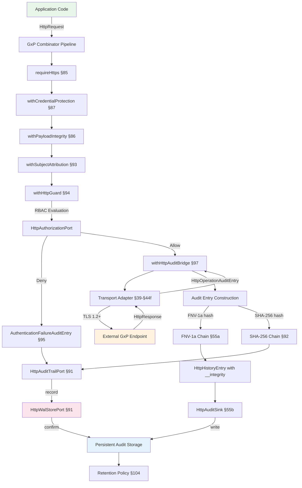
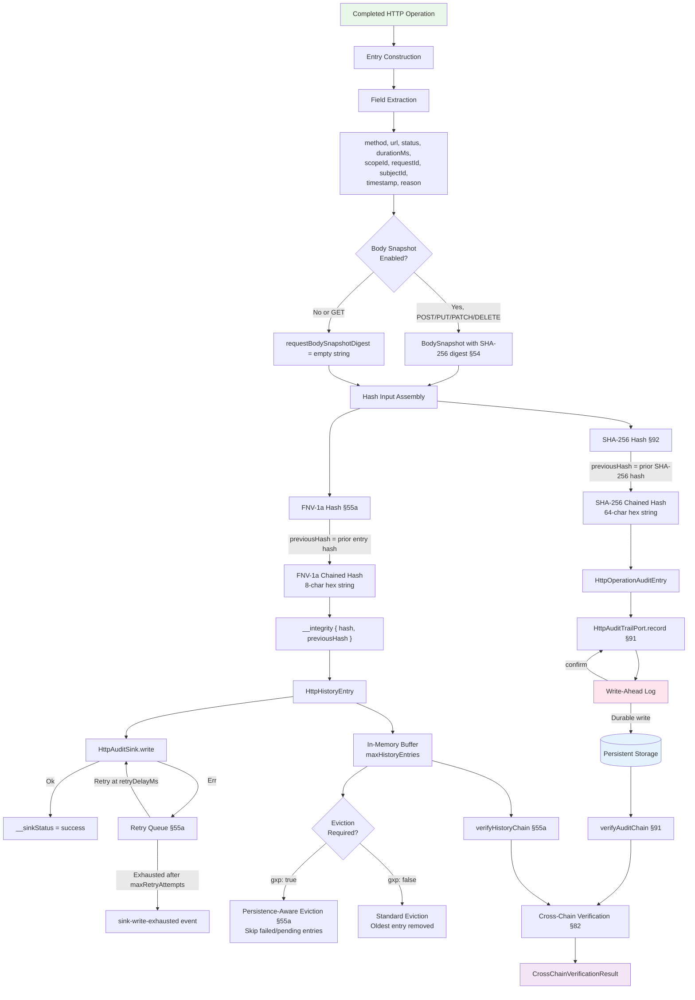
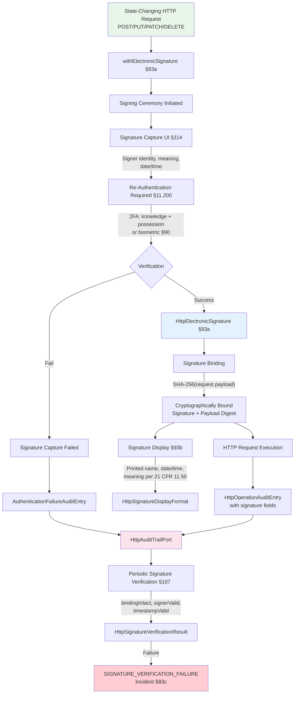
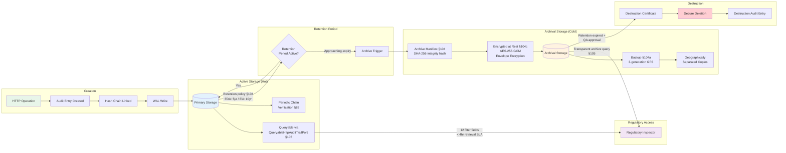

# GxP Compliance — @hex-di/http-client: Regulatory Context & ALCOA+ Mapping

> Part of the `@hex-di/http-client` GxP compliance sub-document suite.
> [Governance index](./gxp.md) | [Sub-document index](./README.md)

---

## 79. Regulatory Context (HTTP Transport Scope)

### Applicable Regulations

| Regulation                  | Requirement                     | HTTP Client Relevance                                                                                                                                                     |
| --------------------------- | ------------------------------- | ------------------------------------------------------------------------------------------------------------------------------------------------------------------------- |
| **21 CFR 11.10(c)**         | Protection of records           | HTTP payloads in transit MUST be protected against tampering                                                                                                              |
| **21 CFR 11.10(e)**         | Audit trails for record changes | HTTP operations that create, modify, or delete GxP records MUST be audit-trailed                                                                                          |
| **21 CFR 11.30**            | Controls for open systems       | HTTP over untrusted networks requires TLS, digital signatures, encryption                                                                                                 |
| **21 CFR 11.50**            | Signature manifestations        | Electronic signatures applied to GxP records transmitted via HTTP MUST include signer identity, date/time, and meaning. Delegated to `HttpSignatureServicePort` (§93a)    |
| **21 CFR 11.100**           | Electronic signature controls   | Electronic signatures MUST be unique to one individual and verified before use. Delegated to `HttpSignatureServicePort` (§93a)                                            |
| **EU GMP Annex 11 §7**      | Data storage and integrity      | HTTP payloads constitute data in transit; integrity MUST be verifiable                                                                                                    |
| **EU GMP Annex 11 §9**      | Audit trails                    | Changes to GxP-relevant data via HTTP MUST produce audit records                                                                                                          |
| **EU GMP Annex 11 §10**     | Change management               | Changes to HTTP client configuration MUST be controlled and documented. See §88 of this spec                                                                              |
| **EU GMP Annex 11 §12**     | Security and access control     | HTTP operations carrying GxP data MUST enforce access control. See §85-§87 of this spec                                                                                   |
| **EU GMP Annex 11 §16**     | Business continuity             | HTTP client MUST support continuity during transient failures (circuit breakers, retry). Crash recovery of audit data requires a `HttpWalStorePort` adapter (§91)         |
| **ALCOA+ (all principles)** | Data integrity                  | HTTP operations MUST satisfy Attributable, Legible, Contemporaneous, Original, Accurate, Complete, Consistent, Enduring, Available                                        |
| **MHRA DI Guidance**        | Cloud-hosted data controls      | HTTP operations to cloud APIs MUST enforce TLS and credential protection                                                                                                  |
| **WHO TRS 1033 Annex 4**   | Data integrity and traceability | HTTP audit trails MUST satisfy data integrity requirements including traceability, retention, and completeness. See §104 (retention), §100 (traceability)                 |
| **PIC/S PI 041**            | Data management and integrity   | HTTP operations MUST comply with ALCOA+ data management practices; audit trail review and data governance per PIC/S guidance. See §80, §104, §105                         |

> **Software Classification:** This library is classified as GAMP 5 Category 5 (Custom Applications) software for GxP environments. See §108 for the formal classification statement, supply chain classification, and Category 5 implications. Category 5 software requires full validation including risk assessment, IQ/OQ/PQ qualification, and periodic review per GAMP 5 2nd Edition Appendix M4.

> **Training Requirements:** Personnel deploying this library in GxP environments MUST meet role-specific training requirements. See §109 for the training role matrix, record structure, and refresh triggers.

> **Port Dependencies:** GxP features depend on port adapters documented in §79 (Port-Based Requirements). Any HexDi ecosystem library or custom adapter can satisfy these ports.

### In-Scope Controls (Built Into @hex-di/http-client)

The following GxP-relevant controls are built into `@hex-di/http-client` without requiring any external port adapters:

| Control                        | Implementation                                                                                                                 | Spec Section |
| ------------------------------ | ------------------------------------------------------------------------------------------------------------------------------ | ------------ |
| **FNV-1a hash chain**          | `HttpHistoryEntry.__integrity` with chained hashes (non-GxP only; SHA-256 via HttpAuditTrailPort is REQUIRED when `gxp: true`) | §55a         |
| **Tamper detection**           | `verifyHistoryChain()` validates chain integrity                                                                               | §55a         |
| **Audit externalization**      | `HttpAuditSink` interface for long-term storage                                                                                | §55b         |
| **Error immutability**         | `Object.freeze()` on all error constructors                                                                                    | §23          |
| **Monotonic timing**           | `monotonicNow()` for immune-to-NTP duration measurement                                                                        | §54, §55a    |
| **Disabled-audit warning**     | `HTTP_WARN_001` emitted when recording is off                                                                                  | §55c         |
| **Request attribution**        | `scopeId`, `requestId` on every history entry                                                                                  | §54          |
| **Sequence ordering**          | Monotonic `sequenceNumber` on all entries and events                                                                           | §54, §56     |
| **GxP fail-fast**              | `gxp: true` validates `HttpAuditTrailPort` presence and rejects `mode: "off"` at construction time                             | §54, §55a    |
| **Body snapshot**              | `BodySnapshot` captures structured body metadata with SHA-256 digest for GxP audit completeness                                | §54          |
| **Persistence-aware eviction** | Entries with failed/pending sink writes protected from eviction when `gxp: true`                                               | §55a         |

> **FNV-1a limitation:** The FNV-1a 32-bit hash used in `@hex-di/http-client` is a non-cryptographic hash with ~1 in 4.3 billion collision probability per pair. It is effective for detecting accidental corruption but trivially invertible and insufficient for defending against deliberate adversarial tampering per NIST SP 800-38D and FDA Guidance for Industry: Cybersecurity. FNV-1a MUST NOT be the sole audit integrity mechanism in 21 CFR Part 11 or EU GMP Annex 11 regulated environments. Register an `HttpAuditTrailPort` adapter providing SHA-256 cryptographic audit chains per FIPS 180-4.

```
REQUIREMENT: When `gxp: true` is set in HttpClientInspectorConfig, SHA-256 audit
             integrity via HttpAuditTrailPort (§91-§97 of this spec) MUST be active.
             The createHttpClientInspectorAdapter factory MUST verify at construction
             time that an HttpAuditTrailPort adapter providing SHA-256 hash chains is
             registered. If HttpAuditTrailPort is not registered, the factory MUST
             throw a ConfigurationError with error code "GXP_AUDIT_INSUFFICIENT" and
             the message: "GxP mode requires SHA-256 audit integrity via
             HttpAuditTrailPort. FNV-1a hash chains alone do not satisfy 21 CFR Part 11
             or EU GMP Annex 11 audit trail requirements." FNV-1a remains active as a
             secondary tamper-detection layer but is not sufficient on its own for GxP.
             Reference: 21 CFR 11.10(c), EU GMP Annex 11 §7.
```

```
REQUIREMENT: If the HttpAuditTrailPort providing SHA-256 becomes unavailable at
             runtime (e.g., audit backend connectivity loss, HSM failure, adapter
             disposal), all GxP HTTP operations MUST be blocked with error code
             "GXP_AUDIT_DEGRADED" and an HttpRequestError stating: "SHA-256 audit
             integrity is temporarily unavailable. GxP operations are blocked per
             21 CFR 11.10(c) until audit integrity is restored." The HTTP client
             MUST NOT fall back to FNV-1a-only audit recording for any GxP
             operation. This requirement complements CF-02 (§115.2) by ensuring
             runtime loss — not just construction-time absence — is handled.
             Reference: 21 CFR 11.10(c), EU GMP Annex 11 §7, §13.
```

### Now-In-Scope Controls (Moved to This Spec)

The following GxP controls are defined within this specification as sections §84-§103:

| Control                          | Combinator / Feature                            | Spec Section | Regulatory Driver                   |
| -------------------------------- | ----------------------------------------------- | ------------ | ----------------------------------- |
| **HTTPS enforcement**            | `requireHttps()` combinator                     | §85          | 21 CFR 11.30                        |
| **Payload integrity**            | `withPayloadIntegrity()` combinator             | §86          | 21 CFR 11.10(c)                     |
| **Credential protection**        | `withCredentialProtection()` combinator         | §87          | 21 CFR 11.300                       |
| **Access control**               | `requireHttps()` + `withCredentialProtection()` | §85, §87     | EU GMP Annex 11 §12                 |
| **Configuration change control** | `HttpClientConfigurationAuditEntry`             | §88          | EU GMP Annex 11 §10                 |
| **Payload schema validation**    | `withPayloadValidation()` combinator            | §89          | 21 CFR 11.10(h)                     |
| **Token lifecycle management**   | `withTokenLifecycle()` combinator               | §90          | 21 CFR 11.300                       |
| **SHA-256 audit trail**          | `HttpAuditTrailPort` with cryptographic chains  | §92          | 21 CFR 11.10(e)                     |
| **Electronic signature bridge**  | `withElectronicSignature()` combinator          | §93a         | 21 CFR 11.50, 11.70, 11.100, 11.200 |

### Port-Based Requirements (GxP Mode)

When `gxp: true` is set, the HTTP client requires adapters for specific ports. These ports are **defined by this spec** — any HexDi ecosystem library or custom adapter can satisfy them.

| Port | Purpose | Regulatory Driver | Error Code If Missing |
|------|---------|-------------------|-----------------------|
| `HttpAuditTrailPort` (§91) | SHA-256 audit chain integrity | 21 CFR 11.10(e), EU GMP Annex 11 §7 | `GXP_AUDIT_INSUFFICIENT` |
| `HttpWalStorePort` (§91) | Write-ahead log crash recovery | EU GMP Annex 11 §16 | `GXP_WAL_PORT_MISSING` |
| `HttpClockSourcePort` (§96) | Temporal consistency with drift detection | ALCOA+ Contemporaneous, EU GMP Annex 11 §9 | `GXP_CLOCK_PORT_MISSING` |
| `HttpSubjectProviderPort` (§93) | Subject attribution | 21 CFR 11.10(d), ALCOA+ Attributable | `GXP_SUBJECT_PORT_MISSING` |
| `HttpSignatureServicePort` (§93a) | Electronic signature lifecycle delegation | 21 CFR 11.50, 11.100 | `GXP_SIGNATURE_PORT_MISSING` |
| `HttpAuthorizationPort` (§94) | RBAC and access control evaluation | 21 CFR 11.10(d), 11.10(g) | `GXP_AUTHORIZATION_PORT_MISSING` |

```
REQUIREMENT: When `gxp: true` is set in the HTTP client configuration, the
             `createGxPHttpClient` factory (§103) and the `createHttpAuditTrailAdapter`
             factory (§91) MUST verify at construction time that adapters are
             registered for all REQUIRED ports listed above. If any REQUIRED port
             adapter is missing, the factory MUST throw a ConfigurationError with
             the corresponding error code and a message identifying which port
             is absent and the regulatory driver requiring it.
             No specific library is mandated — any adapter satisfying the port
             contract is acceptable. This follows the hexagonal architecture
             principle: ports define contracts, adapters implement them, and the
             container composes them.
             Reference: GAMP 5 Category 5, 21 CFR 11.10(a), EU GMP Annex 11 §4.
```

> **Ecosystem adapter providers:** The HexDi ecosystem provides ready-made adapters for these ports:
> - `@hex-di/guard` can provide adapters for `HttpAuthorizationPort`, `HttpSubjectProviderPort`, and `HttpSignatureServicePort`
> - `@hex-di/clock` can provide adapters for `HttpClockSourcePort`
> - `@hex-di/audit` can provide adapters for `HttpAuditTrailPort` and `HttpWalStorePort`
>
> Organizations MAY also implement custom adapters for any of these ports. The HTTP client validates the port contract, not the adapter's provenance.

### Delegated Capabilities (Consumed via Ports)

The following GxP capabilities are consumed through ports, not implemented by the HTTP client:

| Capability                         | Port                          | Spec Section | Regulatory Driver    |
| ---------------------------------- | ----------------------------- | ------------ | -------------------- |
| **Electronic signature lifecycle** | `HttpSignatureServicePort`    | §93a         | 21 CFR 11.50, 11.100 |
| **Crash recovery (WAL)**           | `HttpWalStorePort`            | §91          | EU GMP Annex 11 §16  |
| **Authorization evaluation**       | `HttpAuthorizationPort`       | §94          | 21 CFR 11.10(d)      |
| **Clock synchronization**          | `HttpClockSourcePort`         | §96          | ALCOA+ Contemporaneous |

> **Electronic signatures:** The core electronic signature lifecycle (capture, verification, storage) is delegated to `HttpSignatureServicePort` (§93a). `@hex-di/http-client` provides a **transport-level bridge** via the `withElectronicSignature()` combinator that binds captured signatures to specific HTTP operations. This bridge satisfies 21 CFR 11.70 (signature/record linking) by cryptographically binding signatures to HTTP request content. The `withElectronicSignature()` combinator delegates to `HttpSignatureServicePort` for actual signature capture and 2FA verification — it does not implement signature lifecycle itself.

```
REQUIREMENT: GxP deployments that transmit, modify, or store regulated data via HTTP
             MUST use HTTP transport combinators (sections 84-90 of this spec) for
             full compliance coverage. The built-in controls in @hex-di/http-client
             provide basic audit integrity (FNV-1a hash chain, error freezing, monotonic
             timing) but do NOT satisfy the full scope of 21 CFR Part 11 or EU GMP
             Annex 11 requirements for transport security, credential management, or
             cryptographic audit trails.
             Reference: 21 CFR 11.10(e), 21 CFR 11.30, EU GMP Annex 11 §7, §9, §12.
```

```
REQUIREMENT: For browser-based GxP deployments, CORS hardening is REQUIRED per
             13-advanced.md section 68a (CORS Considerations for GxP Data). The
             CORS configuration MUST be validated during OQ (see OQ-HT-64 in §99b).
             For Content Security Policy (CSP) considerations when inspection
             data is displayed in browser-based review interfaces, see the
             relevant ecosystem library's React integration documentation.
             These cross-cutting security controls complement the transport-level
             controls in this chapter and the transport security controls in sections 84-90.
             Reference: 21 CFR 11.30, ALCOA+ Complete.
```

---

## 79a. GxP Data Flow Diagrams

This section provides formal Data Flow Diagrams (DFDs) for GxP HTTP operations, satisfying GAMP 5 §D.5 and ALCOA+ Legible requirements for visual representation of regulated data paths.

### DFD-1: Normal GxP HTTP Operation Flow

This diagram shows the end-to-end data flow for a standard GxP HTTP operation from client request through audit trail persistence.



### DFD-2: Audit Trail Data Flow (Dual Hash Chain Architecture)

This diagram details how audit data flows through the FNV-1a and SHA-256 dual hash chain architecture from entry creation through persistent storage and verification.



### DFD-3: Electronic Signature Capture Flow

This diagram shows the data flow for electronic signature operations on GxP HTTP requests, per 21 CFR 11.50/11.70/11.100/11.200.



### DFD-4: Audit Data Lifecycle

This diagram shows the complete lifecycle of HTTP audit trail data from creation through retention, archival, and eventual destruction, per EU GMP Annex 11 §5 (Data Lifecycle) and §7 (Data Storage).



**Lifecycle Phases:**

| Phase | Duration | Storage Type | Integrity Mechanism | Access SLA | Regulatory Reference |
| ----- | -------- | ------------ | ------------------- | ---------- | -------------------- |
| **Active** | Current operations | Hot (database/append-only log) | SHA-256 hash chain + FNV-1a secondary | Real-time query | 21 CFR 11.10(e) |
| **Retention** | 5 years (FDA) / 10 years (EU GMP) | Hot or warm | Hash chain preserved | < 4 hours | 21 CFR 211.180, EU GMP Annex 11 §7 |
| **Archival** | Beyond active retention | Cold (encrypted, compressed) | Archive manifest with SHA-256 | < 72 hours | EU GMP Annex 11 §17 |
| **Destruction** | Post-retention expiry | N/A | Destruction certificate | N/A | MHRA DI Guidance §6.20 |

---

## 80. ALCOA+ Mapping for HTTP Operations

This section maps all 9 ALCOA+ data integrity principles to their implementation in `@hex-di/http-client`.

| ALCOA+ Principle    | HTTP Client Implementation                                                                                                                                                                                                                                                                                                                                                                  | Consumer Responsibility                                                                                                                                                                                        |
| ------------------- | ------------------------------------------------------------------------------------------------------------------------------------------------------------------------------------------------------------------------------------------------------------------------------------------------------------------------------------------------------------------------------------------- | -------------------------------------------------------------------------------------------------------------------------------------------------------------------------------------------------------------- |
| **Attributable**    | `scopeId` on `ActiveRequest` and `HttpHistoryEntry` identifies the scope (user/session) that initiated the request. `requestId` uniquely identifies each operation.                                                                                                                                                                                                                         | Consumers MUST configure scoped clients with meaningful `scopeId` values that trace back to authenticated users.                                                                                               |
| **Legible**         | `HttpHistoryEntry` fields use standard types (string URLs, numeric status codes, ISO timestamps). Error messages are human-readable. `CombinatorInfo` provides readable config summaries.                                                                                                                                                                                                   | Consumers SHOULD externalize audit entries via `HttpAuditSink` to a searchable, queryable store.                                                                                                               |
| **Contemporaneous** | `monotonicNow()` timestamps on `startedAtMono` and `completedAtMono` are captured at the moment of request start and completion. `sequenceNumber` provides monotonic ordering.                                                                                                                                                                                                              | Consumers MUST NOT post-date or pre-date audit entries. `HttpAuditSink.write()` is called synchronously after entry creation.                                                                                  |
| **Original**        | `Object.freeze()` on all error objects prevents mutation after creation. `__integrity` hash chain ensures entries are not modified after recording. `HttpHistoryEntry` fields are `readonly`.                                                                                                                                                                                               | Consumers MUST NOT reconstruct or transform entries before writing to the audit sink. The sink receives the original entry.                                                                                    |
| **Accurate**        | `durationMs` is computed from `completedAtMono - startedAtMono` (monotonic, not wall-clock). Status codes, URLs, and error reasons are captured directly from the transport adapter response.                                                                                                                                                                                                | Consumers SHOULD enable `verifyHistoryChain()` checks periodically to confirm entry accuracy has not been compromised.                                                                                         |
| **Complete**        | Every completed request produces an `HttpHistoryEntry` (when mode is `"full"` or `"lightweight"`). `HTTP_WARN_001` is emitted when recording is disabled. `BodySnapshot` captures request/response body metadata when `captureBodySnapshot` is enabled. `gxp: true` rejects `mode: "off"` at construction time. Retry queue ensures failed sink writes are retried before data loss occurs. | Consumers in GxP environments MUST NOT set `mode: "off"`. The warning exists as a compliance safety net. Consumers SHOULD enable `captureBodySnapshot` for POST/PUT/PATCH/DELETE operations carrying GxP data. |
| **Consistent**      | Hash chain links entries in insertion order. `sequenceNumber` is strictly monotonic. `verifyHistoryChain()` detects gaps or reordering.                                                                                                                                                                                                                                                     | Consumers SHOULD compare `sequenceNumber` values in externalized entries to detect missing records.                                                                                                            |
| **Enduring**        | `HttpAuditSink` interface externalizes entries to persistent storage. In-memory buffer is bounded by `maxHistoryEntries` but sink receives entries before eviction. Retry queue recovers from transient sink failures. Persistence-aware eviction (when `gxp: true`) protects unpersisted entries from eviction. `gxp: true` requires a durable `auditSink` at construction time.           | Consumers MUST implement `HttpAuditSink` with durable storage (database, append-only log) for GxP retention requirements. For full crash recovery, register an `HttpWalStorePort` adapter (§91).               |
| **Available**       | `HttpClientInspector` provides real-time query access. MCP resources (§57) expose audit data to AI diagnostics. `HttpClientSnapshot` is serializable.                                                                                                                                                                                                                                       | Consumers SHOULD configure MCP resource exposure for regulatory inspection access.                                                                                                                             |

---

## 80a. Transport Adapter Switchover Data Integrity

When a GxP deployment changes the underlying transport adapter (e.g., migrating from `FetchHttpClientAdapter` to `UndiciHttpClientAdapter` or `BunHttpClientAdapter`), hash chain continuity and ALCOA+ Consistent compliance must be maintained.

### Switchover Scenarios

| Scenario                        | Example                                               | Risk Level                                                          |
| ------------------------------- | ----------------------------------------------------- | ------------------------------------------------------------------- |
| **Runtime adapter replacement** | Switching from Fetch to Undici in a new release       | Medium — hash chain continues if same `HttpAuditTrailPort` instance |
| **Gradual traffic migration**   | Canary deployment routing % of traffic to new adapter | High — two adapter instances may produce interleaved audit entries  |
| **Platform migration**          | Moving from Node.js to Bun runtime                    | High — adapter change coincides with runtime change                 |

### Requirements

```
REQUIREMENT: Transport adapter switchovers MUST NOT break hash chain continuity.
             The hash chain is maintained by HttpAuditTrailPort (§91 of this spec)
             and HttpHistoryEntry.__integrity (§55a), NOT by the transport adapter.
             When the transport adapter changes, the audit trail port instance MUST
             remain the same (or be migrated per §104b) to preserve sequential
             hash chaining. The new adapter's first request MUST chain from the
             previous adapter's last entry.
             Reference: ALCOA+ Consistent, 21 CFR 11.10(e).
```

```
REQUIREMENT: During gradual traffic migration (canary/blue-green deployments)
             where two adapter instances serve traffic concurrently, both instances
             MUST share the same HttpAuditTrailPort instance or use a coordinated
             sequencing mechanism that guarantees: (1) globally monotonic
             sequenceNumber values across both adapters, (2) unbroken hash chain
             linking entries from both adapters in sequence order, and (3) no
             duplicate sequenceNumber values. If shared HttpAuditTrailPort is
             not feasible, the deployment MUST use a merge-and-rechain procedure
             after cutover that produces a unified, verified hash chain.
             Reference: ALCOA+ Consistent, ALCOA+ Complete.
```

```
REQUIREMENT: Transport adapter switchovers in GxP environments MUST be recorded
             as HttpClientConfigurationAuditEntry records (§88) with: (1) the
             previous adapter identifier, (2) the new adapter identifier,
             (3) the switchover timestamp, (4) the reason for the change, and
             (5) the sequenceNumber of the last entry produced by the previous
             adapter. This enables auditors to identify the exact point in the
             audit trail where the adapter changed.
             Reference: EU GMP Annex 11 §10, 21 CFR 11.10(e).
```

```
REQUIREMENT: Organizations MUST validate adapter switchovers as part of OQ
             (§99b) per 21 CFR 11.10(a). The validation MUST include:
             (1) hash chain verification spanning entries from both the old
             and new adapters, (2) cross-correlation check confirming
             evaluationId links remain valid, (3) timestamp consistency check
             confirming monotonic ordering across the switchover boundary, and
             (4) comparison of HTTP response metadata fields populated by each
             adapter to detect behavioral differences. Switchover validation
             results MUST be documented as part of the change control record (§88).
             Reference: 21 CFR 11.10(a), EU GMP Annex 11 §10.
```

---

## 80b. Consumer Validation Responsibilities

This section quantifies the validation burden on organizations deploying `@hex-di/http-client` in GxP environments. The library provides composable GxP controls at the transport layer, but certain controls are intentionally deferred to the consumer's infrastructure, platform, or operational procedures. Organizations MUST validate these deferred controls as part of their site-specific Validation Plan (§83a).

### Deferred Controls Requiring Consumer Validation

| # | Deferred Control | Library Provides | Consumer MUST Provide | Regulatory Driver | Validation Evidence |
| - | ---------------- | ---------------- | --------------------- | ----------------- | ------------------- |
| CV-01 | **TLS implementation** | `requireHttps()` combinator enforces URL scheme and reports negotiated TLS version | Actual TLS handshake, cipher negotiation, and certificate chain verification via platform TLS stack (OpenSSL, BoringSSL, etc.) | 21 CFR 11.30, EU GMP Annex 11 §12 | IQ: Verify platform TLS library version; OQ: Confirm TLS 1.2+ negotiation with target endpoints |
| CV-02 | **DNS resolution security** | Mitigation guidance in §84; `withSsrfProtection()` blocks private IPs post-resolution | DNSSEC validation, DNS-over-HTTPS/TLS, or static host resolution for critical GxP endpoints | 21 CFR 11.30, NIST SP 800-81-2 | IQ: Document DNS resolver configuration; OQ: Verify DNSSEC validation or compensating controls |
| CV-03 | **Audit trail persistent storage** | `HttpAuditSink` interface; `HttpAuditTrailPort` contract; retry queue for transient failures | Durable storage backend (database, append-only log) implementing `HttpAuditSink` with ACID properties | 21 CFR 11.10(e), ALCOA+ Enduring | IQ: Verify storage backend deployment; OQ: Confirm write durability under failure; PQ: Verify retention period compliance |
| CV-04 | **Identity provider integration** | `HttpSubjectProviderPort` contract; `withSubjectAttribution()` combinator | IAM system (LDAP, OIDC, SAML) providing authenticated user identity per scope | 21 CFR 11.10(d), ALCOA+ Attributable | IQ: Verify IAM connectivity; OQ: Confirm user identity resolution; PQ: Verify segregation of duties |
| CV-05 | **Clock source** | `HttpClockSourcePort` contract; 1-second drift threshold; UTC-Z mandate | NTP-synchronized system clock or dedicated time server for the runtime environment | ALCOA+ Contemporaneous, EU GMP Annex 11 §9 | IQ: Verify NTP configuration; OQ: Confirm drift < 1 second against reference |
| CV-06 | **Key management** | `HttpAuditEncryptionPort` contract; key ceremony procedures in §104c | KMS or HSM providing encryption keys for audit data-at-rest encryption | 21 CFR 11.30, EU GMP Annex 11 §12 | IQ: Verify KMS deployment; OQ: Confirm encryption/decryption round-trip; PQ: Verify key rotation |
| CV-07 | **Certificate revocation infrastructure** | `CertificateRevocationPolicy` contract; OCSP/CRL method priority | Network access to OCSP responders and/or CRL distribution points; or documented justification for disabling | 21 CFR 11.30, NIST SP 800-52r2 | IQ: Verify OCSP/CRL endpoint accessibility; OQ: Confirm revocation detection for revoked certificates |
| CV-08 | **Backup and restore infrastructure** | `HttpAuditArchivalPort` contract; 3-generation GFS backup specification in §104a | Backup storage, scheduling, monitoring, and verified restore procedures | EU GMP Annex 11 §7, 21 CFR 11.10(c) | IQ: Verify backup infrastructure; OQ: Execute verified restore; PQ: Confirm retention period coverage |
| CV-09 | **Network infrastructure** | Transport adapter abstraction; timeout and retry combinators | Firewall rules, load balancer configuration, network segmentation for GxP traffic | EU GMP Annex 11 §12, 21 CFR 11.30 | IQ: Document network topology; OQ: Verify connectivity to all GxP endpoints |
| CV-10 | **Operational procedures** | Incident classification framework (§83c); periodic review triggers (§83b); change control process (§116) | SOPs for incident response, periodic review execution, change control approvals, and deviation handling | EU GMP Annex 11 §10, §13, GAMP 5 | IQ: Verify SOPs exist; OQ: Execute tabletop incident exercise; PQ: Confirm SOP adherence during live operations |
| CV-11 | **DNS security risk acceptance** | DNS security mitigation guidance in §84; `withSsrfProtection()` blocks post-resolution private IPs | Organization MUST document DNS resolution security controls (DNSSEC, DoH/DoT) or formally accept residual DNS risk per ICH Q9 risk acceptance criteria | 21 CFR 11.30, NIST SP 800-81-2 | IQ: Document DNS resolver and security controls; OQ: Verify DNSSEC validation or document risk acceptance with compensating controls (e.g., certificate pinning §85); PQ: Confirm DNS monitoring is operational |

```
REQUIREMENT: Organizations MUST document the validation approach for each deferred
             control (CV-01 through CV-11) in Section 7 (Test Strategy) of the
             Validation Plan (§83a). For each control, the Validation Plan MUST
             specify: (1) the consumer-provided component, (2) the qualification
             level (IQ/OQ/PQ), (3) the acceptance criteria, and (4) the responsible
             role from §109. Controls that are not applicable to the deployment
             (e.g., CV-06 if encryption is not required) MUST be documented as
             "Not Applicable" with a risk-based justification referencing the FMEA
             (§98).
             Reference: GAMP 5 §D.4, EU GMP Annex 11 §4.
```

```
REQUIREMENT: The site-specific Validation Plan (§83a) MUST include a Consumer
             Validation Matrix that maps each CV-XX item to the organization's
             specific infrastructure components, responsible personnel, and
             target completion dates. The matrix MUST be reviewed and approved
             by the QA Approver identified in the Validation Plan before IQ
             begins. Incomplete consumer validation items MUST block progression
             from OQ to PQ.
             Reference: GAMP 5 §D.8, EU GMP Annex 11 §4.3.
```

### Consumer Validation Effort Estimate

The following table provides guidance on the relative validation effort for each deferred control, enabling organizations to plan their validation activities. Effort estimates are based on GAMP 5 Category 5 validation expectations for a single GxP deployment.

| Control | IQ Effort | OQ Effort | PQ Effort | Total Relative Effort |
| ------- | --------- | --------- | --------- | --------------------- |
| CV-01 (TLS) | Low — version check | Medium — endpoint verification | Low — included in pipeline | Medium |
| CV-02 (DNS) | Low — configuration check | Low — resolution verification | N/A | Low |
| CV-03 (Audit storage) | Medium — backend deployment | High — durability + failure testing | High — retention verification | High |
| CV-04 (Identity) | Medium — IAM connectivity | High — identity resolution + SoD | Medium — live user verification | High |
| CV-05 (Clock) | Low — NTP check | Low — drift measurement | Low — ongoing monitoring | Low |
| CV-06 (KMS) | Medium — KMS deployment | Medium — round-trip verification | Low — rotation verification | Medium |
| CV-07 (Revocation) | Low — endpoint accessibility | Medium — revoked cert detection | Low — ongoing monitoring | Medium |
| CV-08 (Backup) | Medium — infrastructure | High — verified restore | Medium — retention coverage | High |
| CV-09 (Network) | Low — topology documentation | Medium — connectivity verification | Low — included in pipeline | Medium |
| CV-10 (Procedures) | Medium — SOP creation | Medium — tabletop exercise | High — live SOP adherence | High |
| CV-11 (DNS security) | Low — resolver documentation | Low — DNSSEC/DoH verification or risk acceptance | Low — ongoing monitoring | Low |

> **Note:** These effort estimates are relative guidance, not time commitments. Actual effort depends on the organization's existing infrastructure maturity, regulatory jurisdiction requirements, and the number of GxP endpoints being validated.

---

