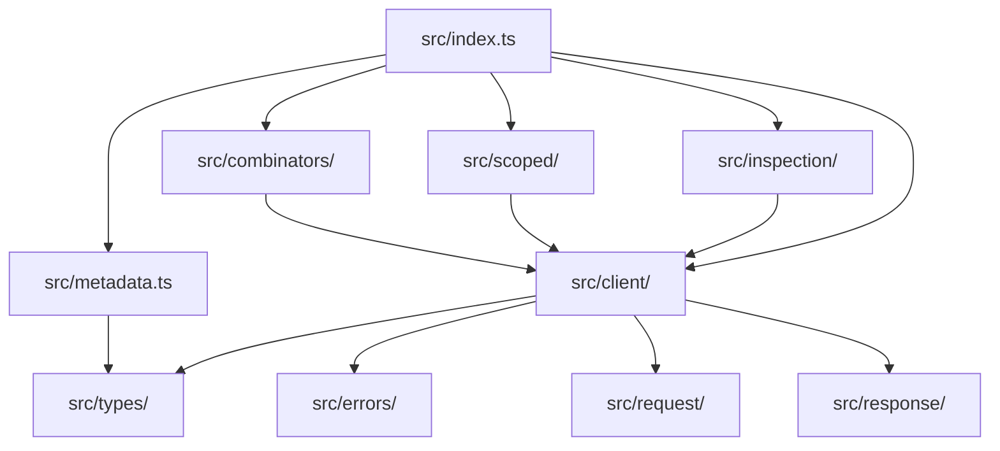

# @hex-di/http-client — Overview (API Surface)

Governance supplement providing package metadata, public API surface tables, module dependency graph, and source file map.

---

## Document Control

| Field | Value |
|-------|-------|
| Document ID | SPEC-HTTP-OVW-001 |
| Version | Derived from Git — `git log -1 --format="%H %ai" -- spec/libs/http-client/overview.md` |
| Approval Evidence | PR merge to `main` |
| Status | Effective |

---

## Package Metadata

| Field | Value |
|-------|-------|
| **Name** | `@hex-di/http-client` |
| **Version** | `0.1.0` |
| **License** | MIT |
| **Repository** | `hex-di` monorepo, `libs/http-client/core/` |
| **Module format** | ESM (`"type": "module"`) with `.d.ts` declarations |
| **Side effects** | None (`"sideEffects": false`) |
| **Node version** | ≥ 18.0.0 |
| **TypeScript version** | ≥ 5.4 |
| **Spec revision** | `0.1` |

---

## Mission

`@hex-di/http-client` provides a platform-agnostic HTTP client port for HexDI. It encodes HTTP requests as immutable value objects, surfaces all errors in a typed Result channel (never throwing), and supports composable combinators for cross-cutting concerns (auth, retry, timeout, logging). Any HTTP library can be plugged in as a transport adapter without changing application code.

---

## Design Philosophy

1. **HTTP is a service**: The HTTP client is a port, not a global. Resolved through the DI container like any other dependency.
2. **Never throw**: All errors are `Err(HttpClientError)` in a `ResultAsync`. No `try/catch` needed in application code.
3. **Immutable requests**: `HttpRequest` is a frozen value object. Combinators return new instances; the original is never mutated.
4. **Typed error variants**: `HttpRequestError | HttpResponseError | HttpBodyError` with exhaustive `_tag` discrimination.
5. **Composable combinators**: Cross-cutting concerns (auth, retry, timeout) are expressed as `(HttpClient) => HttpClient` functions, not middleware.
6. **Transport agnostic**: The transport is a pluggable adapter. Application code never imports `fetch` or `axios` directly.
7. **GxP optional**: Audit trails, HTTPS enforcement, electronic signatures, and credential protection are available as optional port adapters.

---

## Runtime Requirements

| Requirement | Value |
|-------------|-------|
| **Node.js** | ≥ 18.0.0 (for native `fetch` and `ReadableStream`) |
| **TypeScript** | ≥ 5.4 (for satisfies, const type parameters) |
| **Build** | `tsc -p tsconfig.build.json` |
| **Test** | Vitest ≥ 3.0 |
| **Peer: fetch adapter** | Native `fetch` (Node ≥ 18, browsers, Deno, Bun) or polyfill |

---

## Public API Surface

### Core Types

| Export | Kind | Source File |
|--------|------|-------------|
| `HttpMethod` | Type alias | `src/types/method.ts` |
| `HttpHeaders` | Interface | `src/types/headers.ts` |
| `createHeaders` | Function | `src/types/headers.ts` |
| `setHeader` | Function | `src/types/headers.ts` |
| `appendHeader` | Function | `src/types/headers.ts` |
| `removeHeader` | Function | `src/types/headers.ts` |
| `getHeader` | Function | `src/types/headers.ts` |
| `mergeHeaders` | Function | `src/types/headers.ts` |
| `UrlParams` | Interface | `src/types/url-params.ts` |
| `createUrlParams` | Function | `src/types/url-params.ts` |
| `setParam` | Function | `src/types/url-params.ts` |
| `appendParam` | Function | `src/types/url-params.ts` |
| `toQueryString` | Function | `src/types/url-params.ts` |
| `fromQueryString` | Function | `src/types/url-params.ts` |
| `HttpBody` | Type union | `src/types/body.ts` |
| `EmptyBody` | Interface | `src/types/body.ts` |
| `JsonBody` | Interface | `src/types/body.ts` |
| `TextBody` | Interface | `src/types/body.ts` |
| `BinaryBody` | Interface | `src/types/body.ts` |
| `FormBody` | Interface | `src/types/body.ts` |
| `StreamBody` | Interface | `src/types/body.ts` |
| `emptyBody` | Function | `src/types/body.ts` |
| `jsonBody` | Function | `src/types/body.ts` |
| `textBody` | Function | `src/types/body.ts` |

### HttpRequest

| Export | Kind | Source File |
|--------|------|-------------|
| `HttpRequest` | Interface | `src/request/types.ts` |
| `HttpRequest.get` | Static method | `src/request/request.ts` |
| `HttpRequest.post` | Static method | `src/request/request.ts` |
| `HttpRequest.put` | Static method | `src/request/request.ts` |
| `HttpRequest.patch` | Static method | `src/request/request.ts` |
| `HttpRequest.del` | Static method | `src/request/request.ts` |
| `HttpRequest.head` | Static method | `src/request/request.ts` |
| `HttpRequest.options` | Static method | `src/request/request.ts` |
| `setRequestHeader` | Function | `src/request/combinators.ts` |
| `removeRequestHeader` | Function | `src/request/combinators.ts` |
| `setRequestHeaders` | Function | `src/request/combinators.ts` |
| `bearerToken` | Function | `src/request/combinators.ts` |
| `basicAuth` | Function | `src/request/combinators.ts` |
| `prependUrl` | Function | `src/request/combinators.ts` |
| `appendUrl` | Function | `src/request/combinators.ts` |
| `setUrlParam` | Function | `src/request/combinators.ts` |
| `appendUrlParam` | Function | `src/request/combinators.ts` |
| `setBody` | Function | `src/request/combinators.ts` |
| `bodyJson` | Function | `src/request/combinators.ts` |
| `bodyText` | Function | `src/request/combinators.ts` |
| `withAbortSignal` | Function | `src/request/combinators.ts` |

### HttpResponse

| Export | Kind | Source File |
|--------|------|-------------|
| `HttpResponse` | Interface | `src/response/types.ts` |
| `isOk` | Function | `src/response/utils.ts` |
| `isClientError` | Function | `src/response/utils.ts` |
| `isServerError` | Function | `src/response/utils.ts` |
| `getResponseHeader` | Function | `src/response/utils.ts` |

### Error Types

| Export | Kind | Source File |
|--------|------|-------------|
| `HttpClientError` | Type union | `src/errors/types.ts` |
| `HttpRequestError` | Interface | `src/errors/types.ts` |
| `HttpResponseError` | Interface | `src/errors/types.ts` |
| `HttpBodyError` | Interface | `src/errors/types.ts` |
| `HttpRequestErrorReason` | Type union | `src/errors/types.ts` |
| `HttpResponseErrorReason` | Type union | `src/errors/types.ts` |
| `HttpBodyErrorReason` | Type union | `src/errors/types.ts` |
| `httpRequestError` | Function | `src/errors/errors.ts` |
| `httpResponseError` | Function | `src/errors/errors.ts` |
| `httpBodyError` | Function | `src/errors/errors.ts` |
| `isHttpRequestError` | Type guard | `src/errors/guards.ts` |
| `isHttpResponseError` | Type guard | `src/errors/guards.ts` |
| `isHttpBodyError` | Type guard | `src/errors/guards.ts` |
| `isHttpClientError` | Type guard | `src/errors/guards.ts` |

### Port & Client Interface

| Export | Kind | Source File |
|--------|------|-------------|
| `HttpClient` | Interface | `src/client/types.ts` |
| `HttpClientPort` | Port | `src/client/port.ts` |
| `HttpTransportAdapter` | Interface | `src/client/transport.ts` |
| `createHttpClientAdapter` | Factory | `src/client/transport.ts` |
| `InferHttpClient` | Utility type | `src/client/types.ts` |

### Client Combinators

| Export | Kind | Source File |
|--------|------|-------------|
| `baseUrl` | Combinator | `src/combinators/combinators.ts` |
| `defaultHeaders` | Combinator | `src/combinators/combinators.ts` |
| `bearerAuth` | Combinator | `src/combinators/combinators.ts` |
| `filterStatusOk` | Combinator | `src/combinators/combinators.ts` |
| `filterStatus` | Combinator | `src/combinators/combinators.ts` |
| `mapRequest` | Combinator | `src/combinators/combinators.ts` |
| `mapRequestResult` | Combinator | `src/combinators/combinators.ts` |
| `mapResponse` | Combinator | `src/combinators/combinators.ts` |
| `tapRequest` | Combinator | `src/combinators/combinators.ts` |
| `tapResponse` | Combinator | `src/combinators/combinators.ts` |
| `tapError` | Combinator | `src/combinators/combinators.ts` |
| `retry` | Combinator | `src/combinators/combinators.ts` |
| `retryTransient` | Combinator | `src/combinators/combinators.ts` |
| `timeout` | Combinator | `src/combinators/combinators.ts` |
| `catchError` | Combinator | `src/combinators/combinators.ts` |

### Introspection

| Export | Kind | Source File |
|--------|------|-------------|
| `HttpClientInspectorPort` | Port | `src/inspection/ports.ts` |
| `HttpClientRegistryPort` | Port | `src/inspection/ports.ts` |
| `HttpRequestHistoryEntry` | Interface | `src/inspection/types.ts` |
| `HttpClientSnapshot` | Interface | `src/inspection/types.ts` |

### Scoped Clients

| Export | Kind | Source File |
|--------|------|-------------|
| `ScopedHttpClient` | Interface | `src/scoped/types.ts` |
| `createScopedHttpClient` | Function | `src/scoped/scoped.ts` |

### Metadata

| Export | Kind | Source File |
|--------|------|-------------|
| `getMetadata` | Function | `src/metadata.ts` |

---

## Subpath Exports

| Subpath | Description |
|---------|-------------|
| `@hex-di/http-client` | All core exports (types, request, response, errors, port, combinators, introspection) |

---

## Module Dependency Graph

---

## Source File Map

| File | Responsibility |
|------|---------------|
| `src/index.ts` | Public API barrel — re-exports all public symbols |
| `src/metadata.ts` | `getMetadata()` — specRevision and version constants |
| `src/types/method.ts` | `HttpMethod` type union |
| `src/types/headers.ts` | `HttpHeaders` interface and header utility functions |
| `src/types/url-params.ts` | `UrlParams` interface and URL parameter utility functions |
| `src/types/body.ts` | `HttpBody` discriminated union variants and constructors |
| `src/request/types.ts` | `HttpRequest` interface definition |
| `src/request/request.ts` | `HttpRequest` static constructors (get, post, put, etc.) |
| `src/request/combinators.ts` | Request combinator functions (setRequestHeader, bearerToken, etc.) |
| `src/response/types.ts` | `HttpResponse` interface definition |
| `src/response/utils.ts` | Response status utilities (isOk, isClientError, isServerError) |
| `src/errors/types.ts` | `HttpClientError`, `HttpRequestError`, `HttpResponseError`, `HttpBodyError` interfaces |
| `src/errors/errors.ts` | Error constructor functions with populate-freeze-return pattern |
| `src/errors/guards.ts` | Type guard functions for error discrimination |
| `src/client/types.ts` | `HttpClient` interface and `InferHttpClient` utility type |
| `src/client/port.ts` | `HttpClientPort` definition |
| `src/client/transport.ts` | `HttpTransportAdapter` interface and `createHttpClientAdapter` factory |
| `src/combinators/combinators.ts` | All 15 client combinator functions |
| `src/scoped/types.ts` | `ScopedHttpClient` interface |
| `src/scoped/scoped.ts` | `createScopedHttpClient` factory |
| `src/inspection/ports.ts` | `HttpClientInspectorPort` and `HttpClientRegistryPort` definitions |
| `src/inspection/types.ts` | `HttpRequestHistoryEntry` and `HttpClientSnapshot` interfaces |

---

## Type System Notes

`@hex-di/http-client` uses two distinct type-safety patterns, each documented in a dedicated file:

| File | Pattern | Types Covered |
|------|---------|---------------|
| [`type-system/phantom-brands.md`](./type-system/phantom-brands.md) | Unique symbol interface brands — prevent substituting plain `Record`/`Array` for factory-created branded collections | `Headers` (`[HEADERS_SYMBOL]: true`), `UrlParams` (`[URL_PARAMS_SYMBOL]: true`) |
| [`type-system/structural-safety.md`](./type-system/structural-safety.md) | Frozen immutability, discriminated unions, back-reference patterns | `HttpRequest` (frozen value object), `HttpClientError` (tagged union), `HttpResponse.request` (back-reference) |

The package does **not** use primitive phantom brands (e.g., `string & { _brand: "X" }`). Branded types in this package use the unique symbol computed-property-key pattern documented in `type-system/phantom-brands.md`, which is structurally distinct from primitive branding.

---

## Specification & Process Files

| File | Responsibility |
|------|---------------|
| `spec/libs/http-client/README.md` | Document Control hub — Table of Contents, revision history, approval record |
| `spec/libs/http-client/overview.md` | This file — API surface, metadata, source file map |
| `spec/libs/http-client/00-urs.md` | User Requirements Specification with URS-HTTP-NNN IDs |
| `spec/libs/http-client/01-overview.md` through `17-definition-of-done.md` | Functional/Design Specification chapters |
| `spec/libs/http-client/invariants.md` | Runtime guarantees (INV-HC-1 through INV-HC-10) |
| `spec/libs/http-client/traceability.md` | Forward/backward traceability matrix |
| `spec/libs/http-client/risk-assessment.md` | FMEA per-invariant risk analysis |
| `spec/libs/http-client/glossary.md` | Domain terminology |
| `spec/libs/http-client/roadmap.md` | Planned future work |
| `spec/libs/http-client/decisions/` | Architecture Decision Records (ADR-HC-001 through ADR-HC-010) |
| `spec/libs/http-client/type-system/structural-safety.md` | Type-level structural safety patterns |
| `spec/libs/http-client/compliance/gxp.md` | GxP compliance guide (§79–§118) |
| `spec/libs/http-client/process/change-control.md` | Change classification and approval workflow |
| `spec/libs/http-client/process/definitions-of-done.md` | Feature acceptance checklist |
| `spec/libs/http-client/process/requirement-id-scheme.md` | ID format specification |
| `spec/libs/http-client/process/test-strategy.md` | Test pyramid, coverage targets, file naming |
| `spec/libs/http-client/process/document-control-policy.md` | Git-based document versioning policy |
| `spec/libs/http-client/process/ci-maintenance.md` | CI pipeline and release process |
| `spec/libs/http-client/scripts/verify-traceability.sh` | Traceability matrix validator |
