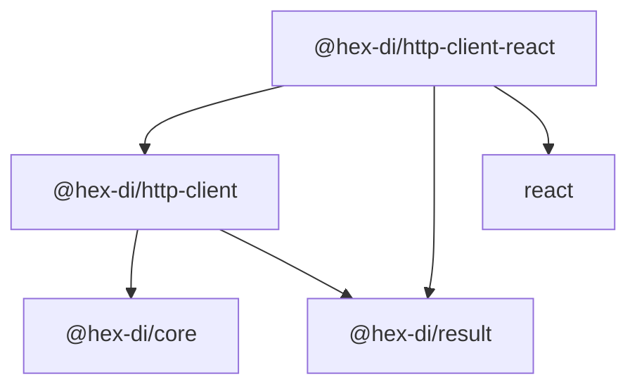

# 01 — Overview

## §1. Mission

`@hex-di/http-client-react` bridges the `HttpClientPort` abstraction to React's component model. It provides a `HttpClientProvider` component that injects an `HttpClient` instance into the component tree via React Context, and three hooks that expose the client for synchronous resolution, reactive query execution, and imperative mutation.

The package has **no opinion on how the `HttpClient` is constructed** — callers provide any `HttpClient` instance (wired through HexDI's `GraphBuilder` or directly constructed). This preserves the hexagonal architecture boundary: the React layer consumes the port; it does not own the adapter or the DI graph.

## §2. Scope

This specification covers `@hex-di/http-client-react` exclusively. The core `@hex-di/http-client` package (types, port, combinators, transport adapters) is documented separately in [`spec/libs/http-client/`](../README.md).

### What this package provides

- `HttpClientProvider` — React Context provider injecting an `HttpClient` into the tree
- `useHttpClient()` — resolves the `HttpClient` from the nearest provider
- `useHttpRequest(request, options?)` — executes an HTTP request reactively, returns `UseHttpRequestState`
- `useHttpMutation()` — returns `[mutate, state]` for imperative write operations
- `createHttpClientTestProvider(client)` — test utility that wraps a mock client in a minimal provider
- `specRevision` constant — links the installed package to this specification revision

### What this package does NOT provide

- HTTP client construction (use `GraphBuilder` + a transport adapter)
- Request combinators (use `@hex-di/http-client` combinators)
- Caching, deduplication, or optimistic updates (these are application-level concerns)
- WebSocket or SSE support (protocol-specific; separate packages)
- Server-side rendering lifecycle management beyond what React Context provides

## §3. Design Philosophy

**1. No framework leakage into the domain.** The `@hex-di/http-client` package has zero React dependency. `@hex-di/http-client-react` imports from `@hex-di/http-client`; the direction is one-way. Domain-layer code never imports React.

**2. Result-typed state, never throws.** Hooks return `Result<HttpResponse, HttpRequestError>` — the same error contract as the underlying `HttpClient`. No `try/catch` patterns in component code.

**3. Explicit client injection.** There is no default or global `HttpClient` instance. Components are only able to execute requests if an `HttpClientProvider` ancestor is present. Missing provider is a programming error caught at runtime with a clear message.

**4. Composition via combinators, not hook options.** Advanced concerns (auth headers, retries, timeouts, base URLs) are applied by composing the `HttpClient` before passing it to `HttpClientProvider`. Hooks do not accept combinator options.

**5. Minimal surface area.** Three hooks cover the full request lifecycle: resolve (`useHttpClient`), reactive query (`useHttpRequest`), imperative mutation (`useHttpMutation`). The API is intentionally narrow.

## §4. Runtime Requirements

| Requirement | Version |
| --- | --- |
| React | >= 18.0 (concurrent mode, `use` hook optional) |
| TypeScript | >= 5.0 (strict mode) |
| `@hex-di/http-client` | >= 0.1.0 |
| `@hex-di/result` | >= 0.1.0 |
| Node.js (SSR) | >= 18.0 |

## §5. Public API Surface

### Provider

| Export | Kind | Description |
| --- | --- | --- |
| `HttpClientProvider` | React component | Injects `HttpClient` via Context |
| `HttpClientProviderProps` | Interface | Props for `HttpClientProvider` |

### Hooks

| Export | Kind | Description |
| --- | --- | --- |
| `useHttpClient` | Hook | Resolves `HttpClient` from nearest provider |
| `useHttpRequest` | Hook | Reactive HTTP request with loading/error state |
| `useHttpMutation` | Hook | Imperative mutation hook |

### State Types

| Export | Kind | Description |
| --- | --- | --- |
| `UseHttpRequestState<E>` | Interface | State returned by `useHttpRequest` |
| `UseHttpMutationState<E>` | Interface | State returned by `useHttpMutation` |
| `HttpRequestStatus` | Union type | `"idle" \| "loading" \| "success" \| "error"` |

### Testing

| Export | Kind | Description |
| --- | --- | --- |
| `createHttpClientTestProvider` | Function | Wraps a mock `HttpClient` for test rendering |
| `HttpClientTestProviderProps` | Interface | Props for the test provider |

### Metadata

| Export | Kind | Description |
| --- | --- | --- |
| `specRevision` | `string` constant | Current specification revision (e.g. `"0.1"`) |

## §6. Module Dependency Graph

## §7. Source File Map

| Source File | Responsibility |
| --- | --- |
| `src/context.ts` | React Context definition; `HttpClientContext` |
| `src/provider.tsx` | `HttpClientProvider` component |
| `src/hooks/use-http-client.ts` | `useHttpClient` hook |
| `src/hooks/use-http-request.ts` | `useHttpRequest` hook + state machine |
| `src/hooks/use-http-mutation.ts` | `useHttpMutation` hook + state machine |
| `src/types.ts` | `UseHttpRequestState`, `UseHttpMutationState`, `HttpRequestStatus` |
| `src/testing.ts` | `createHttpClientTestProvider` |
| `src/metadata.ts` | `specRevision` constant |
| `src/index.ts` | Public re-exports |

## §8. Specification & Process Files

| Spec File | Responsibility |
| --- | --- |
| `01-overview.md` | URS: mission, scope, design philosophy, API surface |
| `02-provider.md` | `HttpClientProvider` component contract |
| `03-hooks.md` | Hook contracts and state machines |
| `04-testing.md` | Testing utilities and patterns |
| `05-definition-of-done.md` | Test enumeration, verification checklist |
| `invariants.md` | Runtime guarantees (INV-HCR-1 through INV-HCR-5) |
| `decisions/` | Architecture Decision Records |
| `process/definitions-of-done.md` | Feature acceptance checklist |
| `process/test-strategy.md` | Test pyramid, coverage targets |
