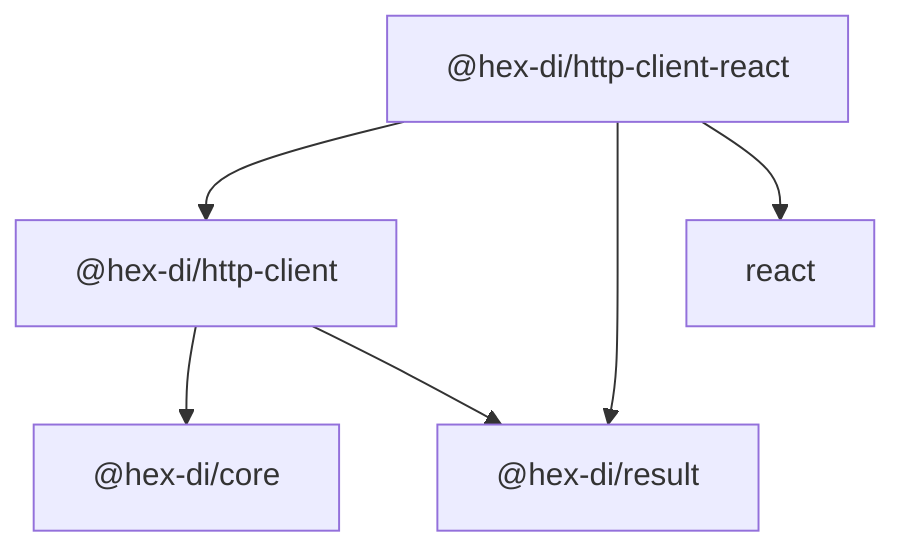

# @hex-di/http-client-react — Overview (API Surface)

Governance supplement providing package metadata, public API surface tables, module dependency graph, and source file map.

---

## Document Control

| Field | Value |
|-------|-------|
| Document ID | SPEC-HCR-OVW-001 |
| Version | Derived from Git — `git log -1 --format="%H %ai" -- spec/libs/http-client/react/overview.md` |
| Approval Evidence | PR merge to `main` |
| Status | Effective |

---

## Package Metadata

| Field | Value |
|-------|-------|
| **Name** | `@hex-di/http-client-react` |
| **Version** | `0.1.0` |
| **License** | MIT |
| **Repository** | `hex-di` monorepo, `libs/http-client/react/` |
| **Module format** | ESM (`"type": "module"`) with `.d.ts` declarations |
| **Side effects** | None (`"sideEffects": false`) |
| **Node version** | ≥ 18.0.0 (SSR) |
| **TypeScript version** | ≥ 5.0 (strict mode) |
| **Spec revision** | `0.1` |

---

## Mission

`@hex-di/http-client-react` bridges the `HttpClientPort` abstraction to React's component model. It provides `HttpClientProvider` to inject an `HttpClient` into the component tree via React Context, and three hooks that expose the client for synchronous resolution, reactive query execution, and imperative mutation. The package has zero opinion on how the `HttpClient` is constructed — that responsibility belongs to the application's DI graph.

---

## Design Philosophy

1. **No framework leakage into the domain.** The `@hex-di/http-client` package has zero React dependency. `@hex-di/http-client-react` is a one-way dependency: React imports http-client; http-client never imports React.

2. **Result-typed state, never throws.** Hooks return `Result<HttpResponse, HttpRequestError>` — the same error contract as the underlying `HttpClient`. No `try/catch` patterns in component code.

3. **Explicit client injection.** There is no default or global `HttpClient` instance. Components can only execute requests if an `HttpClientProvider` ancestor is present. Missing provider is a programming error caught at runtime with a clear message.

4. **Composition via combinators, not hook options.** Auth headers, retries, timeouts, and base URLs are applied by composing the `HttpClient` before passing it to `HttpClientProvider`. Hooks do not accept combinator options.

5. **Minimal surface area.** Three hooks cover the full request lifecycle: resolve (`useHttpClient`), reactive query (`useHttpRequest`), imperative mutation (`useHttpMutation`).

---

## Runtime Requirements

| Requirement | Version |
|-------------|---------|
| React | ≥ 18.0 |
| TypeScript | ≥ 5.0 (strict mode) |
| `@hex-di/http-client` | ≥ 0.1.0 |
| `@hex-di/result` | ≥ 0.1.0 |
| Node.js (SSR) | ≥ 18.0.0 |

---

## Public API Surface

### Provider

| Export | Kind | Source File |
|--------|------|-------------|
| `HttpClientProvider` | React component | `src/provider.tsx` |
| `HttpClientProviderProps` | Interface | `src/provider.tsx` |

### Hooks

| Export | Kind | Source File |
|--------|------|-------------|
| `useHttpClient` | Hook | `src/hooks/use-http-client.ts` |
| `useHttpRequest` | Hook | `src/hooks/use-http-request.ts` |
| `useHttpMutation` | Hook | `src/hooks/use-http-mutation.ts` |

### State Types

| Export | Kind | Source File |
|--------|------|-------------|
| `UseHttpRequestState<E>` | Interface | `src/types.ts` |
| `UseHttpMutationState<E>` | Interface | `src/types.ts` |
| `HttpRequestStatus` | Union type | `src/types.ts` |

### Testing

| Export | Kind | Source File |
|--------|------|-------------|
| `createHttpClientTestProvider` | Function | `src/testing.ts` |
| `HttpClientTestProviderProps` | Interface | `src/testing.ts` |

### Metadata

| Export | Kind | Source File |
|--------|------|-------------|
| `specRevision` | `string` constant | `src/metadata.ts` |

---

## Subpath Exports

| Subpath | Entry Point | Description |
|---------|-------------|-------------|
| `@hex-di/http-client-react` | `src/index.ts` | All public exports |

---

## Module Dependency Graph

---

## Source File Map

| Source File | Responsibility |
|-------------|----------------|
| `src/context.ts` | `HttpClientContext` — React Context definition; default value `null` |
| `src/provider.tsx` | `HttpClientProvider` — Context Provider component; `useMemo` for context value stability |
| `src/hooks/use-http-client.ts` | `useHttpClient` — resolves `HttpClient` from nearest provider; throws if no provider |
| `src/hooks/use-http-request.ts` | `useHttpRequest` — reactive query hook; `useEffect` state machine; `AbortController` lifecycle |
| `src/hooks/use-http-mutation.ts` | `useHttpMutation` — imperative mutation hook; `[mutate, state]` tuple; `reset()` |
| `src/types.ts` | `UseHttpRequestState<E>`, `UseHttpMutationState<E>`, `HttpRequestStatus` type definitions |
| `src/testing.ts` | `createHttpClientTestProvider` — wraps mock `HttpClient` in minimal provider for test rendering |
| `src/metadata.ts` | `specRevision` constant — machine-verifiable link between installed package and this spec |
| `src/index.ts` | Public re-exports of all above modules |

---

## Specification & Process Files

| Spec File | Responsibility |
|-----------|----------------|
| `README.md` | Document Control hub; Quick Start; Table of Contents |
| `01-overview.md` | URS: mission, scope, design philosophy, API surface, source file map |
| `02-provider.md` | FS: `HttpClientProvider` contract; Context definition; nested providers |
| `03-hooks.md` | FS: `useHttpClient`, `useHttpRequest`, `useHttpMutation` contracts and state machines |
| `04-testing.md` | FS: testing utilities and patterns |
| `05-definition-of-done.md` | Test enumeration — 44 tests across 5 DoD groups |
| `overview.md` | This file — API surface governance supplement |
| `invariants.md` | Runtime guarantees (`INV-HCR-1` through `INV-HCR-5`) |
| `traceability.md` | Forward/backward requirement traceability matrix |
| `risk-assessment.md` | FMEA per-invariant analysis |
| `glossary.md` | React-specific domain terminology |
| `roadmap.md` | Planned future work |
| `decisions/` | Architecture Decision Records (`ADR-HCR-001` through `ADR-HCR-006`) |
| `process/definitions-of-done.md` | Feature acceptance checklist |
| `process/test-strategy.md` | Test pyramid, coverage targets, file naming conventions |
| `process/requirement-id-scheme.md` | Requirement ID format specification for `@hex-di/http-client-react` |
| `process/change-control.md` | Change classification and approval workflow |
| `scripts/verify-traceability.sh` | Automated traceability consistency validator |
