# @hex-di/core — Overview

## Package Metadata

| Field         | Value                                                               |
| ------------- | ------------------------------------------------------------------- |
| Name          | `@hex-di/core`                                                      |
| Version       | `1.0.0`                                                             |
| License       | MIT                                                                 |
| Repository    | `https://github.com/hex-di/hex-di.git` (directory: `packages/core`) |
| Module format | ESM primary, CJS compatibility                                      |
| Side effects  | None (`"sideEffects": false`)                                       |
| Node          | `>= 18.0.0`                                                         |
| TypeScript    | `>= 5.0` (optional peer dependency)                                 |

## Mission

Provide the foundational primitives for hexagonal dependency injection in TypeScript: **ports** (contracts), **adapters** (implementations), and **container lifecycle** (resolution, scoping, disposal). All construction errors flow through `Result<T, E>` — no exceptions are thrown from factory functions.

## Design Philosophy

1. **Ports are contracts** — A port declares what a service looks like (`port<Logger>()({ name: "Logger" })`), not how it works. Ports carry metadata (direction, category, tags) but no implementation.
2. **Adapters are implementations** — `createAdapter()` binds a factory function or class to one or more ports, with a declared lifetime (singleton, scoped, transient).
3. **Result-based errors** — All adapter construction errors flow through `Result<T, E>`. Helper functions (`adapterOrDie`, `adapterOrElse`, `adapterOrHandle`) provide ergonomic error handling at the composition boundary.
4. **Immutability** — Port definitions and error objects are `Object.freeze()`d at creation. Resolved services should be treated as immutable capabilities.
5. **Type-level safety** — Port names are literal types. Adapter `requires`/`provides` tuples are validated at compile time. Lifetime mismatches (e.g., singleton depending on transient) are caught by `@hex-di/graph`.
6. **Context variables** — `createContextVariable()` provides scoped ambient context without global state.
7. **Inspection protocol** — Runtime introspection of container state, resolution paths, and adapter metadata via a structured inspector API.

## Runtime Requirements

- **Node.js** `>= 18.0.0`
- **TypeScript** `>= 5.0` (optional — the library works in plain JavaScript)
- **Build**: `tsc` with `tsconfig.build.json`
- **Test**: Vitest (runtime), Vitest typecheck (type-level)

## Public API Surface

### Ports

| Export                  | Kind     | Source              |
| ----------------------- | -------- | ------------------- |
| `port<T>()(config)`     | Function | `ports/factory.ts`  |
| `createPort(config)`    | Function | `ports/factory.ts`  |
| `DirectedPort<N,T,D,C>` | Type     | `ports/directed.ts` |
| `Port<N,T>`             | Type     | `ports/types.ts`    |
| `PortDirection`         | Type     | `ports/types.ts`    |

### Adapters

| Export                    | Kind     | Source                |
| ------------------------- | -------- | --------------------- |
| `createAdapter(config)`   | Function | `adapters/unified.ts` |
| `adapterOrDie(config)`    | Function | `adapters/unified.ts` |
| `adapterOrElse(config)`   | Function | `adapters/unified.ts` |
| `adapterOrHandle(config)` | Function | `adapters/unified.ts` |
| `lazyPort(port)`          | Function | `adapters/lazy.ts`    |

### Lifetime Constants

| Export      | Kind     | Source                  |
| ----------- | -------- | ----------------------- |
| `SINGLETON` | Constant | `adapters/constants.ts` |
| `SCOPED`    | Constant | `adapters/constants.ts` |
| `TRANSIENT` | Constant | `adapters/constants.ts` |
| `SYNC`      | Constant | `adapters/constants.ts` |
| `ASYNC`     | Constant | `adapters/constants.ts` |

### Errors

| Export               | Kind      | Source              |
| -------------------- | --------- | ------------------- |
| `ResolutionError`    | Type      | `errors/types.ts`   |
| `GraphBuildError`    | Type      | `errors/classes.ts` |
| Error code constants | Constants | `errors/codes.ts`   |

### Context

| Export                    | Kind     | Source                 |
| ------------------------- | -------- | ---------------------- |
| `createContextVariable()` | Function | `context/variables.ts` |
| `withContext(vars, fn)`   | Function | `context/helpers.ts`   |
| `getContext(variable)`    | Function | `context/helpers.ts`   |

### Inspection

| Export                   | Kind  | Source                          |
| ------------------------ | ----- | ------------------------------- |
| Container snapshot types | Types | `inspection/container-types.ts` |
| Graph inspection types   | Types | `inspection/graph-types.ts`     |
| Inspector protocol       | Types | `inspection/inspector-types.ts` |
| Tracing types            | Types | `inspection/tracing-types.ts`   |

### Utilities

| Export             | Kind     | Source                    |
| ------------------ | -------- | ------------------------- |
| `correlationId()`  | Function | `utils/correlation.ts`    |
| Type utility types | Types    | `utils/type-utilities.ts` |

## Module Dependency Graph

```mermaid
graph TD
    index["index.ts (public API)"]

    pf["ports/factory.ts"]
    pd["ports/directed.ts"]
    pt["ports/types.ts"]

    au["adapters/unified.ts"]
    ac["adapters/constants.ts"]
    at["adapters/types.ts"]
    al["adapters/lazy.ts"]
    ag["adapters/guards.ts"]
    ai["adapters/inference.ts"]

    eb["errors/base.ts"]
    ec["errors/classes.ts"]
    eo["errors/codes.ts"]
    ep["errors/parsing.ts"]
    et["errors/types.ts"]

    cv["context/variables.ts"]
    ch["context/helpers.ts"]

    ict["inspection/container-types.ts"]
    igt["inspection/graph-types.ts"]
    iit["inspection/inspector-types.ts"]
    itt["inspection/tracing-types.ts"]

    uc["utils/correlation.ts"]
    utu["utils/type-utilities.ts"]

    index --> pf
    index --> pd
    index --> au
    index --> ac
    index --> al
    index --> ag
    index --> eb
    index --> ec
    index --> eo
    index --> ep
    index --> cv
    index --> ch
    index --> ict
    index --> igt
    index --> iit
    index --> itt
    index --> uc
    index --> utu

    pf --> pd
    pf --> pt
    pd --> pt

    au --> at
    au --> ac
    au --> ai
    al --> pt
    ag --> at

    ec --> eb
    ec --> eo
    ep --> et
    ep --> eo

    ch --> cv
```

## Source File Map

| File                            | Responsibility                                     |
| ------------------------------- | -------------------------------------------------- |
| `ports/factory.ts`              | `port()` and `createPort()` — port definition API  |
| `ports/directed.ts`             | `DirectedPort` type with direction metadata        |
| `ports/types.ts`                | Core port type definitions                         |
| `adapters/unified.ts`           | `createAdapter()` — unified adapter factory        |
| `adapters/constants.ts`         | Lifetime and factory kind constants                |
| `adapters/types.ts`             | Adapter configuration and result types             |
| `adapters/inference.ts`         | Type inference utilities for adapter factories     |
| `adapters/lazy.ts`              | `lazyPort()` — lazy dependency resolution          |
| `adapters/guards.ts`            | Type guards for adapter identification             |
| `errors/base.ts`                | Base error class definitions                       |
| `errors/classes.ts`             | Concrete error classes (resolution, build, etc.)   |
| `errors/codes.ts`               | Error code constants                               |
| `errors/parsing.ts`             | Error parsing and formatting utilities             |
| `errors/types.ts`               | Error type definitions and unions                  |
| `errors/resolution-error.ts`    | Resolution-specific error types                    |
| `context/variables.ts`          | `createContextVariable()` — scoped ambient context |
| `context/helpers.ts`            | `withContext()`, `getContext()` — context access   |
| `inspection/container-types.ts` | Container snapshot and state types                 |
| `inspection/graph-types.ts`     | Graph inspection types                             |
| `inspection/inspector-types.ts` | Inspector protocol interface                       |
| `inspection/tracing-types.ts`   | Tracing and correlation types                      |
| `inspection/tracing-warning.ts` | Tracing warning utilities                          |
| `utils/correlation.ts`          | Correlation ID generation                          |
| `utils/type-utilities.ts`       | General type-level utilities                       |

## Document Map

| Document                                                                         | Purpose                                              |
| -------------------------------------------------------------------------------- | ---------------------------------------------------- |
| [overview.md](overview.md)                                                       | This file — package mission, API surface, module map |
| [glossary.md](glossary.md)                                                       | Terminology definitions                              |
| [invariants.md](invariants.md)                                                   | Runtime guarantees                                   |
| [roadmap.md](roadmap.md)                                                         | Enhancement tiers and future work                    |
| [behaviors/01-port-definition.md](behaviors/01-port-definition.md)               | Port creation API                                    |
| [behaviors/02-adapter-creation.md](behaviors/02-adapter-creation.md)             | Adapter factory API                                  |
| [behaviors/03-adapter-error-handling.md](behaviors/03-adapter-error-handling.md) | Error handling helpers                               |
| [behaviors/04-container-lifecycle.md](behaviors/04-container-lifecycle.md)       | Container resolve/dispose                            |
| [decisions/](decisions/)                                                         | Architecture Decision Records                        |
| [type-system/](type-system/)                                                     | Type-level safety patterns                           |
