# @hex-di/graph — Overview

## Package Metadata

| Field         | Value                                                                |
| ------------- | -------------------------------------------------------------------- |
| Name          | `@hex-di/graph`                                                      |
| Version       | `1.0.0`                                                              |
| License       | MIT                                                                  |
| Repository    | `https://github.com/hex-di/hex-di.git` (directory: `packages/graph`) |
| Module format | ESM primary, CJS compatibility                                       |
| Side effects  | None (`"sideEffects": false`)                                        |
| Node          | `>= 18.0.0`                                                          |
| TypeScript    | `>= 5.0` (optional peer dependency)                                  |

## Mission

Provide compile-time and runtime validation of dependency graphs for hexagonal DI. The `GraphBuilder` API assembles adapter registrations into a validated dependency graph, catching cycles, captive dependencies, missing ports, and lifetime violations **before** the container is built.

## Design Philosophy

1. **Fail at build time, not resolve time** — Graph validation happens when `.build()` is called, not during service resolution. All structural errors are caught early.
2. **Type-level validation first** — Cycles, captive dependencies, missing ports, and duplicate registrations are detected at the TypeScript type level wherever possible. Runtime validation is a fallback for cases that escape the type system.
3. **Fluent builder pattern** — `GraphBuilder.create().provide(adapter1).provide(adapter2).build()` — each `.provide()` returns a new builder with updated type state, enabling progressive type narrowing.
4. **Composition via merge** — Graphs compose via `.merge()`, combining adapter registrations from independent subgraphs. Merge conflicts (duplicate port providers) are detected at both type and runtime levels.
5. **Inspection support** — Built graphs expose their structure for runtime analysis: dependency traversal, complexity metrics, depth analysis, serialization, and structured logging.
6. **Result-based errors** — `tryBuild()` and `tryBuildFragment()` return `Result<Graph, GraphBuildError>` instead of throwing. `.build()` throws for ergonomics but `tryBuild()` is available for Result-based pipelines.

## Runtime Requirements

- **Node.js** `>= 18.0.0`
- **TypeScript** `>= 5.0` (optional — the library works in plain JavaScript)
- **Peer dependency**: `@hex-di/core`
- **Build**: `tsc` with `tsconfig.build.json`
- **Test**: Vitest (runtime), Vitest typecheck (type-level)

## Public API Surface

### GraphBuilder

| Export                             | Kind   | Source               |
| ---------------------------------- | ------ | -------------------- |
| `GraphBuilder`                     | Class  | `builder/builder.ts` |
| `GraphBuilder.create()`            | Static | `builder/builder.ts` |
| `GraphBuilder.withMaxDepth<N>()`   | Static | `builder/builder.ts` |
| `GraphBuilder.withExtendedDepth()` | Static | `builder/builder.ts` |
| `GraphBuilder.forParent(graph)`    | Static | `builder/builder.ts` |

### Builder Instance Methods

| Method                   | Returns                | Description                          |
| ------------------------ | ---------------------- | ------------------------------------ |
| `.provide(adapter)`      | `GraphBuilder<...>`    | Register an adapter                  |
| `.provideMany(adapters)` | `GraphBuilder<...>`    | Register multiple adapters           |
| `.override(adapter)`     | `GraphBuilder<...>`    | Override an existing registration    |
| `.merge(otherBuilder)`   | `GraphBuilder<...>`    | Combine two builders                 |
| `.build()`               | `Graph`                | Validate and build (throws on error) |
| `.buildFragment()`       | `Graph`                | Build without completeness check     |
| `.tryBuild()`            | `Result<Graph, Error>` | Validate and build (Result-based)    |
| `.tryBuildFragment()`    | `Result<Graph, Error>` | Fragment build (Result-based)        |
| `.inspect()`             | `BuilderInspection`    | Runtime introspection                |
| `.validate()`            | `ValidationResult`     | Run all validations without building |

### Type Guards

| Export              | Kind     | Source              |
| ------------------- | -------- | ------------------- |
| `isGraphBuilder(v)` | Function | `builder/guards.ts` |
| `isGraph(v)`        | Function | `graph/guards.ts`   |

### Errors

| Export            | Kind | Source                         |
| ----------------- | ---- | ------------------------------ |
| `GraphBuildError` | Type | `errors/graph-build-errors.ts` |
| Error guard utils | Fns  | `errors/guards.ts`             |

### Graph Inspection

| Export              | Kind | Source                                          |
| ------------------- | ---- | ----------------------------------------------- |
| Complexity metrics  | Fns  | `graph/inspection/complexity.ts`                |
| Depth analysis      | Fns  | `graph/inspection/depth-analysis.ts`            |
| Disposal ordering   | Fns  | `graph/inspection/disposal.ts`                  |
| Cycle detection     | Fns  | `graph/inspection/runtime-cycle-detection.ts`   |
| Captive detection   | Fns  | `graph/inspection/runtime-captive-detection.ts` |
| Serialization       | Fns  | `graph/inspection/serialization.ts`             |
| Structured logging  | Fns  | `graph/inspection/structured-logging.ts`        |
| Traversal utilities | Fns  | `graph/inspection/traversal.ts`                 |
| Suggestions         | Fns  | `graph/inspection/suggestions.ts`               |

### Compile-Time Validation

| Module                                        | Validates                             |
| --------------------------------------------- | ------------------------------------- |
| `validation/types/cycle/`                     | Type-level DFS cycle detection        |
| `validation/types/captive/`                   | Captive dependency lifetime hierarchy |
| `validation/types/dependency-satisfaction.ts` | All requires are provided             |
| `validation/types/batch-duplicates.ts`        | No duplicate port providers           |
| `validation/types/self-dependency.ts`         | No adapter depends on itself          |
| `validation/types/merge-conflict.ts`          | No conflicting providers in merge     |
| `validation/types/error-aggregation.ts`       | Error message assembly                |
| `validation/types/lazy-transforms.ts`         | Lazy dependency validation            |
| `validation/types/init-priority.ts`           | Initialization order computation      |

## Module Dependency Graph

```mermaid
graph TD
    index["index.ts (public API)"]

    bb["builder/builder.ts"]
    bbuild["builder/builder-build.ts"]
    bmerge["builder/builder-merge.ts"]
    bprovide["builder/builder-provide.ts"]
    bt["builder/builder-types.ts"]
    bg["builder/guards.ts"]

    ge["errors/graph-build-errors.ts"]
    gex["errors/graph-build-exception.ts"]
    geg["errors/guards.ts"]

    gg["graph/guards.ts"]
    gi["graph/inspection/inspector.ts"]
    gc["graph/inspection/complexity.ts"]
    gda["graph/inspection/depth-analysis.ts"]
    gd["graph/inspection/disposal.ts"]
    grc["graph/inspection/runtime-cycle-detection.ts"]
    grca["graph/inspection/runtime-captive-detection.ts"]
    gs["graph/inspection/serialization.ts"]
    gsl["graph/inspection/structured-logging.ts"]
    gt["graph/inspection/traversal.ts"]
    gsu["graph/inspection/suggestions.ts"]

    sb["symbols/brands.ts"]

    vc["validation/types/cycle/"]
    vca["validation/types/captive/"]
    vds["validation/types/dependency-satisfaction.ts"]
    vbd["validation/types/batch-duplicates.ts"]

    index --> bb
    index --> bg
    index --> gg
    index --> ge
    index --> geg
    index --> sb

    bb --> bbuild
    bb --> bmerge
    bb --> bprovide
    bb --> bt
    bbuild --> ge
    bbuild --> gex

    gi --> gc
    gi --> gda
    gi --> gd
    gi --> grc
    gi --> grca
    gi --> gs
    gi --> gsl
    gi --> gt
    gi --> gsu
```

## Source File Map

| File                                            | Responsibility                                    |
| ----------------------------------------------- | ------------------------------------------------- |
| `builder/builder.ts`                            | `GraphBuilder` class — fluent builder entry point |
| `builder/builder-build.ts`                      | `.build()` / `.tryBuild()` finalization logic     |
| `builder/builder-merge.ts`                      | `.merge()` — graph composition                    |
| `builder/builder-provide.ts`                    | `.provide()` / `.provideMany()` registration      |
| `builder/builder-types.ts`                      | Structural interfaces for builder state           |
| `builder/guards.ts`                             | `isGraphBuilder()` type guard                     |
| `builder/types/builder-signature.ts`            | Builder method type signatures                    |
| `builder/types/state.ts`                        | Type-level builder state tracking                 |
| `builder/types/provide.ts`                      | Provide method type constraints                   |
| `builder/types/merge.ts`                        | Merge method type constraints                     |
| `builder/types/init-order-types.ts`             | Initialization order type utilities               |
| `builder/types/inspection.ts`                   | Builder inspection types                          |
| `errors/graph-build-errors.ts`                  | Error factory functions                           |
| `errors/graph-build-exception.ts`               | Exception class for `.build()` (throwing variant) |
| `errors/guards.ts`                              | Error type guards                                 |
| `graph/guards.ts`                               | `isGraph()` type guard                            |
| `graph/types/graph-types.ts`                    | Graph data structure types                        |
| `graph/types/graph-inference.ts`                | Type inference for graph properties               |
| `graph/types/inspection.ts`                     | Graph inspection result types                     |
| `graph/inspection/inspector.ts`                 | Graph inspector — runtime analysis entry point    |
| `graph/inspection/complexity.ts`                | Complexity metrics (edge count, density, etc.)    |
| `graph/inspection/depth-analysis.ts`            | Depth analysis (max depth, critical paths)        |
| `graph/inspection/disposal.ts`                  | Disposal order computation                        |
| `graph/inspection/runtime-cycle-detection.ts`   | Runtime cycle detection (Tarjan's)                |
| `graph/inspection/runtime-captive-detection.ts` | Runtime captive dependency detection              |
| `graph/inspection/serialization.ts`             | Graph serialization to JSON                       |
| `graph/inspection/structured-logging.ts`        | Structured log output                             |
| `graph/inspection/traversal.ts`                 | Graph traversal utilities (BFS, DFS)              |
| `graph/inspection/suggestions.ts`               | Fix suggestions for graph errors                  |
| `graph/inspection/filter.ts`                    | Graph node filtering                              |
| `graph/inspection/correlation.ts`               | Correlation ID tracking                           |
| `graph/inspection/lazy-analysis.ts`             | Lazy dependency analysis                          |
| `graph/inspection/error-formatting.ts`          | Human-readable error formatting                   |
| `symbols/brands.ts`                             | Brand symbols for nominal typing                  |
| `validation/port-name-validation.ts`            | Runtime port name validation                      |
| `validation/types/cycle/`                       | Type-level cycle detection (DFS)                  |
| `validation/types/captive/`                     | Type-level captive dependency detection           |
| `validation/types/dependency-satisfaction.ts`   | Missing port detection                            |
| `validation/types/batch-duplicates.ts`          | Duplicate provider detection                      |
| `validation/types/self-dependency.ts`           | Self-dependency detection                         |
| `validation/types/merge-conflict.ts`            | Merge conflict detection                          |
| `validation/types/error-aggregation.ts`         | Error message assembly                            |
| `validation/types/error-messages.ts`            | Error message templates                           |
| `validation/types/lazy-transforms.ts`           | Lazy dependency validation                        |
| `validation/types/init-priority.ts`             | Initialization order computation                  |
| `audit/global-sink.ts`                          | Global audit event sink                           |
| `audit/types.ts`                                | Audit event types                                 |

## Document Map

| Document                                                                                     | Purpose                                              |
| -------------------------------------------------------------------------------------------- | ---------------------------------------------------- |
| [overview.md](overview.md)                                                                   | This file — package mission, API surface, module map |
| [glossary.md](glossary.md)                                                                   | Terminology definitions                              |
| [invariants.md](invariants.md)                                                               | Runtime guarantees                                   |
| [roadmap.md](roadmap.md)                                                                     | Enhancement tiers and future work                    |
| [behaviors/01-builder-api.md](behaviors/01-builder-api.md)                                   | GraphBuilder fluent API                              |
| [behaviors/02-cycle-detection.md](behaviors/02-cycle-detection.md)                           | Type-level and runtime cycle detection               |
| [behaviors/03-captive-dependency-detection.md](behaviors/03-captive-dependency-detection.md) | Lifetime hierarchy validation                        |
| [behaviors/04-error-channel-enforcement.md](behaviors/04-error-channel-enforcement.md)       | Unhandled error detection                            |
| [decisions/](decisions/)                                                                     | Architecture Decision Records                        |
| [type-system/](type-system/)                                                                 | Type-level safety patterns                           |
