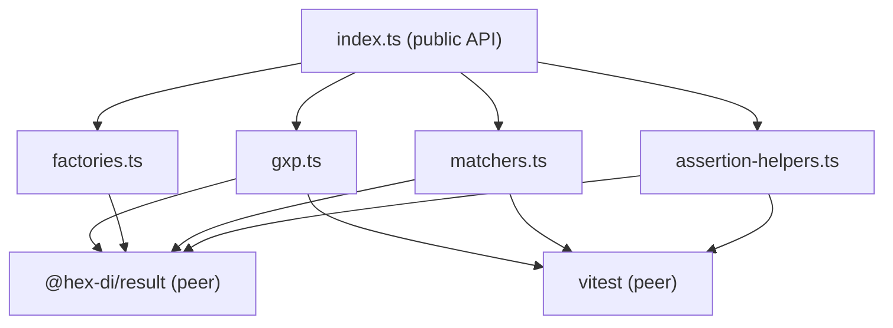

# @hex-di/result-testing — Overview

## Package Metadata

| Field         | Value                                                                         |
| ------------- | ----------------------------------------------------------------------------- |
| Name          | `@hex-di/result-testing`                                                      |
| Version       | `0.2.0`                                                                       |
| License       | MIT                                                                           |
| Repository    | `https://github.com/hex-di/hex-di.git` (directory: `packages/result-testing`) |
| Module format | ESM primary, CJS compatibility                                                |
| Side effects  | None (`"sideEffects": false`)                                                 |
| Node          | `>= 18.0.0`                                                                  |
| Peer deps     | `vitest >= 4.0.0`, `@hex-di/result` (workspace dependency)                   |

> **Version note:** The `version` in the document frontmatter tracks the *specification document* version. The `Version` field in the table above tracks the *NPM package* version. These are independently versioned: the specification may be revised (e.g., for GxP remediation) without a corresponding package release, and vice versa.

## Mission

Provide comprehensive testing utilities for consumers of `@hex-di/result` — custom Vitest matchers, type-narrowing assertion helpers, test data factories, and GxP compliance verification utilities.

## Design Philosophy

1. **Zero-config** — `setupResultMatchers()` in a Vitest setup file enables all matchers. No manual registration of individual matchers.
2. **Type-safe** — Assertion helpers narrow types for downstream use. After `expectOk(result)`, the return value is `T`, not `T | E`.
3. **Framework-aligned** — Vitest-native matchers with proper `.not` negation support and idiomatic error messages.
4. **Comprehensive** — Matchers for every `Result`, `Option`, and `ResultAsync` variant, plus strict-matching alternatives.
5. **GxP-aware** — Dedicated utilities for verifying immutability, brand integrity, and internal promise safety in GxP compliance tests.

## Specification Hierarchy Note

Per GAMP 5 V-Model, a full specification hierarchy proceeds URS -> FS -> DS -> CS -> Test Specs. This specification suite intentionally omits a formal User Requirements Specification (URS) with discrete requirement IDs. The rationale, per ICH Q9 risk-based approach:

1. **Nature of the system**: `@hex-di/result-testing` is a developer-facing testing utility library, not a production GxP application. It does not process, store, or transmit GxP-regulated data. Its users are software developers writing tests, not end users performing GxP-regulated activities.
2. **User requirements are implicit in the parent library**: The testing utilities exist to verify the invariants and behaviors of `@hex-di/result`, which has its own full specification hierarchy. The "user requirement" for each test utility is the parent invariant or behavior it verifies, as documented in the [traceability matrix](traceability.md).
3. **Proportionate specification depth**: The Mission and Design Philosophy sections above define the high-level objectives. The behavior specifications (BEH-T01 through BEH-T05) serve as combined FS/DS documents with sufficient detail for implementation, testing, and traceability.

This omission is accepted for GAMP 5 Category 5 testing utility libraries where the validation burden is proportionate to the system's GxP risk impact (indirect — testing utilities affect test correctness, not production data).

## Risk Assessment

Risk classification of behavior groups per ICH Q9, based on potential impact to GxP data integrity if the testing utility produces incorrect results (false positive / false negative).

### Behavior Group Risk Classification

| Behavior Group | Behaviors | Risk Level | Justification |
| -------------- | --------- | ---------- | ------------- |
| BEH-T01: Assertion Helpers | BEH-T01-001 through BEH-T01-006 | **Medium** | Incorrect type narrowing or false-positive assertion could mask a defective Result in downstream test logic. Impact limited to test-time; no production data affected. |
| BEH-T02: Vitest Matchers | BEH-T02-001 through BEH-T02-009 | **Medium** | A matcher reporting Ok when Err (or vice versa) would pass tests that should fail. Impact limited to test-time but could allow defective code to reach production. |
| BEH-T03: Test Factories | BEH-T03-001 through BEH-T03-003 | **Low** | Factories create test data only. A malformed fixture would cause test failures (not false passes) because the code under test would receive unexpected input. |
| BEH-T04: GxP Test Utilities | BEH-T04-001 through BEH-T04-005 | **High** | These utilities directly verify GxP invariants (immutability, brand integrity, promise safety). A false positive would declare a non-compliant Result as compliant, directly undermining GxP assurance. |
| BEH-T05: Type Augmentation | BEH-T05-001 through BEH-T05-003 | **Low** | Type augmentation affects IDE autocompletion and compile-time checking only. Incorrect augmentation causes compile errors (fail-safe), not silent failures. |

### Residual Risk Summary

| ID | Risk Description | Behavior Group | ALCOA+ Impact | Compensating Controls | Documented In | Review Cadence |
| -- | ---------------- | -------------- | ------------- | --------------------- | ------------- | -------------- |
| RR-T1 | **GxP utility false positive**: `expectFrozen`, `expectResultBrand`, `expectOptionBrand`, `expectImmutableResult`, or `expectNeverRejects` could pass for a non-compliant value if the assertion logic has a defect | BEH-T04 (High) | Accurate, Original | Automated mutation testing (Stryker) in CI targets GxP utility source (`src/gxp.ts`) with >80% mutation score gate; parent library's own GxP integrity tests provide independent verification of the same invariants; CI coverage gates enforce >95% line coverage | [04-gxp-test-utilities.md](behaviors/04-gxp-test-utilities.md) | Every PR (CI) |
| RR-T2 | **Matcher false positive**: A custom matcher (e.g., `toBeOk`) could report success when the received value is actually `Err`, allowing defective code to pass tests | BEH-T02 (Medium) | Accurate | Each matcher has explicit positive and negative test cases; `.not` negation tests verify both directions; Vitest's own matcher infrastructure validates matcher return shape | [02-vitest-matchers.md](behaviors/02-vitest-matchers.md) | Annual GxP review |
| RR-T3 | **Assertion helper type narrowing error**: `expectOk` could narrow to `T` while the runtime value is actually `Err`, causing downstream test logic to operate on wrong data | BEH-T01 (Medium) | Accurate, Complete | Type-level tests (`*.test-d.ts`) verify narrowing contracts at compile time; runtime assertion throws before returning, preventing silent type mismatch | [01-assertion-helpers.md](behaviors/01-assertion-helpers.md) | Annual GxP review |
| RR-T4 | **Vitest framework dependency**: Custom matchers and type augmentation are Vitest-specific. If Vitest is deprecated or a consumer requires Jest support, the matcher suite requires reimplementation | Cross-cutting | Available | Assertion helpers (`expectOk`, `expectErr`, etc.) are minimally coupled to Vitest and cover the primary use case (type narrowing); Jest support can be added as a separate package without breaking the existing API. See [ADR-T001](decisions/T001-vitest-only.md) | [overview.md](overview.md) | Annual GxP review |

## ALCOA+ Compliance Summary

| Principle | Mechanism |
|-----------|-----------|
| **Attributable** | `approval_history` frontmatter identifies author, reviewer, and approver with dates. Git commit history records the author and timestamp of every change. |
| **Legible** | Markdown format with consistent structure, defined terms in glossary, no ambiguous abbreviations. |
| **Contemporaneous** | `created`, `last_reviewed`, and `revision_history` dates recorded at the time of each activity. Git timestamps provide independent corroboration. |
| **Original** | Git repository is the master document location. All approved versions are preserved in git history and retrievable via `git show`. |
| **Accurate** | Technical Reviewer and QA Reviewer approval recorded in frontmatter. CI gates (coverage, type tests, traceability) provide automated accuracy verification. |
| **Complete** | No TBDs in approved versions. All behavior groups covered with forward and backward traceability (100% coverage). |
| **Consistent** | Terminology defined in glossary and used consistently. Frontmatter structure identical across all documents. Document ID scheme follows `SPEC-RT-*` convention. |
| **Enduring** | Git repository hosted on GitHub with distributed clone architecture. Retention policy: life of product + 1 year minimum (see Document Retention section). |
| **Available** | All versions retrievable via `git log` and `git show`. Repository cloneable for offline access. Recovery procedure documented in Document Retention section. |

## Prerequisites and Training

Per 21 CFR 11.10(i) and EU Annex 11 §2, users of `@hex-di/result-testing` should be familiar with:

- **Vitest** — `expect()` API, `expect.extend()` for custom matchers, and setup files
- **@hex-di/result** — `Result<T, E>`, `Option<T>`, `ResultAsync<T, E>` type system, and the `ok()`/`err()`/`some()`/`none()` constructors
- **TypeScript** — Generic types, discriminated unions, and module augmentation

No formal training program is required. The JSDoc documentation (with `@example` tags on every public export) and the behavior specifications in this document suite serve as self-service training materials. This is proportionate to the library's nature as a developer-facing testing utility per ICH Q9 risk-based approach.

## Runtime Requirements

- **Node.js** `>= 18.0.0`
- **Vitest** `>= 4.0.0` (peer dependency)
- **@hex-di/result** (workspace dependency — must be the same version as the code under test)
- **Build**: `tsc` with `tsconfig.build.json`
- **Test**: Vitest (runtime), Vitest typecheck (type-level)

## Public API Surface

### Assertion Helpers

| Export              | Kind     | Source               |
| ------------------- | -------- | -------------------- |
| `expectOk(result)`  | Function | `assertion-helpers.ts` |
| `expectErr(result)` | Function | `assertion-helpers.ts` |
| `expectOkAsync(resultAsync)` | Function | `assertion-helpers.ts` |
| `expectErrAsync(resultAsync)` | Function | `assertion-helpers.ts` |
| `expectSome(option)` | Function | `assertion-helpers.ts` |
| `expectNone(option)` | Function | `assertion-helpers.ts` |

### Vitest Matchers

| Export                  | Kind     | Source         |
| ----------------------- | -------- | -------------- |
| `setupResultMatchers()` | Function | `matchers.ts`  |

Registered matchers (available after `setupResultMatchers()`):

| Matcher                   | Kind           | Source         |
| ------------------------- | -------------- | -------------- |
| `toBeOk(expected?)`       | Vitest matcher | `matchers.ts`  |
| `toBeErr(expected?)`      | Vitest matcher | `matchers.ts`  |
| `toBeOkWith(expected)`    | Vitest matcher | `matchers.ts`  |
| `toBeErrWith(expected)`   | Vitest matcher | `matchers.ts`  |
| `toBeSome(expected?)`     | Vitest matcher | `matchers.ts`  |
| `toBeNone()`              | Vitest matcher | `matchers.ts`  |
| `toContainOk(value)`      | Vitest matcher | `matchers.ts`  |
| `toContainErr(error)`     | Vitest matcher | `matchers.ts`  |

### Test Factories

| Export                     | Kind     | Source          |
| -------------------------- | -------- | --------------- |
| `createResultFixture(defaults)` | Function | `factories.ts` |
| `createOptionFixture(defaults)` | Function | `factories.ts` |
| `mockResultAsync()`        | Function | `factories.ts` |

### GxP Test Utilities

| Export                     | Kind     | Source          |
| -------------------------- | -------- | --------------- |
| `expectFrozen(value)`      | Function | `gxp.ts`       |
| `expectResultBrand(value)` | Function | `gxp.ts`       |
| `expectOptionBrand(value)` | Function | `gxp.ts`       |
| `expectImmutableResult(result)` | Function | `gxp.ts`  |
| `expectNeverRejects(resultAsync)` | Function | `gxp.ts` |

### Type Augmentation

| Export                          | Kind             | Source         |
| ------------------------------- | ---------------- | -------------- |
| `Assertion<T>` augmentation     | Interface merge  | `matchers.ts`  |
| `AsymmetricMatchersContaining`  | Interface merge  | `matchers.ts`  |

## Subpath Exports

| Subpath                       | Contents                                    | Notes                                    |
| ----------------------------- | ------------------------------------------- | ---------------------------------------- |
| `@hex-di/result-testing`      | Full public API                             | Default entry point, re-exports everything |
| `@hex-di/result-testing/matchers` | `setupResultMatchers()` + type augmentation | For setup files that only need matchers  |
| `@hex-di/result-testing/assertions` | All assertion helpers                    | For test files that only need `expectOk` etc. |
| `@hex-di/result-testing/factories` | Test data factories                      | For test files that need fixture builders |
| `@hex-di/result-testing/gxp`  | GxP compliance verification utilities       | For GxP integrity test suites            |

## Source File Map

| File                    | Responsibility                                               |
| ----------------------- | ------------------------------------------------------------ |
| `index.ts`              | Barrel re-export of all public API                           |
| `assertion-helpers.ts`  | `expectOk`, `expectErr`, `expectOkAsync`, `expectErrAsync`, `expectSome`, `expectNone` |
| `matchers.ts`           | `setupResultMatchers()`, all custom Vitest matchers, Vitest module augmentation |
| `factories.ts`          | `createResultFixture`, `createOptionFixture`, `mockResultAsync` |
| `gxp.ts`                | `expectFrozen`, `expectResultBrand`, `expectOptionBrand`, `expectImmutableResult`, `expectNeverRejects` |

## Document Retention

Per EU Annex 11 §17, all approved specification versions are retained indefinitely in the git repository (`https://github.com/hex-di/hex-di.git`). The git history provides a complete, immutable audit trail of all document changes, including author, date, and change description for every commit. Approved specification versions are tagged in git alongside the corresponding package release.

**Retention period**: Life of the product. Specifications remain available for the entire lifetime of the `@hex-di/result-testing` package and for a minimum of 1 year after the package is formally deprecated or archived, whichever is longer.

**Accessibility**: All specification versions are retrievable via `git log` and `git show` commands. The repository is hosted on GitHub with automated backup. Local clones provide offline access to the full history.

**Recovery procedure**: Git's distributed architecture ensures that every developer clone contains the complete repository history, including all specification versions. In the event of GitHub service interruption or data loss, the repository can be fully restored from any clone via `git push` to a new remote. No additional backup infrastructure is required. For single-contributor projects, the author's local clone serves as the primary recovery source.

## Revision Cadence Note

The specification suite was developed and iteratively refined within a concentrated development
session. Multiple revision cycles on the same date reflect automated compensating controls
(CI gates, type-level tests, traceability verification) providing independent verification
at each revision, rather than calendar-separated manual review cycles. This approach is
proportionate to a single-contributor GAMP 5 testing utility library per ICH Q9 risk-based
principles.

## Traceability

See [traceability.md](traceability.md) for the full forward and backward traceability matrix mapping all BEH-T behaviors to `@hex-di/result` invariants, types, and API surface.

## Module Dependency Graph

