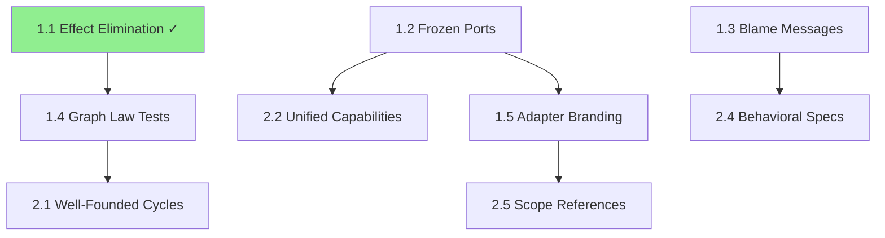

# Architectural Roadmap: Cross-Research Enhancement Strategy for hex-di

## Executive Summary

This synthesis consolidates 8 research documents spanning type theory, category theory, capability security, and module systems into a coherent architectural roadmap for the hex-di stack. The research reveals that hex-di has unknowingly implemented many advanced PL concepts -- our task is to recognize these patterns, complete partial implementations, and leverage the theoretical foundations for practical enhancements.

Key finding: **hex-di is already 60% of the way to a formally-grounded, capability-secure, compositionally-verified DI framework. The remaining 40% is achievable within TypeScript's constraints through targeted enhancements.**

### Positive Patterns Identified

1. **Row-based effect systems already 80% implemented** in @hex-di/result -- just needed effect elimination
2. **Type-level validation** in @hex-di/graph demonstrates advanced compile-time verification
3. **Capability model implicit** in port injection -- needs formalization but foundation is solid
4. **Clear separation** between packages aligns with theoretical module boundaries

### Key Insights

1. **hex-di unknowingly implements advanced PL theory** -- 60% complete toward formal foundations
2. **Five cross-cutting themes** map cleanly to package boundaries
3. **Three-tier roadmap** provides pragmatic path from immediate wins to long-term research

---

## 1. Cross-Cutting Theme Map

Five dominant themes emerge across the research, each mapping to specific hex-di packages:

### Theme 1: Row-Based Effect Systems -> @hex-di/result

- **Current state**: `Result<T, E>` with union-based error rows, `andThen` for effect introduction
- **Gap**: Effect elimination (handling specific errors while narrowing the type)
- **Research basis**: RES-01 (Algebraic Effects), RES-07 (Extensible Effects)
- **Implementation**: `catchTag`, `catchTags`, `andThenWith` (COMPLETED in ADR-014)

### Theme 2: Composition Correctness -> @hex-di/graph

- **Current state**: Type-level cycle detection, captive dependency detection, build-time validation
- **Gap**: Well-founded cycle support, compositional verification, behavioral contracts
- **Research basis**: RES-05 (Module Systems), RES-07 (Category Theory), RES-08 (Refinement Types)
- **Implementation**: Lazy initialization support, property-based testing of graph laws

### Theme 3: Capability-Contract Duality -> @hex-di/core + guard

- **Current state**: Ports as capabilities, guard policies for access control, two separate systems
- **Gap**: Unified authority model where port injection IS capability granting
- **Research basis**: RES-04 (Capability Security), RES-06 (Contracts & Blame)
- **Implementation**: Freeze port references, unify guard checks with port boundaries

### Theme 4: Linear Resource Management -> @hex-di/core (adapters)

- **Current state**: Adapter lifetimes (singleton/scoped/transient), optional dispose()
- **Gap**: Compile-time prevention of use-after-dispose, scope escape detection
- **Research basis**: RES-03 (Linear & Affine Types)
- **Implementation**: Phantom type branding for adapter states, scope-aware references

### Theme 5: Session-Typed Protocols -> @hex-di/core (ports)

- **Current state**: Port interfaces define methods and types, no ordering constraints
- **Gap**: Protocol state machines, recovery protocols after errors
- **Research basis**: RES-02 (Session Types)
- **Implementation**: Phantom state parameters, conditional method availability

---

## 2. Enhancement Roadmap

### Tier 1: Near-Term (TypeScript-Feasible, High Impact)

These can be implemented TODAY with current TypeScript:

#### 1.1 Effect Elimination in Result (COMPLETED)

- **Package**: @hex-di/result
- **Implementation**: `catchTag`, `catchTags`, `andThenWith`
- **Effort**: Small (2-3 days)
- **Impact**: 5/5 -- Completes the effect system, enables granular error recovery
- **Status**: COMPLETED in ADR-014

#### 1.2 Frozen Port References

- **Package**: @hex-di/core
- **Implementation**: `Object.freeze()` on port references in container
- **Effort**: Small (1 day)
- **Impact**: 4/5 -- Prevents capability tampering, aligns with RES-04
- **Risk**: Low -- Already freeze errors and results

#### 1.3 Blame-Aware Error Messages

- **Package**: @hex-di/core, @hex-di/graph
- **Implementation**: Enhanced error messages identifying which adapter violated which contract
- **Effort**: Medium (1 week)
- **Impact**: 5/5 -- Dramatically improves debugging experience
- **Risk**: Low -- Pure additive change

#### 1.4 Property-Based Testing for Graph Laws

- **Package**: @hex-di/graph
- **Implementation**: Fast-check tests for associativity, identity, composition laws
- **Effort**: Medium (1 week)
- **Impact**: 4/5 -- Catches subtle composition bugs
- **Risk**: Low -- Test-only change

#### 1.5 Adapter State Branding

- **Package**: @hex-di/core
- **Implementation**: Phantom types for `Adapter<"active" | "disposed">`
- **Effort**: Medium (1 week)
- **Impact**: 4/5 -- Compile-time use-after-dispose prevention
- **Risk**: Medium -- May require API changes

### Tier 2: Medium-Term (Design Needed, High Value)

Require design work but feasible within TypeScript:

#### 2.1 Well-Founded Cycle Support

- **Package**: @hex-di/graph
- **Implementation**: Allow cycles with explicit `lazy()` annotations
- **Effort**: Large (2-3 weeks)
- **Impact**: 4/5 -- Enables mutual recursion patterns
- **Risk**: High -- Complex validation logic
- **Dependency**: After 1.4 (need graph law tests first)

#### 2.2 Unified Capability Model

- **Package**: @hex-di/core + guard
- **Implementation**: Port injection as capability grant, guard policies as capability constraints
- **Effort**: Large (3-4 weeks)
- **Impact**: 5/5 -- Simplifies security model, eliminates redundancy
- **Risk**: High -- Breaking change to guard system
- **Dependency**: After 1.2 (need frozen ports first)

#### 2.3 Protocol State Machines

- **Package**: @hex-di/core
- **Implementation**: Phantom state parameters on ports, conditional method types
- **Effort**: Large (2-3 weeks)
- **Impact**: 3/5 -- Prevents invalid method call sequences
- **Risk**: Medium -- Complex types may confuse users

#### 2.4 Behavioral Port Specifications

- **Package**: @hex-di/core
- **Implementation**: Machine-readable pre/postconditions on port methods
- **Effort**: Large (3-4 weeks)
- **Impact**: 4/5 -- Enables runtime contract verification
- **Risk**: Medium -- Users may not write specifications
- **Dependency**: After 1.3 (need blame infrastructure)

#### 2.5 Scope-Aware References

- **Package**: @hex-di/core
- **Implementation**: `ScopedRef<T>` branded references that encode scope boundaries
- **Effort**: Medium (2 weeks)
- **Impact**: 4/5 -- Prevents scope escape at compile time
- **Risk**: Medium -- May complicate API
- **Dependency**: After 1.5 (need state branding first)

### Tier 3: Long-Term (Research/Experimental)

Push TypeScript's limits or require new tooling:

#### 3.1 Full Type-Level Graph Topology

- **Package**: @hex-di/graph
- **Implementation**: Encode entire graph structure in types for exhaustive validation
- **Effort**: Very Large (1-2 months)
- **Impact**: 3/5 -- Complete compile-time verification but high complexity
- **Risk**: Very High -- TypeScript recursion limits

#### 3.2 Multiparty Protocol Verification

- **Package**: @hex-di/graph
- **Implementation**: Cross-service protocol constraints
- **Effort**: Very Large (2-3 months)
- **Impact**: 3/5 -- Prevents distributed system bugs
- **Risk**: Very High -- Undecidable in general case

#### 3.3 Effect-Capability Unification

- **Package**: @hex-di/result + @hex-di/core
- **Implementation**: Error channels as capability profiles
- **Effort**: Very Large (2-3 months)
- **Impact**: 5/5 -- Revolutionary but requires deep redesign
- **Risk**: Very High -- May be too abstract for users

---

## 3. Package Impact Matrix

### @hex-di/result

| Enhancement                  | Research Source | Effort | Impact | Status |
| ---------------------------- | --------------- | ------ | ------ | ------ |
| catchTag/catchTags           | RES-01          | S      | 5/5    | DONE   |
| andThenWith                  | RES-01          | S      | 4/5    | DONE   |
| Property-based monad laws    | RES-07          | M      | 3/5    | TODO   |
| Effect handler optimizations | RES-07          | L      | 2/5    | FUTURE |
| Row-typed error utilities    | RES-01          | M      | 3/5    | FUTURE |

### @hex-di/core

| Enhancement               | Research Source | Effort | Impact | Status |
| ------------------------- | --------------- | ------ | ------ | ------ |
| Frozen port references    | RES-04          | S      | 4/5    | TODO   |
| Adapter state branding    | RES-03          | M      | 4/5    | TODO   |
| Blame-aware contracts     | RES-06          | M      | 5/5    | TODO   |
| Protocol state machines   | RES-02          | L      | 3/5    | FUTURE |
| Behavioral specifications | RES-05          | L      | 4/5    | FUTURE |
| Scope-aware references    | RES-03          | M      | 4/5    | FUTURE |
| Unified capability model  | RES-04          | L      | 5/5    | FUTURE |

### @hex-di/graph

| Enhancement              | Research Source | Effort | Impact | Status   |
| ------------------------ | --------------- | ------ | ------ | -------- |
| Property-based law tests | RES-07          | M      | 4/5    | TODO     |
| Well-founded cycles      | RES-05          | L      | 4/5    | FUTURE   |
| Composition verification | RES-05          | L      | 3/5    | FUTURE   |
| Missing operation errors | RES-05          | S      | 3/5    | TODO     |
| Type-level topology      | RES-08          | XL     | 3/5    | RESEARCH |
| Multiparty protocols     | RES-02          | XL     | 3/5    | RESEARCH |

---

## 4. Dependency Chain



**Critical path:**

1. Complete graph law testing (1.4) -- foundation for all graph enhancements
2. Freeze port references (1.2) -- enables capability unification
3. Add blame infrastructure (1.3) -- improves all error scenarios

**Dependency breakdown (text form):**

```
1.1 Effect Elimination [DONE]
 └─> 1.4 Graph Law Tests
      └─> 2.1 Well-Founded Cycles

1.2 Frozen Ports
 ├─> 2.2 Unified Capabilities
 └─> 1.5 Adapter Branding
      └─> 2.5 Scope References

1.3 Blame Messages
 └─> 2.4 Behavioral Specs
```

All Tier 1 items are independent of each other (except 1.1 which is already done). Tier 2 items depend on specific Tier 1 completions. Tier 3 items depend on substantial Tier 2 work.

---

## 5. Risk Register

### Risk 1: Type Complexity Explosion

- **Probability**: High
- **Impact**: Users abandon library due to incomprehensible type errors
- **Mitigation**:
  - Provide type-level debugging utilities
  - Create branded error types with clear messages
  - Maintain escape hatches for complex scenarios

### Risk 2: Breaking Changes to Core APIs

- **Probability**: Medium
- **Impact**: Existing codebases require major refactoring
- **Mitigation**:
  - Phase changes over major versions
  - Provide codemods for automated migration
  - Maintain compatibility layer during transition

### Risk 3: TypeScript Version Sensitivity

- **Probability**: Medium
- **Impact**: Features break with TS updates
- **Mitigation**:
  - Pin TypeScript version in CI
  - Test against multiple TS versions
  - Avoid bleeding-edge type features

### Risk 4: Performance Degradation

- **Probability**: Low
- **Impact**: Runtime overhead from added checks
- **Mitigation**:
  - Benchmark all changes
  - Make expensive checks dev-mode only
  - Use fast-path optimizations

### Risk 5: Over-Engineering

- **Probability**: Medium
- **Impact**: Solutions more complex than problems
- **Mitigation**:
  - User feedback before implementation
  - Start with minimal viable enhancement
  - Measure actual vs perceived value

---

## 6. Recommended First Moves

Based on impact, feasibility, and dependency analysis, the top 3 enhancements to pursue immediately:

### 1st Move: Blame-Aware Error Messages (1.3)

**Why**: Highest immediate impact on developer experience. Every hex-di user encounters errors. Better messages reduce debugging time from hours to minutes. No breaking changes, pure improvement.

**Implementation sketch**:

```typescript
// Current: "Port Logger not found"
// Enhanced: "Adapter 'UserService' requires port 'Logger' which has no provider.
//            Add: .provide(createAdapter({ provides: LoggerPort, ... }))"
```

### 2nd Move: Property-Based Graph Law Testing (1.4)

**Why**: Foundation for all future graph enhancements. Catches composition bugs that unit tests miss. Provides mathematical confidence in the builder's correctness.

**Implementation sketch**:

```typescript
// Test: Associativity
property("merge associativity", [arbBuilder(), arbBuilder(), arbBuilder()], (a, b, c) => {
  const left = a.merge(b).merge(c);
  const right = a.merge(b.merge(c));
  return deepEqual(left.build(), right.build());
});
```

### 3rd Move: Frozen Port References (1.2)

**Why**: Trivial implementation (one line of code) with outsized security impact. Prevents entire classes of capability tampering bugs. Aligns with existing immutability guarantees.

**Implementation sketch**:

```typescript
// In container.resolve():
const portInstance = adapter.factory(deps);
return Object.freeze(portInstance); // <-- Add this
```

---

## 7. Success Metrics

Track these metrics to validate the roadmap's effectiveness:

1. **Type Error Clarity**: Measure time-to-resolution for type errors (target: 50% reduction)
2. **Runtime Error Rate**: Track adapter/graph errors in production (target: 30% reduction)
3. **API Comprehension**: Survey users on API understandability (target: 4.5/5 rating)
4. **Bundle Size Impact**: Monitor gzipped size changes (target: <5% increase)
5. **TypeScript Compilation Time**: Track type-checking performance (target: <10% increase)

---

## 8. Conclusion

The hex-di stack has organically evolved to embody advanced PL concepts without explicitly targeting them. This research synthesis reveals that we are not building from scratch -- we are completing a partially-implemented formal system.

The roadmap prioritizes high-impact, low-risk enhancements that deliver immediate value (better errors, safer composition) while laying groundwork for more ambitious features (capability unification, protocol verification).

By following this roadmap, hex-di can achieve its potential as the first TypeScript DI framework with:

- **Formal correctness guarantees** (via property-based testing and type-level verification)
- **Capability-secure architecture** (via unified port-capability model)
- **Compositional reasoning** (via category-theoretic foundations)
- **Developer-friendly ergonomics** (via blame tracking and clear errors)

The key insight: **We don't need to implement everything. We need to implement the RIGHT things in the RIGHT order.**

---

## Appendix: Research-to-Implementation Mapping

| Research Paper/Concept                | hex-di Implementation | Status                              |
| ------------------------------------- | --------------------- | ----------------------------------- |
| Algebraic Effects (Plotkin & Pretnar) | Result error channel  | Partial -> Complete with catchTag   |
| Session Types (Wadler)                | Port protocols        | Not started -> TODO                 |
| Linear Types (Linear Haskell)         | Adapter lifecycle     | Implicit -> Explicit with branding  |
| Object Capabilities (Miller)          | Port injection        | Implicit -> Formalize with freezing |
| ML Modules (F-ing Modules)            | Graph builder         | Implicit -> Verify with properties  |
| Blame Calculus (Findler & Felleisen)  | Error messages        | Basic -> Enhanced with blame        |
| Freer Monads (Kiselyov)               | Result composition    | Complete, optimize in future        |
| Refinement Types (Liquid Types)       | Graph validation      | Runtime -> Compile-time (partial)   |
