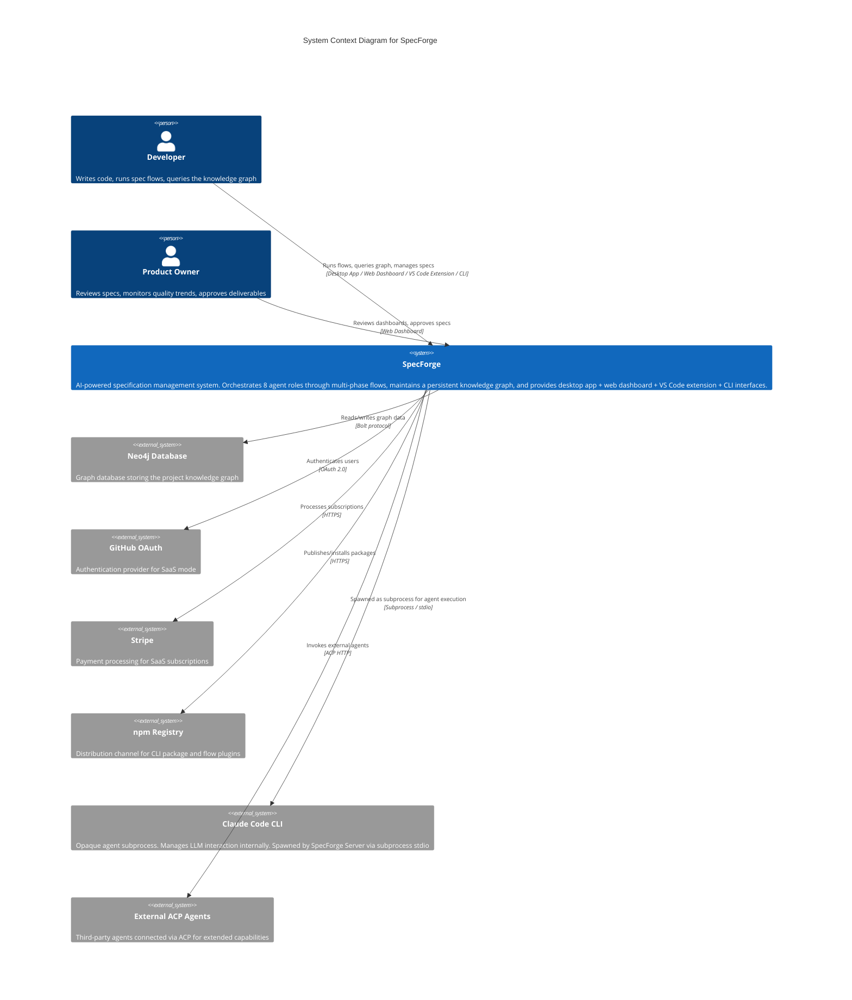

# C1: System Context

**Scope:** SpecForge as a whole system within its operating environment.

**Elements:**

- Persons: Developer, Product Owner
- System: SpecForge (unified server + desktop app + web dashboard + VS Code extension + CLI)
- External Systems: Neo4j Database, GitHub OAuth, Stripe, npm Registry

---

## Mermaid Diagram



### ASCII Representation

```
                    +------------------+  +--------------------+
                    |    Developer     |  |   Product Owner    |
                    +--------+---------+  +---------+----------+
                             | Desktop/Web/VSCode/CLI |  Web Dashboard
                             +----------+-----------+-----------+
                                        |                      |
                                        v                      v
                    +---------------------------------------------------+
                    |                                                     |
                    |                   SpecForge                         |
                    |                                                     |
                    |  AI-powered specification management system.        |
                    |  8 agent roles, multi-phase flows,                  |
                    |  knowledge graph, desktop app +                     |
                    |  web dashboard + VS Code ext + CLI.                 |
                    |                                                     |
                    +---+------+----------+----------+-------+-----------+
                        |      |          |          |       |
            +-----------+      |          |          |       +------------+
            v                  v          v          v                    v
   +-----------------+ +------------+ +--------+ +--------+    +--------------+
   | Claude Code CLI | |   Neo4j    | | GitHub | | Stripe |    | npm Registry |
   |  (Subprocess)   | |  Database  | |  OAuth |  |        |    |              |
   | Agent sessions  | | Graph DB   | | Auth   | | Billing|    | Distribution |
   +-----------------+ +------------+ +--------+ +--------+    +--------------+
     Subprocess/stdio     Bolt           OAuth 2.0   HTTPS          HTTPS
```

## Element Descriptions

| Element       | Type   | Description                                                                        |
| ------------- | ------ | ---------------------------------------------------------------------------------- |
| Developer     | Person | Primary user. Runs spec flows, queries the knowledge graph, manages specifications |
| Product Owner | Person | Reviews specification quality, monitors trends via dashboards                      |

> **Note (N05):** The Product Owner appears only at the C1 (System Context) level. This actor does not appear in C2 or C3 diagrams because those levels focus on technical components, not organizational roles.
> | SpecForge | System | Core system boundary encompassing server, desktop app, web dashboard, VS Code extension, and CLI |
> | Claude Code CLI | External | Opaque agent subprocess. Manages LLM interaction internally. SpecForge communicates via subprocess stdio |
> | Neo4j Database | External | Persistent graph storage for the project knowledge graph |
> | GitHub OAuth | External | Identity provider for SaaS authentication mode |
> | Stripe | External | Subscription billing for SaaS mode |
> | npm Registry | External | Package distribution for CLI and flow plugins |
> | External ACP Agents | External | Third-party ACP-compatible agents connected via ACP protocol for extended capabilities |

> **Note (M61):** npm Registry is a build-time dependency only, not a runtime system. It appears at C1 for completeness as the distribution channel for the CLI package and flow plugins.

## Cross-References

- Next level: [c2-containers.md](./c2-containers.md) -- zooms into SpecForge's internal containers
- Deployment variations: [deployment-solo.md](./deployment-solo.md), [deployment-saas.md](./deployment-saas.md)
- GxP plugin: [../plugins/PLG-gxp.md](../plugins/PLG-gxp.md)
- Claude SDK decision: [../decisions/ADR-004-claude-code-sdk.md](../decisions/ADR-004-claude-code-sdk.md)
- Desktop app decision: [../decisions/ADR-016-desktop-app-primary-client.md](../decisions/ADR-016-desktop-app-primary-client.md)
- Web Dashboard + VS Code decision: [../decisions/ADR-010-web-dashboard-vscode-over-desktop.md](../decisions/ADR-010-web-dashboard-vscode-over-desktop.md) (superseded by ADR-016)
