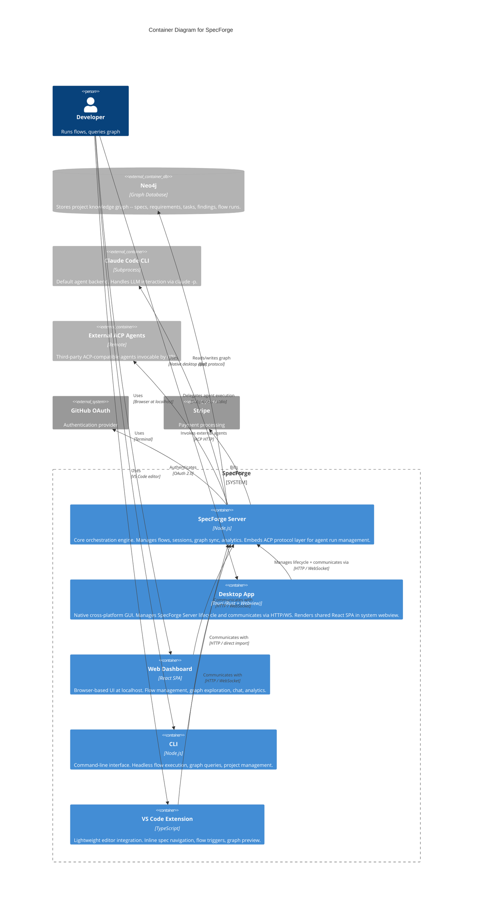

# C2: Containers

**Scope:** Internal container decomposition of the SpecForge system.

**Elements:**

- Containers: SpecForge Server (Node.js), Desktop App (Tauri), Web Dashboard (React SPA), CLI (Node.js), VS Code Extension (TypeScript)
- External Containers: Neo4j (graph DB), Claude Code CLI (agent subprocess)
- External Systems: GitHub OAuth, Stripe

---

## Mermaid Diagram



### ASCII Representation

```
                              ┌──────────────┐
                              │  Developer   │
                              └──────┬───────┘
                                     │
                 ┌───────────────┬────┼────────┬───────────────┐
                 │               │    │        │               │
            Desktop App     Browser  Terminal  VS Code
                 │               │    │        │
                 ▼               ▼    ▼        ▼
┌─────────────────────────────────────────────────────────────────────┐
│                           SpecForge                                 │
│                                                                     │
│ ┌─────────────────┐ ┌───────────────┐ ┌──────────┐ ┌────────────┐ │
│ │  Desktop App    │ │ Web Dashboard │ │   CLI    │ │ VS Code Ext│ │
│ │  (Tauri)        │ │ (React SPA)   │ │ (Node)   │ │ (TypeScript│ │
│ │                 │ │               │ │          │ │            │ │
│ │ Native GUI,     │ │ Flow monitor, │ │ Headless │ │ Inline spec│ │
│ │ tray, file      │ │ graph explorer│ │ flows,   │ │ navigation,│ │
│ │ watcher, auto-  │ │ chat,         │ │ graph    │ │ flow       │ │
│ │ update, server  │ │ analytics     │ │ queries  │ │ triggers   │ │
│ │ lifecycle mgr   │ │               │ │          │ │            │ │
│ └────────┬────────┘ └───────┬───────┘ └────┬─────┘ └──────┬─────┘ │
│   HTTP/WS│          HTTP/WS │   HTTP/import│        HTTP/WS│      │
│          │          ┌───────┘              │               │      │
│          ▼          ▼                      ▼               │      │
│          ┌──────────────────┐◄─────────────────────────────┘      │
│          │  SpecForge Server │                                     │
│          │    (Node.js)      │                                     │
│          │                   │                                     │
│          │  Flow Engine,     │                                     │
│          │  Session Manager, │                                     │
│          │  Message Exchange,│                                     │
│          │  ACP Layer,       │                                     │
│          │  Graph Sync,      │                                     │
│          │  Analytics        │                                     │
│          └───┬────┬────┬─────┘                                    │
│              │    │    │                                           │
└──────────────┼────┼────┼───────────────────────────────────────────┘
               │    │    │
  ┌────────────┘    │    └──────────────────┐
  ▼                 ▼                       ▼
┌──────────────────┐ ┌─────────────────┐  ┌────────────────────┐
│      Neo4j       │ │ Claude Code CLI │  │  External Systems  │
│   (Graph DB)     │ │  (Subprocess)   │  │                    │
│                  │ │                 │  │  GitHub OAuth      │
│  Knowledge graph │ │  Agent sessions │  │  Stripe            │
│  Bolt protocol   │ │  stdio pipes    │  │                    │
└──────────────────┘ └─────────────────┘  └────────────────────┘
```

## Container Descriptions

| Container           | Technology             | Responsibility                                                                                                                                                                                                                                                                           |
| ------------------- | ---------------------- | ---------------------------------------------------------------------------------------------------------------------------------------------------------------------------------------------------------------------------------------------------------------------------------------- |
| SpecForge Server    | Node.js                | Core orchestration. Hosts all engines (Flow, Session, Composition, NLQ, Analytics), message exchange, graph sync, port registry, and embedded ACP protocol layer for agent run management                                                                                                |
| Desktop App         | Tauri (Rust + Webview) | Native cross-platform GUI. Manages SpecForge Server lifecycle as an external process and communicates via HTTP/WebSocket. Renders the shared React SPA in a system webview. Provides system tray, native notifications, file watching, and auto-updates. Primary local GUI for solo mode |
| Web Dashboard       | React SPA              | Browser-based UI served at localhost. Provides views for flow management, graph exploration, chat, and analytics. Communicates with server via HTTP and WebSocket. Same codebase rendered in Desktop App webview                                                                         |
| CLI                 | Node.js                | Headless interface. Flow execution, graph queries, project scaffolding. Can embed server directly or connect via HTTP                                                                                                                                                                    |
| VS Code Extension   | TypeScript             | Lightweight editor integration. Inline spec navigation, flow triggers from editor, graph preview panel. Communicates with server via HTTP and WebSocket                                                                                                                                  |
| Neo4j               | Graph Database         | Persistent storage for the entire project knowledge graph. Accessed via Bolt protocol                                                                                                                                                                                                    |
| Claude Code CLI     | Subprocess             | Default agent backend. Handles LLM interaction via `claude -p`. Each agent session is an isolated process with tool access                                                                                                                                                               |
| External ACP Agents | Remote                 | Third-party ACP-compatible agents discoverable and invocable by URL                                                                                                                                                                                                                      |

> **Deployment note:** The ACP Server is **embedded** within the SpecForge Server process — it is NOT a separate container or process. In solo mode, REST endpoints are localhost-only. In SaaS mode, endpoints are network-accessible behind authentication. The ACP server shares the Node.js event loop with the SpecForge Server.

> **Note (M05):** External ACP Agents are outside SpecForge's system boundary and do not have a C3 component diagram. Their internal architecture is opaque — SpecForge interacts with them only through the ACP protocol interface.

> **Note (C45):** Neo4j is classified as `System_Ext` at C1 (external system) and `ContainerDb_Ext` at C2/C3 (external database container).

> **Note (C46):** Claude Code CLI is a subprocess spawned by SpecForge but not packaged within it. Classified as `System_Ext` at C1 and `Container_Ext` at C2.

## Communication Protocols

| From                  | To                  | Protocol             | Notes                                                                                                        |
| --------------------- | ------------------- | -------------------- | ------------------------------------------------------------------------------------------------------------ |
| Desktop App           | Server              | HTTP / WebSocket     | Desktop app manages server lifecycle as an external process and communicates via HTTP/WebSocket on localhost |
| Desktop App (Webview) | Server              | HTTP / WebSocket     | Same localhost API as standalone web dashboard                                                               |
| Web Dashboard         | Server              | HTTP / WebSocket     | REST API for commands, WebSocket for real-time flow updates and chat                                         |
| CLI                   | Server              | HTTP / direct import | CLI auto-starts server if not running; communicates via HTTP                                                 |
| VS Code Extension     | Server              | HTTP / WebSocket     | REST API for commands, WebSocket for live spec updates                                                       |
| Server                | Neo4j               | Bolt                 | Native Neo4j driver protocol                                                                                 |
| Server                | Claude Code CLI     | Subprocess stdio     | Delegates agent execution via embedded ACP layer, communicates via stdin/stdout                              |
| Server                | External ACP Agents | ACP HTTP             | Invokes third-party agents by URL                                                                            |
| Server                | GitHub OAuth        | OAuth 2.0            | SaaS mode only                                                                                               |
| Server                | Stripe              | HTTPS                | SaaS mode only                                                                                               |

> **Note:** The npm Registry is used by the CLI for package installation and updates but is not shown as a container since it is a standard external package manager dependency.

## Cross-References

- Parent level: [c1-system-context.md](./c1-system-context.md)
- Server internals: [c3-server.md](./c3-server.md)
- CLI internals: [c3-cli.md](./c3-cli.md)
- Desktop App internals: [c3-desktop-app.md](./c3-desktop-app.md)
- Web Dashboard internals: [c3-web-dashboard.md](./c3-web-dashboard.md)
- VS Code Extension internals: [c3-vscode-extension.md](./c3-vscode-extension.md)
- Knowledge graph schema: [c3-knowledge-graph.md](./c3-knowledge-graph.md)
- Port registry: [ports-and-adapters.md](./ports-and-adapters.md)
- Desktop app decision: [../decisions/ADR-016-desktop-app-primary-client.md](../decisions/ADR-016-desktop-app-primary-client.md)
- ACP protocol layer: [c3-acp-layer.md](./c3-acp-layer.md)
- ACP protocol decision: [../decisions/ADR-018-acp-agent-protocol.md](../decisions/ADR-018-acp-agent-protocol.md)
- Claude SDK decision (superseded): [../decisions/ADR-004-claude-code-sdk.md](../decisions/ADR-004-claude-code-sdk.md)
