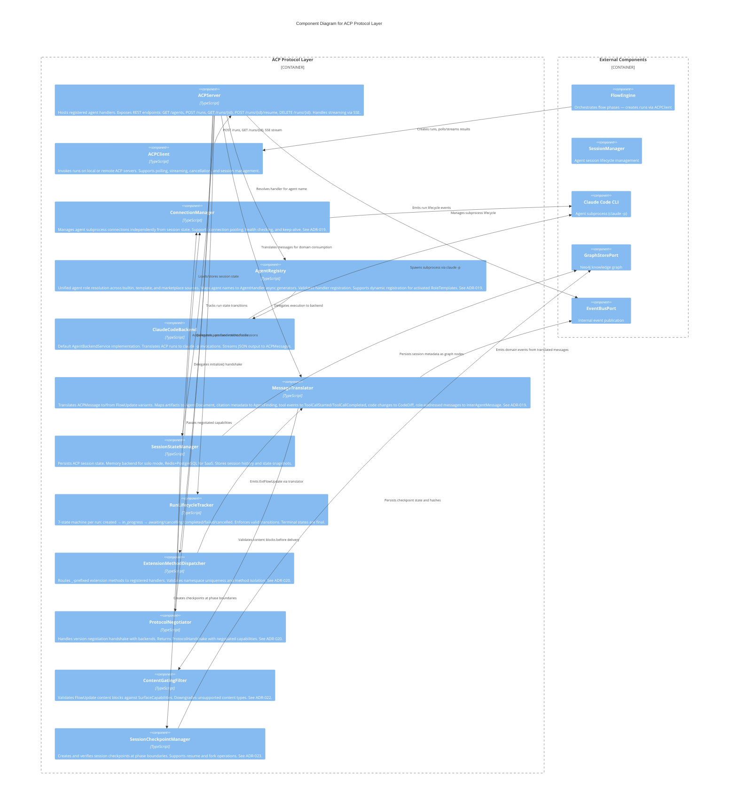

# C3 — ACP Protocol Layer

**Level:** C3 (Component)
**Scope:** Internal components of the ACP protocol layer — server, client, handler registry, backend execution, message translation, session state, and run lifecycle
**Parent:** [c3-server.md](./c3-server.md) — SpecForge Server
**ADR:** [ADR-018](../decisions/ADR-018-acp-agent-protocol.md) — ACP as Primary Agent Protocol

---

## Overview

The ACP Protocol Layer implements the Agent Communication Protocol for SpecForge. It operates in dual mode: as an ACP server exposing SpecForge's agent roles to external clients, and as an ACP client enabling the FlowEngine to invoke agent runs.

> **Embedded deployment:** The ACP layer runs in-process with the SpecForge Server. Internal calls between the orchestrator and the ACP layer are direct function calls, not network requests. External clients connect via HTTP/WebSocket.

The layer manages run lifecycles (7-state machine), translates between ACP messages and domain types, persists session state across runs, and delegates execution to agent backends (Claude Code CLI by default).

---

## Component Diagram



---

## Component Descriptions

| Component                     | Responsibility                                                                                                                                                                                                                                                                                                                                                                                                          | Key Interfaces                                                                                                         |
| ----------------------------- | ----------------------------------------------------------------------------------------------------------------------------------------------------------------------------------------------------------------------------------------------------------------------------------------------------------------------------------------------------------------------------------------------------------------------- | ---------------------------------------------------------------------------------------------------------------------- |
| **ACPServer**                 | Hosts registered agent handlers behind REST endpoints. Manages HTTP request/response lifecycle. Supports SSE streaming for incremental output. Serves agent manifests via `GET /agents`.                                                                                                                                                                                                                                | `start(config)`, `stop()`, `handleRunRequest(req)`                                                                     |
| **ACPClient**                 | Client for invoking runs on ACP servers (local or remote). Supports polling (`GET /runs/{id}`), streaming (SSE), cancellation (`DELETE /runs/{id}`), and session management.                                                                                                                                                                                                                                            | `createRun(req)`, `getRun(id)`, `resumeRun(id, input)`, `cancelRun(id)`, `streamRun(id)`                               |
| **ConnectionManager**         | Manages agent subprocess connections independently from session state. Supports connection pooling (`keepAlive`), health checking, and graceful shutdown. Sessions reference connections; connections can be reused across sessions. See [ADR-019](../decisions/ADR-019-zed-inspired-architecture.md).                                                                                                                  | `acquire(config)`, `release(connectionId)`, `getConnection(connectionId)`, `listActive()`, `healthCheck(connectionId)` |
| **AgentRegistry**             | Unified agent role resolution across all sources: built-in roles (loaded at startup), dynamic templates (generated by activation predicates), marketplace agents (fetched from cloud). Maps agent names to `AgentHandler` async generator functions. Validates handler signatures at registration time. Replaces the former `AgentHandlerRegistry`. See [ADR-019](../decisions/ADR-019-zed-inspired-architecture.md).   | `resolve(roleId)`, `list(filter)`, `register(manifest)`, `unregister(roleId)`                                          |
| **ClaudeCodeBackend**         | Default `AgentBackendService`. Translates ACP run config to `claude -p` CLI arguments. Parses `stream-json` output into `ACPMessage` parts. Maps Claude Code errors to `BackendError` variants.                                                                                                                                                                                                                         | `execute(config)`, `getCapabilities()`                                                                                 |
| **MessageTranslator**         | Translates `ACPMessage` ↔ `FlowUpdate` variants. Named parts → `AgentDocument`. Citation metadata → `AgentFinding`. Tool events → `ToolCallStarted`/`ToolCallCompleted`. Code changes → `CodeDiff`. Role-addressed messages → `InterAgentMessage`. Plan structures → `AgentPlan`. Trajectory metadata → observability events. See [ADR-019](../decisions/ADR-019-zed-inspired-architecture.md).                         | `toFlowUpdate(message)`, `toACP(update)`                                                                               |
| **SessionStateManager**       | Persists ACP session state across runs. Memory backend (solo mode, in-process Map). Redis backend (SaaS, shared across instances). PostgreSQL backend (SaaS, durable). Session history is append-only.                                                                                                                                                                                                                  | `loadHistory(sessionId)`, `loadState(sessionId)`, `storeState(sessionId, state)`, `appendHistory(sessionId, messages)` |
| **RunLifecycleTracker**       | Enforces the 7-state run lifecycle machine. Valid transitions: `created` → `in_progress`, `in_progress` → `awaiting`/`completed`/`failed`/`cancelling`, `awaiting` → `in_progress`/`cancelling`, `cancelling` → `cancelled`. Terminal states (`completed`, `failed`, `cancelled`) are final. **M20:** The `in_progress` → `cancelling` transition is also valid -- user-initiated cancellation during active execution. | `transition(runId, newState)`, `getState(runId)`, `isTerminal(runId)`                                                  |
| **ExtensionMethodDispatcher** | Routes `_`-prefixed extension method calls to registered handlers. Validates namespace uniqueness (no two extensions share a namespace). Ensures extension methods do not shadow core protocol methods. Errors in one extension handler do not affect others. See [ADR-020](../decisions/ADR-020-protocol-extension-observability.md), [INV-SF-38](../invariants/INV-SF-38-extension-method-isolation.md).              | `register(descriptor)`, `dispatch(method, params)`, `listExtensions()`                                                 |
| **ProtocolNegotiator**        | Handles version negotiation during `initialize()` handshake with agent backends. Compares client protocol version with backend's supported range and returns a `ProtocolHandshake` with negotiated capabilities. Rejects incompatible versions with `VersionNegotiationError`. See [ADR-020](../decisions/ADR-020-protocol-extension-observability.md).                                                                 | `negotiate(clientVersion, backendInfo)`                                                                                |
| **ContentGatingFilter**       | Validates `FlowUpdate` content blocks against the session's `SurfaceCapabilities`. Blocks containing content types not supported by the current surface are downgraded (e.g., markdown image → text link) or stripped with a warning. See [ADR-022](../decisions/ADR-022-dynamic-agent-capabilities.md), [INV-SF-41](../invariants/INV-SF-41-surface-capability-gating.md).                                             | `gate(update, capabilities)`, `registerDowngrade(contentType, handler)`                                                |
| **SessionCheckpointManager**  | Creates session checkpoints at phase boundaries and on-demand. Each checkpoint includes a SHA-256 hash of the serialized state for integrity verification. Supports `resume` (restore from checkpoint) and `fork` (branch with new session ID). See [ADR-023](../decisions/ADR-023-session-resilience-mcp-integration.md), [INV-SF-42](../invariants/INV-SF-42-session-checkpoint-integrity.md).                        | `checkpoint(sessionId)`, `verify(checkpointId)`, `resume(checkpointId)`, `fork(checkpointId)`                          |

---

## Relationships to Parent Components

| From                      | To                        | Relationship                                                          |
| ------------------------- | ------------------------- | --------------------------------------------------------------------- |
| FlowEngine                | ACPClient                 | Creates runs for each agent in a phase, polls/streams results         |
| ACPClient                 | ACPServer                 | Standard ACP HTTP protocol (runs on localhost)                        |
| ACPServer                 | AgentRegistry             | Resolves the handler function for the requested agent name            |
| AgentRegistry             | ClaudeCodeBackend         | Default handler delegates to Claude Code for execution                |
| SessionStateManager       | ConnectionManager         | Acquires/releases connections for subprocess reuse across sessions    |
| ConnectionManager         | Claude Code CLI           | Manages subprocess lifecycle (spawn, health check, release)           |
| ACPServer                 | RunLifecycleTracker       | Tracks state transitions for every run                                |
| ACPServer                 | SessionStateManager       | Loads session history for context, stores state on completion         |
| SessionStateManager       | GraphStorePort            | Persists session metadata as graph nodes                              |
| MessageTranslator         | EventBusPort              | Emits domain events when ACP messages are translated                  |
| ClaudeCodeBackend         | Claude Code CLI           | Spawns `claude -p` subprocess per run                                 |
| ACPServer                 | ExtensionMethodDispatcher | Delegates `_`-prefixed method calls to extension handlers             |
| ExtensionMethodDispatcher | MessageTranslator         | Emits `ExtFlowUpdate` via translator for extension results            |
| ACPServer                 | ProtocolNegotiator        | Delegates `initialize()` handshake for version negotiation            |
| ProtocolNegotiator        | ConnectionManager         | Passes negotiated capabilities to connection setup                    |
| MessageTranslator         | ContentGatingFilter       | Validates content blocks against surface capabilities before delivery |
| SessionStateManager       | SessionCheckpointManager  | Creates checkpoints at phase boundaries                               |
| SessionCheckpointManager  | GraphStorePort            | Persists checkpoint state and integrity hashes                        |

---

## Run State Machine

```
                    ┌──────────┐
                    │ created  │
                    └────┬─────┘
                         │
                         ▼
                  ┌──────────────┐
            ┌─────│ in_progress  │─────┬─────────────┐
            │     └──────┬───────┘     │             │
            │            │             │             │
            ▼            ▼             ▼             ▼
     ┌───────────┐ ┌──────────┐ ┌──────────┐ ┌──────────────┐
     │ awaiting  │ │completed │ │  failed  │ │  cancelling  │───► cancelled
     └─────┬─────┘ └──────────┘ └──────────┘ └──────────────┘
           │                                        ▲
           ▼                                        │
    ┌──────────────┐                                │
    │ in_progress  │───► completed / failed ────────┘
    └──────────────┘
```

Terminal states: `completed`, `failed`, `cancelled` — no further transitions allowed.

> **State transition (N03):** The `in_progress → cancelling` transition is valid and occurs when a user or budget enforcement cancels an active run.

---

## Session State Persistence

**M01:** `SessionStateManager` is the **single authority** for session state. The `--resume` flag on Claude Code CLI is NOT used for session persistence. Instead:

1. Session history is loaded from `SessionStateManager.loadHistory()` before each run
2. History is injected into the agent's system prompt context by the `ClaudeCodeBackend`
3. After each run completes, output messages are appended via `SessionStateManager.appendHistory()`
4. State snapshots (non-conversation state) are stored/loaded via `storeState()`/`loadState()`

This avoids coupling to Claude Code's internal session format and ensures session persistence works across any backend implementation.

> **Storage schema (M07):** Session state storage schema is adapter-specific. Memory backend: in-process `Map<string, SessionState>`. Redis backend: `session:{id}` key with JSON value. PostgreSQL backend: `session_states` table with JSONB `state` column. All backends implement the same `SessionSnapshotStoreService` interface.

---

## OrchestratorEvent Emitter Mapping

**M18:** The following table maps each `OrchestratorEvent` variant to the component that emits it:

| Event `_tag`          | Emitter Component      | Trigger                                            |
| --------------------- | ---------------------- | -------------------------------------------------- |
| `flow-started`        | FlowEngine             | Flow run created                                   |
| `flow-completed`      | FlowEngine             | Flow run reaches terminal state                    |
| `phase-started`       | FlowEngine             | Phase iteration begins                             |
| `phase-completed`     | FlowEngine             | Phase iteration ends (converged or max iterations) |
| `finding-added`       | MessageTranslator      | ACP message with CitationMetadata translated       |
| `agent-spawned`       | ACPServer              | New run enters `in_progress`                       |
| `agent-completed`     | ACPServer              | Run enters terminal state                          |
| `budget-warning`      | TokenAccountingService | Budget threshold crossed                           |
| `convergence-reached` | ConvergenceService     | Phase convergence criteria met                     |

## OrchestratorEvent Consumer Mapping

| Event                 | Emitter                | Consumer(s)                                     |
| --------------------- | ---------------------- | ----------------------------------------------- |
| `flow-started`        | OrchestratorService    | WebSocket, AnalyticsService                     |
| `flow-completed`      | OrchestratorService    | WebSocket, AnalyticsService, GraphSyncService   |
| `phase-started`       | FlowEngineService      | WebSocket                                       |
| `phase-completed`     | FlowEngineService      | WebSocket, AnalyticsService, ConvergenceService |
| `finding-added`       | Agent sessions         | WebSocket, GraphSyncService                     |
| `agent-spawned`       | SessionManagerService  | WebSocket                                       |
| `agent-completed`     | SessionManagerService  | WebSocket, GraphSyncService                     |
| `budget-warning`      | TokenAccountingService | WebSocket, FlowEngineService (pause decision)   |
| `convergence-reached` | ConvergenceService     | WebSocket, FlowEngineService                    |

---

## WebSocket Event Source

**M19:** The WebSocket server streams events to connected dashboard and VS Code extension clients. The event source is the `EventBusPort`: the WebSocket server subscribes to all `OrchestratorEvent` variants and forwards them to connected clients. The ACP protocol layer does not directly emit WebSocket messages; it publishes domain events to `EventBusPort`, and the WebSocket server acts as a subscriber.

## WebSocket Event Mapping

ACP events are mapped to dashboard stream events for real-time monitoring:

| ACP Event               | Dashboard Event                             | Payload                           |
| ----------------------- | ------------------------------------------- | --------------------------------- |
| `acp:message-created`   | `StreamDashboardEvent { type: 'message' }`  | Message preview, role, timestamp  |
| `acp:run-state-changed` | `StreamDashboardEvent { type: 'status' }`   | Run ID, old state, new state      |
| `acp:artifact-attached` | `StreamDashboardEvent { type: 'artifact' }` | Artifact name, content type, size |
| `budget-warning`        | `StreamDashboardEvent { type: 'budget' }`   | Usage, threshold, remaining       |
| `phase-completed`       | `StreamDashboardEvent { type: 'phase' }`    | Phase name, metrics summary       |

---

## ACP-to-Graph Translation Rules

The ACP Protocol Layer translates ACP messages into knowledge graph nodes and edges via `GraphSyncPort`. The following rules govern the translation:

| ACP Message Pattern                                                    | Graph Result                     | Edge Type                                              |
| ---------------------------------------------------------------------- | -------------------------------- | ------------------------------------------------------ |
| `ACPMessage` with `role: 'agent/architect'`                            | `GraphNode { type: 'Decision' }` | `DECIDED_IN` → `FlowRun`                               |
| `ACPMessage` with `CitationMetadata`                                   | `GraphNode { type: 'Finding' }`  | `CITES` → cited spec nodes                             |
| `ACPMessagePart { contentType: 'application/vnd.specforge.document' }` | `GraphNode { type: 'Artifact' }` | `PRODUCED_BY` → session node                           |
| Text messages (no structured parts)                                    | No new node                      | `DISCUSSED_IN` edge linking mentioned topics → session |
| `FlowUpdate { _tag: "CodeDiff" }`                                      | `GraphNode { type: 'FileDiff' }` | `MODIFIED_BY` → session, `AFFECTS` → File node         |

### Translation Pipeline

```
ACPMessage received
    │
    ├─ Extract role → determine node type
    │   ├─ architect role → Decision node
    │   ├─ reviewer role → Finding node (if citations present)
    │   └─ any role → text indexing only
    │
    ├─ Extract message parts → determine artifacts
    │   ├─ document parts → Artifact node with content hash (SHA-256)
    │   └─ citation parts → Finding node with edges to cited specs
    │
    └─ GraphSyncPort.syncMessage()
        ├─ Upsert node (content-addressed identity)
        └─ Create edges to session and related nodes
```

> **Idempotency (INV-SF-20):** All sync operations use content-addressed identity (SHA-256 hash of canonical content). Duplicate events result in upsert-or-skip, not duplicate nodes.

> **No-match behavior (M08):** When `GraphSyncPort.syncMessage()` processes a message with no extractable requirement IDs, a File node is still created (if the message references a file path). The edge set is empty. This ensures all file activity is tracked even when no traceability links are established.

---

## Session Chunk Creation

SessionChunks are created by `CompositionService` from `ACPMessage` sequences. Chunking strategy is determined by the `CompositionStrategy` configured for the current phase:

| Strategy      | Grouping Logic                                                | Chunk Source    |
| ------------- | ------------------------------------------------------------- | --------------- |
| `role-based`  | Messages grouped by agent role                                | `'role-based'`  |
| `topic-based` | Messages grouped by keyword match                             | `'topic-based'` |
| `similarity`  | Messages grouped by embedding similarity (minScore threshold) | `'similarity'`  |
| `flow-based`  | Messages from a specific flow run                             | `'flow-based'`  |
| `curated`     | Manually selected chunks                                      | `'curated'`     |

Each chunk stores: source messages, token count, relevance score, and metadata. Chunks are ranked by relevance before assembly into `ComposedContext`, and trimmed to fit the token budget.

---

## Memory Generation Data Sources

ADRs, requirements, and invariants are populated in the knowledge graph via `GraphSyncPort` from flow artifacts:

- **Initial population:** The first flow run creates graph nodes from the project scaffold (existing spec files, README, package.json).
- **Subsequent flows:** Incremental updates via ACP message events. New findings, decisions, and artifacts are synced as they are produced.
- **Sources:** `GraphSyncPort.syncMessage()` for real-time events, `GraphSyncPort.syncArtifacts()` for batch processing at phase/flow completion.

See [architecture/c3-memory-generation.md](./c3-memory-generation.md) for the full memory generation pipeline.

---

## Security Architecture

### REST Authorization Model (C08)

Role-based access control for REST API endpoints:

| Role       | Permissions                                                             |
| ---------- | ----------------------------------------------------------------------- |
| `admin`    | All endpoints. Server configuration, user management                    |
| `user`     | Own flow runs, sessions, graph queries. Cannot modify other users' data |
| `readonly` | GET endpoints only. No mutations, no flow starts                        |

Endpoint authorization is enforced by middleware before handler execution. Unauthorized requests receive `403 Forbidden`.

### Session State Encryption (C09)

- **Redis/PostgreSQL backends:** AES-256-GCM encryption at rest for all session state data. Encryption key derived via HKDF-SHA256 from a master secret.
- **Memory backend:** Process isolation only (no encryption). Suitable for solo/development mode.
- **Key management:** Solo mode: OS keychain. SaaS mode: HashiCorp Vault or AWS Secrets Manager.

### SaaS Credential Storage (C10)

- **Production:** HashiCorp Vault or AWS Secrets Manager for API keys, OAuth secrets, and database credentials.
- **Development:** Environment variable override via `.env` file (not committed to version control).
- **Rotation:** See credential rotation policy below.

### External Agent Trust Model (C11)

- **Production:** Mutual TLS (mTLS) required for all external ACP agent connections.
- **Capability negotiation:** External agents advertise capabilities via `GET /agents` manifest. SpecForge validates capabilities before dispatching runs.
- **Data isolation:** Separate session context per external agent. No cross-agent data leakage.

### GxP Hash Chain Details (C12)

- **Hash algorithm:** SHA-256 for chain links (content hashing).
- **Key derivation:** HKDF-SHA256 (RFC 5869) for deriving chain verification keys.
- **Key storage:** OS keychain (solo) or HashiCorp Vault (SaaS).
- **Tamper detection:** Full chain verification on every read operation. Broken chain → `GxPIntegrityError`.

### Input Sanitization (C13)

- **Max request body:** 10 MB.
- **Path traversal prevention:** All file paths resolved to absolute and checked for prefix containment within allowed directories.
- **Content-type validation:** Request content-type must match expected type per endpoint.
- **No HTML rendering:** User input is never rendered as HTML. All output is JSON or plain text.

### WebSocket Authentication (C14)

- **Bearer token:** Passed via `Sec-WebSocket-Protocol` header on initial handshake.
- **Validation:** Token validated on connection establishment.
- **Expiry handling:** On token expiry, server closes connection with code 4001. Client must reconnect with fresh token.

### Rate Limiting (C15)

| Resource                        | Limit                 |
| ------------------------------- | --------------------- |
| Concurrent runs per token       | 10                    |
| REST requests per IP            | 100/second            |
| Failed auth attempts            | 3 → 60-second lockout |
| WebSocket connections per token | 5                     |

### Trajectory Redaction (M09)

Trajectory redaction covers `TrajectoryMetadata.toolOutput` and `TrajectoryMetadata.toolInput`. Redaction patterns are configurable via `ACPServerConfig.redactionPatterns` and default to:

- File paths containing `credentials`, `secrets`, `.env`
- Tool inputs containing API key patterns (`sk-*`, `ghp_*`, `Bearer *`)

### Session Snapshot Integrity (M10)

Session snapshots use HMAC-SHA256 for integrity verification. The HMAC is computed over the serialized snapshot content and stored alongside the snapshot. On restore, the HMAC is verified before deserialization.

### Agent Subprocess Isolation (M11)

- **Container deployment:** Agent subprocesses run with `--net=none` (no network access except via SpecForge proxy).
- **Bare metal:** Firewall rules restrict agent subprocess network access to localhost and the LLM provider endpoint only.

### OAuth Token Revocation (M12)

When an OAuth token is revoked:

1. Terminate all active WebSocket connections for the token.
2. Cancel all in-flight flow runs associated with the token's user.
3. Invalidate all cached session data.

### Permission Decision Graph Constraints (M13)

Permission decision nodes in Neo4j use constraints:

```cypher
CREATE CONSTRAINT permission_decision_required_fields
FOR (p:PermissionDecision)
REQUIRE (p.userId, p.action, p.resource, p.decision, p.timestamp) IS NOT NULL
```

### Credential Rotation (M14)

- **Default rotation period:** 90 days, configurable via `security.credentialRotationDays`.
- **MCP servers:** Notified via disconnect + reconnect with new credentials.
- **Neo4j:** Connection pool drained and re-established with new credentials.

### TLS Requirements (M15)

- **Minimum version:** TLS 1.2.
- **Self-signed certificates:** Rejected in SaaS mode. Solo mode: configurable via `security.allowSelfSignedCerts`.

### Dual-Control Authorship (M16)

GxP dual-control authorship is determined by the ACP session `role` field. Each session records the authenticated user ID and agent role. The combination provides dual-control evidence for audit trails.

### Session Binding (M17)

Sessions are bound via `sessionId` + `userAgent` hash. Concurrent session limit: 5 per user. Exceeding the limit returns `SessionError` with cause `'concurrent-session-limit'`.

### Security Headers (N04)

All HTTP responses include:

- `Content-Security-Policy: default-src 'self'`
- `X-Frame-Options: DENY`
- `Strict-Transport-Security: max-age=31536000; includeSubDomains` (SaaS only)
- `X-Content-Type-Options: nosniff`

### Log Sanitization (N05)

Structured logs are sanitized before output: sensitive field values matching configured patterns are replaced with `[REDACTED]`. Default patterns: `password`, `token`, `secret`, `apiKey`, `authorization`.

### HKDF Entropy (N06)

HKDF input keying material is sourced from `crypto.randomBytes(32)` (256 bits of entropy). The salt is derived from the application instance ID.

### CORS Policy (N07)

- **Solo mode:** `Access-Control-Allow-Origin: http://localhost:*` (any localhost port).
- **SaaS mode:** Configured origins only, specified in `security.corsAllowedOrigins`.

### Secure Deletion (N08)

- **Sensitive buffers:** Zero-filled (`buffer.fill(0)`) before deallocation.
- **Temporary files:** Deleted on session archive or server shutdown.
- **Session cleanup:** All in-memory session data cleared on session completion or cancellation.

---

## References

- [ADR-018](../decisions/ADR-018-acp-agent-protocol.md) — ACP as Primary Agent Protocol
- [ACP Server Behaviors](../behaviors/BEH-SF-209-acp-server.md) — BEH-SF-209 through BEH-SF-218
- [ACP Client Behaviors](../behaviors/BEH-SF-219-acp-client.md) — BEH-SF-219 through BEH-SF-228
- [ACP Messaging Behaviors](../behaviors/BEH-SF-229-acp-messaging.md) — BEH-SF-229 through BEH-SF-238
- [Agent Backend Behaviors](../behaviors/BEH-SF-239-agent-backend.md) — BEH-SF-239 through BEH-SF-248
- [ACP Types](../types/acp.md) — Core ACP type definitions
- [Port Types](../types/ports.md) — ACPAgentService, ACPServerService, AgentBackendService
- [INV-SF-18](../invariants/INV-SF-18-acp-run-state-consistency.md) — ACP Run State Consistency
- [INV-SF-19](../invariants/INV-SF-19-degraded-mode.md) — ACP Server Availability
- [ADR-020](../decisions/ADR-020-protocol-extension-observability.md) — Protocol Extension & Observability Framework
- [ADR-022](../decisions/ADR-022-dynamic-agent-capabilities.md) — Dynamic Agent Capabilities & Streaming
- [ADR-023](../decisions/ADR-023-session-resilience-mcp-integration.md) — Session Resilience & MCP Integration
- [INV-SF-38](../invariants/INV-SF-38-extension-method-isolation.md) — Extension Method Isolation
- [INV-SF-39](../invariants/INV-SF-39-protocol-meta-pass-through.md) — Protocol Meta Pass-Through
- [INV-SF-41](../invariants/INV-SF-41-surface-capability-gating.md) — Surface Capability Gating
- [INV-SF-42](../invariants/INV-SF-42-session-checkpoint-integrity.md) — Session Checkpoint Integrity
- [Protocol Extension Behaviors](../behaviors/BEH-SF-496-protocol-extensions.md) — BEH-SF-496 through BEH-SF-503
- [Dynamic Capabilities Behaviors](../behaviors/BEH-SF-512-dynamic-capabilities.md) — BEH-SF-512 through BEH-SF-519
- [Session Resilience Behaviors](../behaviors/BEH-SF-520-session-resilience.md) — BEH-SF-520 through BEH-SF-527
