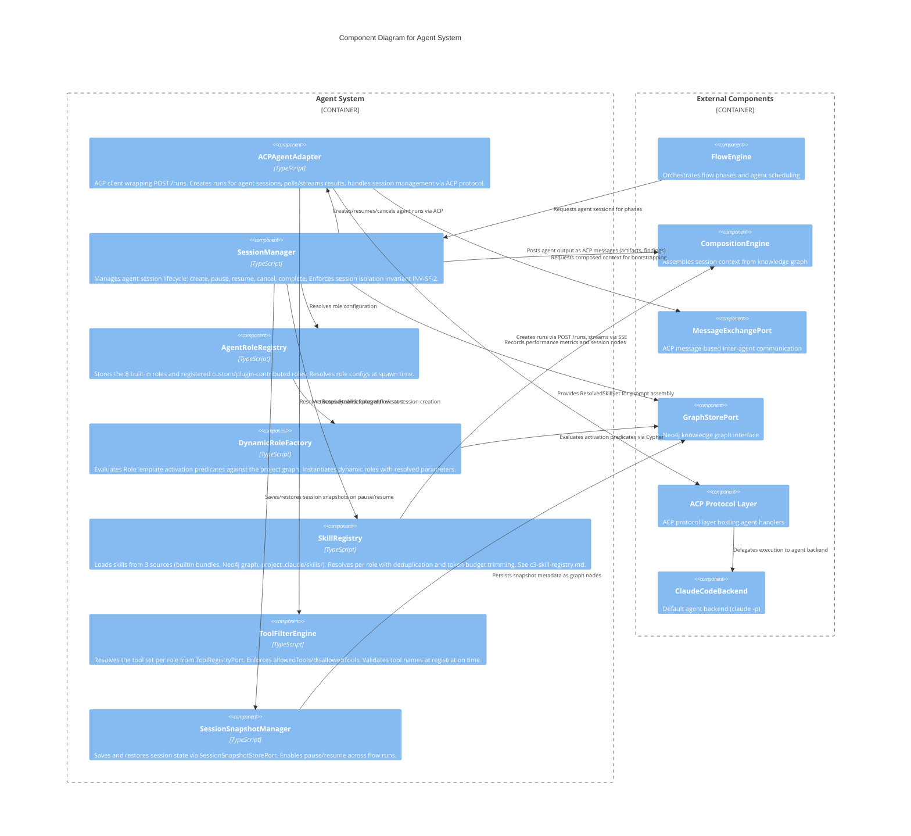

# C3 — Agent System

**Level:** C3 (Component)
**Scope:** Internal components of the agent lifecycle, role management, and session orchestration subsystem
**Parent:** [c3-server.md](./c3-server.md) — SpecForge Server

---

## Overview

The Agent System manages the full lifecycle of AI agent sessions within SpecForge. It handles role resolution (8 static roles plus dynamic templates), session management via the ACP protocol layer, skill resolution via the Skill Registry (3-source loading with role-aware deduplication), tool scoping per role, session snapshot persistence, and agent performance tracking. All agents follow the same ACP protocol regardless of whether they are built-in or dynamically generated.

---

## Component Diagram

---

## Component Descriptions

| Component                  | Responsibility                                                                                                                                                                                                                                                                                                                                                                                             | Key Interfaces                                                                             |
| -------------------------- | ---------------------------------------------------------------------------------------------------------------------------------------------------------------------------------------------------------------------------------------------------------------------------------------------------------------------------------------------------------------------------------------------------------- | ------------------------------------------------------------------------------------------ |
| **ACPAgentAdapter**        | ACP client wrapping `POST /runs`. Creates runs with composed system prompts (4 layers: role + flow + context + session history). Polls/streams results via ACP protocol. Manages ACP sessions for persistent context. Maps ACP errors to SpecForge error variants.                                                                                                                                         | `createRun(request)`, `getRun(runId)`, `resumeRun(runId, input)`, `cancelRun(runId)`       |
| **SessionManager**         | Orchestrates session lifecycle state machine: `created` -> `active` -> `paused`/`completed`/`cancelled`. Enforces INV-SF-2 (session isolation). Materializes conversation chunks on completion.                                                                                                                                                                                                            | `create(config)`, `pause(id)`, `resume(id)`, `cancel(id)`, `get(id)`                       |
| **AgentRoleRegistry**      | Central registry for all agent roles (8 built-in + custom + plugin). Each role declares: system prompt template, tool set, default model, domain. Validates custom agent registrations.                                                                                                                                                                                                                    | `resolve(role)`, `register(config)`, `listRoles()`                                         |
| **DynamicRoleFactory**     | Evaluates `RoleTemplate` activation predicates (Cypher queries) against the project graph at flow start. Resolves parameterized template slots from flow config, graph queries, or defaults. Caches activation results per flow run.                                                                                                                                                                       | `activateRoles(projectId)`, `instantiate(template, params)`                                |
| **SkillRegistry**          | Loads skills from 3 sources (builtin bundles, Neo4j graph-extracted, project `.claude/skills/`). Resolves skills per agent role at session spawn time: filters by role + scope, deduplicates by name with priority ordering (graph > builtin > project), trims to token budget. Feeds `ResolvedSkillSet` to CompositionEngine. See [c3-skill-registry.md](./c3-skill-registry.md) for internal components. | `resolveSkills(config)`, `listSkills(scope)`, `listBundles()`, `getBundleAssignment(role)` |
| **ToolFilterEngine**       | Resolves tool sets per role from `ToolRegistryPort`. Combines built-in tools with MCP-discovered tools. Applies `allowedTools`/`deniedTools` filtering. Validates tool names at registration time, returning `ToolRegistryError` for unknowns.                                                                                                                                                             | `getToolsForRole(role)`, `validateTools(toolNames)`                                        |
| **SessionSnapshotManager** | Persists session state for pause/resume. Saves conversation state, iteration counter, and timestamp. Restores sessions from snapshots, preserving full conversation history.                                                                                                                                                                                                                               | `saveSnapshot(session)`, `loadSnapshot(sessionId)`                                         |

---

## Relationships to Parent Components

| From               | To                  | Relationship                                                          |
| ------------------ | ------------------- | --------------------------------------------------------------------- |
| FlowEngine         | SessionManager      | Schedules agent sessions per phase, requests create/pause/resume      |
| SessionManager     | ACPAgentAdapter     | Creates/resumes/cancels agent runs via ACP protocol                   |
| CompositionEngine  | SessionManager      | Provides assembled session context for agent bootstrapping            |
| SessionManager     | SkillRegistry       | Requests skill resolution for agent role at session creation          |
| SkillRegistry      | CompositionEngine   | Provides `ResolvedSkillSet` for system prompt assembly                |
| ACPAgentAdapter    | MessageExchangePort | Posts agent output as ACP messages (artifacts, findings)              |
| ACPAgentAdapter    | ACP Protocol Layer  | Creates runs, polls/streams results                                   |
| ACP Protocol Layer | ClaudeCodeBackend   | Delegates execution to agent backend                                  |
| SessionManager     | GraphStorePort      | Records session nodes, performance metrics, `BOOTSTRAPPED_FROM` edges |
| DynamicRoleFactory | GraphStorePort      | Evaluates Cypher activation predicates against the project graph      |

---

## References

- [ADR-018](../decisions/ADR-018-acp-agent-protocol.md) — ACP as Primary Agent Protocol
- [ADR-006](../decisions/ADR-006-persistent-agent-sessions.md) — Persistent Agent Sessions
- [ADR-015](../decisions/ADR-015-agent-teams-hybrid-integration.md) — Agent Teams Hybrid Integration
- [ACP Protocol Layer](./c3-acp-layer.md) — ACP server, client, handler registry, backend
- [Agent Roles Behaviors](../behaviors/BEH-SF-017-agent-roles.md) — BEH-SF-017 through BEH-SF-024
- [Agent Sessions Behaviors](../behaviors/BEH-SF-025-agent-sessions.md) — BEH-SF-025 through BEH-SF-032
- [ACP Server Behaviors](../behaviors/BEH-SF-209-acp-server.md) — BEH-SF-209 through BEH-SF-218
- [Agent Backend Behaviors](../behaviors/BEH-SF-239-agent-backend.md) — BEH-SF-239 through BEH-SF-248
- [Dynamic Agents Behaviors](../behaviors/BEH-SF-185-dynamic-agents.md) — BEH-SF-185 through BEH-SF-192
- [ADR-025](../decisions/ADR-025-skill-registry-architecture.md) — Skill Registry Architecture
- [Skill Registry Components](./c3-skill-registry.md) — C3 component diagram for SkillRegistry subsystem
- [Skill Registry Behaviors](../behaviors/BEH-SF-558-skill-registry.md) — BEH-SF-558 through BEH-SF-565
- [Agent Types](../types/agent.md) — AgentRole, SessionConfig, Session, TokenUsage
- [Skill Types](../types/skill.md) — Skill, SkillBundle, ResolvedSkillSet, SkillRegistryPort
- [ACP Types](../types/acp.md) — ACPMessage, ACPRun, ACPAgentManifest
- [INV-SF-2](../invariants/INV-SF-2-agent-session-isolation.md) — Agent Session Isolation
- [INV-SF-5](../invariants/INV-SF-5-tool-isolation.md) — Tool Isolation
- [INV-SF-18](../invariants/INV-SF-18-acp-run-state-consistency.md) — ACP Run State Consistency
