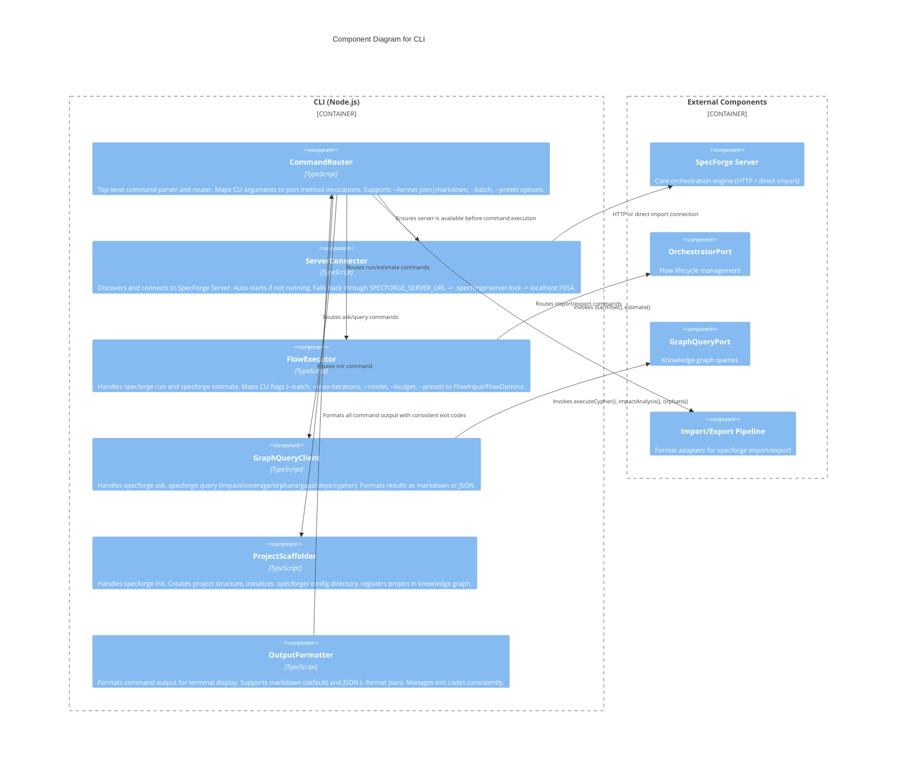

# C3 — CLI

**Level:** C3 (Component)
**Scope:** Internal components of the SpecForge command-line interface
**Parent:** [c2-containers.md](./c2-containers.md) — CLI Container

---

## Overview

The CLI is a headless Node.js interface for SpecForge that provides flow execution, graph queries, import/export, project scaffolding, cost estimation, and CI integration. It operates independently of the Desktop App, connecting to a running SpecForge Server (discovered via `SPECFORGE_SERVER_URL`, `.specforge/server.lock`, or default `http://localhost:7654`) or auto-starting one. All commands work without a display server and use consistent exit codes (0=success, 1=failure, 2=warnings, 3=config error, 4=validation error).

---

## Component Diagram

---

## Component Descriptions

| Component             | Responsibility                                                                                                                                                                                                                                                                                                                            | Key Interfaces                                      |
| --------------------- | ----------------------------------------------------------------------------------------------------------------------------------------------------------------------------------------------------------------------------------------------------------------------------------------------------------------------------------------- | --------------------------------------------------- | ----------------------------------------------------------------------------------------------------------------------------------------------------------- | -------------------------------------------------------------------- |
| **CommandRouter**     | Top-level CLI entry point. Parses commands and arguments. Routes to appropriate handler: `run`, `estimate`, `ask`, `query`, `import`, `export`, `init`, `run list/pause/resume/cancel/show`, `feedback`, `converge`, `iterate`, `approve`, `reject`, `compose-context`, `plugin list/enable/disable`, `stats`, `drift-report`, `trigger`. | `route(argv)`                                       |
| **ServerConnector**   | Discovers SpecForge Server via 3-tier fallback: `SPECFORGE_SERVER_URL` env var -> `.specforge/server.lock` file -> `http://localhost:7654`. Auto-starts server if not running. Supports both HTTP connection and direct import for embedded mode.                                                                                         | `connect()`, `ensureRunning()`                      |
| **FlowExecutor**      | Handles `specforge run <flow-name>` and `specforge estimate <flow-name>`. Maps CLI flags to `FlowInput`/`FlowOptions`. Supports `--batch` (skip pauses), `--max-iterations N`, `--model`, `--budget`, `--compose-from`, `--preset quick                                                                                                   | standard                                            | thorough`. Also handles flow management: list, pause, resume, cancel, show, and human intervention commands (feedback, converge, iterate, approve, reject). | `run(flowName, options)`, `estimate(flowName)`, `manage(subcommand)` |
| **GraphQueryClient**  | Handles `specforge ask "<question>"` (NLQ via Claude session), `specforge query impact/coverage/orphans/gaps/deps/cypher`. Supports `--format json`, `--verbose` (show Cypher). Maps to `GraphQueryPort` and `SpecCoveragePort` methods.                                                                                                  | `ask(question, options)`, `query(subcommand, args)` |
| **ProjectScaffolder** | Handles `specforge init`. Creates `.specforge/` config directory, scaffolds project structure, registers the project as a `Project` node in the knowledge graph.                                                                                                                                                                          | `init(projectPath)`                                 |
| **OutputFormatter**   | Formats all CLI output. Default: human-readable markdown. `--format json`: structured JSON to stdout. Manages consistent exit codes: 0=success, 1=failure, 2=warnings, 3=config error, 4=validation error.                                                                                                                                | `format(data, options)`, `exit(code)`               |

---

## Relationships to Parent Components

| From             | To                     | Relationship                              |
| ---------------- | ---------------------- | ----------------------------------------- |
| CLI              | SpecForge Server       | Connects via HTTP or embeds directly      |
| FlowExecutor     | OrchestratorPort       | Invokes flow lifecycle methods            |
| GraphQueryClient | GraphQueryPort         | Executes graph queries and NLQ            |
| CommandRouter    | Import/Export Pipeline | Routes import/export commands             |
| ServerConnector  | SpecForge Server       | Auto-starts and manages server connection |

---

## References

- [ADR-007](../decisions/ADR-007-flow-based-orchestration.md) — Flow-Based Orchestration
- [CLI Behaviors](../behaviors/BEH-SF-113-cli.md) — BEH-SF-113 through BEH-SF-120
- [Flow Types](../types/flow.md) — FlowInput, FlowOptions, FlowResult
- [C2 Containers](./c2-containers.md) — CLI container definition

---

> **CLI exit codes (N14):** Exit 0 = success. Exit 1 = error. Exit 2 = completed with warnings (e.g., non-critical findings).
