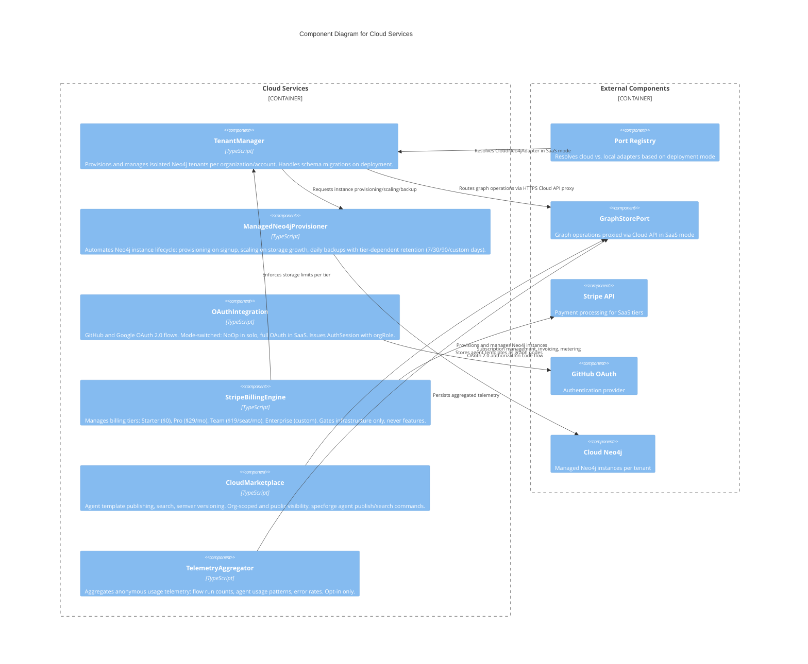

# C3 — Cloud Services

**Level:** C3 (Component)
**Scope:** Internal components of the SaaS cloud infrastructure, billing, and marketplace subsystem
**Parent:** [c3-server.md](./c3-server.md) — SpecForge Server

---

## Overview

The Cloud Services subsystem provides SaaS-mode infrastructure management. It handles multi-tenant Neo4j provisioning with tier-dependent backup retention, Stripe-based billing with infrastructure-only tiers (features are never gated), OAuth authentication, data residency enforcement, cloud API proxying for graph operations, and an agent marketplace for publishing/discovering shared agent templates. In solo mode, all cloud components resolve to NoOp adapters.

---

## Component Diagram

---

## Component Descriptions

| Component                   | Responsibility                                                                                                                                                                                                                                                  | Key Interfaces                                                       |
| --------------------------- | --------------------------------------------------------------------------------------------------------------------------------------------------------------------------------------------------------------------------------------------------------------- | -------------------------------------------------------------------- |
| **TenantManager**           | Provisions isolated Neo4j tenants per org/account. Routes all graph operations through the Cloud API HTTPS proxy (`CloudNeo4jAdapter`). Transparent to application logic -- all ports work identically. Manages data residency (US default, EU for Enterprise). | `provisionTenant(orgId)`, `routeQuery(request)`                      |
| **ManagedNeo4jProvisioner** | Automates Neo4j lifecycle: provisioning on signup, storage-based autoscaling, daily automated backups. Retention: 7 days (Starter), 30 (Pro), 90 (Team), custom (Enterprise). Handles schema migrations. Users never see Neo4j credentials.                     | `provision(tenantId)`, `scale(tenantId)`, `backup(tenantId)`         |
| **OAuthIntegration**        | Mode-switched authentication. NoOp in solo mode. In SaaS: GitHub and Google OAuth 2.0 flows. Issues `AuthSession` with `userId`, `orgId`, `orgRole`, `token`, `expiresAt`. Supports API token generation for CI.                                                | `authenticate(credentials)`, `refreshToken(session)`                 |
| **StripeBillingEngine**     | Manages 4 billing tiers gating infrastructure only (storage, backup retention, projects, SSO). All features available at every tier including free Starter. BYOC model: SpecForge never charges for Claude Code usage.                                          | `createSubscription(orgId, tier)`, `getUsage(orgId)`                 |
| **CloudMarketplace**        | SaaS agent template marketplace. `specforge agent publish` pushes templates with semver. `specforge agent search` discovers by keyword. Org-scoped (visible to org) and public visibility. Templates follow the agent template schema.                          | `publish(template)`, `search(query)`, `install(templateId, version)` |
| **TelemetryAggregator**     | Collects anonymous, opt-in usage telemetry: flow run counts, popular agent roles, error rates. Never collects spec content or PII. Aggregated data informs product improvements.                                                                                | `aggregate(event)`, `report(period)`                                 |

---

## Relationships to Parent Components

| From                | To                | Relationship                                      |
| ------------------- | ----------------- | ------------------------------------------------- |
| Port Registry       | TenantManager     | Selects CloudNeo4jAdapter in SaaS deployment mode |
| TenantManager       | GraphStorePort    | Proxies graph operations via HTTPS Cloud API      |
| StripeBillingEngine | TenantManager     | Enforces tier-based storage and project limits    |
| OAuthIntegration    | Auth Module       | Provides AuthSession for SaaS authentication      |
| CloudMarketplace    | AgentRoleRegistry | Registers marketplace-installed agent templates   |

---

## References

- [Cloud Services Behaviors](../behaviors/BEH-SF-107-cloud-services.md) — BEH-SF-107 through BEH-SF-112
- [Authentication Behaviors](../behaviors/BEH-SF-101-authentication.md) — Authentication flows
- [Cloud Types](../types/cloud.md) — PlanDetails, UsageReport, GraphRequest, GraphResponse, AnalyticsQuery
- [Auth Types](../types/auth.md) — AuthCredentials, AuthSession, AuthToken
- [Deployment SaaS](./deployment-saas.md) — SaaS deployment topology
- [Ports and Adapters](./ports-and-adapters.md) — Mode-switched adapter selection
