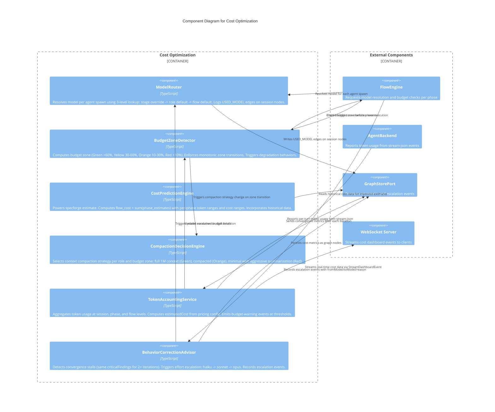

# C3 — Cost Optimization

**Level:** C3 (Component)
**Scope:** Internal components of the token budgeting, model routing, and cost prediction subsystem
**Parent:** [c3-server.md](./c3-server.md) — SpecForge Server

---

## Overview

The Cost Optimization subsystem manages all aspects of token budgeting and model economics. It implements role-adaptive model routing (per-role, per-stage model selection), four progressive budget zones (Green/Yellow/Orange/Red) with automatic degradation behaviors, convergence-responsive model escalation, context compaction strategies, and cost prediction for `specforge estimate`. Token usage flows from the AgentBackend's stream-json events through to graph-persisted cost analytics.

---

## Component Diagram



---

## Component Descriptions

| Component                    | Responsibility                                                                                                                                                                                                                                                                                    | Key Interfaces                                       |
| ---------------------------- | ------------------------------------------------------------------------------------------------------------------------------------------------------------------------------------------------------------------------------------------------------------------------------------------------- | ---------------------------------------------------- |
| **ModelRouter**              | Three-level model resolution: (1) stage-level override, (2) role-level default from `RoleModelMapping`, (3) flow-level default. Passes resolved model to AgentBackend via `--model`. Records `USED_MODEL` graph edges.                                                                            | `resolveModel(role, stage, flowConfig)`              |
| **BudgetZoneDetector**       | Computes current budget zone from remaining percentage. Enforces monotonic transitions (never reverts). Yellow: downgrade non-critical roles to haiku, reduce iterations 25%. Orange: all roles use sonnet, skip optional stages. Red: essential stages only, "budget critical" prompt injection. | `getZone(budget)`, `transition(newZone)`             |
| **CostPredictionEngine**     | Powers `specforge estimate`. Formula: `flow_cost = sum(phase_estimates)`, `phase_estimate = avg_iterations * sum(stage_estimates)`, `stage_estimate = model_cost * estimated_tokens`. Outputs tabular min/expected/max with confidence intervals.                                                 | `estimate(flowDef, packageSize)`                     |
| **CompactionDecisionEngine** | Selects context window strategy based on role and budget zone. Green/Yellow: 1M context for spec-author, reviewer. Orange: compacted context mode. Red: minimal with aggressive summarization. Never discards task-critical information.                                                          | `selectStrategy(role, zone)`                         |
| **TokenAccountingService**   | Aggregates `inputTokens` + `outputTokens` from stream-json metadata at session, phase, and flow levels. Computes `estimatedCost` from pricing config. Emits `budget-warning` at configurable threshold (default 90%). Produces `StreamDashboardEvent` for real-time UI.                           | `track(sessionId, usage)`, `getFlowUsage(flowRunId)` |

> **Note (C20):** The `CostTracker` component in [c3-hooks.md](./c3-hooks.md) is the hook-pipeline-side token accumulator that feeds raw usage data to `TokenAccountingService`. They are not duplicates: `CostTracker` collects per-tool-invocation token deltas, while `TokenAccountingService` aggregates them into session/phase/flow totals and computes budget zones.
> | **BehaviorCorrectionAdvisor** | Monitors convergence metrics after each iteration. Detects stalls (criticalFindings unchanged for 2+ iterations, convergence score not improving by >5%). Triggers one-tier model escalation (haiku -> sonnet -> opus). Caps at opus. | `evaluateConvergence(metrics, prevMetrics)` |

---

## Relationships to Parent Components

| From                      | To                     | Relationship                                           |
| ------------------------- | ---------------------- | ------------------------------------------------------ |
| FlowEngine                | ModelRouter            | Requests model resolution before agent spawn           |
| FlowEngine                | BudgetZoneDetector     | Checks zone and applies degradation behaviors          |
| AgentBackend              | TokenAccountingService | Reports token usage from stream-json events            |
| TokenAccountingService    | WebSocket Server       | Streams real-time cost metrics as StreamDashboardEvent |
| BehaviorCorrectionAdvisor | ModelRouter            | Triggers escalation from cheaper to more capable model |
| CostPredictionEngine      | GraphStorePort         | Reads historical averages for improved prediction      |

---

## Cost Event Propagation

End-to-end trace of token usage from LLM call to budget enforcement:

```
AgentBackend.onTokenUsage(callback)
    → CostTracker.record(usage)
    → TokenAccountingService.updateBudget(sessionId, usage)
    → EventBusPort.publish({ _tag: 'budget-warning', flowRunId, usage, threshold })
```

Budget warnings are consumed by:

- **WebSocket Server:** Streams to connected dashboards for real-time display
- **FlowEngine:** May pause or cancel the flow if budget is exhausted
- **AnalyticsService:** Records for cost reporting

---

## References

- [ADR-014](../decisions/ADR-014-role-adaptive-model-routing.md) — Role-Adaptive Model Routing
- [Token Budgeting Behaviors](../behaviors/BEH-SF-073-token-budgeting.md) — BEH-SF-073 through BEH-SF-080
- [Cost Optimization Behaviors](../behaviors/BEH-SF-169-cost-optimization.md) — BEH-SF-169 through BEH-SF-176
- [Flow Types](../types/flow.md) — TokenUsage, PhaseMetrics, ModelSelection, ModelEscalation
- [Structured Output Types](../types/structured-output.md) — StreamDashboardEvent
- [INV-SF-15](../invariants/INV-SF-15-budget-zone-monotonicity.md) — Cost Optimization Invariant
