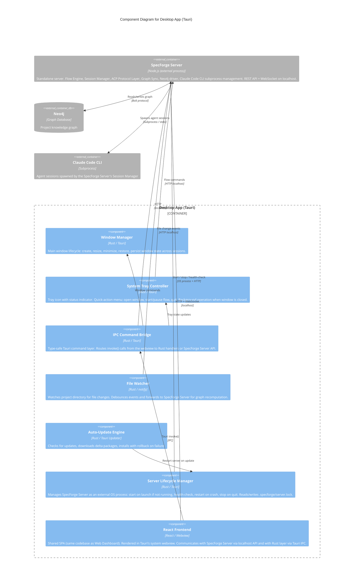

# C3: Desktop App Components

**Scope:** Internal component decomposition of the Desktop App container -- a Tauri-based native application that manages the SpecForge Server as an external process and renders the shared React SPA in a system webview.

**Elements:**

- Window Manager (Tauri/Rust -- window lifecycle, state persistence)
- System Tray Controller (Tauri/Rust -- tray icon, quick-action menu, background operation)
- IPC Command Bridge (Tauri/Rust -- type-safe command layer between Rust backend and webview frontend)
- File Watcher (Tauri/Rust -- project directory monitoring, change event forwarding)
- Auto-Update Engine (Tauri/Rust -- check, download, install, rollback)
- Server Lifecycle Manager (Tauri/Rust -- start, stop, health-check, restart the SpecForge Server as an external OS process)
- React Frontend (Webview -- shared SPA from c3-web-dashboard.md)

---

## Mermaid Diagram



### ASCII Representation

```
┌─────────────────────────────────────────────────────────────────────────────┐
│                        Desktop App (Tauri)                                   │
│                                                                             │
│  ┌───────────────────────────────────────────────────────────────────────┐  │
│  │                    React Frontend (Webview)                           │  │
│  │     Shared SPA: Flow Monitor | Graph Explorer | Findings | Cost      │  │
│  └────────────┬───────────────────────────────────┬──────────────────────┘  │
│               │ Tauri invoke()                    │ HTTP + WebSocket        │
│               ▼                                   │ (localhost)             │
│  ┌─────────────────────────────┐                  │                        │
│  │    IPC Command Bridge       │                  │                        │
│  │      (Rust / Tauri)         │                  │                        │
│  │                             │                  │                        │
│  │  invoke() → Rust handlers   │                  │                        │
│  │  invoke() → server proxy    │                  │                        │
│  └────┬──────────┬─────────────┘                  │                        │
│       │          │                                │                        │
│       ▼          ▼                                │                        │
│  ┌──────────┐ ┌──────────┐  ┌──────────────────┐ │                        │
│  │ Window   │ │ System   │  │ Server Lifecycle │ │                        │
│  │ Manager  │ │ Tray     │  │ Manager (Rust)   │ │                        │
│  │          │ │ Ctrl     │  │                  │ │                        │
│  │ create,  │ │ icon,    │  │ start if not     │ │                        │
│  │ resize,  │ │ menu,    │  │ running, health- │ │                        │
│  │ persist  │ │ bg mode  │  │ check, restart,  │ │                        │
│  └──────────┘ └──────────┘  │ stop, lock file  │ │                        │
│                              └────────┬─────────┘ │                        │
│  ┌──────────┐ ┌──────────┐          │            │                        │
│  │ File     │ │ Auto-    │          │            │                        │
│  │ Watcher  │ │ Update   │          │            │                        │
│  │          │ │ Engine   │          │            │                        │
│  │ notify   │ │ delta    │          │            │                        │
│  │ debounce │ │ rollback │          │            │                        │
│  └────┬─────┘ └────┬─────┘          │            │                        │
│       │            │                │            │                        │
└───────┼────────────┼────────────────┼────────────┼────────────────────────┘
        │            │                │            │
        │            │     start/stop/│            │ HTTP + WebSocket
        │            │     health     │            │
        ▼            ▼                ▼            ▼
  ┌─────────────────────────────────────────────────────────────────┐
  │                    SpecForge Server (Node.js)                    │
  │                     (external process)                          │
  │                                                                 │
  │  Flow Engine | Session Manager | ACP Protocol Layer | Graph Sync │
  │  Neo4j driver | REST API | WebSocket | Claude CLI mgmt          │
  └───────┬───────────────┬─────────────────────────────────────────┘
          │               │
          ▼               ▼
  ┌──────────────────┐  ┌─────────────────┐
  │      Neo4j       │  │ Claude Code CLI │
  │   (Graph DB)     │  │  (Subprocess)   │
  │                  │  │                 │
  │  Knowledge graph │  │  Agent sessions │
  │  Bolt protocol   │  │  stdio pipes    │
  └──────────────────┘  └─────────────────┘
```

## Component Descriptions

| Component                | Technology           | Responsibility                                                                                                                                                                                                                                                                                                                                                                                                                                                                               |
| ------------------------ | -------------------- | -------------------------------------------------------------------------------------------------------------------------------------------------------------------------------------------------------------------------------------------------------------------------------------------------------------------------------------------------------------------------------------------------------------------------------------------------------------------------------------------- |
| Window Manager           | Rust / Tauri         | Main window lifecycle: create, resize, minimize to tray, restore, fullscreen. Persists window position and size across sessions via Tauri's state plugin                                                                                                                                                                                                                                                                                                                                     |
| System Tray Controller   | Rust / Tauri         | System tray icon with flow status indicator (idle/running/error). Quick-action context menu: open window, start last flow, pause active flow, quit. Enables background operation when the main window is closed                                                                                                                                                                                                                                                                              |
| IPC Command Bridge       | Rust / Tauri         | Type-safe command routing layer. Handles `invoke()` calls from the webview frontend: some are handled directly by Rust (window/tray/file dialog), others are proxied to the SpecForge Server's REST API. Provides event emission from Rust to webview via Tauri events                                                                                                                                                                                                                       |
| File Watcher             | Rust / notify crate  | Monitors the active project directory for file changes using OS-native file system events. Debounces rapid changes (100ms window) and forwards change events to the SpecForge Server via HTTP to trigger graph recomputation                                                                                                                                                                                                                                                                 |
| Auto-Update Engine       | Rust / Tauri Updater | Checks for updates on startup and periodically (configurable). Downloads delta update packages. Installs updates by replacing the app bundle and restarting. Rolls back to previous version if the new version fails to start within a health check window. Coordinates with the Server Lifecycle Manager to restart the server process after update                                                                                                                                         |
| Server Lifecycle Manager | Rust / Tauri         | Manages the SpecForge Server as an external OS process. On Desktop App launch, checks if a server is already running (reads `.specforge/server.lock` and performs HTTP health check). If not running, starts the bundled server binary as a detached process. Monitors server health periodically. Restarts the server automatically on crash. Stops the server on Desktop App quit (configurable). Writes and reads the `.specforge/server.lock` file for server discovery by other clients |
| React Frontend           | React / Webview      | The shared SPA (same codebase as c3-web-dashboard.md) rendered in Tauri's system webview. Uses the SpecForge Server's HTTP/WebSocket API for data and real-time events. Uses Tauri's `invoke()` API for native capabilities (file dialogs, clipboard, notifications)                                                                                                                                                                                                                         |

## Communication Protocols

| From                     | To                 | Protocol                | Notes                                                                                              |
| ------------------------ | ------------------ | ----------------------- | -------------------------------------------------------------------------------------------------- |
| React Frontend           | IPC Command Bridge | Tauri invoke() / events | Type-safe IPC. Commands for native features (window, tray, file dialog, notifications)             |
| React Frontend           | SpecForge Server   | HTTP + WebSocket        | localhost. Same API as standalone web dashboard. REST for commands, WebSocket for real-time events |
| IPC Command Bridge       | SpecForge Server   | HTTP                    | localhost. Proxied commands from webview that need server processing                               |
| IPC Command Bridge       | Window Manager     | Internal Rust calls     | Window resize, minimize, fullscreen                                                                |
| System Tray Controller   | SpecForge Server   | HTTP                    | localhost. Quick-action commands (start/pause flow)                                                |
| File Watcher             | SpecForge Server   | HTTP                    | localhost. POST file change events for graph recomputation                                         |
| Server Lifecycle Manager | SpecForge Server   | HTTP + OS process       | Health check via HTTP `GET /health`. Process management via OS APIs (spawn, kill, signal)          |
| SpecForge Server         | Neo4j              | Bolt                    | Graph database read/write. Same driver as standalone mode                                          |
| SpecForge Server         | Claude Code CLI    | Subprocess stdio        | Agent session spawn and management. Same as standalone mode                                        |
| Auto-Update Engine       | Update Server      | HTTPS                   | Check for updates, download delta packages                                                         |

## Cross-References

- Parent container: [c2-containers.md](./c2-containers.md)
- Server internals: [c3-server.md](./c3-server.md)
- Shared SPA (frontend): [c3-web-dashboard.md](./c3-web-dashboard.md)
- Desktop decision: [../decisions/ADR-016-desktop-app-primary-client.md](../decisions/ADR-016-desktop-app-primary-client.md)
- Standalone server decision: [../decisions/ADR-017-standalone-server-over-sidecar.md](../decisions/ADR-017-standalone-server-over-sidecar.md)
- Tauri technology decision: [../decisions/ADR-002-tauri-over-electron.md](../decisions/ADR-002-tauri-over-electron.md)
- Behavioral specs: [../behaviors/BEH-SF-273-desktop-app.md](../behaviors/BEH-SF-273-desktop-app.md) (BEH-SF-273--281)
- Port registry: [ports-and-adapters.md](./ports-and-adapters.md)
- Claude Code adapter: [../behaviors/BEH-SF-151-claude-code-adapter.md](../behaviors/BEH-SF-151-claude-code-adapter.md)
