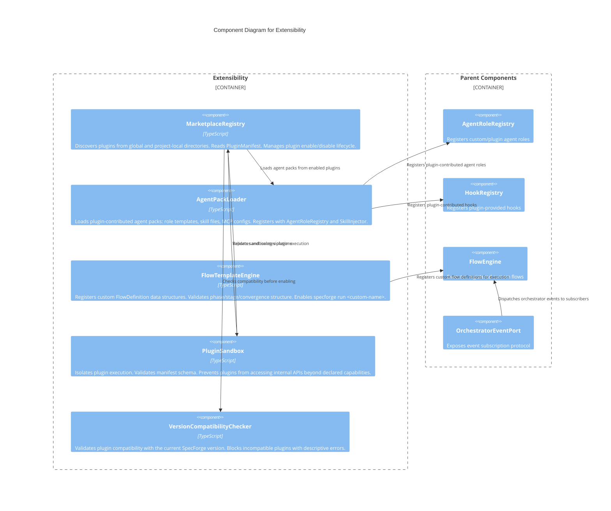

# C3 — Extensibility

**Level:** C3 (Component)
**Scope:** Internal components of the plugin, custom agent, custom flow, and event protocol subsystem
**Parent:** [c3-server.md](./c3-server.md) — SpecForge Server

---

## Overview

The Extensibility subsystem enables SpecForge to be extended through plugins, custom agents, custom flows, convention overrides, and a formalized event protocol. Plugins are discovered from global (`~/.specforge/plugins/`) and project-local (`.specforge/plugins/`) directories. Each plugin declares a manifest listing its capabilities: agent roles, hooks, conventions, flows, MCP server packs, and agent packs. Custom agents and flows follow the same protocols as built-in equivalents.

---

## Component Diagram

---

## Component Descriptions

| Component                       | Responsibility                                                                                                                                                                                                                                                                             | Key Interfaces                                           |
| ------------------------------- | ------------------------------------------------------------------------------------------------------------------------------------------------------------------------------------------------------------------------------------------------------------------------------------------ | -------------------------------------------------------- |
| **MarketplaceRegistry**         | Discovers plugins from `~/.specforge/plugins/` (global) and `.specforge/plugins/` (project-local). Reads `PluginManifest` declaring name, version, provides (roles, hooks, conventions, flows), and activationMode (`always`/`on-demand`). Manages `specforge plugin list/enable/disable`. | `discover()`, `enable(name)`, `disable(name)`, `list()`  |
| **AgentPackLoader**             | Loads complete agent packs from plugins: role templates with activation predicates, skill files, MCP server configurations, flow definitions using contributed roles. Registers all components with their respective registries. Disabling a plugin removes all its registrations.         | `loadPack(manifest)`, `unloadPack(pluginName)`           |
| **FlowTemplateEngine**          | Registers custom `FlowDefinition` data structures (phases, stages, convergence, agent roles). Validates structural correctness. Makes custom flows invocable via `specforge run <name>` and the web dashboard. Supports convention plugins for spec structure and requirement ID schemes.  | `registerFlow(definition)`, `registerConvention(plugin)` |
| **PluginSandbox**               | Validates plugin manifest schema. Prevents plugins from accessing internal APIs beyond their declared `provides` scope. Enforces that plugin-contributed roles follow the standard `AgentPort` protocol.                                                                                   | `validate(manifest)`, `sandbox(plugin)`                  |
| **VersionCompatibilityChecker** | Validates that a plugin's declared compatible SpecForge version range matches the running version. Blocks incompatible plugins with descriptive error messages. Warns on minor version mismatches.                                                                                         | `checkCompatibility(manifest, currentVersion)`           |

> **Plugin Isolation (M30):** Convention plugins and phase hooks execute in the same Node.js process as the server. Plugins are isolated at the API boundary (they can only interact through the defined `ConventionPlugin` and `PhaseHook` interfaces) but do not have process-level or VM-level sandboxing. Malicious plugins can access the full Node.js runtime. Plugin trust is established at registration time via the marketplace review process (SaaS) or local file verification (solo).

---

## Relationships to Parent Components

| From                  | To                   | Relationship                                                |
| --------------------- | -------------------- | ----------------------------------------------------------- |
| MarketplaceRegistry   | AgentRoleRegistry    | Registers/unregisters plugin-provided agent roles           |
| AgentPackLoader       | HookRegistry         | Registers plugin-provided hooks                             |
| FlowTemplateEngine    | FlowEngine           | Makes custom flows available for execution                  |
| OrchestratorEventPort | External subscribers | `subscribe(eventType, handler)` and `subscribeAll(handler)` |

---

## References

- [ADR-007](../decisions/ADR-007-flow-based-orchestration.md) — Flow-Based Orchestration
- [ADR-008](../decisions/ADR-008-gxp-optional-mode.md) — GxP Optional Mode
- [Extensibility Behaviors](../behaviors/BEH-SF-087-extensibility.md) — BEH-SF-087 through BEH-SF-094
- [Dynamic Agents Behaviors](../behaviors/BEH-SF-185-dynamic-agents.md) — BEH-SF-192 (Plugin-Contributed Agent Packs)
- [Extensibility Types](../types/extensibility.md) — PhaseHook, HookContext, OrchestratorEvent, CustomAgentConfig, ConventionPlugin
- [INV-SF-5](../invariants/INV-SF-5-tool-isolation.md) — Tool Isolation
- [INV-SF-9](../invariants/INV-SF-9-flow-determinism.md) — Extensibility Invariant
