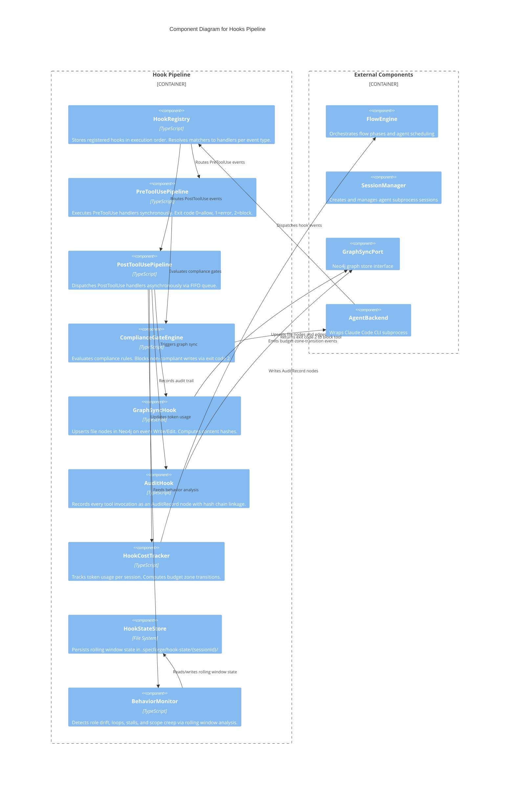

# C3 — Hook Pipeline System

**Level:** C3 (Component)
**Scope:** Internal components of the hook pipeline subsystem
**Parent:** [c3-server.md](./c3-server.md) — SpecForge Server

---

## Overview

The hook pipeline is a programmable event bus that intercepts every tool invocation across all agent sessions. It provides real-time observability, compliance enforcement, graph synchronization, and audit trail generation without modifying agent code.

---

## Component Diagram

---

## Component Descriptions

| Component                | Responsibility                                                                                                                                                                                                                                              | Key Interfaces                               |
| ------------------------ | ----------------------------------------------------------------------------------------------------------------------------------------------------------------------------------------------------------------------------------------------------------- | -------------------------------------------- |
| **HookRegistry**         | Central registration point for all hooks. Maintains ordered handler lists per event type. Resolves tool matchers and path globs.                                                                                                                            | `register(handler)`, `resolve(event)`        |
| **PreToolUsePipeline**   | Synchronous execution of PreToolUse handlers. Runs in registration order. First exit code 2 blocks the tool. Exit code 1 logs error but allows.                                                                                                             | `execute(event) → HookOutput`                |
| **PostToolUsePipeline**  | Asynchronous FIFO dispatch of PostToolUse handlers. <50ms latency target. Failures logged but never block the agent.                                                                                                                                        | `dispatch(event)`                            |
| **ComplianceGateEngine** | Evaluates compliance rules against tool invocations. Checks: required sections, requirement ID format, traceability annotations. GxP mode adds destructive git blocking.                                                                                    | `evaluate(event) → ComplianceGateResult`     |
| **GraphSyncHook**        | PostToolUse handler for `Write`, `Edit`, `Bash` tools. Computes SHA-256 content hash. Issues Cypher `MERGE` for file nodes. Extracts requirement IDs via regex for `CONTAINS` edges.                                                                        | `sync(event)`                                |
| **AuditHook**            | Records every tool invocation as an `AuditRecord` graph node. Maintains hash chain linkage to previous record. Supports Merkle witness publication.                                                                                                         | `record(event)`                              |
| **HookCostTracker**      | Accumulates token usage from `stream-json` events. Computes budget zone (Green/Yellow/Orange/Red). Emits `budget-zone-transition` events to FlowEngine.                                                                                                     | `track(tokenUpdate)`, `getZone()`            |
| **HookStateStore**       | File-based persistence for hook state. Each session gets a directory under `.specforge/hook-state/`. Stores rolling window events, counters, and timestamps.                                                                                                | `read(sessionId)`, `write(sessionId, state)` |
| **BehaviorMonitor**      | Analyzes rolling window of recent tool invocations to detect: (a) role drift — wrong tool usage for role, (b) loops — repetitive read patterns, (c) stalls — meta-commentary without artifact creation, (d) scope creep — file access outside project root. | `analyze(event) → ReadonlyArray<Anomaly>`    |

> **Token usage source (C03):** Token usage is extracted from `ACPMessage.metadata.tokenUsage` populated by the AgentBackend adapter after each LLM call. The hooks pipeline reads this metadata to track per-hook and per-phase token consumption.

> **Event matcher algorithm (M06):** Hook event matching uses: exact match on tool name, glob pattern on file path patterns. Specificity ordering: exact match > glob pattern > wildcard (`*`). The most specific matching hook is invoked first.

---

## Relationships to Parent Components

| From            | To             | Relationship                                      |
| --------------- | -------------- | ------------------------------------------------- |
| AgentBackend    | HookRegistry   | Dispatches `HookEvent` for every tool invocation  |
| FlowEngine      | HookRegistry   | Registers phase-level hooks at flow start         |
| SessionManager  | HookRegistry   | Registers session-level hooks at session creation |
| HookCostTracker | FlowEngine     | Emits budget zone transition events               |
| GraphSyncHook   | GraphSyncPort  | Writes file nodes and relationship edges          |
| AuditHook       | GraphSyncPort  | Writes AuditRecord nodes                          |
| BehaviorMonitor | SessionManager | Reports anomalies for session-level action        |

> **Note (M59):** BehaviorMonitor is a cross-cutting concern shared by the hooks pipeline, permission governance, and cost optimization subsystems.

---

## References

- [ADR-011](../decisions/ADR-011-hooks-as-event-bus.md) — Hooks as Event Bus
- [Hook Pipeline Behaviors](../behaviors/BEH-SF-161-hook-pipeline.md) — BEH-SF-161 through BEH-SF-168
- [Hook Pipeline Types](../types/hooks.md) — HookEvent, HookPipeline, ComplianceGateResult
- [Audit Types](../types/audit.md) — AuditRecord, AuditChain, MerkleWitness
- [INV-SF-12](../invariants/INV-SF-12-hook-pipeline-ordering.md) — Hook Pipeline Ordering
