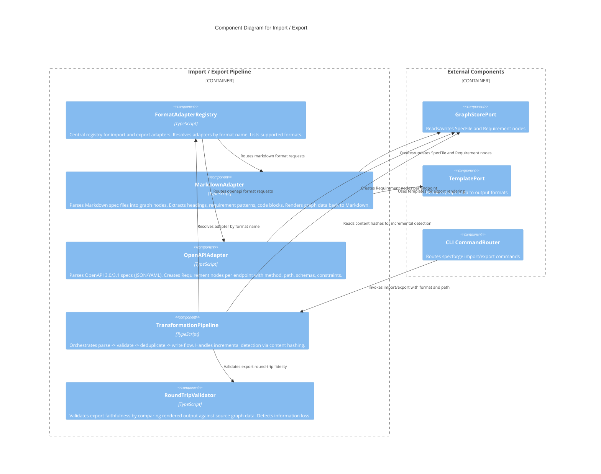

# C3 — Import / Export

**Level:** C3 (Component)
**Scope:** Internal components of the pluggable import/export adapter pipeline
**Parent:** [c3-server.md](./c3-server.md) — SpecForge Server

---

## Overview

The Import/Export subsystem provides a pluggable pipeline for ingesting external specifications into the knowledge graph and rendering graph data to external formats. Built-in adapters handle Markdown and OpenAPI import, plus Markdown/ADR/Coverage-Report export. The adapter registry pattern enables third-party format plugins (Jira, Confluence, AsciiDoc, Gherkin). Incremental import uses content hashing to skip unchanged files, and round-trip validation ensures export faithfulness.

---

## Component Diagram



---

## Component Descriptions

| Component                  | Responsibility                                                                                                                                                                                                                                                                                | Key Interfaces                                                         |
| -------------------------- | --------------------------------------------------------------------------------------------------------------------------------------------------------------------------------------------------------------------------------------------------------------------------------------------- | ---------------------------------------------------------------------- |
| **FormatAdapterRegistry**  | Central registry for `ImportAdapterService` and `ExportAdapterService` implementations. Resolves by format name. Returns `ImportFormatNotSupportedError` or `ExportFormatNotSupportedError` for unknown formats. Plugins register additional adapters at startup.                             | `register(adapter)`, `resolve(format)`, `listFormats()`                |
| **MarkdownAdapter**        | Import: parses Markdown files, extracts heading structure as sections, detects requirement patterns (`REQ-*`, `MUST`, `SHALL`), identifies code blocks. Export: renders graph data as Markdown using `TemplatePort`. Supports `--dry-run` and `--force` flags.                                | `parse(input)`, `render(data)`, `supports('markdown')`                 |
| **OpenAPIAdapter**         | Import: parses OpenAPI 3.0 and 3.1 specs (JSON and YAML). Creates a `Requirement` node per endpoint with HTTP method, path, summary, request/response schemas, and validation constraints.                                                                                                    | `parse(input)`, `supports('openapi')`                                  |
| **TransformationPipeline** | Orchestrates the full import/export flow. Import: parse -> validate -> compute content hash -> skip if unchanged -> deduplicate -> write to graph. Export: query graph -> filter by spec -> render via adapter -> validate round-trip. Handles `--dry-run`, `--force`, `--incremental` flags. | `import(format, path, options)`, `export(format, outputPath, options)` |
| **RoundTripValidator**     | Validates that exported files faithfully represent the source graph data. Compares node counts, requirement IDs, section structure. Reports discrepancies as warnings. Used for CI drift detection.                                                                                           | `validate(exported, source)`                                           |

---

## Relationships to Parent Components

| From                   | To                     | Relationship                                          |
| ---------------------- | ---------------------- | ----------------------------------------------------- |
| CLI CommandRouter      | TransformationPipeline | Routes `specforge import`/`specforge export` commands |
| TransformationPipeline | FormatAdapterRegistry  | Resolves import/export adapter by format name         |
| MarkdownAdapter        | GraphStorePort         | Creates/updates SpecFile and Requirement graph nodes  |
| OpenAPIAdapter         | GraphStorePort         | Creates Requirement nodes per API endpoint            |
| MarkdownAdapter        | TemplatePort           | Uses rendering templates for Markdown export          |

---

## Import/Export Data Flow

**Import pipeline:**

```
File input → ImportRegistryPort.resolve(format)
    → ImportAdapterService.parse(input)
    → ParsedImport
    → GraphMutationService.createNode() (per entry)
    → GraphSyncService.syncArtifacts()
```

**Export pipeline:**

```
ExportRegistryPort.resolve(format)
    → GraphQueryService.query() (gather data)
    → ExportAdapterService.render(data)
    → ExportResult (file output)
```

---

## References

- [Import/Export Behaviors](../behaviors/BEH-SF-127-import-export.md) — BEH-SF-127 through BEH-SF-132
- [Import/Export Types](../types/import-export.md) — ImportInput, ImportResult, ExportData, ExportResult, ImportAdapterService, ExportAdapterService
- [Ports and Adapters](./ports-and-adapters.md) — ImportAdapterPort, ExportAdapterPort in universal ports
