# C3: Knowledge Graph Schema

**Scope:** Neo4j graph schema modeled as a C4-style component diagram. Node types, relationship types, and query surface areas.

**Elements:**

- Node Types: Project, SpecFile, Requirement, Task, FlowRun, AgentSession, SessionChunk, Finding, ACPSession, and 15+ additional types
- Relationship Types: CONTAINS, TRACES_TO, DEPENDS_ON, COVERS, MITIGATES, REVIEWS, and others
- Query Surface: Session composition queries, NLQ queries, analytics aggregations

---

## Mermaid Diagram

```mermaid
C4Component
    title Component Diagram for Knowledge Graph Schema

    Container_Boundary(graph, "Neo4j Knowledge Graph") {

        Component(project, "Project", "Node", "Root node. Contains all spec files, flow runs, and team configuration.")
        Component(specFile, "SpecFile", "Node", "A specification document. Markdown content with frontmatter metadata.")
        Component(requirement, "Requirement", "Node", "An extracted requirement. Traceable to specs and tasks.")
        Component(task, "Task", "Node", "A work item derived from requirements. Assigned to agents or humans.")
        Component(flowRun, "FlowRun", "Node", "A single execution of a flow template. Contains phases and agent sessions.")
        Component(agentSession, "AgentSession", "Node", "An individual agent execution. Linked to flow run and session chunks.")
        Component(sessionChunk, "SessionChunk", "Node", "A reusable context fragment. Ranked and assembled into session context.")
        Component(finding, "Finding", "Node", "An issue, suggestion, or observation produced by an agent during a flow.")
        Component(acpSession, "ACPSession", "Node", "Per-flow-run event log. Documents, findings, messages.")
        Component(phase, "Phase", "Node", "A flow phase definition. Ordered within a flow run.")
        Component(convergence, "ConvergenceCriteria", "Node", "Criteria for phase completion. Evaluated after each iteration.")
        Component(agent, "Agent", "Node", "Agent definition. Role, tools, system prompt template.")
        Component(flowTemplate, "FlowTemplate", "Node", "Reusable flow definition. Phases, agents, convergence criteria.")
        Component(tag, "Tag", "Node", "Classification label. Applied to specs, requirements, findings.")
        Component(quality, "QualityMetric", "Node", "Quality measurement. Linked to flow runs and spec files.")
        Component(skill, "Skill", "Node", "A skill instruction. Loaded from builtin bundles, graph extraction, or project files.")
        Component(skillBundle, "SkillBundle", "Node", "A named collection of related skills. Assigned to agent roles.")
    }

    Rel(project, specFile, "CONTAINS")
    Rel(project, flowRun, "CONTAINS")
    Rel(project, flowTemplate, "CONTAINS")
    Rel(specFile, requirement, "CONTAINS")
    Rel(requirement, task, "TRACES_TO")
    Rel(requirement, requirement, "DEPENDS_ON")
    Rel(flowRun, agentSession, "CONTAINS")
    Rel(flowRun, acpSession, "CONTAINS")
    Rel(flowRun, phase, "CONTAINS")
    Rel(agentSession, sessionChunk, "PRODUCES")
    Rel(agentSession, finding, "PRODUCES")
    Rel(finding, requirement, "COVERS")
    Rel(finding, finding, "MITIGATES")
    Rel(phase, convergence, "EVALUATES")
    Rel(phase, agent, "ASSIGNS")
    Rel(flowTemplate, phase, "DEFINES")
    Rel(tag, specFile, "TAGS")
    Rel(tag, requirement, "TAGS")
    Rel(quality, flowRun, "MEASURES")
    Rel(quality, specFile, "MEASURES")
    Rel(skill, skillBundle, "PART_OF")
    Rel(skill, specFile, "EXTRACTED_FROM")
    Rel(skill, agent, "ASSIGNED_TO")
    Rel(skillBundle, skill, "CONTAINS")
```



### ASCII Representation

```
┌─────────────────────────────────────────────────────────────────────────────┐
│                          Neo4j Knowledge Graph                              │
│                                                                             │
│  ┌───────────┐                                                              │
│  │  Project  │──CONTAINS──┬──────────────────────────────────┐              │
│  └───────────┘            │                                  │              │
│                           ▼                                  ▼              │
│              ┌────────────────┐                  ┌──────────────────┐       │
│              │    SpecFile    │                  │   FlowTemplate   │       │
│              └───────┬────────┘                  └────────┬─────────┘       │
│                      │ CONTAINS                           │ DEFINES         │
│                      ▼                                    ▼                 │
│              ┌────────────────┐                  ┌──────────────┐           │
│              │  Requirement   │◄──COVERS─────────│    Phase     │           │
│              └───┬────┬───────┘                  └──┬─────┬────┘           │
│    DEPENDS_ON ◄──┘    │ TRACES_TO                   │     │                │
│    (self-ref)         ▼                    EVALUATES │     │ ASSIGNS        │
│              ┌────────────┐              ┌──────────▼┐   ▼                 │
│              │    Task    │              │Convergence│  ┌───────┐          │
│              └────────────┘              │ Criteria  │  │ Agent │          │
│                                          └───────────┘  └───────┘          │
│                                                                             │
│  ┌───────────┐──CONTAINS──┬──────────────────────────────────┐             │
│  │  FlowRun  │            │                                  │             │
│  └───────────┘            ▼                                  ▼             │
│                  ┌─────────────────┐                ┌──────────────┐       │
│                  │  AgentSession   │                │  ACPSession  │       │
│                  └───┬─────┬───────┘                └──────────────┘       │
│            PRODUCES  │     │ PRODUCES                                       │
│                      ▼     ▼                                                │
│           ┌──────────────┐  ┌──────────┐                                   │
│           │ SessionChunk │  │ Finding  │──MITIGATES──▶ (self-ref)          │
│           └──────────────┘  └──────────┘                                   │
│                                                                             │
│  Cross-cutting:                                                             │
│  ┌───────┐──TAGS──▶ SpecFile, Requirement, Finding                         │
│  │  Tag  │                                                                  │
│  └───────┘                                                                  │
│  ┌────────────────┐──MEASURES──▶ FlowRun, SpecFile                         │
│  │ QualityMetric  │                                                         │
│  └────────────────┘                                                         │
│                                                                             │
│  Skills:                                                                    │
│  ┌──────────────┐──PART_OF──▶ SkillBundle                                  │
│  │    Skill     │──EXTRACTED_FROM──▶ SpecFile                              │
│  │              │──ASSIGNED_TO──▶ Agent                                     │
│  └──────────────┘                                                           │
│  ┌──────────────┐──CONTAINS──▶ Skill                                       │
│  │ SkillBundle  │                                                           │
│  └──────────────┘                                                           │
│                                                                             │
└─────────────────────────────────────────────────────────────────────────────┘
```

## Node Type Inventory

| Node Type           | Properties                                                      | Description                                                         |
| ------------------- | --------------------------------------------------------------- | ------------------------------------------------------------------- |
| Project             | name, path, createdAt                                           | Root container for all project artifacts                            |
| SpecFile            | path, title, content, hash, updatedAt                           | A specification document with version tracking                      |
| Requirement         | id, text, priority, status                                      | Extracted requirement traceable to specs and tasks                  |
| Task                | id, description, status, assignee                               | Work item derived from requirements                                 |
| FlowRun             | id, templateId, status, startedAt, completedAt                  | Single execution of a flow template                                 |
| AgentSession        | id, role, status, tokenCount                                    | Individual agent execution within a flow run                        |
| SessionChunk        | id, content, embedding, relevanceScore                          | Reusable context fragment for session composition                   |
| Finding             | id, type, severity, message                                     | Issue, suggestion, or observation from an agent                     |
| ACPSession          | id, flowRunId                                                   | Per-flow-run append-only event log                                  |
| Phase               | id, name, order, maxIterations                                  | Flow phase definition with ordering                                 |
| ConvergenceCriteria | id, type, threshold                                             | Criteria for determining phase completion                           |
| Agent               | id, role, tools, systemPromptTemplate                           | Agent definition with capabilities                                  |
| FlowTemplate        | id, name, description, version                                  | Reusable flow definition                                            |
| Tag                 | name, category                                                  | Classification label                                                |
| QualityMetric       | id, metricType, value, timestamp                                | Quality measurement data point                                      |
| Skill               | name, source, bundle, content, contentHash, scope, roles, stale | Skill instruction loaded from builtin, graph extraction, or project |
| SkillBundle         | name, description                                               | Named collection of related skills assigned to roles                |

## Relationship Type Inventory

| Relationship   | From          | To                              | Description                         |
| -------------- | ------------- | ------------------------------- | ----------------------------------- |
| CONTAINS       | Project       | SpecFile, FlowRun, FlowTemplate | Project ownership                   |
| CONTAINS       | SpecFile      | Requirement                     | Spec-to-requirement extraction      |
| CONTAINS       | FlowRun       | AgentSession, ACPSession, Phase | Flow run composition                |
| TRACES_TO      | Requirement   | Task                            | Requirement-to-task traceability    |
| DEPENDS_ON     | Requirement   | Requirement                     | Inter-requirement dependencies      |
| PRODUCES       | AgentSession  | SessionChunk, Finding           | Agent output artifacts              |
| COVERS         | Finding       | Requirement                     | Finding-to-requirement coverage     |
| MITIGATES      | Finding       | Finding                         | Finding resolution chain            |
| EVALUATES      | Phase         | ConvergenceCriteria             | Phase completion evaluation         |
| ASSIGNS        | Phase         | Agent                           | Agent assignment to phases          |
| DEFINES        | FlowTemplate  | Phase                           | Template-to-phase structure         |
| TAGS           | Tag           | SpecFile, Requirement, Finding  | Classification tagging              |
| MEASURES       | QualityMetric | FlowRun, SpecFile               | Quality measurement linkage         |
| PART_OF        | Skill         | SkillBundle                     | Skill membership in a bundle        |
| EXTRACTED_FROM | Skill         | SpecFile                        | Graph-extracted skill provenance    |
| ASSIGNED_TO    | Skill         | Agent                           | Skill resolved for an agent session |

> **Note (M60):** GraphStorePort is the Neo4j access layer (connection management, transactions). GraphSyncPort projects ACP events into the graph via GraphStorePort.

## Cross-References

- Parent container: [c2-containers.md](./c2-containers.md)
- Session composition (queries this graph): [dynamic-session-composition.md](./dynamic-session-composition.md)
- Graph-first decision: [../decisions/ADR-005-graph-first-architecture.md](../decisions/ADR-005-graph-first-architecture.md)
- Compositional sessions decision: [../decisions/ADR-009-compositional-sessions.md](../decisions/ADR-009-compositional-sessions.md)
- Behavioral specs: [../behaviors/BEH-SF-001-graph-operations.md](../behaviors/BEH-SF-001-graph-operations.md)
- Skill registry architecture: [../decisions/ADR-025-skill-registry-architecture.md](../decisions/ADR-025-skill-registry-architecture.md)
- Skill types: [../types/skill.md](../types/skill.md)
- Skill registry components: [c3-skill-registry.md](./c3-skill-registry.md)
- Type definitions: [../types/graph.md](../types/graph.md)
