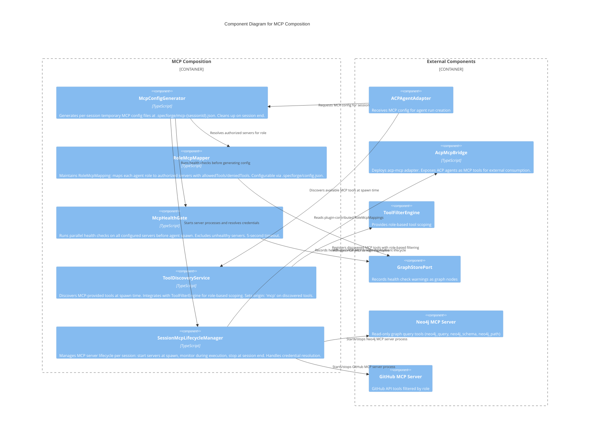

# C3 — MCP Composition

**Level:** C3 (Component)
**Scope:** Internal components of the dynamic MCP server composition and tool discovery subsystem
**Parent:** [c3-server.md](./c3-server.md) — SpecForge Server

---

## Overview

The MCP Composition subsystem dynamically assembles per-session MCP (Model Context Protocol) server configurations based on agent role. It generates temporary configuration files, performs spawn-time health checks, maps tools per role, manages credentials through a three-tier resolution system, and supports plugin-contributed MCP server packs. This enables agents to access external services (Neo4j graph queries, GitHub API, etc.) with role-appropriate tool filtering.

---

## Component Diagram

---

## Component Descriptions

| Component                      | Responsibility                                                                                                                                                                                                                            | Key Interfaces                                                                 |
| ------------------------------ | ----------------------------------------------------------------------------------------------------------------------------------------------------------------------------------------------------------------------------------------- | ------------------------------------------------------------------------------ |
| **McpConfigGenerator**         | Generates temporary per-session MCP configuration files. Includes only servers authorized for the agent's role. Passes config via `--mcp-config` flag. Cleans up temp files on session end.                                               | `generateConfig(sessionId, role)`, `cleanupConfig(sessionId)`                  |
| **RoleMcpMapper**              | Maps each agent role to its authorized MCP servers. Supports `allowedTools` (whitelist) and `deniedTools` (blacklist) per role-server pair. Configurable via `.specforge/config.json`. Overridable by plugins.                            | `getServersForRole(role)`, `getToolFilter(role, serverId)`                     |
| **McpHealthGate**              | Parallel health checks before agent spawn. Executes `healthCheckCommand` with 5-second timeout. Excludes unhealthy servers from config. If all fail, agent spawns without MCP with `Notification` event. Records failures as graph nodes. | `checkHealth(servers)`                                                         |
| **ToolDiscoveryService**       | Discovers MCP-provided tools at spawn time via Claude Code's native MCP integration. Tags discovered tools with `origin: 'mcp'`. Integrates with `ToolFilterEngine` for role-based scoping.                                               | `discoverTools(mcpConfig)`                                                     |
| **SessionMcpLifecycleManager** | Manages MCP server process lifecycle per session. Starts servers at spawn, monitors health during execution, stops at session end. Resolves credentials via 3-tier system: env vars -> system keychain -> `.specforge/credentials.json`.  | `startServers(config)`, `stopServers(sessionId)`, `resolveCredentials(server)` |

---

## Relationships to Parent Components

| From                       | To                 | Relationship                                                   |
| -------------------------- | ------------------ | -------------------------------------------------------------- |
| ACPAgentAdapter            | McpConfigGenerator | Requests MCP configuration at agent run creation time          |
| McpConfigGenerator         | ACPAgentAdapter    | Returns config file path for agent backend `--mcp-config` flag |
| SessionMcpLifecycleManager | AcpMcpBridge       | Deploys `acp-mcp` bridge exposing ACP agents as MCP tools      |
| ToolDiscoveryService       | ToolFilterEngine   | Registers MCP-discovered tools for role-based filtering        |
| McpHealthGate              | GraphStorePort     | Records health check warning nodes                             |
| SessionMcpLifecycleManager | Neo4j MCP Server   | Manages read-only graph query server lifecycle                 |
| SessionMcpLifecycleManager | GitHub MCP Server  | Manages GitHub API server lifecycle                            |

> **Note (M62):** ToolDiscoveryService enumerates MCP tools; ToolFilterEngine applies role-based filtering. Discovery happens once at agent spawn time; filtering is applied on every tool access.

> **Composition queries (M04):** Query strategy shapes and filters for session composition are documented in the CompositionStrategy types. Exact Cypher query templates are deferred to adapter implementation; the specification defines the semantic contract, not the query syntax.

---

## References

- [ADR-015](../decisions/ADR-015-agent-teams-hybrid-integration.md) — Agent Teams Hybrid Integration
- [MCP Composition Behaviors](../behaviors/BEH-SF-193-mcp-composition.md) — BEH-SF-193 through BEH-SF-200
- [MCP Types](../types/mcp.md) — McpServerConfig, RoleMcpMapping, McpHealthCheck, PluginMcpManifest, CredentialConfig
- [INV-SF-17](../invariants/INV-SF-17-mcp-server-health-gate.md) — MCP Composition Invariant
