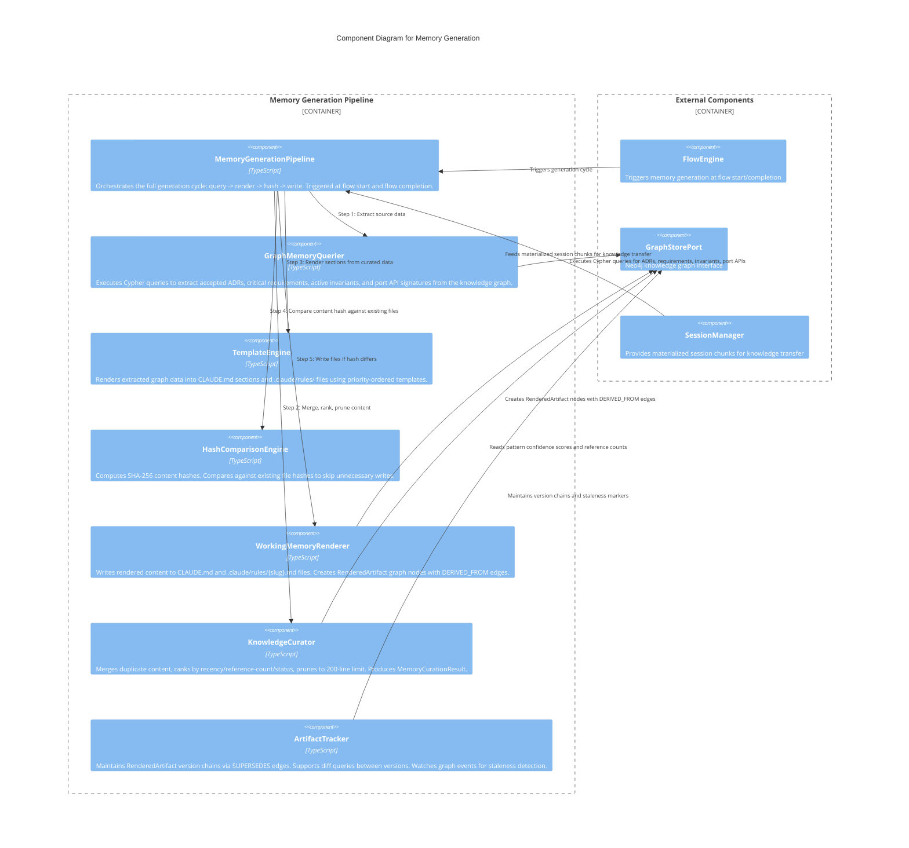

# C3 — Memory Generation

**Level:** C3 (Component)
**Scope:** Internal components of the memory generation and knowledge curation pipeline
**Parent:** [c3-server.md](./c3-server.md) — SpecForge Server

---

## Overview

The Memory Generation subsystem produces and maintains CLAUDE.md files and `.claude/rules/` files from the knowledge graph. It implements the dual-memory architecture: a graph-backed generation pipeline extracts ADRs, requirements, invariants, and port APIs via Cypher queries, renders them through templates, and writes files only when content has changed (SHA-256 hash comparison). A curation stage merges, ranks, and prunes content to stay within the 200-line effective limit.

---

## Component Diagram

---

## Component Descriptions

| Component                    | Responsibility                                                                                                                                                                                                                            | Key Interfaces                                                      |
| ---------------------------- | ----------------------------------------------------------------------------------------------------------------------------------------------------------------------------------------------------------------------------------------- | ------------------------------------------------------------------- |
| **MemoryGenerationPipeline** | Top-level orchestrator for the generation cycle. Coordinates query -> curate -> render -> hash -> write stages. Triggered at flow start (for agent context) and flow completion (for knowledge capture).                                  | `generate(projectId)`, `generateRules(projectId)`                   |
| **GraphMemoryQuerier**       | Executes targeted Cypher queries: accepted ADRs (title + decision summary), critical requirements, active invariants, port API signatures. Returns structured data for template rendering.                                                | `queryMemorySources(projectId)`                                     |
| **TemplateEngine**           | Renders graph data into markdown sections with priority ordering: invariants > ADRs > requirements > port APIs. Supports per-behavior rule file rendering with path scope annotations.                                                    | `renderClaudeMd(sources)`, `renderRule(behavior, scope)`            |
| **HashComparisonEngine**     | Computes SHA-256 content hashes for rendered output. Compares against stored hashes on existing `RenderedArtifact` nodes. Returns skip/write decision.                                                                                    | `shouldWrite(content, existingHash)`                                |
| **WorkingMemoryRenderer**    | File writer that creates/updates CLAUDE.md and `.claude/rules/` files. Creates `RenderedArtifact` graph nodes with all required fields (artifactId, targetPath, contentHash, sourceNodeIds, templateId).                                  | `writeMemoryFile(path, content, sources)`                           |
| **KnowledgeCurator**         | Enforces the 200-line limit by merging duplicate content, ranking by recency + reference count + status, and pruning low-value items. Extracts `KnowledgePattern` items from session chunks. Classifies patterns by type.                 | `curate(sources)`, `extractPatterns(chunks)`                        |
| **ArtifactTracker**          | Maintains version history via `SUPERSEDES` edges between `RenderedArtifact` nodes. Watches for graph events (ADR superseded, requirement deleted, invariant modified) to mark artifacts stale. Prunes unreferenced patterns after N runs. | `trackVersion(artifact)`, `markStale(sourceNodeId)`, `diff(v1, v2)` |

> **Memory generation timing (M03):** Memory generation is triggered at flow start (bootstrap from project scaffold) and flow completion (persist findings, decisions, artifacts). There are no mid-flow incremental memory updates; the graph sync handles real-time event projection separately.

---

## Relationships to Parent Components

| From                  | To                       | Relationship                                                 |
| --------------------- | ------------------------ | ------------------------------------------------------------ |
| FlowEngine            | MemoryGenerationPipeline | Triggers generation at flow start and completion             |
| GraphMemoryQuerier    | GraphStorePort           | Reads ADRs, requirements, invariants, port APIs via Cypher   |
| WorkingMemoryRenderer | GraphStorePort           | Creates RenderedArtifact nodes with DERIVED_FROM edges       |
| ArtifactTracker       | GraphStorePort           | Maintains version chains, watches events, marks staleness    |
| SessionManager        | MemoryGenerationPipeline | Provides session chunks for knowledge transfer pipeline      |
| KnowledgeCurator      | GraphStorePort           | Reads and updates KnowledgePattern confidence and references |

---

## References

- [ADR-013](../decisions/ADR-013-dual-memory-architecture.md) — Dual Memory Architecture
- [Memory Generation Behaviors](../behaviors/BEH-SF-177-memory-generation.md) — BEH-SF-177 through BEH-SF-184
- [Memory Types](../types/memory.md) — RenderedArtifact, KnowledgePattern, MemoryCurationResult, CollectiveMemory
- [INV-SF-14](../invariants/INV-SF-14-memory-artifact-traceability.md) — Memory Generation Invariant
