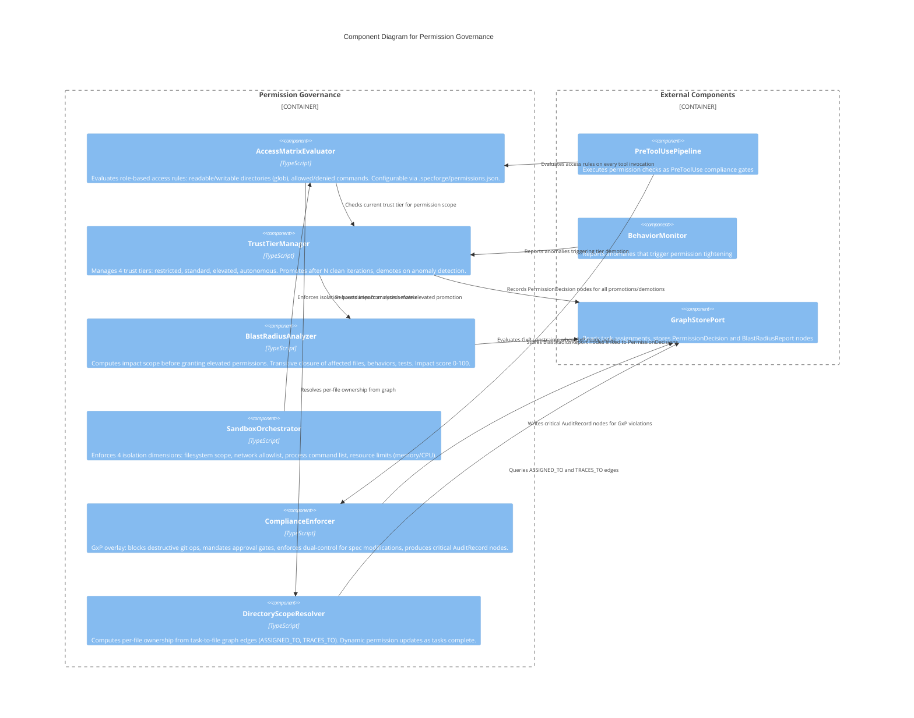

# C3 — Permission Governance

**Level:** C3 (Component)
**Scope:** Internal components of the layered permission, trust management, and sandboxing subsystem
**Parent:** [c3-server.md](./c3-server.md) — SpecForge Server

---

## Overview

The Permission Governance subsystem enforces multi-layered access control for agent sessions. It combines a role-based access matrix (directory scoping, command filtering), progressive trust tiers (restricted -> standard -> elevated -> autonomous), sandboxed execution boundaries (filesystem, network, process, resource), graph-driven per-file ownership, blast radius analysis for elevated permissions, and a GxP compliance overlay. All permission decisions are recorded as `PermissionDecision` graph nodes for full auditability.

---

## Component Diagram

---

## Component Descriptions

| Component                  | Responsibility                                                                                                                                                                                                                                                                                      | Key Interfaces                                                                 |
| -------------------------- | --------------------------------------------------------------------------------------------------------------------------------------------------------------------------------------------------------------------------------------------------------------------------------------------------- | ------------------------------------------------------------------------------ |
| **AccessMatrixEvaluator**  | Evaluates the role-based access matrix for every tool invocation. Declares readable/writable directories (glob patterns), allowed/denied commands per role. Integrates trust tier and file ownership for dynamic scope expansion. Violations blocked with exit code 2.                              | `evaluate(role, tool, path)`                                                   |
| **TrustTierManager**       | Manages 4-tier progressive trust: `restricted` (read-only), `standard` (read/write in scope), `elevated` (cross-scope), `autonomous` (self-directed). Promotes after N consecutive clean iterations (default 3). Demotes one tier on anomaly. All decisions recorded as `PermissionDecision` nodes. | `getCurrentTier(sessionId)`, `promote(sessionId)`, `demote(sessionId, reason)` |
| **BlastRadiusAnalyzer**    | Computes maximum impact scope before granting elevated/autonomous permissions. Traverses graph for affected files (transitive closure), affected behaviors (BEH-SF links), affected tests. Produces impact score 0-100. Scores > 50 require human approval.                                         | `analyze(targetPath)`                                                          |
| **SandboxOrchestrator**    | Enforces 4 isolation dimensions via `ClaudeCodeAdapter` permission mode and PreToolUse gates: (1) filesystem path scoping, (2) network domain allowlist, (3) process command allowlist, (4) memory/CPU resource limits per role.                                                                    | `enforceBoundaries(sessionId, tool, input)`                                    |
| **ComplianceEnforcer**     | GxP mode overlay layered on top of role permissions. Blocks destructive git ops (`push --force`, `reset --hard`, `branch -D`). Mandates approval gates for all phase transitions. Enforces dual-control (author cannot self-approve). Produces `AuditRecord` nodes with severity `critical`.        | `evaluateGxP(tool, input)`                                                     |
| **DirectoryScopeResolver** | Derives per-file write permissions from graph task assignments. When a task is `ASSIGNED_TO` an agent, the agent gains write access to files referenced via `TRACES_TO` edges. Permissions update dynamically as tasks complete. Unassigned files require `elevated` trust.                         | `resolveScope(sessionId)`, `hasWriteAccess(sessionId, path)`                   |

---

## Relationships to Parent Components

| From                   | To                    | Relationship                                                  |
| ---------------------- | --------------------- | ------------------------------------------------------------- |
| PreToolUsePipeline     | AccessMatrixEvaluator | Evaluates permissions as a compliance gate on every tool call |
| BehaviorMonitor        | TrustTierManager      | Reports anomalies that trigger trust demotion                 |
| TrustTierManager       | GraphStorePort        | Records all PermissionDecision nodes                          |
| BlastRadiusAnalyzer    | GraphStorePort        | Reads transitive graph closure, stores BlastRadiusReport      |
| DirectoryScopeResolver | GraphStorePort        | Queries task-to-file assignment edges                         |
| ComplianceEnforcer     | GraphStorePort        | Writes AuditRecord nodes for GxP violations                   |

---

## References

- [ADR-011](../decisions/ADR-011-hooks-as-event-bus.md) — Hooks as Event Bus
- [Tool Isolation Behaviors](../behaviors/BEH-SF-081-tool-isolation.md) — BEH-SF-081 through BEH-SF-086
- [Permission Governance Behaviors](../behaviors/BEH-SF-201-permission-governance.md) — BEH-SF-201 through BEH-SF-208
- [Hook Types](../types/hooks.md) — HookEvent, ComplianceGateResult
- [Audit Types](../types/audit.md) — AuditRecord
- [INV-SF-5](../invariants/INV-SF-5-tool-isolation.md) — Tool Isolation
- [INV-SF-16](../invariants/INV-SF-16-permission-escalation-requires-explicit-grant.md) — Permission Governance Invariant
