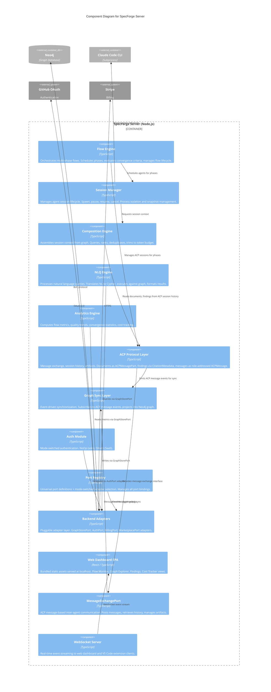

# C3: SpecForge Server Components

**Scope:** Internal component decomposition of the SpecForge Server container.

**Elements:**

- Flow Engine (orchestration, phase scheduling, convergence)
- Session Manager (agent lifecycle, process isolation)
- ACP Protocol Layer (message exchange, session history, artifacts)
- Graph Sync (event-driven Neo4j synchronization via ACP message events)
- Composition Engine (session context assembly)
- NLQ Engine (`specforge ask` query processing)
- Analytics Engine (flow metrics, quality trends)
- Auth Module (mode-switched: NoOp / OAuth)
- Port Registry (universal + mode-switched ports)
- Web Dashboard SPA (bundled static assets served at localhost)

---

## Mermaid Diagram



### ASCII Representation

```
+-------------------------------------------------------------------------+
|                       SpecForge Server (Node.js)                        |
|                                                                         |
|  +--------------+  +---------------+  +--------------+  +-----------+  |
|  | Flow Engine   |  | Session Mgr   |  | Composition  |  |    NLQ    |  |
|  |              |  |               |  |   Engine     |  |  Engine   |  |
|  | phases       |  | spawn/pause   |  |              |  |           |  |
|  | convergence  |  | resume/cancel |  | query        |  | NL->Cypher|  |
|  | scheduling   |  | snapshots     |  | rank         |  | execute   |  |
|  +------+-------+  +------+--------+  | assemble     |  | format    |  |
|         |                 |           +------+-------+  +----+------+  |
|         |                 |                  |               |         |
|         v                 v                  |               |         |
|  +----------------------------------------------+-----------+         |
|  |           ACP Protocol Layer (per flow run)                        |
|  |  +----------------+  +----------------+  +-------------------+     |
|  |  |  Documents     |  |   Findings     |  |    Messages       |     |
|  |  | (ACPMessagePart|  | (Citation      |  | (role-addressed   |     |
|  |  |  artifacts)    |  |  Metadata)     |  |  ACPMessage)      |     |
|  |  +----------------+  +----------------+  +-------------------+     |
|  +----------------------------+------------------------------------+  |
|                                | ACP message events                   |
|                                v                                      |
|  +------------------------------------------------------------+      |
|  |                Graph Sync Layer + Analytics Engine           |      |
|  +----------------------------+-------------------------------+       |
|                                |                                      |
|  +-------------+  +-----------v-----------------------------------+   |
|  | Auth Module |  |             Pluggable Backend Adapters         |   |
|  |             |  |                                                |   |
|  | NoOp (solo) |  |  GraphStorePort -> LocalNeo4j / CloudNeo4j    |   |
|  | OAuth (SaaS)|  |  AuthPort       -> NoOp / CloudOAuth          |   |
|  +------+------+  |  BillingPort    -> NoOp / StripeBilling       |   |
|         |         |  MarketplacePort-> LocalFiles / CloudMktplace  |   |
|         |         +------------------------+----------------------+   |
|         +-----------------------------|                               |
|  +-------------------+                |                               |
|  |  Port Registry    |----------------+                               |
|  |  (universal +     |                                                |
|  |   mode-switched)  |                                                |
|  +-------------------+                                                |
|                                                                       |
|  +-----------------------------+  +-------------------------------+   |
|  | Web Dashboard SPA (React)   |  | WebSocket Server              |   |
|  | Flow Monitor | Graph Explore|  | Real-time events to dashboard |   |
|  | Findings     | Cost Tracker |  | and VS Code extension         |   |
|  +-----------------------------+  +-------------------------------+   |
+--------------+----------------+--------------+------------------------+
               |                               |
  +------------+                               +---------------+
  v                                                            v
+------------------+                                +--------------------+
|      Neo4j       |                                |  Claude Code CLI   |
|   (Bolt)         |                                |   (Subprocess)     |
+------------------+                                +--------------------+
```

## Component Descriptions

| Component           | Responsibility                                                                                                                                                                                                                                             |
| ------------------- | ---------------------------------------------------------------------------------------------------------------------------------------------------------------------------------------------------------------------------------------------------------- |
| Flow Engine         | Orchestrates multi-phase specification flows. Evaluates convergence criteria to decide whether to loop a phase or advance. Manages the entire flow lifecycle from start to completion                                                                      |
| Session Manager     | Manages individual agent sessions as isolated subprocesses. Handles spawn, pause, resume, cancel operations. Maintains session snapshots for persistence                                                                                                   |
| ACP Protocol Layer  | Message exchange scoped per flow run. Three logical categories: Documents (ACPMessagePart artifacts), Findings (messages with CitationMetadata), Messages (role-addressed ACPMessage instances). See [ADR-018](../decisions/ADR-018-acp-agent-protocol.md) |
| Graph Sync Layer    | Subscribes to ACP message events and projects them into the Neo4j knowledge graph. Ensures the graph stays consistent with flow execution state                                                                                                            |
| Composition Engine  | Assembles session context for agent bootstrapping. Queries the graph for relevant chunks, ranks by relevance, deduplicates, and trims to fit the token budget                                                                                              |
| NLQ Engine          | Processes `specforge ask` natural language queries. Translates questions into Cypher, executes against the graph, and formats human-readable results                                                                                                       |
| Analytics Engine    | Computes flow execution metrics, specification quality trends, convergence statistics, and cost tracking data                                                                                                                                              |
| Auth Module         | Mode-switched authentication. NoOp in solo mode, GitHub OAuth in SaaS mode                                                                                                                                                                                 |
| Port Registry       | Central registry for all port definitions. Resolves port bindings based on deployment mode (solo/SaaS)                                                                                                                                                     |
| Backend Adapters    | Concrete adapter implementations for each port. Selected at startup based on deployment mode                                                                                                                                                               |
| MessageExchangePort | ACP message-based inter-agent communication interface. Posts messages, retrieves session history, manages artifacts. Connects the ACP Protocol Layer, Structured Output pipeline, and Agent System                                                         |
| Web Dashboard SPA   | Bundled React SPA served as static assets at localhost. Provides Flow Monitor, Graph Explorer, Findings, and Cost Tracker views                                                                                                                            |
| WebSocket Server    | Streams real-time orchestrator events to connected web dashboard and VS Code extension clients                                                                                                                                                             |

> **Note (M57):** Web Dashboard SPA is bundled as static assets within the server container but documented separately at [c3-web-dashboard.md](./c3-web-dashboard.md) for its internal component structure.

> **Note (M63):** WebSocket Server is an internal component of SpecForge Server, exposed as an endpoint consumed by Web Dashboard and VS Code Extension.

> **Convergence data dependencies (M02):** Convergence evaluation reads from two sources: (1) ACP message counts for finding deltas (via MessageExchangePort), and (2) the knowledge graph for coverage metrics (via GraphQueryPort). Both must be available for accurate convergence computation.

> **FlowEngine boundary (N02):** FlowEngine is internal to the SpecForge Server. External callers invoke FlowEngine via the REST API (OrchestratorPort), not directly.

## NLQ Pipeline

Natural Language Query processing pipeline:

```
NL query (user input)
    → NLQService.parse()
    → LLM prompt with graph schema context
    → Cypher generation
    → GraphQueryService.validate(cypher)
    → GraphQueryService.query(cypher, params)
    → NLQService.format(results)
    → JSON response to caller
```

> **Error handling:** Cypher syntax errors from LLM generation are caught by `GraphQueryService.validate()` and retried once with error context appended to the LLM prompt. If retry fails, `GraphQuerySyntaxError` is returned to the caller.

---

## Cross-References

- Parent container: [c2-containers.md](./c2-containers.md)
- Flow execution dynamics: [dynamic-flow-execution.md](./dynamic-flow-execution.md)
- Session composition dynamics: [dynamic-session-composition.md](./dynamic-session-composition.md)
- Port registry details: [ports-and-adapters.md](./ports-and-adapters.md)
- Web dashboard: [c3-web-dashboard.md](./c3-web-dashboard.md)
- VS Code extension: [c3-vscode-extension.md](./c3-vscode-extension.md)
- ACP Protocol decision (supersedes ADR-003): [../decisions/ADR-003-blackboard-communication.md](../decisions/ADR-003-blackboard-communication.md) — superseded by [ADR-018](../decisions/ADR-018-acp-agent-protocol.md)
- ACP Protocol decision: [../decisions/ADR-018-acp-agent-protocol.md](../decisions/ADR-018-acp-agent-protocol.md)
- Graph-first decision: [../decisions/ADR-005-graph-first-architecture.md](../decisions/ADR-005-graph-first-architecture.md)
- Flow orchestration decision: [../decisions/ADR-007-flow-based-orchestration.md](../decisions/ADR-007-flow-based-orchestration.md)
- Web Dashboard + VS Code decision: [../decisions/ADR-010-web-dashboard-vscode-over-desktop.md](../decisions/ADR-010-web-dashboard-vscode-over-desktop.md)
- Behavioral specs: [../behaviors/BEH-SF-001-graph-operations.md](../behaviors/BEH-SF-001-graph-operations.md), [../behaviors/BEH-SF-057-flow-execution.md](../behaviors/BEH-SF-057-flow-execution.md)

## Sub-Component C3 Diagrams

The following C3 diagrams decompose specific subsystems within the SpecForge Server:

| Subsystem             | C3 Diagram                                                   | Key Behaviors                    |
| --------------------- | ------------------------------------------------------------ | -------------------------------- |
| Agent System          | [c3-agent-system.md](./c3-agent-system.md)                   | BEH-SF-017–032, 151–160, 185–192 |
| Memory Generation     | [c3-memory-generation.md](./c3-memory-generation.md)         | BEH-SF-177–184                   |
| Cost Optimization     | [c3-cost-optimization.md](./c3-cost-optimization.md)         | BEH-SF-073–080, 169–176          |
| MCP Composition       | [c3-mcp-composition.md](./c3-mcp-composition.md)             | BEH-SF-193–200                   |
| Permission Governance | [c3-permission-governance.md](./c3-permission-governance.md) | BEH-SF-081–086, 201–208          |
| Structured Output     | [c3-structured-output.md](./c3-structured-output.md)         | BEH-SF-041–048                   |
| Import / Export       | [c3-import-export.md](./c3-import-export.md)                 | BEH-SF-127–132                   |
| Cloud Services        | [c3-cloud-services.md](./c3-cloud-services.md)               | BEH-SF-107–112                   |
| Extensibility         | [c3-extensibility.md](./c3-extensibility.md)                 | BEH-SF-087–094                   |
| Hooks Pipeline        | [c3-hooks.md](./c3-hooks.md)                                 | BEH-SF-161–168                   |
| ACP Protocol Layer    | [c3-acp-layer.md](./c3-acp-layer.md)                         | BEH-SF-209–218, 219–227, 228–238 |

Dynamic diagrams for server subsystems:

- [dynamic-memory-generation.md](./dynamic-memory-generation.md) — Memory generation pipeline sequence
- [dynamic-hook-event-flow.md](./dynamic-hook-event-flow.md) — Hook pipeline for a single tool invocation
