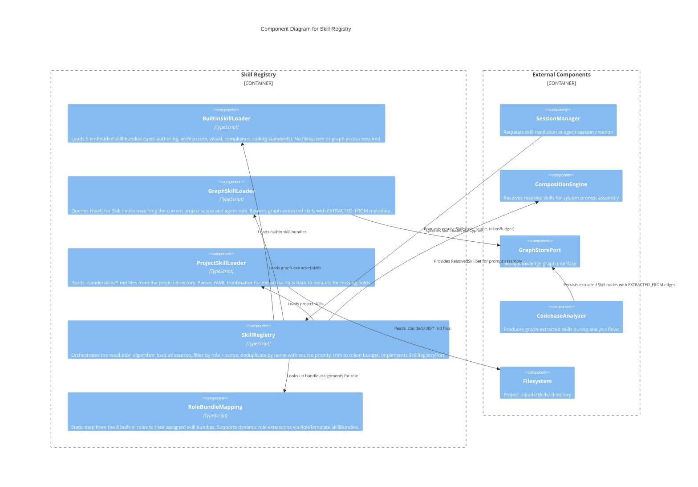

# C3: Skill Registry

**Level:** C3 (Component)
**Scope:** Internal components of the Skill Registry subsystem — skill loading, resolution, deduplication, role-bundle mapping, and graph sync
**Parent:** [c3-server.md](./c3-server.md) — SpecForge Server

---

## Overview

The Skill Registry manages the full lifecycle of skills within SpecForge. It loads skills from three sources (builtin bundles, Neo4j graph nodes, project filesystem), resolves them per agent role at session spawn time, deduplicates with source-priority ordering, trims to token budget, and feeds resolved skill sets to the Composition Engine for injection into agent system prompts.

---

## Component Diagram



### ASCII Representation

```
  SessionManager          SkillRegistry            Loaders                External
      |                       |                       |                      |
      | 1. resolveSkills      |                       |                      |
      |   (role, scope,       |                       |                      |
      |    tokenBudget)       |                       |                      |
      |----------------------->                       |                      |
      |                       |                       |                      |
      |                       | 2a. load builtins     |                      |
      |                       |----> BuiltinLoader    |                      |
      |                       |      (embedded data)  |                      |
      |                       |                       |                      |
      |                       | 2b. load graph skills |                      |
      |                       |----> GraphLoader -----+----> GraphStorePort  |
      |                       |      (Cypher query)   |      (Neo4j)         |
      |                       |                       |                      |
      |                       | 2c. load project      |                      |
      |                       |----> ProjectLoader ---+----> Filesystem      |
      |                       |      (.claude/skills/)|      (.md files)     |
      |                       |                       |                      |
      |                       | 3. lookup role        |                      |
      |                       |    bundle assignment  |                      |
      |                       |----> RoleBundleMap    |                      |
      |                       |                       |                      |
      |                       | 4. filter by role     |                      |
      |                       | 5. filter by scope    |                      |
      |                       | 6. deduplicate        |                      |
      |                       |    (graph > builtin   |                      |
      |                       |     > project)        |                      |
      |                       | 7. trim to budget     |                      |
      |                       |                       |                      |
      |  8. ResolvedSkillSet  |                       |                      |
      |<-----------------------|                       |                      |
      |                       |                       |                      |
      |                       | 9. feed to            |                      |
      |                       |    CompositionEngine  |                      |
      |                       |---------------------->| CompositionEngine    |
      |                       |                       | (prompt assembly)    |
```

---

## Component Descriptions

| Component              | Responsibility                                                                                                                                                                                                          | Key Interfaces                                                                             |
| ---------------------- | ----------------------------------------------------------------------------------------------------------------------------------------------------------------------------------------------------------------------- | ------------------------------------------------------------------------------------------ |
| **BuiltinSkillLoader** | Loads the 5 embedded skill bundles. Skills are compiled into the application binary — no filesystem or graph access required. Returns all builtin skills with `source: "builtin"`.                                      | `loadBuiltins()` → `ReadonlyArray<Skill>`                                                  |
| **GraphSkillLoader**   | Queries Neo4j for `Skill` nodes matching the session's scope and role. Handles graph connection failures gracefully (returns empty with warning).                                                                       | `loadFromGraph(scope, role)` → `ResultAsync<ReadonlyArray<Skill>, SkillResolverError>`     |
| **ProjectSkillLoader** | Reads `.claude/skills/*.md` files, parses YAML frontmatter, creates `Skill` objects with `source: "project"`. Returns empty array if directory doesn't exist.                                                           | `loadFromProject(projectPath)` → `ResultAsync<ReadonlyArray<Skill>, SkillResolverError>`   |
| **SkillRegistry**      | Orchestrates the full resolution algorithm: concurrent loading from 3 sources, role filtering, scope filtering, name-based deduplication with priority ordering, token budget trimming. Implements `SkillRegistryPort`. | `resolveSkills(config)`, `listSkills(scope)`, `listBundles()`, `getBundleAssignment(role)` |
| **RoleBundleMapping**  | Static map from agent roles to skill bundle assignments. The 8 built-in roles have fixed assignments; custom roles default to empty. Dynamic roles can declare assignments via `RoleTemplate.skillBundles`.             | `getAssignment(role)` → `RoleBundleAssignment`                                             |

---

## Relationships to Parent Components

| From               | To                | Relationship                                                 |
| ------------------ | ----------------- | ------------------------------------------------------------ |
| SessionManager     | SkillRegistry     | Requests skill resolution at agent session creation          |
| SkillRegistry      | CompositionEngine | Provides `ResolvedSkillSet` for system prompt assembly       |
| GraphSkillLoader   | GraphStorePort    | Queries `Skill` nodes via Cypher                             |
| ProjectSkillLoader | Filesystem        | Reads `.claude/skills/*.md` files                            |
| CodebaseAnalyzer   | GraphStorePort    | Persists extracted `Skill` nodes with `EXTRACTED_FROM` edges |
| SkillRegistry      | RoleBundleMapping | Looks up bundle assignments for target role                  |

---

## References

- [ADR-025](../decisions/ADR-025-skill-registry-architecture.md) — Skill Registry Architecture
- [ADR-009](../decisions/ADR-009-compositional-sessions.md) — Compositional Sessions
- [Agent System](./c3-agent-system.md) — Parent agent system (SkillRegistry replaces SkillInjector)
- [Knowledge Graph](./c3-knowledge-graph.md) — Skill and SkillBundle node types
- [Session Composition](./dynamic-session-composition.md) — Skill resolution stage in composition pipeline
- [Skill Registry Behaviors](../behaviors/BEH-SF-558-skill-registry.md) — BEH-SF-558 through BEH-SF-565
- [Skill Types](../types/skill.md) — Skill, SkillBundle, ResolvedSkillSet, SkillRegistryPort
