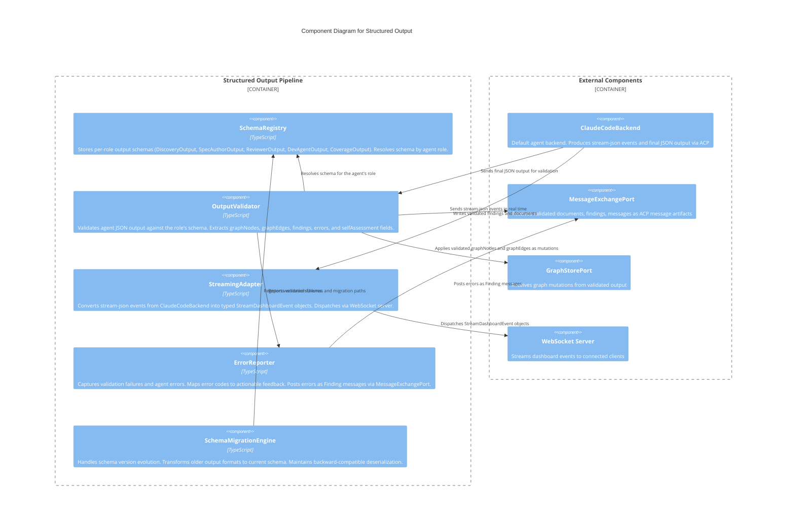

# C3 — Structured Output

**Level:** C3 (Component)
**Scope:** Internal components of the schema-validated agent output and streaming pipeline
**Parent:** [c3-server.md](./c3-server.md) — SpecForge Server

---

## Overview

The Structured Output subsystem validates, transforms, and streams agent output through a schema-driven pipeline. Each agent role has a dedicated output schema (DiscoveryOutput, SpecAuthorOutput, ReviewerOutput, etc.) validated at ingestion time. The pipeline converts validated output into graph mutations and streams real-time events (tool calls, token updates, partial text) to the web dashboard and VS Code extension via WebSocket.

---

## Component Diagram

---

## Component Descriptions

| Component                 | Responsibility                                                                                                                                                                                                                                                                                      | Key Interfaces                                    |
| ------------------------- | --------------------------------------------------------------------------------------------------------------------------------------------------------------------------------------------------------------------------------------------------------------------------------------------------- | ------------------------------------------------- |
| **SchemaRegistry**        | Stores output schema definitions per agent role. Each schema declares required fields: `graphNodes`, `graphEdges`, `findings`, `errors`, `selfAssessment`. Resolves the correct schema at validation time.                                                                                          | `getSchema(role)`, `registerSchema(role, schema)` |
| **OutputValidator**       | Validates agent JSON output against the role's registered schema. Extracts typed fields. Transforms `graphNodes` and `graphEdges` into graph mutations. Routes `findings` to the ACP protocol layer via MessageExchangePort. Reports `selfAssessment` to the flow engine for convergence decisions. | `validate(role, output)`                          |
| **StreamingAdapter**      | Converts raw stream-json events from ClaudeCodeBackend into typed `StreamDashboardEvent` discriminated union variants: `tool-call`, `tool-result`, `partial-text`, `token-update`, `error`, `system`. Dispatches via WebSocket for real-time UI updates.                                            | `adapt(streamEvent)`, `dispatch(dashboardEvent)`  |
| **ErrorReporter**         | Captures schema validation failures, agent-reported errors, and runtime exceptions. Maps error codes to human-readable messages and actionable remediation. Posts as `Finding` messages via MessageExchangePort with `severity: 'major'`.                                                           | `report(error, sessionId)`                        |
| **SchemaMigrationEngine** | Manages schema evolution across SpecForge versions. Registers migration functions between schema versions. Applies migrations transparently during deserialization to maintain backward compatibility with older agent output formats.                                                              | `migrate(data, fromVersion, toVersion)`           |

---

## Relationships to Parent Components

| From              | To                  | Relationship                                             |
| ----------------- | ------------------- | -------------------------------------------------------- |
| ClaudeCodeBackend | OutputValidator     | Sends final agent JSON output for schema validation      |
| ClaudeCodeBackend | StreamingAdapter    | Sends stream-json events for real-time dashboard updates |
| OutputValidator   | MessageExchangePort | Writes validated findings and documents as ACP messages  |
| OutputValidator   | GraphStorePort      | Applies graphNodes/graphEdges as graph mutations         |
| StreamingAdapter  | WebSocket Server    | Dispatches typed StreamDashboardEvent objects            |
| ErrorReporter     | MessageExchangePort | Posts validation errors as Finding messages              |

---

## References

- [ADR-012](../decisions/ADR-012-json-first-structured-output.md) — JSON-First Structured Output
- [Agent Communication Behaviors](../behaviors/BEH-SF-041-agent-communication.md) — BEH-SF-041 through BEH-SF-048
- [Structured Output Types](../types/structured-output.md) — AgentSelfAssessment, DiscoveryOutput, StreamDashboardEvent, TypedStageDefinition
- [INV-SF-2](../invariants/INV-SF-2-agent-session-isolation.md) — Agent Session Isolation
