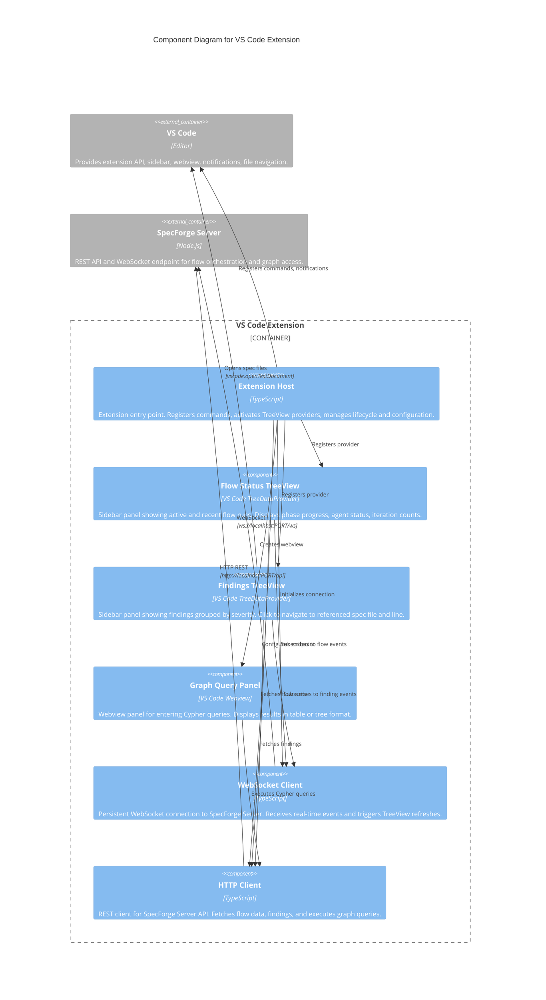

# C3: VS Code Extension Components

**Scope:** Internal component decomposition of the VS Code Extension -- a sidebar extension communicating with the SpecForge Server via HTTP and WebSocket. The extension operates independently of the Desktop App and discovers the server via the `specforge.serverUrl` VS Code setting, `SPECFORGE_SERVER_URL` env var, `.specforge/server.lock` file, or default `http://localhost:7654`.

**Elements:**

- Extension Host (activation, command registration, lifecycle)
- Flow Status TreeView (active/recent flow runs with phase progress)
- Findings TreeView (findings grouped by severity, linked to spec files)
- Graph Query Panel (Cypher query input, table/tree result display)
- WebSocket Client (real-time event streaming from SpecForge Server)
- HTTP Client (REST communication with SpecForge Server)

---

## Mermaid Diagram



### ASCII Representation

```
┌─────────────────────────────────────────────────────────────────────────┐
│                          VS Code Extension                               │
│                                                                         │
│  ┌───────────────────────────────────────────────────────────────────┐  │
│  │                      Extension Host                               │  │
│  │     command registration  |  activation  |  configuration         │  │
│  └────┬──────────┬──────────┬──────────┬─────────────────────────────┘  │
│       │          │          │          │                                 │
│       ▼          ▼          ▼          │                                 │
│  ┌──────────┐ ┌──────────┐ ┌──────────┐                                │
│  │  Flow    │ │ Findings │ │  Graph   │                                │
│  │  Status  │ │ TreeView │ │  Query   │                                │
│  │ TreeView │ │          │ │  Panel   │                                │
│  │          │ │ grouped  │ │          │                                │
│  │ flow runs│ │ by       │ │ Cypher   │                                │
│  │ phases   │ │ severity │ │ input    │                                │
│  │ progress │ │ click to │ │ table /  │                                │
│  │ agents   │ │ navigate │ │ tree     │                                │
│  └────┬─────┘ └────┬─────┘ └────┬─────┘                                │
│       │            │            │                                       │
│       ▼            ▼            ▼                                       │
│  ┌─────────────────────────────────────────────────────────────────┐    │
│  │              Communication Layer                                │    │
│  │                                                                 │    │
│  │  ┌─────────────────────┐     ┌─────────────────────┐           │    │
│  │  │  WebSocket Client   │     │  HTTP Client         │           │    │
│  │  │                     │     │                     │           │    │
│  │  │  real-time events:  │     │  REST endpoints:    │           │    │
│  │  │  phase-started      │     │  GET /api/flows     │           │    │
│  │  │  flow-completed     │     │  GET /api/findings  │           │    │
│  │  │  finding-added      │     │  POST /api/cypher   │           │    │
│  │  │  budget-warning     │     │                     │           │    │
│  │  └──────────┬──────────┘     └──────────┬──────────┘           │    │
│  └─────────────┼────────────────────────────┼─────────────────────┘    │
│                │                            │                          │
└────────────────┼────────────────────────────┼──────────────────────────┘
                 │ WebSocket                  │ HTTP REST
                 ▼                            ▼
        ┌─────────────────────────────────────────────┐
        │            SpecForge Server (Node.js)        │
        │                                              │
        │  REST API  |  WebSocket Endpoint             │
        │  Flow Engine  |  ACP Protocol Layer  |  Analytics    │
        └──────────────────────────────────────────────┘

        ┌─────────────────────────────────────────────┐
        │                  VS Code                     │
        │                                              │
        │  Extension API  |  Sidebar  |  Webview       │
        │  Notifications  |  File Navigation           │
        └──────────────────────────────────────────────┘
```

## Component Descriptions

| Component            | Responsibility                                                                                                                                                                                                                                        |
| -------------------- | ----------------------------------------------------------------------------------------------------------------------------------------------------------------------------------------------------------------------------------------------------- |
| Extension Host       | Extension entry point activated on SpecForge-related workspace detection. Registers commands, initializes TreeView providers, creates webview panels, manages WebSocket lifecycle, and reads extension configuration (server URL, port)               |
| Flow Status TreeView | VS Code TreeDataProvider displayed in the sidebar. Shows active and recent flow runs as a tree: flow run > phases > agents. Each node displays progress indicators, iteration counts, and status icons. Click opens flow details in the web dashboard |
| Findings TreeView    | VS Code TreeDataProvider displayed in the sidebar. Groups findings by severity (critical, warning, info). Each finding shows its message and source location. Click navigates to the referenced spec file and line using `vscode.openTextDocument`    |
| Graph Query Panel    | VS Code Webview panel for interactive graph queries. Provides a Cypher query input field and displays results in either table or tree format. Supports query history and result export                                                                |
| WebSocket Client     | Maintains a persistent WebSocket connection to the SpecForge Server. Receives real-time events (phase-started, phase-completed, finding-added, agent-spawned, budget-warning, flow-completed) and triggers TreeView provider refreshes                |
| HTTP Client          | REST client for the SpecForge Server API. Handles data fetching for TreeView providers, submits Cypher queries from the Graph Query Panel, and retrieves finding details                                                                              |

## Cross-References

- Parent container: [c2-containers.md](./c2-containers.md)
- Server components: [c3-server.md](./c3-server.md)
- Web dashboard (companion UI): [c3-web-dashboard.md](./c3-web-dashboard.md)
- Extension decision: [../decisions/ADR-010-web-dashboard-vscode-over-desktop.md](../decisions/ADR-010-web-dashboard-vscode-over-desktop.md)
- Superseded desktop app: [../decisions/ADR-002-tauri-over-electron.md](../decisions/ADR-002-tauri-over-electron.md)
- Behavioral specs: [../behaviors/BEH-SF-139-vscode-extension.md](../behaviors/BEH-SF-139-vscode-extension.md)
